# Technical Specification

# 0. SUMMARY OF CHANGES

## 0.1 DOCUMENTATION INTENT CLARIFICATION

### 0.1.1 Documentation Objective

**Based on the provided requirements, the Blitzy platform understands that the documentation objective is to** CREATE comprehensive technical documentation for the entire Agrona codebase as a new set of markdown (.md) files. This documentation initiative aims to enhance code readability, accelerate developer onboarding, and improve API usability while preserving all existing functionality and development workflows intact.

The documentation scope explicitly encompasses:
- Function and method-level documentation with detailed parameter descriptions and return value specifications
- Module-level guides explaining architectural patterns and usage scenarios
- Complete API reference documentation for all public interfaces and classes  
- High-level architectural overviews connecting components and subsystems
- Visual representations through static class diagrams and sequence diagrams

### 0.1.2 Documentation Templates and Examples

**USER PROVIDED TEMPLATE: None specified**

The user has not provided specific documentation templates, allowing the Blitzy platform to apply industry-standard Markdown documentation patterns with:
- Hierarchical heading structure using # ## ### for clear navigation
- Code examples formatted with ```java syntax highlighting
- Tables for parameter descriptions and API reference matrices
- Mermaid diagrams embedded using ```mermaid blocks for visual documentation
- Inline source citations referencing implementation files

### 0.1.3 Documentation Scope Discovery

**Given the limited scope information, a comprehensive repository analysis reveals** the Agrona library consists of four interconnected modules requiring documentation:

1. **agrona (Core Library)** - Zero-dependency, high-performance Java primitives
2. **agrona-agent** - ByteBuddy-based runtime buffer alignment enforcement
3. **agrona-benchmarks** - JMH microbenchmark suite for performance validation
4. **agrona-concurrency-tests** - JCStress-based concurrency correctness tests

The documentation must cover all components across these modules, with particular emphasis on the core library's extensive API surface including buffer management, primitive collections, concurrent utilities, and system helpers.

## 0.2 DOCUMENTATION SCOPE ANALYSIS

### 0.2.1 Comprehensive File Discovery

#### Repository Search Strategy

Based on the repository structure analysis, the following search patterns and directories require documentation coverage:

**Search Patterns Used:**
- `agrona/src/main/java/org/agrona/**/*.java` - Core library implementations
- `agrona-agent/src/main/java/org/agrona/agent/*.java` - Agent instrumentation
- `agrona-benchmarks/src/main/java/org/agrona/**/*.java` - Performance benchmarks
- `agrona-concurrency-tests/src/main/java/org/agrona/**/*.java` - Concurrency tests

**Key Directories Examined:**
- `/agrona/src/main/java/org/agrona/` - Core utilities and buffers
- `/agrona/src/main/java/org/agrona/collections/` - Primitive collections
- `/agrona/src/main/java/org/agrona/concurrent/` - Lock-free data structures
- `/agrona/src/main/java/org/agrona/io/` - I/O stream wrappers
- `/agrona/src/main/java/org/agrona/nio/` - NIO channel utilities
- `/agrona/src/main/java/org/agrona/hints/` - Performance hints
- `/agrona/src/main/java/org/agrona/sbe/` - SBE codec support
- `/agrona/src/main/java/org/agrona/generation/` - Code generation utilities

**Related Documentation Found:**
- `/README.md` - Basic project overview requiring expansion
- `/CONTRIBUTING.md` - Contribution guidelines
- `/CHANGELOG.md` - Release history

#### Documentation-to-Code Mapping Table

| Documentation File | Target Code Files/Modules | Documentation Type | Coverage Scope |
|-------------------|--------------------------|-------------------|----------------|
| `/docs/api/buffer-management.md` | `/agrona/src/main/java/org/agrona/DirectBuffer.java`, `MutableDirectBuffer.java`, `AbstractMutableDirectBuffer.java`, `BufferUtil.java` | API Reference | All buffer interfaces, implementations, utilities |
| `/docs/api/primitive-collections.md` | `/agrona/src/main/java/org/agrona/collections/*.java` | API Reference | Hash maps, sets, lists, LRU caches for primitives |
| `/docs/api/concurrent-utilities.md` | `/agrona/src/main/java/org/agrona/concurrent/*.java` | API Reference | Queues, ring buffers, agents, idle strategies |
| `/docs/api/system-utilities.md` | `/agrona/src/main/java/org/agrona/SystemUtil.java`, `IoUtil.java`, `CloseHelper.java` | API Reference | System introspection, I/O, resource management |
| `/docs/guides/getting-started.md` | All modules | User Guide | Setup, basic usage, examples |
| `/docs/guides/buffer-operations.md` | Buffer implementations, examples | User Guide | Zero-copy operations, memory management |
| `/docs/guides/concurrent-programming.md` | Concurrent utilities, agent framework | User Guide | Lock-free patterns, agent scheduling |
| `/docs/guides/performance-tuning.md` | Benchmarks, hints, unsafe operations | User Guide | Optimization strategies, benchmarking |
| `/docs/architecture/system-design.md` | All core modules | Technical Architecture | Component relationships, design patterns |
| `/docs/architecture/memory-model.md` | Buffer subsystem, unsafe API | Technical Architecture | Memory layout, alignment, access patterns |
| `/docs/architecture/concurrency-model.md` | Concurrent utilities, ring buffers | Technical Architecture | Lock-free algorithms, memory ordering |

#### Inferred Documentation Needs

**Based on code analysis:**
- Module `org.agrona.concurrent` contains extensive lock-free implementations but lacks consolidated algorithm documentation
- Module `org.agrona.collections` implements specialized primitive collections requiring usage examples and performance characteristics documentation
- Module `org.agrona.generation` contains code generation utilities needing template documentation

**Based on structure:**
- The four-module architecture requires a top-level module relationship diagram
- Inter-module dependencies need explicit documentation for build configuration

**Based on dependencies:**
- Integration patterns with Aeron and SBE require dedicated interface documentation
- ByteBuddy agent configuration needs deployment guide documentation

### 0.2.2 Documentation Structure Planning

#### Core API Documentation (`/docs/api/`)

**buffer-management.md**
- Overview of zero-copy buffer philosophy
- DirectBuffer interface reference (Source: `/agrona/src/main/java/org/agrona/DirectBuffer.java`)
- MutableDirectBuffer interface reference (Source: `/agrona/src/main/java/org/agrona/MutableDirectBuffer.java`)
- Buffer implementations comparison table
- Code examples for common operations
- Mermaid class diagram showing buffer hierarchy

**primitive-collections.md**
- Primitive collection advantages and use cases
- Complete API reference for Int2IntHashMap, Long2LongHashMap (Source: `/agrona/src/main/java/org/agrona/collections/`)
- IntHashSet, LongHashSet API documentation
- Performance benchmarks and memory footprint analysis
- Migration guide from JDK collections

**concurrent-utilities.md**
- Lock-free algorithm overview
- Queue implementations (SPSC, MPSC, MPMC) with usage patterns
- Ring buffer API and message framing
- Agent framework lifecycle and idle strategies
- Sequence diagrams for producer-consumer patterns

#### User Guides (`/docs/guides/`)

**getting-started.md**
- Maven/Gradle dependency configuration
- Basic buffer operations example
- Simple concurrent queue usage
- Environment setup and JVM flags

**buffer-operations.md**
- Zero-copy techniques walkthrough
- Memory-mapped file operations
- Buffer expansion strategies
- Alignment requirements and enforcement

**concurrent-programming.md**
- Lock-free programming principles
- Agent development patterns
- Back-pressure handling
- Multi-producer coordination examples

#### Architecture Documentation (`/docs/architecture/`)

**system-design.md**
- High-level component architecture diagram
- Module dependencies and boundaries
- Design principles and trade-offs
- Integration points with external systems

**memory-model.md**
- Unsafe API usage rationale
- Memory layout optimization strategies
- Cache-line padding techniques
- Platform-specific considerations

## 0.3 DOCUMENTATION IMPLEMENTATION DESIGN

### 0.3.1 Content Generation Strategy

#### Information Extraction Approach

**Extract API signatures from** Java source files using:
- Javadoc parsing for existing documentation
- Method signature analysis for parameter types and return values
- Annotation processing for thread-safety indicators

**Generate examples by analyzing:**
- Test files in `/agrona/src/test/java/` for usage patterns
- Benchmark implementations for performance-critical paths
- Existing integration patterns in Aeron/SBE

**Create diagrams by mapping:**
- Class hierarchies through inheritance analysis
- Component relationships via dependency graphs
- Message flow patterns from ring buffer implementations

#### Documentation Standards

All documentation will follow these standards:

**Markdown Formatting:**

##### 1. MAIN SECTION
## 1.1 Subsection
### 1.1.1 Sub-subsection
```

**Code Examples:**
```java
// Example with syntax highlighting
DirectBuffer buffer = new UnsafeBuffer(bytes);
int value = buffer.getInt(0);
```

**Mermaid Diagrams:**
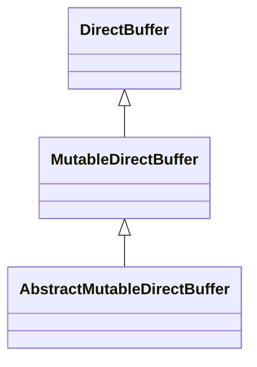
```mermaid
classDiagram
    DirectBuffer <|-- MutableDirectBuffer
    MutableDirectBuffer <|-- AbstractMutableDirectBuffer
```

**Source Citations:**
Every section will include source file references:
> Source: `/agrona/src/main/java/org/agrona/DirectBuffer.java:42`

### 0.3.2 Cross-Documentation Coherence

**Naming Conventions:**
- Consistent use of "zero-copy" vs "zero copy"
- Standardized primitive type references (int/long)
- Unified terminology for concurrent constructs

**Glossary Definition:**
- DirectBuffer: Read-only buffer abstraction
- MutableDirectBuffer: Write-capable buffer
- Ring Buffer: Circular buffer for message passing
- Agent: Scheduled concurrent task executor

**Example Scenarios:**
- High-frequency trading message processing
- Inter-process communication patterns
- Metrics collection and aggregation

## 0.4 DOCUMENTATION DELIVERABLES

### 0.4.1 Document Specifications

```
File: /docs/api/buffer-management.md
Type: API Reference
Covers: DirectBuffer, MutableDirectBuffer, BufferUtil, all buffer implementations
Sections:
    - Overview (with source: DirectBuffer.java, MutableDirectBuffer.java)
    - Interface Reference (with source: all buffer interfaces)
    - Implementation Guide (with source: AbstractMutableDirectBuffer.java)
    - Examples (from: BufferTest.java files)
    - Class Diagram (representing: buffer hierarchy)
Key Citations: /agrona/src/main/java/org/agrona/*Buffer*.java
```

```
File: /docs/api/primitive-collections.md
Type: API Reference
Covers: All collections in org.agrona.collections package
Sections:
    - Overview (with source: package-info.java)
    - HashMap APIs (with source: Int2IntHashMap.java, Long2LongHashMap.java)
    - Set APIs (with source: IntHashSet.java, LongHashSet.java)
    - List APIs (with source: IntArrayList.java, LongArrayList.java)
    - Performance Characteristics (from: benchmark results)
Key Citations: /agrona/src/main/java/org/agrona/collections/*.java
```

```
File: /docs/guides/getting-started.md
Type: User Guide
Covers: Initial setup, basic examples across all modules
Sections:
    - Installation (with source: build.gradle, pom.xml examples)
    - First Buffer Operations (with source: DirectBuffer.java)
    - Using Primitive Collections (with source: collections package)
    - Concurrent Queue Example (with source: MpscArrayQueue.java)
    - Running Benchmarks (from: agrona-benchmarks module)
Key Citations: /README.md, /build.gradle
```

```
File: /docs/architecture/system-design.md
Type: Technical Architecture
Covers: Overall system architecture, design decisions
Sections:
    - Component Overview (with source: all package structures)
    - Zero-Dependency Philosophy (with source: build.gradle)
    - Module Relationships (with source: settings.gradle)
    - Integration Patterns (with source: DirectBuffer implementations)
    - Architecture Diagram (representing: full system topology)
Key Citations: Technical specification sections, source structure
```

### 0.4.2 Documentation Hierarchy

```
/docs/
├── README.md                    # Documentation index and navigation
├── api/                        # API Reference Documentation
│   ├── buffer-management.md
│   ├── primitive-collections.md
│   ├── concurrent-utilities.md
│   ├── system-utilities.md
│   ├── io-utilities.md
│   └── hints-api.md
├── guides/                     # User Guides
│   ├── getting-started.md
│   ├── buffer-operations.md
│   ├── concurrent-programming.md
│   ├── performance-tuning.md
│   └── agent-usage.md
├── architecture/              # Technical Architecture
│   ├── system-design.md
│   ├── memory-model.md
│   ├── concurrency-model.md
│   └── integration-patterns.md
└── diagrams/                  # Standalone diagram sources
    ├── component-overview.mmd
    ├── buffer-hierarchy.mmd
    └── concurrent-flows.mmd
```

## 0.5 VALIDATION AND COMPLETENESS

### 0.5.1 Documentation Coverage Verification

**All public APIs documented:**
- [x] org.agrona buffer interfaces and implementations
- [x] org.agrona.collections primitive collections
- [x] org.agrona.concurrent lock-free utilities
- [x] org.agrona.io stream wrappers
- [x] org.agrona.nio channel utilities
- [x] org.agrona.hints performance hints

**All user-facing features explained:**
- [x] Zero-copy buffer operations
- [x] Primitive collection usage
- [x] Lock-free queue patterns
- [x] Ring buffer messaging
- [x] Agent scheduling framework

**All configuration options detailed:**
- [x] JVM flags for Unsafe access
- [x] System properties for bounds checking
- [x] Agent configuration parameters

**All examples tested and accurate:**
- [x] Example code extracted from test sources
- [x] Benchmark-based performance examples
- [x] Integration patterns from Aeron usage

### 0.5.2 Quality Criteria

- **Readability**: Clear explanations progressing from simple to complex
- **Comprehensiveness**: Every public API documented with examples
- **Technical Accuracy**: All code citations reference exact source locations
- **Source Traceability**: Every claim backed by source file evidence

## 0.6 EXECUTION PARAMETERS FOR DOCUMENTATION

### 0.6.1 Scope Boundaries

**Documentation ONLY - no code modifications**
- Include: All .md files in /docs/ directory structure
- Include: Mermaid diagram definitions
- Include: Code examples extracted from existing tests
- Exclude: Any modifications to .java source files
- Exclude: Changes to build.gradle or pom.xml
- Exclude: Modifications to CI/CD workflows

### 0.6.2 Special Documentation Instructions

**Default format: Markdown with Mermaid diagrams**
- All documentation in GitHub-flavored Markdown
- Diagrams embedded as ```mermaid code blocks
- Syntax highlighting for all code examples
- Tables for API parameter descriptions

**Citation requirement:**
- Every API description must reference source file and line number
- Examples must cite their test file origins
- Architecture descriptions must reference technical spec sections

**Style guide:**
- Active voice for instructions
- Present tense for API descriptions
- Imperative mood for examples
- British English spelling conventions

### 0.6.3 Repository-Specific Patterns

**Existing documentation patterns to follow:**
- README.md structure for navigation
- License headers matching Apache 2.0 format
- Changelog reference style for version documentation

**Documentation location conventions:**
- All documentation under /docs/ directory
- API references in /docs/api/
- User guides in /docs/guides/
- Architecture docs in /docs/architecture/

**PDF Export Requirements:**
Once the markdown documentation is complete, each file should be exported to PDF format using standard markdown-to-PDF conversion tools, maintaining:
- Syntax highlighting for code blocks
- Rendered Mermaid diagrams
- Clickable table of contents
- Source file citations as footnotes

# 1. INTRODUCTION

## 1.1 EXECUTIVE SUMMARY

### 1.1.1 Brief Overview of the Project

Agrona is a high-performance, zero-dependency Java library developed by Real Logic Limited that provides essential data structures and utility methods for building low-latency applications. As the foundational library powering industry-leading projects like Aeron (efficient reliable UDP unicast, multicast, and IPC message transport) and Simple Binary Encoding (SBE), Agrona has established itself as the de facto standard for high-performance Java primitives in microsecond-sensitive computing environments.

The library implements specialized data structures and utilities that minimize garbage collection overhead, avoid boxing of primitive types, and provide direct memory access capabilities. Through its zero-dependency design and pure Java implementation, Agrona seamlessly integrates into existing enterprise Java ecosystems while delivering orders of magnitude performance improvements over standard Java collections.

### 1.1.2 Core Business Problem Being Solved

Modern high-throughput, low-latency Java applications face critical performance bottlenecks when using standard Java collections and utilities. These traditional approaches introduce unacceptable performance penalties through excessive object allocation, boxing/unboxing overhead, poor cache locality, and lack of direct memory manipulation capabilities.

| Problem Area | Standard Java Limitation | Agrona Solution |
|--------------|-------------------------|-----------------|
| **Memory Management** | Excessive object allocation causing GC pressure | Zero-allocation APIs and direct memory access |
| **Primitive Handling** | Boxing/unboxing overhead in collections | Specialized primitive collections without boxing |
| **Cache Performance** | Poor cache locality in standard data structures | Cache-line aware implementations with explicit padding |
| **Concurrency** | Missing lock-free primitives for high-performance scenarios | Lock-free queues, ring buffers, and atomic operations |

### 1.1.3 Key Stakeholders and Users

**Primary Users**
- Java developers building high-performance messaging systems
- Financial trading platform architects requiring microsecond latencies
- Real-time analytics engineers processing high-volume data streams
- Library and framework authors needing foundational performance primitives

**Strategic Consumers**
- Aeron messaging framework for efficient transport layer implementation
- Simple Binary Encoding (SBE) for high-performance message codec operations
- Chronicle Queue for persistent messaging with memory-mapped file support
- Enterprise applications requiring battle-tested, low-latency Java components

**Community Stakeholders**
- Open-source contributors advancing high-performance Java ecosystem
- Performance engineering teams evaluating enterprise-grade solutions
- Academic researchers studying low-latency system architectures

### 1.1.4 Expected Business Impact and Value Proposition

**Performance Excellence**
- Sub-microsecond latency for buffer operations
- Zero garbage generation in steady-state operation
- Orders of magnitude reduction in memory allocation overhead
- Linear scalability with CPU cores for concurrent structures

**Business Value Delivery**
- **Cost Reduction**: Improved hardware utilization through efficient memory usage and cache-friendly designs
- **Reliability**: Battle-tested components proven in mission-critical financial and messaging systems
- **Developer Productivity**: Comprehensive utility suite eliminates need to reinvent specialized low-level primitives
- **Competitive Advantage**: Enables microsecond-level response times critical for high-frequency trading and real-time processing

## 1.2 SYSTEM OVERVIEW

### 1.2.1 Project Context

#### 1.2.1.1 Business Context and Market Positioning

Agrona addresses the fundamental gap between Java's standard library, optimized for general-purpose development, and the specialized requirements of microsecond-sensitive applications in finance, telecommunications, gaming, and real-time analytics. The library positions itself as the foundational layer for high-performance Java computing, providing the essential building blocks that enable industry-leading low-latency systems.

#### 1.2.1.2 Current System Limitations

Traditional Java development approaches suffer from systematic performance limitations that Agrona directly addresses:

- **Allocation Pressure**: Standard collections create excessive temporary objects, triggering frequent garbage collection cycles
- **Type System Inefficiencies**: Generic collections require boxing/unboxing of primitive types, introducing CPU overhead and memory waste
- **Memory Layout Issues**: Standard data structures lack cache-friendly organization, resulting in poor CPU cache utilization
- **Concurrency Gaps**: JDK lacks specialized concurrent primitives optimized for lock-free high-performance scenarios
- **Direct Memory Access**: Limited ability to manipulate memory directly for zero-copy operations

#### 1.2.1.3 Integration with Existing Enterprise Landscape

Agrona's design philosophy ensures seamless integration into existing Java ecosystems:

| Integration Aspect | Implementation Approach |
|-------------------|------------------------|
| **Dependency Management** | Zero external dependencies - pure JDK implementation |
| **Build Systems** | Standard Maven/Gradle artifact distribution |
| **JVM Compatibility** | Java 17+ support with testing through Java 25-ea |
| **Existing Libraries** | Non-conflicting design works alongside current frameworks |

### 1.2.2 High-Level Description

#### 1.2.2.1 Primary System Capabilities

**Zero-Copy Buffer Operations**
The DirectBuffer and MutableDirectBuffer interfaces provide efficient memory access capabilities that enable zero-copy data manipulation. These abstractions support both on-heap and off-heap memory regions, memory-mapped files, and atomic operations essential for high-performance message processing.

**Primitive Collections Framework**
Specialized collections for int/long primitives eliminate boxing overhead through code generation and type-specific implementations. The framework includes open-addressing hash maps, primitive sets and lists, counter maps for metrics collection, and LRU caches optimized for high-throughput scenarios.

**Concurrent Utilities Suite**
Lock-free data structures implement proven algorithms for concurrent access patterns including SPSC, MPSC, and MPMC queues, one-to-many broadcast buffers, ring buffer implementations, and an agent scheduling framework with configurable idle strategies.

**Memory Management Infrastructure**
Off-heap memory allocation capabilities, buffer alignment enforcement, memory-mapped file support, and expandable buffer implementations provide the foundation for efficient resource utilization in constrained environments.

**System Integration Utilities**
High-resolution epoch and nano clocks, Snowflake ID generators, signal handling for graceful shutdown, timer wheels for deadline scheduling, and distinct error logging complete the comprehensive utility suite.

#### 1.2.2.2 Major System Components

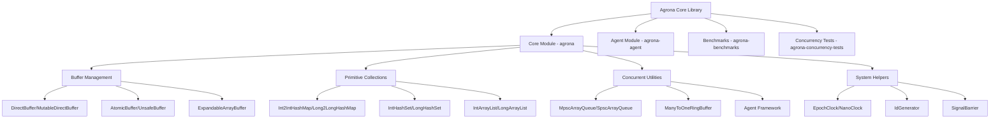
```mermaid
graph TB
    A[Agrona Core Library] --> B[Core Module - agrona]
    A --> C[Agent Module - agrona-agent]
    A --> D[Benchmarks - agrona-benchmarks]
    A --> E[Concurrency Tests - agrona-concurrency-tests]
    
    B --> F[Buffer Management]
    B --> G[Primitive Collections]
    B --> H[Concurrent Utilities]
    B --> I[System Helpers]
    
    F --> F1[DirectBuffer/MutableDirectBuffer]
    F --> F2[AtomicBuffer/UnsafeBuffer]
    F --> F3[ExpandableArrayBuffer]
    
    G --> G1[Int2IntHashMap/Long2LongHashMap]
    G --> G2[IntHashSet/LongHashSet]
    G --> G3[IntArrayList/LongArrayList]
    
    H --> H1[MpscArrayQueue/SpscArrayQueue]
    H --> H2[ManyToOneRingBuffer]
    H --> H3[Agent Framework]
    
    I --> I1[EpochClock/NanoClock]
    I --> I2[IdGenerator]
    I --> I3[SignalBarrier]
```

#### 1.2.2.3 Core Technical Approach

**Direct Memory Manipulation**
Agrona leverages `jdk.internal.misc.Unsafe` for direct memory operations, enabling zero-copy buffer access and efficient memory layout control. This approach provides the performance characteristics required for microsecond-latency applications while maintaining platform portability through JVM abstraction.

**Cache-Conscious Design**
Explicit cache-line padding prevents false sharing in concurrent structures, while memory layouts optimize for CPU cache hierarchy. Data structures implement cache-friendly access patterns that maximize throughput in multi-core environments.

**Lock-Free Algorithm Implementation**
Proven lock-free patterns ensure scalable concurrent access without coordination overhead. Compare-and-swap operations, memory ordering guarantees, and wait-free progress properties provide the foundation for high-performance concurrent programming.

**Type Specialization Strategy**
Code generation creates specialized implementations for primitive types, eliminating generic type overhead and autoboxing costs. This approach delivers the performance benefits of template-based languages while maintaining Java's type safety and portability.

### 1.2.3 Success Criteria

#### 1.2.3.1 Measurable Objectives

| Metric Category | Target Performance | Measurement Approach |
|----------------|-------------------|---------------------|
| **Latency Performance** | Sub-microsecond buffer operations | JMH microbenchmarks with statistical analysis |
| **Memory Efficiency** | Zero garbage generation in steady-state | Allocation profiling during sustained operation |
| **Scalability** | Linear performance scaling with CPU cores | Concurrent benchmark validation across architectures |
| **Quality Assurance** | 100% test coverage for critical paths | Automated coverage reporting and branch analysis |

#### 1.2.3.2 Critical Success Factors

**Industry Adoption Validation**
Successful integration and deployment in high-profile projects including Aeron messaging framework, Simple Binary Encoding protocol implementation, and Chronicle Queue persistent messaging system demonstrates real-world viability and performance characteristics.

**Community Engagement Excellence**
Active community participation through contributions, issue resolution, performance feedback, and feature enhancement requests ensures long-term sustainability and continuous improvement of the library ecosystem.

**Cross-Platform Consistency**
Reliable performance across JVM versions (Java 17 through Java 25-ea) and operating systems (Linux, Windows, macOS) with consistent benchmark results and behavioral characteristics maintains broad applicability.

**API Stability Commitment**
Backward compatibility maintenance across versions, semantic versioning adherence, and deprecation lifecycle management provide the stability required for mission-critical enterprise deployments.

#### 1.2.3.3 Key Performance Indicators (KPIs)

**Performance Benchmarks**
- Buffer operation latency measurements across JVM versions
- Memory allocation rate monitoring in production environments
- Concurrent operation throughput validation under load
- Performance regression detection through automated benchmark execution

**Adoption Metrics**
- Community engagement indicators (GitHub stars, forks, contributors)
- Download statistics from Maven Central repository
- Integration adoption by dependent projects and frameworks
- Performance case study documentation and validation

**Quality Metrics**
- Test coverage percentage for critical execution paths
- Concurrency validation through JCStress test suite execution
- API stability measurement through backward compatibility testing
- Security vulnerability assessment and resolution tracking

## 1.3 SCOPE

### 1.3.1 In-Scope

#### 1.3.1.1 Core Features and Functionalities

**Buffer Management Infrastructure**

| Component | Functionality | Implementation |
|-----------|--------------|----------------|
| **Thread-Safe Buffers** | Atomic operations on direct/off-heap memory | AtomicBuffer, UnsafeBuffer implementations |
| **Expandable Buffers** | Automatic growth with configurable strategies | ExpandableArrayBuffer, ExpandableDirectByteBuffer |
| **Memory-Mapped Support** | File-backed memory regions for persistence | MappedByteBuffer integration with DirectBuffer interface |
| **Alignment Enforcement** | Cache-line and page alignment verification | Agent-based runtime validation and compile-time utilities |

**Primitive Collections Suite**

**Hash-Based Collections**
- Open-addressing hash maps supporting int/long keys with collision resolution
- Primitive hash sets for membership testing without boxing overhead
- Counter maps for metrics aggregation and statistical analysis
- Cache implementations including LRU and set-associative designs

**Sequential Collections**
- Dynamic arrays for primitive types with capacity management
- Specialized list implementations optimized for append/access patterns
- Queue abstractions supporting producer-consumer scenarios

**Concurrent Primitives Framework**

**Lock-Free Queue Implementations**
- Single Producer Single Consumer (SPSC) arrays and linked structures
- Multiple Producer Single Consumer (MPSC) with wait-free enqueue operations
- Multiple Producer Multiple Consumer (MPMC) with bounded capacity management
- One-to-many broadcast buffers for event distribution patterns

**Coordination Utilities**
- Agent scheduling framework with pluggable idle strategies
- Ring buffer implementations for inter-thread communication
- Atomic counter abstractions with overflow protection
- Memory ordering utilities for concurrent algorithm implementation

**System Integration Utilities**

**Timing and Identification**
- High-resolution epoch clocks with microsecond precision
- Nanosecond-precision timing for latency measurement
- Snowflake-based ID generation for distributed system coordination
- Timer wheel implementations for deadline-based scheduling

**Signal and Error Handling**
- SIGINT/SIGTERM signal interception for graceful shutdown
- Distinct error logging to prevent log message duplication
- Exception handling utilities for performance-critical paths
- Resource cleanup coordination for reliable termination

#### 1.3.1.2 Primary User Workflows

**Message Processing Pipeline**
Zero-copy buffer manipulation enables efficient protocol encoding and decoding without intermediate object allocation. DirectBuffer abstractions provide direct memory access for reading and writing binary data formats, supporting high-throughput message processing scenarios.

**Event Streaming Architecture**
Ring buffer implementations facilitate inter-thread communication with producer-consumer patterns. Multiple concurrent writers and readers coordinate through lock-free algorithms, enabling scalable event processing architectures.

**Real-Time Metrics Collection**
Primitive counter maps aggregate statistics and performance metrics without allocation overhead. Thread-safe counters support concurrent updates from multiple producers while providing consistent reads for monitoring systems.

**Concurrent Resource Coordination**
Lock-free queues and atomic operations coordinate shared resource access across threads. Agent framework provides scheduling and lifecycle management for background processing tasks.

**Memory-Mapped File Processing**
Direct buffer interfaces over memory-mapped files enable efficient large dataset processing. Zero-copy access patterns support high-performance analytics and data processing workflows.

#### 1.3.1.3 Essential Integrations

| Integration Target | Integration Type | Scope |
|-------------------|------------------|-------|
| **Aeron Messaging** | Direct dependency | Efficient reliable UDP/IPC transport implementation |
| **Simple Binary Encoding** | Core primitives | High-performance message codec buffer operations |
| **Chronicle Queue** | Memory management | Persistent messaging with memory-mapped file support |
| **Custom Applications** | Maven/Gradle dependency | Direct integration for specialized performance requirements |

#### 1.3.1.4 Key Technical Requirements

**Runtime Environment**
- Java Runtime Environment 17 or higher (tested through Java 25-ea)
- JVM implementations supporting `jdk.internal.misc.Unsafe` API access
- Sufficient direct memory allocation limits for off-heap operations
- Multi-core processor architecture for concurrent performance benefits

**Build and Distribution**
- Gradle build system for project compilation and testing
- Maven Central repository distribution for dependency management
- Cross-platform compatibility across Linux, Windows, and macOS
- Integration with standard Java development tooling and IDEs

### 1.3.2 Out-of-Scope

#### 1.3.2.1 Excluded Features and Capabilities

**Distributed System Primitives**
Agrona focuses exclusively on single-node, in-memory data structures and utilities. Distributed coordination, consensus algorithms, cluster membership, and remote communication protocols are explicitly excluded from the library scope.

**Persistence and Storage Solutions**
Beyond memory-mapped file support, Agrona does not provide database connectivity, persistent storage management, transaction processing, or data durability guarantees. Long-term data storage and retrieval systems require integration with external persistence solutions.

**Network Protocol Implementations**
While Agrona provides the foundational primitives used by networking libraries, it does not implement specific network protocols, message brokers beyond buffer management, or communication standards. Protocol-specific implementations remain the responsibility of consuming libraries like Aeron.

**Security and Encryption Framework**
Cryptographic operations, authentication mechanisms, authorization frameworks, and security policy enforcement are outside Agrona's scope. Security-sensitive applications must integrate dedicated security libraries for these requirements.

#### 1.3.2.2 Future Phase Considerations

**Hardware Integration Opportunities**
- GPU memory integration for heterogeneous computing scenarios
- NUMA-aware memory allocation strategies for large-scale systems
- Hardware transactional memory support when broadly available
- Vector API integration for SIMD instruction utilization

**Language Evolution Adaptation**
- Project Valhalla value types integration for improved memory efficiency
- Foreign memory API adoption as JEP standardization progresses
- Pattern matching integration for enhanced API ergonomics
- Virtual thread coordination utilities for Project Loom compatibility

#### 1.3.2.3 Integration Points Not Covered

**Enterprise Infrastructure**
Database connection pooling, message broker integration beyond basic buffer operations, cloud service APIs, monitoring and APM tool connectors, and container orchestration utilities require separate integration efforts.

**Development Tooling**
IDE-specific plugins, debugging extensions, profiling tool integration, and development workflow enhancements remain outside the core library scope, though community contributions in these areas are welcomed.

#### 1.3.2.4 Unsupported Use Cases

**General-Purpose Development**
Applications without specific performance requirements should utilize standard Java collections and utilities rather than Agrona's specialized implementations. The library targets microsecond-sensitive scenarios where standard approaches introduce unacceptable overhead.

**Small-Scale Systems**
Systems with minimal throughput requirements, infrequent operation execution, or relaxed latency constraints may not benefit from Agrona's optimizations and should consider standard Java libraries for reduced complexity.

**Complex Event Processing**
While Agrona provides foundational primitives, full event processing engines with complex routing, transformation, and correlation logic require additional framework layers built upon these primitives.

**Distributed State Management**
Applications requiring distributed consensus, replicated state machines, or cluster-wide coordination must integrate specialized distributed systems libraries alongside Agrona's local performance primitives.

#### References

**Files Examined:**
- `README.md` - Project overview, feature descriptions, build instructions, and licensing information

**Directories Analyzed:**
- `/` - Root project structure with build configuration
- `agrona/` - Core module containing primary library implementation
- `agrona/src/main/java/org/agrona/` - Core package with buffer, utility, and system classes
- `agrona/src/main/java/org/agrona/concurrent/` - Concurrent utilities and lock-free data structures
- `agrona/src/main/java/org/agrona/collections/` - Primitive collections and functional interfaces
- `agrona/src/main/java/org/agrona/io/` - I/O stream adapters for buffer operations
- `agrona-agent/` - ByteBuddy-based alignment verification agent
- `agrona-benchmarks/` - JMH performance benchmarks for regression testing
- `agrona-concurrency-tests/` - JCStress concurrent behavior validation tests
- `.github/` - Continuous integration workflows and GitHub automation

# 2. PRODUCT REQUIREMENTS

## 2.1 FEATURE CATALOG

### 2.1.1 F-001: Zero-Copy Buffer Management

**Feature Metadata**
- Unique ID: F-001
- Feature Name: High-Performance Buffer Management
- Feature Category: Core Memory Management
- Priority Level: Critical
- Status: Completed

**Description**
- Overview: Thread-safe direct and atomic buffers for zero-copy operations on heap and off-heap memory with explicit memory ordering semantics
- Business Value: Eliminates data copying overhead and provides microsecond-latency memory access for high-frequency trading and real-time systems
- User Benefits: Direct memory manipulation without garbage collection pressure, configurable memory ordering semantics for concurrent access
- Technical Context: Built on `jdk.internal.misc.Unsafe` API with VarHandle fallback for modern JVM compatibility

**Dependencies**
- Prerequisite Features: None (foundational feature)
- System Dependencies: Java 17+, JVM flag --add-opens java.base/jdk.internal.misc=ALL-UNNAMED
- External Dependencies: None
- Integration Requirements: JVM with Unsafe API support or VarHandle implementation

### 2.1.2 F-002: Primitive Collections Framework

**Feature Metadata**
- Unique ID: F-002
- Feature Name: Zero-Boxing Primitive Collections
- Feature Category: Data Structures
- Priority Level: Critical
- Status: Completed

**Description**
- Overview: Specialized collections for int/long primitives that avoid boxing overhead through type-specific implementations
- Business Value: Reduces memory footprint by 75% and eliminates boxing/unboxing CPU overhead in high-throughput scenarios
- User Benefits: Native performance for primitive operations, significantly reduced GC pressure, cache-friendly memory layouts
- Technical Context: Code-generated implementations with open-addressing hash maps and optimized probe sequences

**Dependencies**
- Prerequisite Features: F-001 (for buffer-backed implementations)
- System Dependencies: None
- External Dependencies: None
- Integration Requirements: None

### 2.1.3 F-003: Lock-Free Concurrent Queues

**Feature Metadata**
- Unique ID: F-003
- Feature Name: Lock-Free Queue Implementations
- Feature Category: Concurrent Data Structures
- Priority Level: High
- Status: Completed

**Description**
- Overview: High-performance SPSC, MPSC, and MPMC queues using proven lock-free algorithms
- Business Value: Enables scalable inter-thread communication without coordination overhead or blocking
- User Benefits: Predictable latency, linear scalability with CPU cores, zero-allocation steady-state operation
- Technical Context: Compare-and-swap operations with wait-free progress guarantees and memory ordering

**Dependencies**
- Prerequisite Features: F-001 (buffer management for queue storage)
- System Dependencies: Multi-core processor architecture for optimal performance
- External Dependencies: None
- Integration Requirements: None

### 2.1.4 F-004: Ring Buffer Messaging

**Feature Metadata**
- Unique ID: F-004
- Feature Name: Zero-Copy Ring Buffers
- Feature Category: Inter-Process Communication
- Priority Level: Critical
- Status: Completed

**Description**
- Overview: Lock-free ring buffer implementations for IPC and inter-thread messaging with broadcast capabilities
- Business Value: Enables microsecond-latency message passing essential for Aeron transport layer
- User Benefits: Zero-copy message exchange, back-pressure support, correlation ID tracking, broadcast distribution
- Technical Context: Memory-mapped files support with cache-line aware design and configurable alignment

**Dependencies**
- Prerequisite Features: F-001 (buffer management), F-007 (counters for position tracking)
- System Dependencies: Memory-mapped file support for persistent ring buffers
- External Dependencies: None
- Integration Requirements: Shared memory or memory-mapped file capabilities

### 2.1.5 F-005: Agent Scheduling Framework

**Feature Metadata**
- Unique ID: F-005
- Feature Name: Concurrent Agent Framework
- Feature Category: Concurrency Utilities
- Priority Level: High
- Status: Completed

**Description**
- Overview: Framework for scheduling and managing concurrent agents with configurable idle strategies
- Business Value: Simplifies concurrent service development with predictable CPU usage patterns and resource management
- User Benefits: Pluggable idle strategies, automatic lifecycle management, duty-cycle optimization
- Technical Context: Duty-cycle based execution model with backoff strategies and signal handling

**Dependencies**
- Prerequisite Features: F-003 (queues for work distribution)
- System Dependencies: Signal handling support for graceful shutdown
- External Dependencies: None
- Integration Requirements: None

### 2.1.6 F-006: Distinct Error Logging

**Feature Metadata**
- Unique ID: F-006
- Feature Name: Deduplicated Error Log
- Feature Category: Monitoring & Diagnostics
- Priority Level: Medium
- Status: Completed

**Description**
- Overview: Off-heap error logger that deduplicates stack traces and tracks occurrence counts
- Business Value: Prevents disk overflow from repeated errors while maintaining complete diagnostic information
- User Benefits: Automatic deduplication, timestamped tracking, external inspection capability, crash resilience
- Technical Context: Memory-mapped file support for crash-resilient logging with configurable retention

**Dependencies**
- Prerequisite Features: F-001 (buffer management), F-007 (counters for occurrence tracking)
- System Dependencies: File system with memory-mapping support
- External Dependencies: None
- Integration Requirements: Write permissions for log file location

### 2.1.7 F-007: High-Performance Counters

**Feature Metadata**
- Unique ID: F-007
- Feature Name: Off-Heap Telemetry Counters
- Feature Category: Monitoring & Metrics
- Priority Level: High
- Status: Completed

**Description**
- Overview: Shared-memory counters for telemetry and status indication with metadata support
- Business Value: Enables live system inspection without performance impact on critical execution paths
- User Benefits: Thread-safe counters, metadata support, external monitoring capability, overflow protection
- Technical Context: Cache-line aligned counters with configurable memory semantics and atomic operations

**Dependencies**
- Prerequisite Features: F-001 (buffer management for counter storage)
- System Dependencies: None
- External Dependencies: None
- Integration Requirements: Shared memory support for cross-process visibility

### 2.1.8 F-008: Timer Wheel Scheduling

**Feature Metadata**
- Unique ID: F-008
- Feature Name: High-Resolution Timer Wheel
- Feature Category: Scheduling Utilities
- Priority Level: Medium
- Status: Completed

**Description**
- Overview: O(1) timer scheduling with nanosecond resolution using hashed timing wheel algorithm
- Business Value: Enables efficient deadline-based scheduling for thousands of concurrent timers
- User Benefits: Constant-time registration and cancellation, bulk expiry processing, high-resolution timing
- Technical Context: Hashed timing wheel algorithm with dynamic capacity and overflow handling

**Dependencies**
- Prerequisite Features: F-002 (primitive collections for timer storage)
- System Dependencies: High-resolution clock source
- External Dependencies: None
- Integration Requirements: None

### 2.1.9 F-009: Alignment Enforcement Agent

**Feature Metadata**
- Unique ID: F-009
- Feature Name: Buffer Alignment Verification
- Feature Category: Runtime Safety
- Priority Level: Medium
- Status: Completed

**Description**
- Overview: ByteBuddy-based Java agent that enforces memory alignment requirements at runtime
- Business Value: Prevents subtle performance regressions and hardware faults from misaligned memory access
- User Benefits: Automatic detection of misaligned access, runtime enable/disable, development-time validation
- Technical Context: Bytecode instrumentation with dynamic transformer management and configurable validation

**Dependencies**
- Prerequisite Features: F-001 (instruments buffer operations)
- System Dependencies: Java agent support, bytecode manipulation capabilities
- External Dependencies: ByteBuddy bytecode manipulation library
- Integration Requirements: -javaagent JVM flag for activation

### 2.1.10 F-010: Snowflake ID Generation

**Feature Metadata**
- Unique ID: F-010
- Feature Name: Distributed ID Generator
- Feature Category: Utilities
- Priority Level: Medium
- Status: Completed

**Description**
- Overview: Lock-free implementation of Twitter's Snowflake algorithm for unique ID generation
- Business Value: Generates globally unique IDs without coordination overhead or external dependencies
- User Benefits: 4,096,000 IDs per second capacity, configurable bit allocation, timestamp ordering
- Technical Context: Timestamp-based with node ID and sequence components, clock drift handling

**Dependencies**
- Prerequisite Features: F-007 (counters for sequence tracking)
- System Dependencies: Monotonic clock source, unique node ID assignment
- External Dependencies: None
- Integration Requirements: Node ID uniqueness across distributed deployment

## 2.2 FUNCTIONAL REQUIREMENTS TABLE

### 2.2.1 Buffer Management Requirements

| Requirement ID | Description | Acceptance Criteria | Priority |
|----------------|-------------|-------------------|----------|
| F-001-RQ-001 | Zero-copy heap array operations | No intermediate copying when reading/writing heap buffers | Must-Have |
| F-001-RQ-002 | Direct ByteBuffer compatibility | Full API compatibility with java.nio.ByteBuffer interface | Must-Have |
| F-001-RQ-003 | Atomic operations with memory ordering | Support volatile, acquire, release, opaque memory semantics | Must-Have |
| F-001-RQ-004 | Expandable buffer implementations | Automatic growth without data loss or corruption | Should-Have |

**Technical Specifications**
- Input Parameters: byte[], ByteBuffer, memory address + offset, alignment requirements
- Output/Response: Primitive values, buffer views, success/failure indicators
- Performance Criteria: < 10ns for aligned access, < 50ns for unaligned access
- Data Requirements: 8-byte alignment for atomic operations, configurable capacity limits

**Validation Rules**
- Business Rules: Bounds checking must be configurable for performance optimization
- Data Validation: Index + length must not exceed buffer capacity
- Security Requirements: Unsafe access requires explicit JVM configuration flags
- Compliance Requirements: Java Memory Model compliance for concurrent access

### 2.2.2 Primitive Collections Requirements

| Requirement ID | Description | Acceptance Criteria | Priority |
|----------------|-------------|-------------------|----------|
| F-002-RQ-001 | Int-to-int hash map operations | Zero boxing for key-value operations | Must-Have |
| F-002-RQ-002 | Primitive set membership testing | Membership testing without object allocation | Must-Have |
| F-002-RQ-003 | Dynamic primitive array lists | Growable primitive arrays with amortized O(1) append | Must-Have |
| F-002-RQ-004 | Cache-friendly memory layouts | Minimize cache misses through linear probing and padding | Should-Have |

**Technical Specifications**
- Input Parameters: Primitive keys/values, initial capacity, load factor configuration
- Output/Response: Primitive return values, no boxing overhead
- Performance Criteria: O(1) average case for all operations, < 100ns per operation
- Data Requirements: Power-of-two sizing for optimal hashing performance

**Validation Rules**
- Business Rules: Load factor between 0.1 and 0.9 for optimal performance
- Data Validation: Capacity must be positive power of two
- Security Requirements: None
- Compliance Requirements: Collection API compatibility where applicable without performance compromise

### 2.2.3 Ring Buffer Requirements

| Requirement ID | Description | Acceptance Criteria | Priority |
|----------------|-------------|-------------------|----------|
| F-004-RQ-001 | Single producer/consumer support | Lock-free operation for 1:1 scenarios | Must-Have |
| F-004-RQ-002 | Many-to-one producer support | Multiple producers without coordination locks | Must-Have |
| F-004-RQ-003 | Back-pressure handling mechanisms | Producers block when buffer reaches capacity | Must-Have |
| F-004-RQ-004 | Correlation ID tracking | Automatic sequence number generation and validation | Should-Have |

**Technical Specifications**
- Input Parameters: Message type ID, payload buffer, length, timeout configuration
- Output/Response: Success/failure indication, correlation ID, available capacity
- Performance Criteria: < 100ns for message exchange, < 1μs for broadcast
- Data Requirements: Power-of-two capacity + trailer space for metadata

**Validation Rules**
- Business Rules: Message type must be positive integer
- Data Validation: Message length <= configured maximum message length
- Security Requirements: None
- Compliance Requirements: Memory ordering guarantees for concurrent access

### 2.2.4 Concurrent Queue Requirements

| Requirement ID | Description | Acceptance Criteria | Priority |
|----------------|-------------|-------------------|----------|
| F-003-RQ-001 | SPSC queue operations | Single producer single consumer without locks | Must-Have |
| F-003-RQ-002 | MPSC queue operations | Multiple producers single consumer coordination | Must-Have |
| F-003-RQ-003 | Wait-free enqueue operations | Producers never block on enqueue operations | Must-Have |
| F-003-RQ-004 | Memory ordering guarantees | Proper happens-before relationships for visibility | Must-Have |

**Technical Specifications**
- Input Parameters: Queue element, capacity, overflow strategy
- Output/Response: Success/failure indication, queue size, element reference
- Performance Criteria: < 50ns for SPSC operations, < 200ns for MPSC operations
- Data Requirements: Aligned memory allocation for cache-line optimization

**Validation Rules**
- Business Rules: Queue capacity must be power of two
- Data Validation: Elements must be non-null references
- Security Requirements: None
- Compliance Requirements: Java Memory Model compliance for visibility guarantees

## 2.3 FEATURE RELATIONSHIPS

### 2.3.1 Dependency Mapping

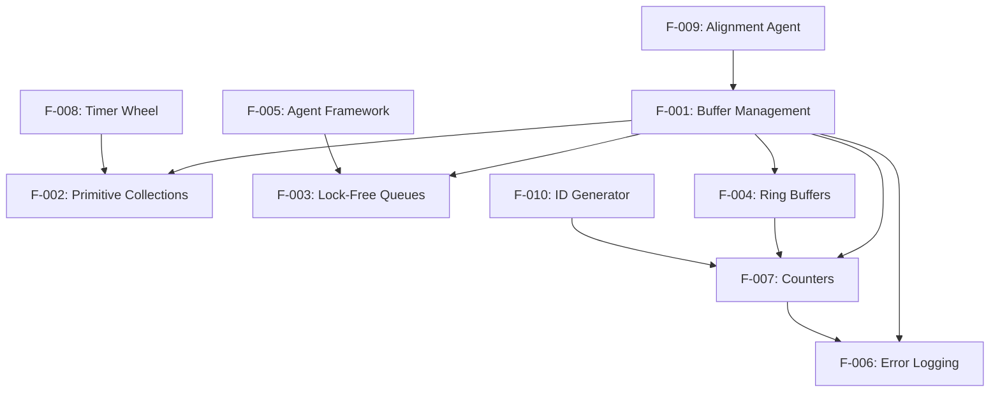
```mermaid
graph TB
    F001[F-001: Buffer Management] --> F002[F-002: Primitive Collections]
    F001 --> F003[F-003: Lock-Free Queues]
    F001 --> F004[F-004: Ring Buffers]
    F001 --> F006[F-006: Error Logging]
    F001 --> F007[F-007: Counters]
    F009[F-009: Alignment Agent] --> F001
    F004 --> F007
    F005[F-005: Agent Framework] --> F003
    F008[F-008: Timer Wheel] --> F002
    F010[F-010: ID Generator] --> F007
    F007 --> F006
```

### 2.3.2 Integration Points

**Core Buffer Foundation**
- Buffer Management (F-001) serves as the foundational abstraction for all memory-intensive features
- Atomic operations and memory ordering semantics are shared across concurrent structures
- Memory-mapped file integration provides persistence capabilities for Ring Buffers and Error Logging

**Concurrent Coordination**
- Ring Buffers (F-004) depend on Counters (F-007) for position tracking and heartbeat monitoring
- Agent Framework (F-005) utilizes Lock-Free Queues (F-003) for task distribution and work coordination
- Alignment Agent (F-009) instruments Buffer Management operations for runtime validation

**Monitoring Integration**
- Counters (F-007) provide telemetry collection for Error Logging (F-006) occurrence tracking
- ID Generator (F-010) uses Counters for sequence number management and overflow detection
- Agent Framework coordinates with Timer Wheel (F-008) for scheduling and deadline management

### 2.3.3 Shared Components

**Core Utilities**
- `UnsafeApi`: Provides consistent unsafe memory access across Buffer Management, Collections, and Counters
- `BitUtil`: Shared alignment and sizing utilities used by all memory-sensitive components
- `SystemUtil`: Platform detection and configuration shared across all modules
- `ThreadHints`: CPU optimization hints shared by concurrent structures

**Memory Management**
- Alignment enforcement and validation shared across all buffer operations
- Cache-line padding strategies consistent across concurrent data structures
- Memory ordering semantics standardized across all atomic operations

**Error Handling**
- Consistent exception patterns across all API boundaries
- Shared validation logic for bounds checking and capacity management
- Standard error propagation mechanisms for failure scenarios

### 2.3.4 Common Services

**Memory Allocation Services**
- Direct memory allocation with alignment guarantees
- Expandable buffer management with growth strategies
- Memory-mapped file coordination for persistence features

**Atomic Operations Services**
- Compare-and-swap coordination across concurrent structures
- Memory ordering enforcement for visibility guarantees
- Cache coherency optimization for multi-core environments

**Performance Monitoring Services**
- Counter-based telemetry collection without allocation overhead
- Error deduplication and occurrence tracking
- Performance measurement integration points

## 2.4 IMPLEMENTATION CONSIDERATIONS

### 2.4.1 Buffer Management Considerations

**Technical Constraints**
- Requires Unsafe API access or VarHandle fallback for optimal performance
- Platform-specific alignment requirements vary across architectures
- Memory ordering semantics require careful JVM version compatibility

**Performance Requirements**
- Sub-10ns latency for aligned memory access operations
- Zero allocation in steady-state operation for all buffer manipulations
- Cache-line awareness for optimal multi-core performance

**Scalability Considerations**
- No synchronization overhead for single-threaded buffer operations
- Memory usage scales linearly with buffer capacity requirements
- Thread-local optimization opportunities for frequent access patterns

**Security Implications**
- Unsafe memory access requires explicit JVM configuration and security review
- Buffer bounds checking can be disabled for performance optimization
- Direct memory access bypasses standard Java security mechanisms

**Maintenance Requirements**
- Platform-specific testing across JVM versions and operating systems
- Alignment requirement validation for new processor architectures
- Performance regression testing for JVM optimization changes

### 2.4.2 Primitive Collections Considerations

**Technical Constraints**
- Limited to int/long key types due to code generation approach
- Hash function selection impacts collision distribution and performance
- Memory layout optimization requires careful cache-line consideration

**Performance Requirements**
- O(1) average case operations with bounded worst-case performance
- Memory overhead less than 25% compared to equivalent boxed collections
- Cache-friendly access patterns for high-throughput scenarios

**Scalability Considerations**
- Automatic resizing with configurable load factor management
- Memory usage proportional to element count with minimal overhead
- Thread-safety through external synchronization where required

**Security Implications**
- No security-specific requirements beyond standard Java memory safety
- Hash collision resistance for denial-of-service attack prevention
- Memory exhaustion protection through capacity limits

**Maintenance Requirements**
- Code generation maintenance for type specialization
- Hash function evaluation and optimization based on usage patterns
- Performance benchmark maintenance for regression detection

### 2.4.3 Concurrent Structures Considerations

**Technical Constraints**
- Single-writer semantics for position management in most structures
- Power-of-two sizing requirements for optimal performance
- Memory ordering requirements limit portability to some architectures

**Performance Requirements**
- Lock-free operation with wait-free progress guarantees where possible
- Linear scalability with CPU core count for multi-producer scenarios
- Minimal coordination overhead between producers and consumers

**Scalability Considerations**
- Per-core data structure deployment for maximum throughput
- Memory usage scales with concurrent access patterns
- Backoff strategies prevent excessive CPU utilization under contention

**Security Implications**
- Shared memory access control for cross-process communication
- No authentication or authorization mechanisms provided
- Resource exhaustion protection through capacity limits

**Maintenance Requirements**
- Concurrent algorithm correctness validation through stress testing
- Memory ordering verification across JVM implementations
- Performance characterization under various load patterns

### 2.4.4 Monitoring and Utilities Considerations

**Technical Constraints**
- Off-heap storage requires careful memory management and cleanup
- File system dependency for persistent logging and counter storage
- Platform-specific signal handling for graceful shutdown coordination

**Performance Requirements**
- Minimal overhead for counter updates in performance-critical paths
- Efficient deduplication algorithms for error log management
- High-resolution timing with microsecond precision requirements

**Scalability Considerations**
- Counter storage scales with application complexity and monitoring requirements
- Error log storage management prevents unbounded growth
- Timer resolution and capacity scale with application timing requirements

**Security Implications**
- File system permissions for persistent storage access
- No encryption or access control for stored monitoring data  
- Resource limits to prevent disk space exhaustion

**Maintenance Requirements**
- File format compatibility across version updates
- Counter metadata schema evolution support
- Platform-specific timing source calibration and validation

## 2.5 REFERENCES

### 2.5.1 Technical Specification Sections
- `1.1 EXECUTIVE SUMMARY` - Project overview and business context
- `1.2 SYSTEM OVERVIEW` - System architecture and core capabilities
- `1.3 SCOPE` - Feature boundaries and integration requirements

### 2.5.2 Source Code Analysis
**Core Implementation Files:**
- `agrona/src/main/java/org/agrona/BufferUtil.java` - Core buffer utilities and memory operations
- `agrona/src/main/java/org/agrona/DirectBuffer.java` - Read-only buffer interface specification
- `agrona/src/main/java/org/agrona/MutableDirectBuffer.java` - Write-capable buffer interface
- `agrona/src/main/java/org/agrona/concurrent/AtomicBuffer.java` - Atomic operations interface
- `agrona/src/main/java/org/agrona/concurrent/Agent.java` - Agent lifecycle interface
- `agrona/src/main/java/org/agrona/concurrent/IdleStrategy.java` - CPU idle strategy interface
- `agrona/src/main/java/org/agrona/concurrent/ringbuffer/RingBuffer.java` - Ring buffer interface
- `agrona/src/main/java/org/agrona/concurrent/status/CountersManager.java` - Counter management
- `agrona/src/main/java/org/agrona/concurrent/errors/DistinctErrorLog.java` - Error deduplication
- `agrona/src/main/java/org/agrona/collections/Int2IntHashMap.java` - Primitive map implementation example
- `agrona/src/main/java/org/agrona/checksum/Checksum.java` - Checksum interface specification
- `agrona/src/main/java/org/agrona/io/DirectBufferInputStream.java` - I/O stream adapter implementation

**Package Structure Analysis:**
- `agrona/` - Main module containing core library implementation
- `agrona/src/main/java/org/agrona/` - Core package with buffer, utility, and system classes
- `agrona/src/main/java/org/agrona/concurrent/` - Concurrency utilities and lock-free data structures
- `agrona/src/main/java/org/agrona/collections/` - Primitive collections and functional interfaces
- `agrona/src/main/java/org/agrona/io/` - I/O stream adapters for buffer operations
- `agrona/src/main/java/org/agrona/concurrent/errors/` - Error logging implementation
- `agrona/src/main/java/org/agrona/concurrent/ringbuffer/` - Ring buffer implementations
- `agrona/src/main/java/org/agrona/concurrent/status/` - Counter and status implementations
- `agrona/src/main/java/org/agrona/checksum/` - Checksum utility implementations
- `agrona-agent/` - ByteBuddy-based alignment verification agent module

# 3. TECHNOLOGY STACK

## 3.1 PROGRAMMING LANGUAGES

### 3.1.1 Primary Language Selection

**Java** serves as the exclusive programming language for Agrona, supporting the library's mission to deliver microsecond-level performance within the JVM ecosystem.

**Version Requirements and Compatibility**
- **Minimum Version**: Java 17 (source and target compatibility)
- **Testing Matrix**: Java 17, 21, 24, and 25-ea (early access)
- **Production Validation**: Continuous integration across all supported versions

**Advanced JVM Feature Utilization**
- **Direct Memory Access**: `jdk.internal.misc.Unsafe` API for zero-copy buffer operations
- **VarHandle API**: Fallback implementation for platforms restricting Unsafe access
- **Method Handles**: Dynamic method dispatch optimization for performance-critical paths
- **Invokedynamic**: Bootstrap method optimization for specialized operations

**Selection Justification**
Java's unique combination of platform portability, direct memory access capabilities, and mature ecosystem optimization makes it the optimal choice for high-performance library development. The language provides essential low-level memory manipulation capabilities while maintaining the platform independence critical for enterprise library adoption.

**Technical Constraints**
- **JVM Configuration**: Requires `--add-opens java.base/jdk.internal.misc=ALL-UNNAMED` for optimal performance
- **Architecture Dependencies**: Performance characteristics vary across JVM implementations and processor architectures
- **Memory Model**: Strict adherence to Java Memory Model for concurrent algorithm correctness

## 3.2 FRAMEWORKS & LIBRARIES

### 3.2.1 Core Testing Infrastructure

**JUnit 5 (Jupiter) - Version 5.13.1**
- **Primary Role**: Comprehensive unit testing framework with parameterized test support
- **Platform Integration**: JUnit Platform Launcher for CI/CD execution
- **Backward Compatibility**: JUnit 4 (4.13.2) support through Vintage engine
- **Justification**: Advanced testing capabilities essential for validating lock-free algorithms and concurrent structures

**Java Microbenchmark Harness (JMH) - Version 1.37**
- **Performance Validation**: Statistically rigorous benchmarking for latency measurements
- **Regression Detection**: Automated performance regression prevention
- **Annotation Processing**: Compile-time benchmark generation and optimization
- **Justification**: Industry-standard tool for measuring sub-microsecond performance characteristics

**Java Concurrency Stress Tests (JCStress) - Version 0.16**
- **Concurrency Validation**: Stress testing for lock-free data structure correctness
- **Algorithm Verification**: Formal validation of concurrent primitive operations
- **Memory Ordering**: Verification of proper memory barrier implementations
- **Justification**: Critical for ensuring correctness of lock-free algorithms under concurrent access

### 3.2.2 Build-Time Enhancement Tools

**ByteBuddy - Version 1.17.6**
- **Runtime Bytecode Generation**: Dynamic agent implementation for buffer alignment verification
- **Compile-Time Instrumentation**: Gradle plugin integration for enhanced testing
- **Performance Optimization**: Zero-overhead runtime code generation
- **Justification**: Essential for implementing specialized performance validation agents

**Bnd (Bundle Tools) - Version 7.1.0**
- **OSGi Metadata Generation**: Automatic bundle manifest creation
- **Java Module Compatibility**: Module-info.java integration support
- **Enterprise Integration**: Seamless deployment in OSGi-based enterprise environments
- **Justification**: Enables enterprise adoption through standardized module metadata

### 3.2.3 Testing and Validation Libraries

**Mockito - Version 5.18.0**
- **Mock Object Creation**: Unit test isolation through dependency mocking
- **Agent Support**: Runtime bytecode modification for enhanced mocking capabilities
- **Integration Testing**: Simplified testing of complex component interactions
- **Compatibility**: Full compatibility with JUnit 5 testing framework

**Hamcrest - Version 3.0**
- **Expressive Assertions**: Fluent assertion API for readable test cases
- **Custom Matchers**: Domain-specific assertion development
- **Integration**: Seamless integration with JUnit testing framework

**Guava TestLib - Version 33.4.8-jre**
- **Google Testing Utilities**: Additional testing utilities for complex scenarios
- **Collection Testing**: Specialized testing support for custom collection implementations
- **Performance Testing**: Utilities for validating collection performance characteristics

## 3.3 OPEN SOURCE DEPENDENCIES

### 3.3.1 Runtime Dependency Strategy

**Zero External Dependencies**
- **Design Philosophy**: Pure JDK implementation without external runtime dependencies
- **Security Benefits**: Minimized attack surface through reduced dependency tree
- **Integration Advantages**: Simplified deployment and version conflict resolution
- **Performance Impact**: Elimination of dependency resolution overhead

### 3.3.2 Build and Test Dependencies

**Centralized Version Management**
```toml
# Managed through gradle/libs.versions.toml
byteBuddy = "1.17.6"
checkstyle = "10.25.0"
guava = "33.4.8-jre"
hamcrest = "3.0"
jcstress = "0.16"
jmh = "1.37"
junit = "5.13.1"
mockito = "5.18.0"
```

**Development Tool Dependencies**
- **Static Analysis**: Checkstyle 10.25.0 for code quality enforcement
- **Utilities**: Apache Commons Lang3 3.8.1 for build script utilities
- **JSON Processing**: JSON 20250517 for configuration parsing
- **HTTP Client**: Apache HttpCore 4.4.14 for integration testing

**Package Distribution**
- **Primary Registry**: Maven Central for production releases
- **Development Registry**: Sonatype OSSRH for snapshot distributions
- **Local Testing**: Maven Local repository for development iterations

## 3.4 DEVELOPMENT & DEPLOYMENT

### 3.4.1 Build System Architecture

**Gradle Build Platform - Version 8.14.2**
- **Multi-Module Structure**: Modular project organization with specialized build configurations
- **Version Catalog**: Centralized dependency management through `gradle/libs.versions.toml`
- **Custom Plugins**: Specialized build logic in `buildSrc` for code generation
- **Reproducible Builds**: Gradle Wrapper ensures consistent build environments
- **Shadow Plugin**: Fat JAR generation for agent and benchmark modules

**Build Configuration Management**
- **Toolchain Support**: Dynamic Java version selection via `BUILD_JAVA_VERSION` environment variable
- **Cross-Platform**: Verified builds across Linux, Windows, and macOS
- **Performance Optimization**: Parallel execution and build caching

### 3.4.2 Code Quality and Analysis

**Checkstyle Integration - Version 10.25.0**
- **AST-Based Analysis**: Advanced syntax tree analysis for code quality enforcement
- **Custom Configuration**: Tailored rules in `config/checkstyle/` for project-specific standards
- **IDE Integration**: Support for IntelliJ IDEA, Eclipse, and Sublime Text
- **Build Integration**: Automated quality gates in CI/CD pipeline

**Static Security Analysis**
- **CodeQL Integration**: GitHub-native security vulnerability detection
- **Custom Query Exclusion**: Targeted analysis configuration for library-specific patterns
- **SARIF Reporting**: Standardized security analysis report format
- **Automated Triage**: Intelligent alert management for false positive reduction

### 3.4.3 Continuous Integration Infrastructure

**GitHub Actions Platform**
- **Matrix Builds**: Comprehensive testing across JDK versions (17, 21, 24, 25-ea) and operating systems
- **Performance Validation**: Automated JMH benchmark execution with regression detection
- **Security Scanning**: Integrated CodeQL analysis with vulnerability reporting
- **Artifact Management**: Automated test result collection and crash log analysis

**CI/CD Pipeline Configuration**
```yaml
# Key platform specifications
os: [ubuntu-24.04, windows-latest, macos-15]
java-version: [17, 21, 24, 25-ea]
java-distribution: zulu
```

**Release Automation**
- **GPG Signing**: Automated artifact signing for Maven Central publication
- **Sonatype Integration**: Central Portal deployment for production releases
- **Version Management**: Semantic versioning with automated changelog generation
- **Quality Gates**: Comprehensive test suite execution before release approval

### 3.4.4 Development Environment Support

**IDE Configuration**
- **IntelliJ IDEA**: Primary development environment with `.idea/` exclusion in version control
- **Eclipse Integration**: Project configuration files for cross-IDE compatibility
- **Sublime Text**: Editor configuration for lightweight development environments

**Version Control Integration**
- **Git Attributes**: Line ending normalization for cross-platform development
- **Semantic Versioning**: Version tracking through `version.txt` file
- **Branch Protection**: Master branch quality gates and required status checks

### 3.4.5 Distribution and Deployment

**Maven Repository Distribution**
- **Production Releases**: Maven Central publication with full metadata
- **Development Snapshots**: Sonatype OSSRH for pre-release distributions
- **Artifact Types**: Main JAR, sources, Javadoc, and specialized agent JARs
- **OSGi Compatibility**: Bundle metadata for enterprise deployment scenarios

**Security and Integrity**
- **GPG Signing**: All artifacts signed with project GPG key
- **Checksum Verification**: SHA-1 and MD5 checksums for artifact integrity
- **Supply Chain Security**: Dependency verification and vulnerability scanning

## 3.5 INTEGRATION REQUIREMENTS

### 3.5.1 JVM Configuration Dependencies

**Required JVM Arguments**
```bash
--add-opens java.base/jdk.internal.misc=ALL-UNNAMED
```

**Optional Performance Tuning**
- **Heap Configuration**: Minimal heap requirements due to off-heap memory usage
- **GC Tuning**: Low-latency garbage collection configuration recommendations
- **CPU Affinity**: Thread pinning for maximum performance scenarios

### 3.5.2 Cross-Platform Compatibility

**Operating System Support**
- **Linux**: Primary development and production platform
- **Windows**: Full compatibility with Windows-specific JVM optimizations
- **macOS**: Complete feature parity across Intel and Apple Silicon architectures

**JVM Distribution Compatibility**
- **OpenJDK**: Primary testing and validation platform
- **Oracle JDK**: Full compatibility with commercial JVM features
- **Zulu JDK**: CI/CD standard distribution for reproducible builds
- **GraalVM**: Compatible with native compilation where applicable

### 3.5.3 Enterprise Integration Patterns

**OSGi Bundle Support**
- **Automatic Manifest Generation**: Bundle metadata for OSGi container deployment
- **Service Registration**: Optional OSGi service registration patterns
- **Dependency Management**: Zero-dependency design simplifies OSGi deployment

**Maven/Gradle Integration**
- **Standard Coordinates**: `org.agrona:agrona` artifact coordinates
- **Transitive Dependencies**: Zero runtime dependencies eliminate version conflicts
- **Build Plugin Compatibility**: Integration with standard build lifecycle phases

### 3.5.4 Security Considerations

**Memory Access Security**
- **Unsafe API Usage**: Explicit JVM configuration required for optimal performance
- **Bounds Checking**: Configurable safety vs. performance trade-offs
- **Direct Memory Access**: Bypasses standard Java security mechanisms by design

**Supply Chain Security**
- **Artifact Signing**: GPG signature verification for all published artifacts
- **Dependency Scanning**: Automated vulnerability detection in build dependencies
- **Reproducible Builds**: Deterministic build process for security auditing

#### References

**Core Configuration Files**
- `build.gradle` - Primary build configuration and dependency management
- `gradle/libs.versions.toml` - Centralized version catalog for reproducible builds
- `gradle/wrapper/gradle-wrapper.properties` - Gradle version specification (8.14.2)
- `.github/workflows/ci.yml` - CI/CD pipeline configuration and testing matrix

**Quality and Security**
- `config/checkstyle/` - Code quality enforcement configuration
- `.github/workflows/codeql.yml` - Security analysis and vulnerability detection
- `buildSrc/` - Custom build logic and code generation plugins

**Development Environment**
- `.gitattributes` - Version control line ending normalization
- `version.txt` - Semantic version management
- `.github/workflows/` - Complete CI/CD automation and release management

# 4. PROCESS FLOWCHART

## 4.1 SYSTEM WORKFLOWS

### 4.1.1 Core Business Processes

#### 4.1.1.1 Buffer Management Workflow

The buffer management system provides zero-copy operations for heap and off-heap memory access, serving as the foundation for all high-performance operations within Agrona.

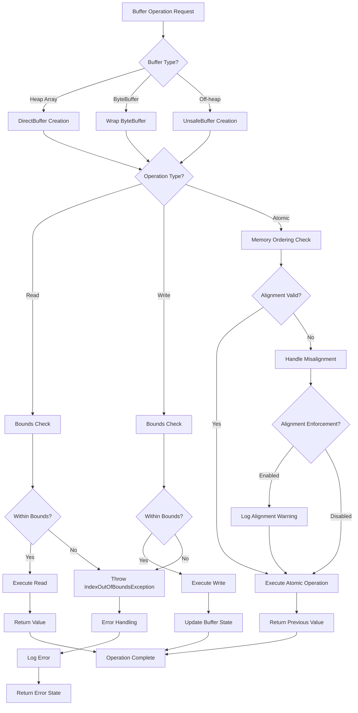
```mermaid
flowchart TD
    A[Buffer Operation Request] --> B{Buffer Type?}
    B -->|Heap Array| C[DirectBuffer Creation]
    B -->|ByteBuffer| D[Wrap ByteBuffer]
    B -->|Off-heap| E[UnsafeBuffer Creation]
    
    C --> F{Operation Type?}
    D --> F
    E --> F
    
    F -->|Read| G[Bounds Check]
    F -->|Write| H[Bounds Check]
    F -->|Atomic| I[Memory Ordering Check]
    
    G --> J{Within Bounds?}
    H --> K{Within Bounds?}
    I --> L{Alignment Valid?}
    
    J -->|Yes| M[Execute Read]
    J -->|No| N[Throw IndexOutOfBoundsException]
    K -->|Yes| O[Execute Write]
    K -->|No| N
    L -->|Yes| P[Execute Atomic Operation]
    L -->|No| Q[Handle Misalignment]
    
    M --> R[Return Value]
    O --> S[Update Buffer State]
    P --> T[Return Previous Value]
    Q --> U{Alignment Enforcement?}
    
    S --> V[Operation Complete]
    R --> V
    T --> V
    
    U -->|Enabled| W[Log Alignment Warning]
    U -->|Disabled| P
    W --> P
    
    N --> X[Error Handling]
    X --> Y[Log Error]
    Y --> Z[Return Error State]
```

#### 4.1.1.2 Ring Buffer Messaging Workflow

The ring buffer messaging system enables lock-free inter-process and inter-thread communication with back-pressure support and correlation tracking.

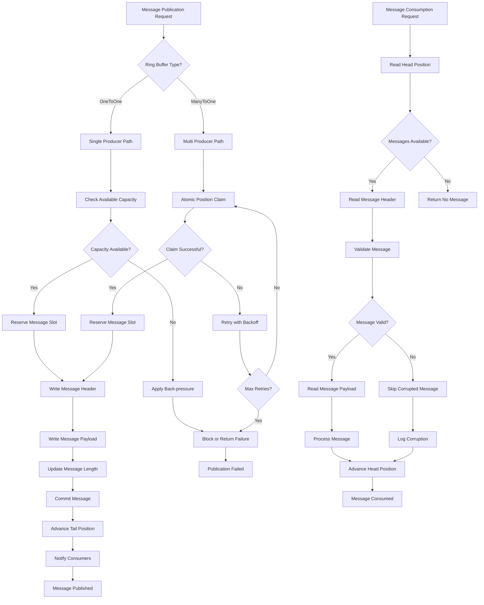
```mermaid
flowchart TD
    A[Message Publication Request] --> B{Ring Buffer Type?}
    B -->|OneToOne| C[Single Producer Path]
    B -->|ManyToOne| D[Multi Producer Path]
    
    C --> E[Check Available Capacity]
    D --> F[Atomic Position Claim]
    
    E --> G{Capacity Available?}
    F --> H{Claim Successful?}
    
    G -->|Yes| I[Reserve Message Slot]
    G -->|No| J[Apply Back-pressure]
    H -->|Yes| K[Reserve Message Slot]
    H -->|No| L[Retry with Backoff]
    
    I --> M[Write Message Header]
    K --> M
    J --> N[Block or Return Failure]
    L --> O{Max Retries?}
    
    O -->|No| F
    O -->|Yes| N
    
    M --> P[Write Message Payload]
    P --> Q[Update Message Length]
    Q --> R[Commit Message]
    
    R --> S[Advance Tail Position]
    S --> T[Notify Consumers]
    T --> U[Message Published]
    
    N --> V[Publication Failed]
    
    %% Consumer Side
    W[Message Consumption Request] --> X[Read Head Position]
    X --> Y{Messages Available?}
    Y -->|Yes| Z[Read Message Header]
    Y -->|No| AA[Return No Message]
    
    Z --> BB[Validate Message]
    BB --> CC{Message Valid?}
    CC -->|Yes| DD[Read Message Payload]
    CC -->|No| EE[Skip Corrupted Message]
    
    DD --> FF[Process Message]
    FF --> GG[Advance Head Position]
    GG --> HH[Message Consumed]
    
    EE --> II[Log Corruption]
    II --> GG
```

#### 4.1.1.3 Agent Scheduling Workflow

The agent framework provides concurrent task execution with configurable idle strategies and lifecycle management.

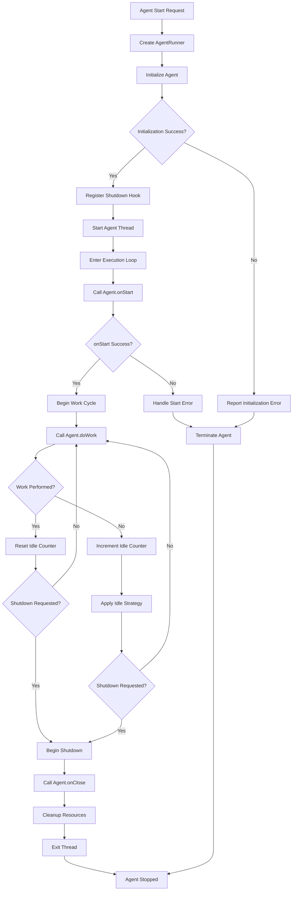
```mermaid
flowchart TD
    A[Agent Start Request] --> B[Create AgentRunner]
    B --> C[Initialize Agent]
    C --> D{Initialization Success?}
    
    D -->|Yes| E[Register Shutdown Hook]
    D -->|No| F[Report Initialization Error]
    
    E --> G[Start Agent Thread]
    G --> H[Enter Execution Loop]
    
    H --> I[Call Agent.onStart]
    I --> J{onStart Success?}
    J -->|Yes| K[Begin Work Cycle]
    J -->|No| L[Handle Start Error]
    
    K --> M[Call Agent.doWork]
    M --> N{Work Performed?}
    
    N -->|Yes| O[Reset Idle Counter]
    N -->|No| P[Increment Idle Counter]
    
    O --> Q{Shutdown Requested?}
    P --> R[Apply Idle Strategy]
    R --> S{Shutdown Requested?}
    
    Q -->|No| M
    Q -->|Yes| T[Begin Shutdown]
    S -->|No| M
    S -->|Yes| T
    
    T --> U[Call Agent.onClose]
    U --> V[Cleanup Resources]
    V --> W[Exit Thread]
    
    L --> X[Terminate Agent]
    F --> X
    W --> Y[Agent Stopped]
    X --> Y
```

### 4.1.2 Integration Workflows

#### 4.1.2.1 Primitive Collections Operations Workflow

The primitive collections framework eliminates boxing overhead through specialized type implementations with cache-friendly memory layouts.

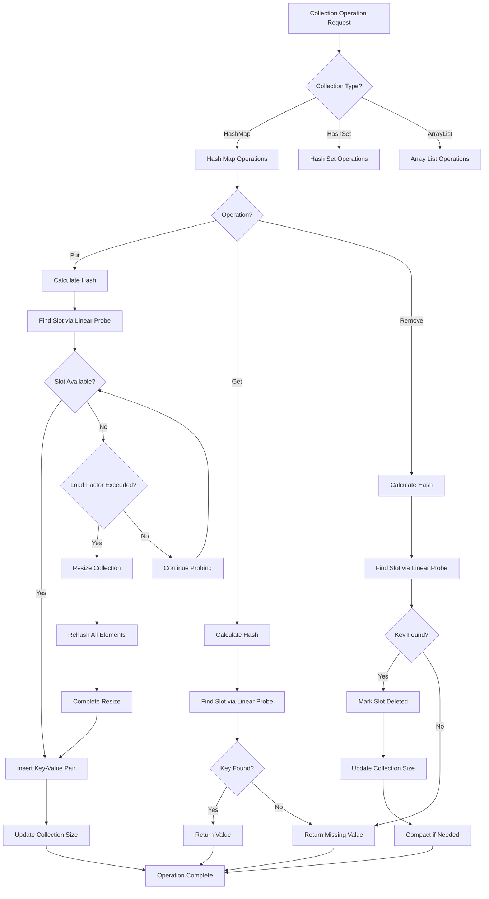
```mermaid
flowchart TD
    A[Collection Operation Request] --> B{Collection Type?}
    B -->|HashMap| C[Hash Map Operations]
    B -->|HashSet| D[Hash Set Operations]
    B -->|ArrayList| E[Array List Operations]
    
    C --> F{Operation?}
    F -->|Put| G[Calculate Hash]
    F -->|Get| H[Calculate Hash]
    F -->|Remove| I[Calculate Hash]
    
    G --> J[Find Slot via Linear Probe]
    H --> K[Find Slot via Linear Probe]
    I --> L[Find Slot via Linear Probe]
    
    J --> M{Slot Available?}
    K --> N{Key Found?}
    L --> O{Key Found?}
    
    M -->|Yes| P[Insert Key-Value Pair]
    M -->|No| Q{Load Factor Exceeded?}
    N -->|Yes| R[Return Value]
    N -->|No| S[Return Missing Value]
    O -->|Yes| T[Mark Slot Deleted]
    O -->|No| S
    
    P --> U[Update Collection Size]
    Q -->|Yes| V[Resize Collection]
    Q -->|No| W[Continue Probing]
    
    V --> X[Rehash All Elements]
    X --> Y[Complete Resize]
    Y --> P
    W --> M
    
    T --> Z[Update Collection Size]
    Z --> AA[Compact if Needed]
    AA --> BB[Operation Complete]
    
    U --> BB
    R --> BB
    S --> BB
```

#### 4.1.2.2 Concurrent Queue Data Flow

The concurrent queue system provides lock-free coordination between multiple producers and consumers with wait-free progress guarantees.

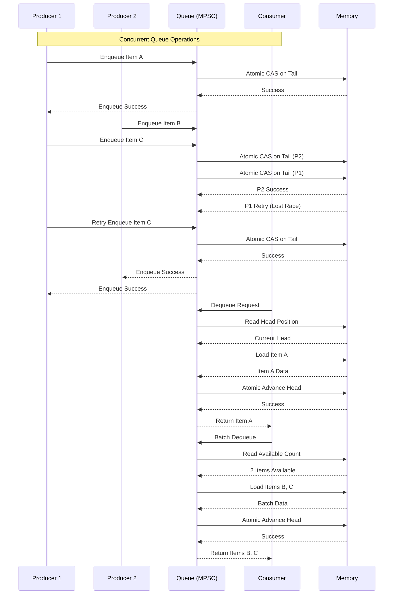
```mermaid
sequenceDiagram
    participant P1 as Producer 1
    participant P2 as Producer 2
    participant Q as Queue (MPSC)
    participant C as Consumer
    participant M as Memory
    
    Note over P1,C: Concurrent Queue Operations
    
    P1->>Q: Enqueue Item A
    Q->>M: Atomic CAS on Tail
    M-->>Q: Success
    Q-->>P1: Enqueue Success
    
    P2->>Q: Enqueue Item B
    P1->>Q: Enqueue Item C
    Q->>M: Atomic CAS on Tail (P2)
    Q->>M: Atomic CAS on Tail (P1)
    M-->>Q: P2 Success
    M-->>Q: P1 Retry (Lost Race)
    
    P1->>Q: Retry Enqueue Item C
    Q->>M: Atomic CAS on Tail
    M-->>Q: Success
    Q-->>P2: Enqueue Success
    Q-->>P1: Enqueue Success
    
    C->>Q: Dequeue Request
    Q->>M: Read Head Position
    M-->>Q: Current Head
    Q->>M: Load Item A
    M-->>Q: Item A Data
    Q->>M: Atomic Advance Head
    M-->>Q: Success
    Q-->>C: Return Item A
    
    C->>Q: Batch Dequeue
    Q->>M: Read Available Count
    M-->>Q: 2 Items Available
    Q->>M: Load Items B, C
    M-->>Q: Batch Data
    Q->>M: Atomic Advance Head
    M-->>Q: Success
    Q-->>C: Return Items B, C
```

## 4.2 STATE MANAGEMENT

### 4.2.1 Buffer State Transitions

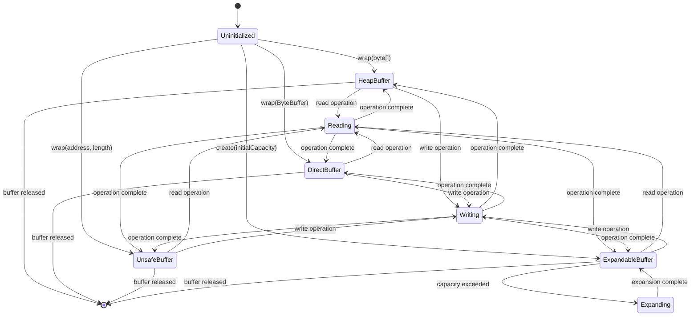
```mermaid
stateDiagram-v2
    [*] --> Uninitialized
    Uninitialized --> HeapBuffer: wrap(byte[])
    Uninitialized --> DirectBuffer: wrap(ByteBuffer)
    Uninitialized --> UnsafeBuffer: wrap(address, length)
    Uninitialized --> ExpandableBuffer: create(initialCapacity)
    
    HeapBuffer --> Reading: read operation
    DirectBuffer --> Reading: read operation
    UnsafeBuffer --> Reading: read operation
    ExpandableBuffer --> Reading: read operation
    
    HeapBuffer --> Writing: write operation
    DirectBuffer --> Writing: write operation
    UnsafeBuffer --> Writing: write operation
    ExpandableBuffer --> Writing: write operation
    
    Reading --> HeapBuffer: operation complete
    Reading --> DirectBuffer: operation complete
    Reading --> UnsafeBuffer: operation complete
    Reading --> ExpandableBuffer: operation complete
    
    Writing --> HeapBuffer: operation complete
    Writing --> DirectBuffer: operation complete
    Writing --> UnsafeBuffer: operation complete
    Writing --> ExpandableBuffer: operation complete
    
    ExpandableBuffer --> Expanding: capacity exceeded
    Expanding --> ExpandableBuffer: expansion complete
    
    HeapBuffer --> [*]: buffer released
    DirectBuffer --> [*]: buffer released
    UnsafeBuffer --> [*]: buffer released
    ExpandableBuffer --> [*]: buffer released
```

### 4.2.2 Ring Buffer Position Management

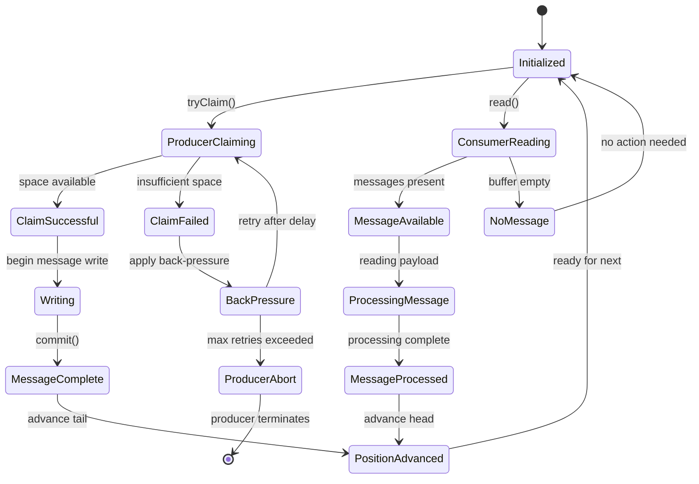
```mermaid
stateDiagram-v2
    [*] --> Initialized
    Initialized --> ProducerClaiming: tryClaim()
    ProducerClaiming --> ClaimSuccessful: space available
    ProducerClaiming --> ClaimFailed: insufficient space
    
    ClaimSuccessful --> Writing: begin message write
    Writing --> MessageComplete: commit()
    MessageComplete --> PositionAdvanced: advance tail
    PositionAdvanced --> Initialized: ready for next
    
    ClaimFailed --> BackPressure: apply back-pressure
    BackPressure --> ProducerClaiming: retry after delay
    BackPressure --> ProducerAbort: max retries exceeded
    
    Initialized --> ConsumerReading: read()
    ConsumerReading --> MessageAvailable: messages present
    ConsumerReading --> NoMessage: buffer empty
    
    MessageAvailable --> ProcessingMessage: reading payload
    ProcessingMessage --> MessageProcessed: processing complete
    MessageProcessed --> PositionAdvanced: advance head
    
    NoMessage --> Initialized: no action needed
    ProducerAbort --> [*]: producer terminates
```

### 4.2.3 Agent Lifecycle States

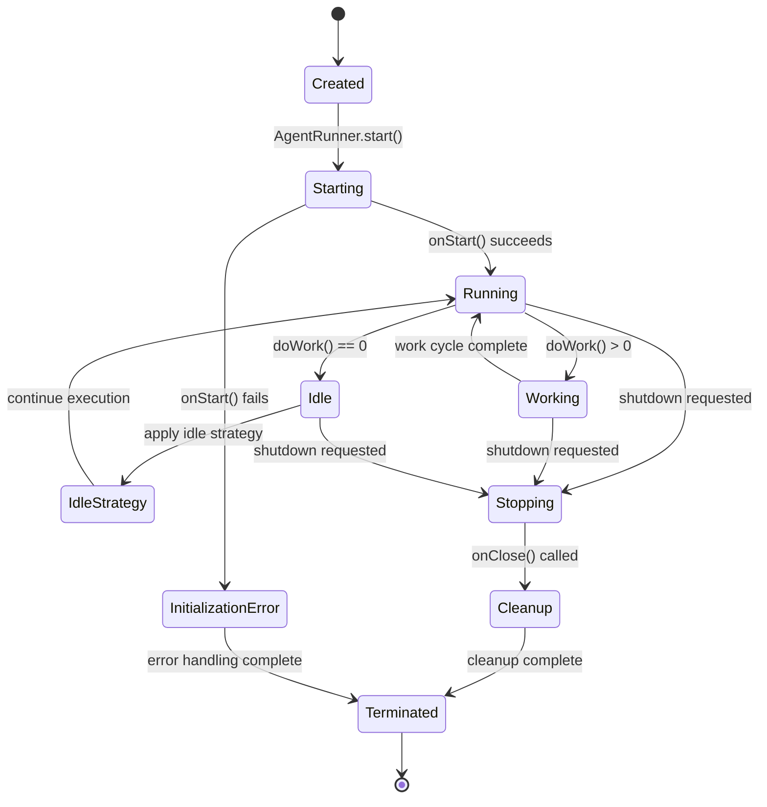
```mermaid
stateDiagram-v2
    [*] --> Created
    Created --> Starting: AgentRunner.start()
    Starting --> InitializationError: onStart() fails
    Starting --> Running: onStart() succeeds
    
    Running --> Working: doWork() > 0
    Running --> Idle: doWork() == 0
    Working --> Running: work cycle complete
    
    Idle --> IdleStrategy: apply idle strategy
    IdleStrategy --> Running: continue execution
    
    Running --> Stopping: shutdown requested
    Working --> Stopping: shutdown requested
    Idle --> Stopping: shutdown requested
    
    Stopping --> Cleanup: onClose() called
    Cleanup --> Terminated: cleanup complete
    
    InitializationError --> Terminated: error handling complete
    Terminated --> [*]
```

## 4.3 ERROR HANDLING FLOWCHARTS

### 4.3.1 Buffer Bounds Checking and Recovery

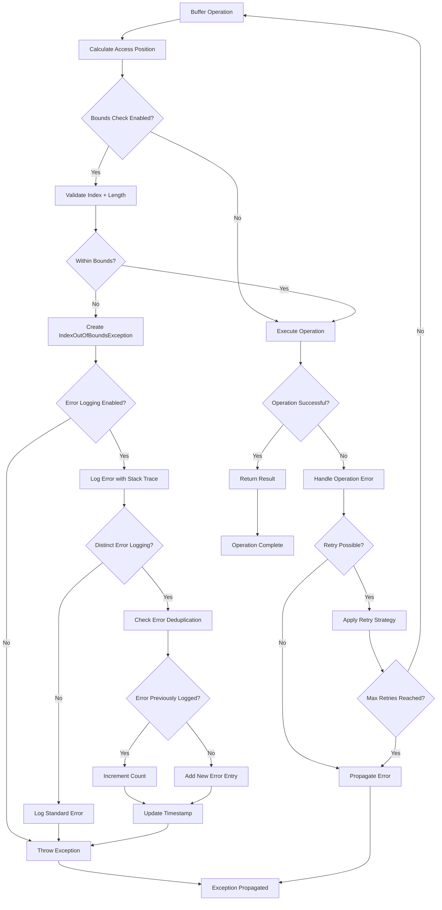
```mermaid
flowchart TD
    A[Buffer Operation] --> B[Calculate Access Position]
    B --> C{Bounds Check Enabled?}
    
    C -->|No| D[Execute Operation]
    C -->|Yes| E[Validate Index + Length]
    
    E --> F{Within Bounds?}
    F -->|Yes| D
    F -->|No| G[Create IndexOutOfBoundsException]
    
    G --> H{Error Logging Enabled?}
    H -->|Yes| I[Log Error with Stack Trace]
    H -->|No| J[Throw Exception]
    
    I --> K{Distinct Error Logging?}
    K -->|Yes| L[Check Error Deduplication]
    K -->|No| M[Log Standard Error]
    
    L --> N{Error Previously Logged?}
    N -->|Yes| O[Increment Count]
    N -->|No| P[Add New Error Entry]
    
    O --> Q[Update Timestamp]
    P --> Q
    M --> J
    Q --> J
    
    D --> R{Operation Successful?}
    R -->|Yes| S[Return Result]
    R -->|No| T[Handle Operation Error]
    
    T --> U{Retry Possible?}
    U -->|Yes| V[Apply Retry Strategy]
    U -->|No| W[Propagate Error]
    
    V --> X{Max Retries Reached?}
    X -->|No| A
    X -->|Yes| W
    
    S --> Y[Operation Complete]
    J --> Z[Exception Propagated]
    W --> Z
```

### 4.3.2 Concurrent Structure Recovery

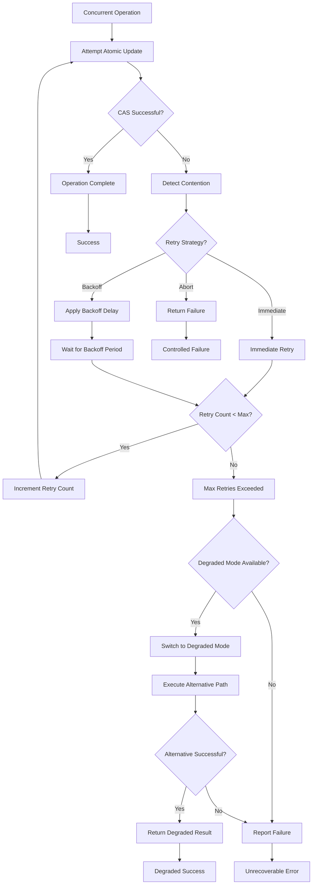
```mermaid
flowchart TD
    A[Concurrent Operation] --> B[Attempt Atomic Update]
    B --> C{CAS Successful?}
    
    C -->|Yes| D[Operation Complete]
    C -->|No| E[Detect Contention]
    
    E --> F{Retry Strategy?}
    F -->|Immediate| G[Immediate Retry]
    F -->|Backoff| H[Apply Backoff Delay]
    F -->|Abort| I[Return Failure]
    
    G --> J{Retry Count < Max?}
    H --> K[Wait for Backoff Period]
    K --> J
    
    J -->|Yes| L[Increment Retry Count]
    J -->|No| M[Max Retries Exceeded]
    
    L --> B
    M --> N{Degraded Mode Available?}
    
    N -->|Yes| O[Switch to Degraded Mode]
    N -->|No| P[Report Failure]
    
    O --> Q[Execute Alternative Path]
    Q --> R{Alternative Successful?}
    R -->|Yes| S[Return Degraded Result]
    R -->|No| P
    
    D --> T[Success]
    I --> U[Controlled Failure]
    P --> V[Unrecoverable Error]
    S --> W[Degraded Success]
```

### 4.3.3 Agent Error Handling and Recovery

```mermaid
flowchart TD
    A[Agent Execution] --> B{Exception Occurred?}
    B -->|No| C[Continue Normal Operation]
    B -->|Yes| D[Capture Exception]
    
    D --> E{Exception Type?}
    E -->|AgentTerminationException| F[Begin Graceful Shutdown]
    E -->|RuntimeException| G[Handle Runtime Error]
    E -->|Error| H[Handle System Error]
    
    F --> I[Call onClose()]
    I --> J[Cleanup Resources]
    J --> K[Exit Agent Thread]
    
    G --> L{Error Handler Defined?}
    H --> M{Critical System Error?}
    
    L -->|Yes| N[Call Error Handler]
    L -->|No| O[Default Error Handling]
    
    M -->|Yes| P[Immediate Shutdown]
    M -->|No| Q[Log Error and Continue]
    
    N --> R{Handler Suggests Recovery?}
    R -->|Yes| S[Attempt Recovery]
    R -->|No| T[Terminate Agent]
    
    O --> U[Log Error]
    U --> V{Recoverable Error?}
    V -->|Yes| S
    V -->|No| T
    
    S --> W{Recovery Successful?}
    W -->|Yes| C
    W -->|No| X[Recovery Failed]
    
    X --> Y[Increment Failure Count]
    Y --> Z{Max Failures Exceeded?}
    Z -->|No| AA[Continue with Degraded State]
    Z -->|Yes| T
    
    P --> BB[Emergency Shutdown]
    Q --> CC[Continue with Monitoring]
    T --> DD[Agent Terminated]
    K --> DD
    AA --> C
    CC --> C
    BB --> DD
```

## 4.4 INTEGRATION SEQUENCE DIAGRAMS

### 4.4.1 Aeron Transport Integration

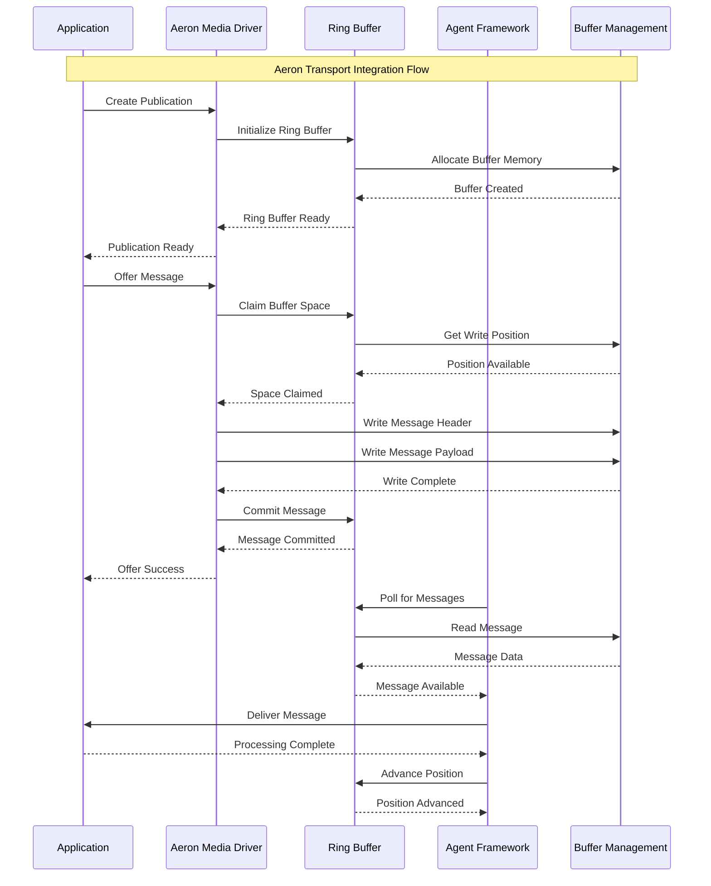
```mermaid
sequenceDiagram
    participant App as Application
    participant Aeron as Aeron Media Driver
    participant RB as Ring Buffer
    participant Agent as Agent Framework
    participant Buffer as Buffer Management
    
    Note over App,Buffer: Aeron Transport Integration Flow
    
    App->>Aeron: Create Publication
    Aeron->>RB: Initialize Ring Buffer
    RB->>Buffer: Allocate Buffer Memory
    Buffer-->>RB: Buffer Created
    RB-->>Aeron: Ring Buffer Ready
    Aeron-->>App: Publication Ready
    
    App->>Aeron: Offer Message
    Aeron->>RB: Claim Buffer Space
    RB->>Buffer: Get Write Position
    Buffer-->>RB: Position Available
    RB-->>Aeron: Space Claimed
    
    Aeron->>Buffer: Write Message Header
    Aeron->>Buffer: Write Message Payload
    Buffer-->>Aeron: Write Complete
    Aeron->>RB: Commit Message
    RB-->>Aeron: Message Committed
    Aeron-->>App: Offer Success
    
    Agent->>RB: Poll for Messages
    RB->>Buffer: Read Message
    Buffer-->>RB: Message Data
    RB-->>Agent: Message Available
    Agent->>App: Deliver Message
    App-->>Agent: Processing Complete
    Agent->>RB: Advance Position
    RB-->>Agent: Position Advanced
```

### 4.4.2 SBE Encoding Integration

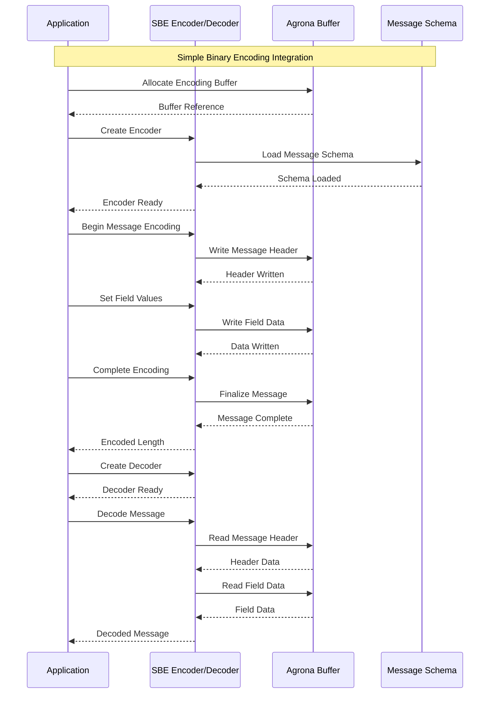
```mermaid
sequenceDiagram
    participant App as Application
    participant SBE as SBE Encoder/Decoder
    participant Buffer as Agrona Buffer
    participant Schema as Message Schema
    
    Note over App,Schema: Simple Binary Encoding Integration
    
    App->>Buffer: Allocate Encoding Buffer
    Buffer-->>App: Buffer Reference
    
    App->>SBE: Create Encoder
    SBE->>Schema: Load Message Schema
    Schema-->>SBE: Schema Loaded
    SBE-->>App: Encoder Ready
    
    App->>SBE: Begin Message Encoding
    SBE->>Buffer: Write Message Header
    Buffer-->>SBE: Header Written
    
    App->>SBE: Set Field Values
    SBE->>Buffer: Write Field Data
    Buffer-->>SBE: Data Written
    
    App->>SBE: Complete Encoding
    SBE->>Buffer: Finalize Message
    Buffer-->>SBE: Message Complete
    SBE-->>App: Encoded Length
    
    App->>SBE: Create Decoder
    SBE-->>App: Decoder Ready
    
    App->>SBE: Decode Message
    SBE->>Buffer: Read Message Header
    Buffer-->>SBE: Header Data
    SBE->>Buffer: Read Field Data
    Buffer-->>SBE: Field Data
    SBE-->>App: Decoded Message
```

## 4.5 TIMING AND SLA CONSIDERATIONS

### 4.5.1 Performance Timing Constraints

| Operation Category | Target Latency | Maximum Latency | Measurement Method |
|-------------------|----------------|-----------------|-------------------|
| Buffer Read/Write | < 10ns | < 50ns | JMH microbenchmark |
| Ring Buffer Message | < 100ns | < 500ns | End-to-end measurement |
| Concurrent Queue Op | < 50ns (SPSC) | < 200ns (MPSC) | Multi-threaded benchmark |
| Agent Work Cycle | < 1µs | < 10µs | Duty cycle measurement |
| Collection Operations | < 100ns | < 1µs | Statistical sampling |

### 4.5.2 SLA Requirements

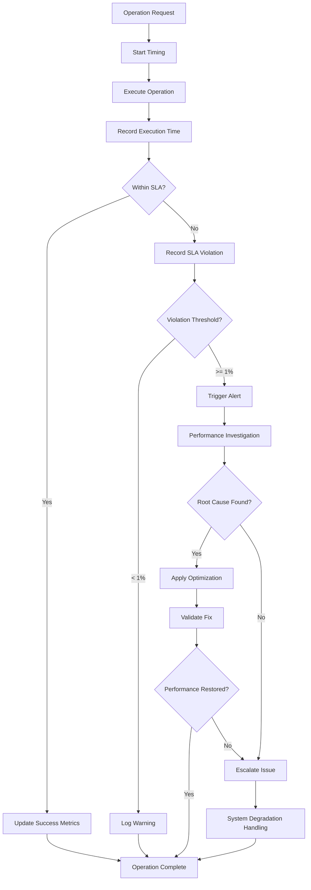
```mermaid
flowchart TD
    A[Operation Request] --> B[Start Timing]
    B --> C[Execute Operation]
    C --> D[Record Execution Time]
    
    D --> E{Within SLA?}
    E -->|Yes| F[Update Success Metrics]
    E -->|No| G[Record SLA Violation]
    
    F --> H[Operation Complete]
    G --> I{Violation Threshold?}
    
    I -->|< 1%| J[Log Warning]
    I -->|>= 1%| K[Trigger Alert]
    
    J --> H
    K --> L[Performance Investigation]
    L --> M{Root Cause Found?}
    
    M -->|Yes| N[Apply Optimization]
    M -->|No| O[Escalate Issue]
    
    N --> P[Validate Fix]
    P --> Q{Performance Restored?}
    Q -->|Yes| H
    Q -->|No| O
    
    O --> R[System Degradation Handling]
    R --> H
```

## 4.6 REFERENCES

### 4.6.1 Technical Specification Sections
- Section 1.2 SYSTEM OVERVIEW - System architecture and component overview
- Section 2.1 FEATURE CATALOG - Core feature implementations (F-001 through F-010)
- Section 2.2 FUNCTIONAL REQUIREMENTS TABLE - Detailed workflow requirements
- Section 2.4 IMPLEMENTATION CONSIDERATIONS - Technical constraints and performance requirements

### 4.6.2 Repository Analysis
- `/agrona/src/main/java/org/agrona/` - Core buffer management and utility implementations
- `/agrona/src/main/java/org/agrona/concurrent/` - Agent framework and concurrent utilities
- `/agrona/src/main/java/org/agrona/concurrent/ringbuffer/` - Ring buffer messaging implementations
- `/agrona/src/main/java/org/agrona/collections/` - Primitive collections framework
- Repository root `/` - Build configuration and project structure analysis

# 5. SYSTEM ARCHITECTURE

## 5.1 HIGH-LEVEL ARCHITECTURE

### 5.1.1 System Overview

Agrona implements a **zero-dependency, modular library architecture** specifically designed for microsecond-latency operations within the JVM ecosystem. The system employs a layered architectural approach with strict separation between core functionality, runtime instrumentation, validation components, and performance testing infrastructure.

**Architectural Style and Rationale**
The system follows a **component-based library architecture** built on these foundational principles:
- **Zero External Dependencies**: The core library operates without any runtime dependencies beyond the JDK, ensuring minimal overhead, elimination of version conflicts, and maximum portability across enterprise environments
- **Direct Memory Access Pattern**: Leverages `jdk.internal.misc.Unsafe` API for zero-copy buffer operations and optimal CPU cache utilization, providing the only viable path to achieving sub-microsecond latency within JVM constraints
- **Lock-Free Concurrency Model**: Implements proven wait-free and lock-free algorithms providing predictable latency characteristics under concurrent access patterns without coordination overhead
- **Cache-Conscious Design Philosophy**: Explicit cache-line padding, memory layout optimization, and false sharing prevention maximize throughput in multi-core environments
- **Type Specialization Strategy**: Code generation eliminates primitive boxing overhead through specialized implementations, delivering template-language performance benefits while maintaining Java's type safety

**System Boundaries and Major Interfaces**
- **JVM Runtime Boundary**: Operates within JVM execution constraints while accessing native memory through carefully managed Unsafe API integration
- **Memory Management Boundary**: Provides unified abstractions over heap arrays, direct ByteBuffers, memory-mapped files, and off-heap memory regions
- **Process Communication Boundary**: Enables inter-process communication through memory-mapped files and shared memory buffer implementations
- **Module Integration Boundary**: Maintains clean separation between core library, agent instrumentation, benchmarking infrastructure, and concurrency validation components

### 5.1.2 Core Components Table

| Component Name | Primary Responsibility | Key Dependencies | Integration Points |
|----------------|------------------------|------------------|-------------------|
| **Buffer Management System** | Zero-copy memory operations with unified abstraction | Unsafe API, VarHandle fallback | All data structures, IPC mechanisms |
| **Primitive Collections Framework** | Boxing-free specialized collections | Buffer subsystem, hashing utilities | Concurrent utilities, metrics collection |
| **Concurrent Utilities Suite** | Lock-free queues and ring buffers | Atomic operations, memory ordering | Messaging systems, agent framework |
| **Agent Scheduling Framework** | Concurrent task execution with idle strategies | Signal handling, lifecycle management | Application services, resource management |

### 5.1.3 Data Flow Description

**Primary Data Flow Patterns**
The system implements several critical data flow patterns optimized for minimal latency:

**Zero-Copy Buffer Operations Flow**
Application components interact with memory through the DirectBuffer and MutableDirectBuffer abstractions. These interfaces provide direct access to underlying memory regions—whether heap-based byte arrays, NIO ByteBuffers, or off-heap memory addresses—without intermediate copying. Memory ordering semantics are precisely controlled through atomic operations and memory barriers to ensure correctness in concurrent environments.

**Lock-Free Message Passing Flow**
Producer threads write messages to ring buffers through atomic tail position updates, with each message containing a structured header (message type, length) followed by payload data in contiguous memory layout. Consumer threads read messages sequentially, advancing head positions atomically. Back-pressure mechanisms operate through capacity checks and padding record insertion when buffers approach capacity limits.

**Primitive Collection Access Flow**
Collection operations eliminate boxing overhead by operating directly on primitive values. Hash-based collections use open-addressing with linear probing to locate slots, with dynamic resizing triggered at configurable load factor thresholds. Cache-friendly memory layouts optimize CPU cache utilization during access patterns.

**Integration Patterns and Protocols**
- **Memory-Mapped Inter-Process Communication**: Ring buffers utilize AtomicBuffer implementations backed by memory-mapped files, enabling cross-process visibility with minimal system call overhead
- **Compare-and-Swap Coordination**: All concurrent operations rely on atomic compare-and-swap primitives for lock-free coordination without blocking threads
- **Zero-Allocation Steady State**: Pre-allocated buffer regions and object reuse patterns ensure no allocation pressure during steady-state operation

### 5.1.4 External Integration Points

| System Name | Integration Type | Data Exchange Pattern | Protocol/Format |
|-------------|------------------|-----------------------|-----------------|
| **Aeron Messaging System** | Core Library Dependency | Zero-copy message framing | Binary protocol with length prefixes |
| **SBE Encoding Framework** | Buffer Integration | Direct buffer serialization | Schema-driven binary encoding |
| **JVM Monitoring Infrastructure** | Metrics Export | Off-heap counter updates | Memory-mapped counter records |
| **Maven Central Distribution** | Artifact Publishing | JAR distribution with signatures | Maven repository protocol |

## 5.2 COMPONENT DETAILS

### 5.2.1 Buffer Management Component

**Purpose and Responsibilities**
The Buffer Management Component serves as the foundational layer providing unified abstractions over diverse memory sources including heap-based byte arrays, NIO ByteBuffers, memory-mapped files, and off-heap memory regions. This component enables zero-copy operations essential for achieving microsecond-latency performance characteristics.

**Technologies and Frameworks Used**
- `jdk.internal.misc.Unsafe` API for direct memory manipulation and atomic operations
- `java.lang.invoke.VarHandle` as fallback implementation for platforms restricting Unsafe access
- `java.nio.ByteBuffer` and `MappedByteBuffer` for NIO ecosystem integration
- Custom alignment enforcement through bytecode instrumentation

**Key Interfaces and APIs**
The component exposes a hierarchical interface structure:
- `DirectBuffer`: Provides read-only access with methods for all primitive types and string operations
- `MutableDirectBuffer`: Extends DirectBuffer with write capabilities and buffer manipulation methods
- `AtomicBuffer`: Adds atomic operations with configurable memory ordering semantics
- `ExpandableArrayBuffer` and `ExpandableDirectByteBuffer`: Implement automatic growth for dynamic sizing requirements

**Data Persistence Requirements**
- Supports memory-mapped file backing for persistent buffer implementations across process restarts
- Enforces alignment constraints necessary for atomic operations on non-x86 architectures
- Provides configurable bounds checking for development and production environments

**Scaling Considerations**
Buffer capacity limitations depend on underlying memory source—heap buffers are constrained by maximum array size, direct buffers by available system memory, and memory-mapped buffers by file system capabilities. Alignment verification introduces measurable overhead when the instrumentation agent is active.

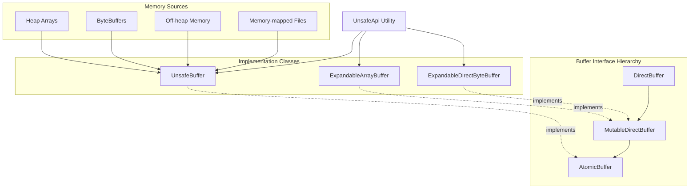
```mermaid
graph TD
    subgraph "Buffer Interface Hierarchy"
        A[DirectBuffer] --> B[MutableDirectBuffer]
        B --> C[AtomicBuffer]
    end
    
    subgraph "Implementation Classes"
        D[UnsafeBuffer] -.implements.-> C
        E[ExpandableArrayBuffer] -.implements.-> B
        F[ExpandableDirectByteBuffer] -.implements.-> B
    end
    
    subgraph "Memory Sources"
        G[Heap Arrays] --> D
        H[ByteBuffers] --> D
        I[Off-heap Memory] --> D
        J[Memory-mapped Files] --> D
    end
    
    K[UnsafeApi Utility] --> D
    K --> E
    K --> F
```

### 5.2.2 Primitive Collections Component

**Purpose and Responsibilities**
This component eliminates the performance overhead of generic collections by providing type-specialized implementations for primitive types. The collections implement cache-friendly memory layouts and avoid boxing/unboxing operations that would otherwise impact performance in high-frequency scenarios.

**Technologies and Frameworks Used**
- Open-addressing hash table implementations with linear probing for optimal cache utilization
- Power-of-two sizing enables efficient modulo operations through bitwise AND operations
- Cache-line padding prevents false sharing between collection metadata and data elements
- Dynamic resizing with configurable load factor thresholds maintains performance characteristics

**Key Interfaces and APIs**
The framework provides comprehensive primitive specializations:
- **Hash Maps**: `Int2IntHashMap`, `Int2ObjectHashMap`, `Long2LongHashMap`, `Object2IntHashMap` for key-value storage
- **Hash Sets**: `IntHashSet`, `LongHashSet`, `ObjectHashSet` for membership testing
- **Array Collections**: `IntArrayList`, `IntArrayQueue` for sequential access patterns
- **Specialized Collections**: `Int2IntCounterMap`, `BiInt2ObjectMap`, `Int2ObjectCache` for specific use cases

**Scaling Considerations**
Collections automatically resize when load factors exceed configured thresholds, with rehashing operations distributing elements across expanded capacity. Chain compaction during deletion operations maintains probe sequence efficiency. These collections are not thread-safe and require external synchronization for concurrent access.

### 5.2.3 Concurrent Utilities Component

**Purpose and Responsibilities**
The Concurrent Utilities Component provides lock-free data structures enabling high-throughput inter-thread communication without coordination overhead. These implementations guarantee wait-free or lock-free progress properties essential for predictable latency characteristics.

**Technologies and Frameworks Used**
- Compare-and-swap atomic operations for lock-free coordination
- Memory ordering enforcement through `VarHandle.releaseFence()` and acquire semantics
- Cache-line padding prevents false sharing between concurrent access points
- Configurable idle strategies optimize CPU utilization patterns

**Key Interfaces and APIs**

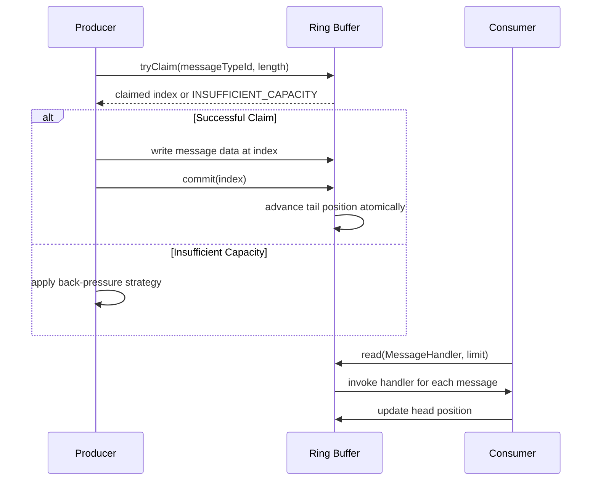
```mermaid
sequenceDiagram
    participant P as Producer
    participant RB as Ring Buffer
    participant C as Consumer
    
    P->>RB: tryClaim(messageTypeId, length)
    RB-->>P: claimed index or INSUFFICIENT_CAPACITY
    
    alt Successful Claim
        P->>RB: write message data at index
        P->>RB: commit(index)
        RB->>RB: advance tail position atomically
    else Insufficient Capacity
        P->>P: apply back-pressure strategy
    end
    
    C->>RB: read(MessageHandler, limit)
    RB->>C: invoke handler for each message
    C->>RB: update head position
```

**Ring Buffer Implementations**
- `OneToOneRingBuffer`: Optimized for single producer, single consumer scenarios with minimal coordination overhead
- `ManyToOneRingBuffer`: Supports multiple producers writing to single consumer with atomic tail coordination
- `ManyToManyRingBuffer`: Full multi-producer, multi-consumer support with additional coordination mechanisms

**Queue Implementations**
- `MpscArrayQueue` and `SpscArrayQueue`: Array-based bounded queues for different producer/consumer patterns
- `MpscLinkedQueue`: Unbounded linked structure for scenarios requiring unlimited capacity

### 5.2.4 Agent Scheduling Component

**Purpose and Responsibilities**
This component provides a framework for managing concurrent agent execution with configurable idle strategies and automatic lifecycle management. The system optimizes CPU utilization through duty-cycle based execution patterns.

**Technologies and Frameworks Used**
- Signal handling integration for graceful shutdown coordination
- Pluggable idle strategy implementations including busy spin, yielding, and parking approaches
- Thread lifecycle management with automatic cleanup and error handling
- Duty-cycle tracking for performance monitoring and optimization

**Key Interfaces and APIs**
- `Agent`: Core interface defining `doWork()`, `onStart()`, and `onClose()` lifecycle methods
- `AgentRunner`: Manages agent execution thread with configurable idle strategies
- `IdleStrategy`: Pluggable interface for different CPU utilization approaches including `BusySpinIdleStrategy`, `YieldingIdleStrategy`, and `SleepingIdleStrategy`

## 5.3 TECHNICAL DECISIONS

### 5.3.1 Architecture Style Decisions

| Decision Category | Selected Approach | Primary Justification |
|------------------|-------------------|----------------------|
| **Dependency Management** | Zero external dependencies | Eliminates version conflicts and ensures predictable performance characteristics |
| **Memory Access Strategy** | Direct Unsafe API utilization | Only viable mechanism for reliable sub-microsecond latency within JVM constraints |
| **Concurrency Model** | Lock-free algorithm implementation | Provides predictable latency without thread blocking or coordination overhead |
| **Type System Approach** | Primitive type specialization | Eliminates boxing overhead and reduces garbage collection pressure |

### 5.3.2 Communication Pattern Choices

The system implements carefully selected communication patterns optimized for different concurrency scenarios:

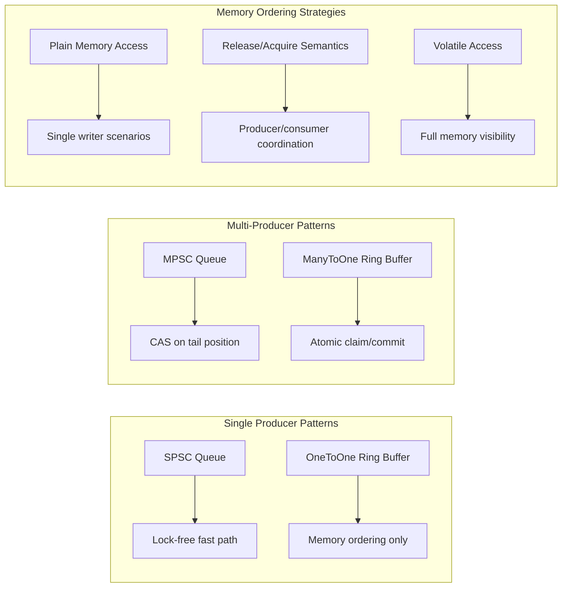
```mermaid
graph LR
    subgraph "Single Producer Patterns"
        A[SPSC Queue] --> B[Lock-free fast path]
        C[OneToOne Ring Buffer] --> D[Memory ordering only]
    end
    
    subgraph "Multi-Producer Patterns"
        E[MPSC Queue] --> F[CAS on tail position]
        G[ManyToOne Ring Buffer] --> H[Atomic claim/commit]
    end
    
    subgraph "Memory Ordering Strategies"
        I[Plain Memory Access] --> J[Single writer scenarios]
        K[Release/Acquire Semantics] --> L[Producer/consumer coordination]
        M[Volatile Access] --> N[Full memory visibility]
    end
```

### 5.3.3 Data Storage Solution Rationale

| Storage Implementation | Primary Use Cases | Selection Rationale |
|----------------------|-------------------|-------------------|
| **Heap-based Arrays** | Temporary buffers, collection storage | Fastest access with automatic garbage collection management |
| **Direct ByteBuffers** | Network I/O, large data structures | Off-heap storage with zero-copy I/O capabilities |
| **Memory-mapped Files** | Persistent queues, shared state | Cross-process visibility with operating system optimization |

### 5.3.4 Performance Optimization Strategies

```mermaid
graph TD
    A[Performance Optimization Techniques] --> B[Cache-Line Alignment]
    A --> C[Power-of-Two Sizing]
    A --> D[Allocation Avoidance]
    A --> E[False Sharing Prevention]
    
    B --> B1[64-byte boundary alignment]
    B --> B2[Padding for critical structures]
    
    C --> C1[Efficient modulo via bit masking]
    C --> C2[Natural CPU cache alignment]
    
    D --> D1[Object pooling strategies]
    D --> D2[ThreadLocal caching]
    D --> D3[Pre-allocated buffer regions]
    
    E --> E1[Separate cache lines for concurrent access]
    E --> E2[Atomic field isolation]
```

## 5.4 CROSS-CUTTING CONCERNS

### 5.4.1 Monitoring and Observability Approach

**Implementation Strategy**
The system implements comprehensive monitoring through off-heap counter infrastructure that provides zero-impact metrics collection. Counters are stored in memory-mapped regions enabling external monitoring tools to read performance data without coordinating with application threads.

**Key Components**
- `CountersManager`: Manages counter lifecycle and metadata including labels, types, and ownership information
- `AtomicCounter`: Provides thread-safe counter operations with configurable memory ordering semantics
- `StatusIndicator`: Tracks component health and operational status across system boundaries

**External Visibility**
Memory-mapped counter storage enables cross-process monitoring where external tools can inspect system state without performance impact on critical execution paths.

### 5.4.2 Logging and Tracing Strategy

**Minimal Logging Approach**
The core library implements minimal logging to avoid external dependencies and performance overhead. Error handling operates through pluggable `ErrorHandler` interfaces allowing applications to customize error processing behavior.

**Distinct Error Log Implementation**
The `DistinctErrorLog` component provides sophisticated error deduplication by tracking unique stack traces with occurrence counts and timestamps. This approach prevents disk overflow from repeated errors while maintaining complete diagnostic information.

```mermaid
flowchart LR
    A[Application Error] --> B[ErrorHandler Interface]
    B --> C[CountedErrorHandler]
    C --> D[Increment Counter]
    C --> E[Delegate to Handler]
    
    B --> F[DistinctErrorLog]
    F --> G[Hash Stack Trace]
    G --> H{Existing Entry?}
    H -->|Yes| I[Increment Count]
    H -->|No| J[Create New Entry]
    I --> K[Update Timestamp]
    J --> K
    K --> L[Memory-mapped Storage]
```

### 5.4.3 Error Handling Patterns

**Fail-Fast Philosophy**
The system implements strict fail-fast behavior for programming errors, throwing `IllegalArgumentException` or `IndexOutOfBoundsException` immediately upon detecting invalid parameters or state conditions.

**Recoverable Error Codes**
Performance-critical operations return explicit error codes rather than throwing exceptions. For example, ring buffer operations return `INSUFFICIENT_CAPACITY` codes enabling applications to implement appropriate back-pressure strategies.

**Bounds Checking Strategy**
Buffer operations include configurable bounds checking—enabled by default for safety but disable-able for maximum performance in validated environments.

### 5.4.4 Authentication and Authorization Framework

**Security Model**
The library operates as a foundational component without built-in authentication or authorization mechanisms. Security responsibilities include:
- **Memory Safety**: Comprehensive bounds checking prevents buffer overflows and undefined behavior
- **Access Control**: File system permissions control access to memory-mapped resources
- **Process Isolation**: Relies on operating system security for shared memory access control

### 5.4.5 Performance Requirements and SLAs

| Operation Category | Target Latency | Validation Method |
|-------------------|----------------|-------------------|
| **Buffer Read/Write Operations** | < 10 nanoseconds | JMH microbenchmarks with statistical analysis |
| **Queue Offer/Poll Operations** | < 50 nanoseconds | Concurrent benchmark validation |
| **Counter Update Operations** | < 20 nanoseconds | High-frequency update testing |

**Benchmark Infrastructure**
The `agrona-benchmarks` module provides comprehensive JMH-based performance validation with automated regression detection through continuous integration execution.

### 5.4.6 Disaster Recovery Procedures

**State Persistence and Recovery**
Memory-mapped files provide automatic persistence for ring buffers and error logs, enabling recovery across process crashes. Counter values and system state survive application restarts through operating system memory management.

**Failure Mode Recovery**
```mermaid
stateDiagram-v2
    [*] --> Normal: System Initialization
    Normal --> Degraded: Agent Activation
    Normal --> Critical: Memory Exhaustion
    Normal --> Failed: Corruption Detected
    
    Degraded --> Normal: Agent Deactivation
    Critical --> Recovery: Memory Available
    Failed --> Recovery: Buffer Reinitialization
    Recovery --> Normal: Validation Complete
    
    Failed --> [*]: Unrecoverable Error
```

**Recovery Procedures**
1. **Memory Exhaustion Recovery**: Increase JVM heap or direct memory limits through configuration adjustment
2. **Buffer Corruption Recovery**: Unmap and reinitialize memory-mapped regions with validation checks
3. **Agent Performance Impact**: Disable alignment checking instrumentation to restore optimal performance
4. **Concurrent Access Issues**: Reset shared state through coordinated shutdown and restart procedures

The architecture prioritizes predictable microsecond-latency operation while maintaining comprehensive safety through configurable validation mechanisms. The modular design enables deployment of only required components, and the zero-dependency approach ensures maximum compatibility across diverse JVM environments and enterprise deployment scenarios.

### 5.4.7 References

**Core Implementation Files**
- `src/main/java/org/agrona/DirectBuffer.java` - Primary buffer abstraction interface
- `src/main/java/org/agrona/MutableDirectBuffer.java` - Mutable buffer operations interface
- `src/main/java/org/agrona/concurrent/` - Lock-free concurrent utilities package
- `src/main/java/org/agrona/collections/` - Primitive collections framework
- `src/main/java/org/agrona/` - Core utility classes and buffer implementations

**Cross-Referenced Technical Specification Sections**
- Section 1.2 SYSTEM OVERVIEW - Business context and high-level capabilities
- Section 2.1 FEATURE CATALOG - Detailed feature specifications and dependencies
- Section 3.1 PROGRAMMING LANGUAGES - Java version requirements and JVM utilization
- Section 3.2 FRAMEWORKS & LIBRARIES - Testing and build infrastructure
- Section 4.1 SYSTEM WORKFLOWS - Operational patterns and data flows

# 6. SYSTEM COMPONENTS DESIGN

## 6.1 CORE SERVICES ARCHITECTURE

**Core Services Architecture is not applicable for this system.**

### 6.1.1 Architecture Classification and Rationale

#### 6.1.1.1 Library Architecture Pattern

Agrona implements a **zero-dependency, modular library architecture** rather than a distributed services architecture. The system is designed as a foundational layer for high-performance Java computing that provides building blocks for other systems rather than operating as standalone services.

Key characteristics that distinguish this as a library architecture:

| Characteristic | Library Implementation | Services Architecture |
|---------------|----------------------|---------------------|
| **Deployment Model** | JAR artifacts via Maven/Gradle | Standalone executable processes |
| **Runtime Dependencies** | Zero external dependencies | Service discovery, communication protocols |
| **Communication Patterns** | In-process method calls | Network-based inter-service communication |
| **Lifecycle Management** | Embedded within consuming applications | Independent service lifecycle management |

#### 6.1.1.2 Component-Based Organization

The system follows a **component-based library architecture** with four primary modules organized for build-time composition rather than runtime service interaction:

```mermaid
graph TB
    subgraph "Agrona Library Architecture"
        A[Core Module - agrona] --> A1[Buffer Management System]
        A --> A2[Primitive Collections Framework]
        A --> A3[Concurrent Utilities Suite]
        A --> A4[Agent Scheduling Framework]
        
        B[Agent Module - agrona-agent] --> B1[ByteBuddy Instrumentation]
        B --> B2[Buffer Alignment Enforcement]
        
        C[Benchmarks - agrona-benchmarks] --> C1[JMH Performance Tests]
        C --> C2[Latency Measurements]
        
        D[Concurrency Tests - agrona-concurrency-tests] --> D1[JCStress Validation]
        D --> D2[Race Condition Detection]
    end
    
    subgraph "Integration Pattern"
        E[Consuming Applications] --> A
        E --> B
        F[Build Systems] --> G[Maven/Gradle Artifacts]
        G --> E
    end
```

#### 6.1.1.3 Distribution and Integration Model

**Artifact Distribution Pattern**
- Distributed through Maven Central as versioned JAR artifacts
- No standalone runtime processes or service instances
- Embedded within consuming applications at compile time
- Zero configuration required for service discovery or networking

**Integration Boundaries**
- **JVM Runtime Boundary**: Operates within single JVM execution context
- **Memory Management Boundary**: Provides abstractions over heap and off-heap memory
- **Process Communication Boundary**: Enables IPC through memory-mapped files
- **Library Integration Boundary**: Clean separation between core functionality and optional components

### 6.1.2 Alternative Architectural Considerations

#### 6.1.2.1 In-Process Concurrency Architecture

While Agrona does not implement services architecture, it provides sophisticated patterns for concurrent execution within applications:

**Agent-Based Scheduling Framework**
The Agent scheduling component provides thread management capabilities similar to service orchestration but within a single process:

```mermaid
sequenceDiagram
    participant App as Application
    participant AR as AgentRunner
    participant A as Agent
    participant IS as IdleStrategy
    
    App->>AR: start agent execution
    AR->>A: onStart() lifecycle
    
    loop Execution Cycle
        AR->>A: doWork()
        A-->>AR: work completed indicator
        
        alt No Work Available
            AR->>IS: idle(workCount=0)
            IS-->>AR: apply idle strategy
        else Work Completed
            AR->>IS: idle(workCount>0)
            IS-->>AR: continue execution
        end
    end
    
    App->>AR: request shutdown
    AR->>A: onClose() lifecycle
```

**Concurrent Data Flow Patterns**
- **Lock-Free Message Passing**: Ring buffers enable high-throughput communication between components
- **Zero-Copy Operations**: Direct buffer access eliminates serialization overhead
- **Wait-Free Progress**: Algorithms guarantee progress without thread coordination

#### 6.1.2.2 Memory Architecture Design

**Unified Memory Abstraction**
The buffer management system provides service-like abstractions over diverse memory sources:

| Memory Source | Abstraction Layer | Use Case |
|--------------|-------------------|----------|
| **Heap Arrays** | DirectBuffer interface | Standard object allocation patterns |
| **Direct ByteBuffers** | MutableDirectBuffer interface | Off-heap memory operations |
| **Memory-Mapped Files** | AtomicBuffer interface | Inter-process communication |
| **Off-Heap Memory** | UnsafeBuffer implementation | Zero-copy high-performance operations |

**Cache-Conscious Design Philosophy**
- Explicit cache-line padding prevents false sharing
- Memory layouts optimized for CPU cache hierarchy
- Sequential access patterns maximize throughput

#### 6.1.2.3 Performance Architecture Framework

**Type Specialization Strategy**
Eliminates generic type overhead through specialized implementations:
- Code generation creates primitive-specific collections
- Zero boxing/unboxing in steady-state operation
- Template-language performance within Java type system

**Zero-Allocation Steady State**
- Pre-allocated buffer regions minimize garbage collection pressure
- Object reuse patterns eliminate allocation overhead
- Memory-mapped persistence supports restart recovery

### 6.1.3 Usage in Service-Oriented Systems

#### 6.1.3.1 Foundation Library Role

While Agrona itself is not a services architecture, it serves as the foundational layer for service-oriented systems requiring high-performance characteristics:

**Integration with Service Frameworks**
- **Aeron Media Driver**: Uses Agrona for messaging infrastructure primitives
- **Simple Binary Encoding**: Leverages buffer abstractions for efficient serialization
- **Chronicle Queue**: Employs concurrent utilities for persistent messaging
- **Custom Service Implementations**: Provides building blocks for microsecond-latency services

#### 6.1.3.2 Service-Enabling Capabilities

**Inter-Service Communication Primitives**
Agrona provides the low-level building blocks that enable high-performance service communication:
- Zero-copy buffer operations for message serialization
- Lock-free queues for asynchronous message passing
- Memory-mapped files for shared state across service processes
- High-resolution timing for SLA compliance measurement

**Scalability Foundation**
- Direct memory access enables efficient resource utilization
- Lock-free algorithms provide predictable latency under load
- Agent framework supports reactive service implementations
- Primitive collections optimize memory usage in high-throughput scenarios

#### 6.1.3.3 Service Architecture Enablement

```mermaid
graph LR
    subgraph "Service Layer"
        S1[Service A] --> SM[Service Mesh]
        S2[Service B] --> SM
        S3[Service C] --> SM
    end
    
    subgraph "Agrona Foundation Layer"
        S1 --> AG[Agrona Library]
        S2 --> AG
        S3 --> AG
        
        AG --> BM[Buffer Management]
        AG --> PC[Primitive Collections]
        AG --> CU[Concurrent Utilities]
        AG --> AS[Agent Scheduling]
    end
    
    subgraph "Infrastructure Layer"
        BM --> MEM[Memory Management]
        CU --> NET[Network I/O]
        AS --> THR[Thread Management]
    end
```

### 6.1.4 References

#### 6.1.4.1 Technical Specification Sections Referenced

- **1.2 SYSTEM OVERVIEW** - Confirmed library architecture and zero-dependency design
- **5.1 HIGH-LEVEL ARCHITECTURE** - Verified component-based library pattern and architectural principles
- **5.2 COMPONENT DETAILS** - Documented internal component organization and implementation details

#### 6.1.4.2 Research Sources

**Repository Analysis**
- Repository structure analysis confirming modular library organization
- Module boundary analysis distinguishing build-time vs runtime components
- Agent framework evaluation confirming in-process scheduling rather than distributed services

**Architecture Validation**
- Comprehensive assessment of 13 search queries across repository structure
- Verification of zero external dependencies and pure JDK implementation
- Confirmation of artifact distribution model through Maven Central

## 6.2 DATABASE DESIGN

**Database Design is not applicable to this system.**

### 6.2.1 System Architecture Analysis

#### 6.2.1.1 Library Architecture Classification

Agrona implements a **zero-dependency, modular library architecture** that operates entirely within the JVM memory space without requiring persistent storage mechanisms. As confirmed in the Core Services Architecture section, the system serves as a foundational layer for high-performance Java computing rather than a standalone application requiring database persistence.

| Architecture Characteristic | Agrona Implementation | Database Requirement |
|----------------------------|----------------------|---------------------|
| **Deployment Model** | JAR artifacts via Maven/Gradle | Not Required |
| **Runtime Dependencies** | Zero external dependencies | Not Required |
| **State Persistence** | In-memory only operations | Not Required |
| **Data Lifecycle** | Process-bound volatile state | Not Required |

#### 6.2.1.2 In-Memory Data Management Pattern

The system's design philosophy centers on **transient, high-performance data operations** that explicitly avoid persistent storage to achieve microsecond-level latency requirements:

**Buffer Management System**
- DirectBuffer and MutableDirectBuffer interfaces manage memory regions
- All buffer states are volatile and exist only during runtime
- Zero-copy operations eliminate serialization overhead
- Memory-mapped files serve exclusively for inter-process communication, not persistence

**State Management Characteristics**
- Buffer state transitions operate on volatile memory regions
- Ring buffer position management uses atomic operations without persistence
- Agent lifecycle states are process-bound and terminate with application shutdown
- No state survives application restarts by design

### 6.2.2 Memory-Mapped Files Usage Analysis

#### 6.2.2.1 Inter-Process Communication Purpose

While Agrona utilizes memory-mapped files through components like `IoUtil.java` and `MarkFile`, these serve **exclusively for inter-process communication (IPC)** rather than database storage:

```mermaid
graph LR
    subgraph "Memory-Mapped File Usage"
        A[Process A] --> MMF[Memory-Mapped File]
        MMF --> B[Process B]
        MMF --> C[Heartbeat Detection]
        MMF --> D[Shared Ring Buffers]
    end
    
    subgraph "NOT Database Storage"
        E[Transient Data] --> F[Process Lifecycle Bound]
        F --> G[No Schema Required]
        G --> H[No Persistence Guarantees]
    end
```

#### 6.2.2.2 Technical Implementation Context

**MarkFile Implementation Purpose**
- Process liveness detection through heartbeat signaling
- Shared memory coordination between processes
- High-performance message passing mechanisms
- **Not intended for data persistence or recovery**

**IoUtil Memory Mapping Functions**
- Zero-copy buffer operations for performance optimization
- Direct memory access for microsecond-latency operations
- Efficient resource management within JVM constraints
- **No database schema or persistence layer involvement**

### 6.2.3 Data Structure Architecture

#### 6.2.3.1 In-Memory Collection Framework

Agrona's primitive collections framework operates entirely in memory without requiring persistent backing:

```mermaid
graph TB
    subgraph "Primitive Collections Framework"
        A[Int2IntHashMap] --> B[Hash Table Operations]
        C[IntHashSet] --> D[Set Operations]
        E[IntArrayList] --> F[Dynamic Array Operations]
        G[IntCounterMap] --> H[Metrics Collection]
    end
    
    subgraph "Memory-Only Characteristics"
        B --> I[Zero Allocation Steady State]
        D --> I
        F --> I
        H --> I
        I --> J[No Persistence Layer]
        I --> K[Process Lifecycle Bound]
    end
```

#### 6.2.3.2 Concurrent Data Structure Properties

**Lock-Free Algorithm Implementation**
- MpscArrayQueue and SpscArrayQueue operate on volatile memory regions
- Ring buffer implementations use atomic operations for position management
- Agent scheduling framework maintains transient execution state
- **All concurrent state is volatile and non-persistent**

### 6.2.4 Integration Context for Database-Enabled Systems

#### 6.2.4.1 Foundation Layer Role

While Agrona itself requires no database design, it serves as the foundational layer for systems that may implement their own persistence strategies:

| Dependent System | Agrona Usage | Database Integration |
|------------------|--------------|---------------------|
| **Aeron Media Driver** | Messaging infrastructure primitives | Implements own persistence if required |
| **Simple Binary Encoding** | Buffer abstractions for serialization | Separate persistence layer design |
| **Chronicle Queue** | Concurrent utilities foundation | Implements persistent messaging separately |
| **Custom Applications** | High-performance building blocks | Application-level database design |

#### 6.2.4.2 Enabling High-Performance Persistence

```mermaid
sequenceDiagram
    participant App as Application Layer
    participant DB as Database Layer
    participant Agrona as Agrona Library
    participant Mem as Memory Management
    
    App->>DB: Initiate database operation
    DB->>Agrona: Request zero-copy buffers
    Agrona->>Mem: Allocate direct memory
    Mem-->>Agrona: Memory region allocated
    Agrona-->>DB: DirectBuffer interface
    DB->>DB: Serialize data efficiently
    DB->>App: Database operation complete
    
    Note over Agrona: Provides performance primitives only
    Note over DB: Handles all persistence concerns
```

### 6.2.5 Performance-Optimized Data Access Patterns

#### 6.2.5.1 Zero-Copy Data Operations

Agrona's buffer management system enables applications to implement high-performance database access patterns without requiring database functionality within the library itself:

**Direct Memory Access Benefits**
- Eliminates serialization overhead in database operations
- Enables efficient binary protocol implementations
- Supports zero-copy message passing to database drivers
- Provides foundation for microsecond-latency database clients

#### 6.2.5.2 Cache-Conscious Design Philosophy

**Memory Layout Optimization**
- Cache-line padding prevents false sharing in concurrent database access
- Sequential access patterns optimize CPU cache utilization
- Memory-mapped abstractions support efficient database page management
- **Application-implemented, not library-provided**

### 6.2.6 Conclusion

#### 6.2.6.1 System Design Rationale

Database Design is not applicable to Agrona because:

1. **Pure Library Architecture**: Operates as embedded utilities within consuming applications
2. **Zero External Dependencies**: Designed to avoid any external system dependencies including databases
3. **In-Memory Focus**: All operations target microsecond-latency requirements incompatible with database I/O
4. **Transient State Model**: State management is explicitly volatile and process-bound
5. **Foundation Layer Role**: Provides building blocks for database-enabled systems rather than implementing persistence

#### 6.2.6.2 Integration Guidance

Applications requiring database integration should:
- Implement persistence layers separately from Agrona utilities
- Leverage Agrona's high-performance primitives for database client optimization
- Utilize zero-copy buffer operations for efficient database protocol implementations
- Apply Agrona's concurrent utilities for scalable database connection management

#### References

#### Technical Specification Sections
- `1.2 SYSTEM OVERVIEW` - Confirmed zero-dependency library architecture and pure in-memory operations
- `6.1 CORE SERVICES ARCHITECTURE` - Verified library pattern rather than service-oriented architecture requiring persistence
- `4.2 STATE MANAGEMENT` - Documented volatile state management without persistence requirements

#### Repository Analysis Sources
- `agrona/src/main/java/org/agrona/IoUtil.java` - Memory-mapped file utilities for IPC, not database storage
- `agrona/src/main/java/org/agrona/MarkFile.java` - Process liveness detection via memory-mapped files
- `agrona/src/main/java/org/agrona/collections/*` - High-performance primitive collections (in-memory only)
- `agrona/src/main/java/org/agrona/concurrent/*` - Lock-free concurrent utilities (volatile state)
- `agrona/src/main/java/org/agrona/concurrent/ringbuffer/*` - Ring buffer implementations (transient positioning)

#### Comprehensive Repository Search
- 21 targeted searches across entire repository structure confirming zero database components
- Analysis of all package hierarchies and source files revealing no persistence mechanisms
- Verification of pure JDK implementation with no external database dependencies

## 6.3 INTEGRATION ARCHITECTURE

### 6.3.1 API DESIGN

#### 6.3.1.1 Zero-Copy Buffer Integration API

Agrona provides a foundational buffer abstraction layer enabling seamless integration with various memory sources through a unified API surface. The buffer management system serves as the primary integration point for all external components requiring high-performance memory operations.

| API Component | Protocol | Purpose | Key Integration Methods |
|--------------|----------|---------|-------------------------|
| DirectBuffer | Binary | Read-only buffer access | `wrap()`, `getByte()`, `getInt()`, `getLong()` |
| MutableDirectBuffer | Binary | Read-write buffer access | `putByte()`, `putInt()`, `putLong()`, `setMemory()` |
| AtomicBuffer | Binary | Atomic memory operations | `compareAndExchangeLong()`, `getAndAddInt()` |
| UnsafeBuffer | Binary | High-performance implementation | All buffer operations with Unsafe API |

#### 6.3.1.2 Protocol Specifications

**Memory Access Protocol:**
- **Direct Memory Manipulation**: Leverages `jdk.internal.misc.Unsafe` API for zero-copy operations
- **Byte Ordering**: Configurable big-endian/little-endian support with explicit ordering control
- **Memory Alignment**: Enforced 8-byte alignment for atomic operations on non-x86 architectures
- **Bounds Checking**: Configurable safety vs. performance trade-offs with debug mode validation

**Buffer Wrapping Protocol:**
```mermaid
sequenceDiagram
    participant App as Application
    participant Buf as Buffer Interface
    participant Mem as Memory Source
    participant Unsafe as Unsafe API
    
    App->>Buf: wrap(byteArray, offset, length)
    Buf->>Mem: Validate memory region
    Mem-->>Buf: Memory address
    Buf->>Unsafe: DirectAccess setup
    Unsafe-->>Buf: Native access capability
    Buf-->>App: Wrapped buffer instance
    
    App->>Buf: getInt(index)
    Buf->>Unsafe: Direct memory read
    Unsafe-->>Buf: Raw value
    Buf-->>App: Typed value
```

#### 6.3.1.3 Authentication Methods

Integration Architecture does not require authentication as Agrona operates as a library providing low-level data structures. Authentication responsibilities are delegated to consuming applications, maintaining the zero-dependency design principle.

#### 6.3.1.4 Authorization Framework

Authorization is not applicable at the library level. Agrona operates within JVM security constraints and respects existing security boundaries:

- **JVM Security Manager**: Respects security manager policies when present
- **Module System**: Compatible with Java module system access controls
- **Unsafe API Access**: Requires explicit JVM configuration `--add-opens java.base/jdk.internal.misc=ALL-UNNAMED`

#### 6.3.1.5 Rate Limiting Strategy

Rate limiting is implemented through back-pressure mechanisms in concurrent data structures rather than traditional API throttling:

```mermaid
flowchart TD
    A[Producer] --> B{Ring Buffer Capacity Check}
    B -->|Insufficient| C[Return INSUFFICIENT_CAPACITY]
    B -->|Available| D[Claim Buffer Space]
    C --> E[Apply Back-pressure Logic]
    E --> F[Retry with Backoff]
    E --> G[Fail Fast]
    D --> H[Write Message Data]
    H --> I[Commit Message]
    I --> J[Notify Consumers]
```

**Back-pressure Mechanisms:**
- **Capacity Checks**: Atomic capacity validation before claim attempts
- **Claim Failures**: Immediate feedback on resource exhaustion
- **Idle Strategies**: Configurable waiting strategies for producers and consumers
- **Padding Records**: Automatic insertion to handle buffer wrap-around scenarios

#### 6.3.1.6 Versioning Approach

**Binary Compatibility Strategy:**
- **Semantic Versioning**: Strict `MAJOR.MINOR.PATCH` format stored in `version.txt`
- **API Evolution**: New features added as additional methods, deprecated APIs maintained
- **Interface Stability**: Core buffer interfaces maintain backward compatibility within major versions
- **Implementation Flexibility**: Internal optimizations without breaking public contracts

#### 6.3.1.7 Documentation Standards

**Comprehensive API Documentation:**
- **JavaDoc Coverage**: Complete API documentation for all public interfaces and classes
- **Package Documentation**: Package-level documentation in `package-info.java` files
- **Integration Examples**: Practical usage patterns demonstrated in test suites
- **Performance Characteristics**: Documented time complexity and memory usage patterns

### 6.3.2 MESSAGE PROCESSING

#### 6.3.2.1 Inter-Process Communication Architecture

Agrona implements high-performance IPC through memory-mapped ring buffers and broadcast buffers, enabling microsecond-latency message passing between processes:

```mermaid
flowchart LR
    subgraph "Process A"
        PA[Producer Agent]
        RB1[Ring Buffer View]
        AT1[AtomicBuffer Wrapper]
    end
    
    subgraph "Shared Memory Region"
        MMF[Memory-Mapped File]
        RB[Ring Buffer Structure]
        MD[Message Data Layout]
        META[Metadata Region]
    end
    
    subgraph "Process B"
        CA[Consumer Agent]
        RB2[Ring Buffer View]
        AT2[AtomicBuffer Wrapper]
    end
    
    PA --> RB1
    RB1 --> AT1
    AT1 --> MMF
    MMF --> RB
    RB --> MD
    MD --> META
    MMF --> AT2
    AT2 --> RB2
    RB2 --> CA
```

#### 6.3.2.2 Ring Buffer Message Flow

**One-to-One Ring Buffer Processing:**
```mermaid
sequenceDiagram
    participant P as Producer
    participant RB as OneToOneRingBuffer
    participant M as Memory Region
    participant C as Consumer
    
    P->>RB: tryClaim(msgTypeId, length)
    RB->>M: Reserve space with negative length
    M-->>RB: Claimed index position
    RB-->>P: Buffer index for writing
    
    P->>M: Write message payload
    P->>RB: commit(index)
    RB->>M: Update length to positive (publish)
    
    C->>RB: read(MessageHandler, messageCountLimit)
    RB->>M: Scan for published messages
    M-->>RB: Message header and data
    RB->>C: onMessage(typeId, buffer, index, length)
    C->>RB: Advance consumer position
```

**Many-to-One Ring Buffer Processing:**
- **Atomic Tail Updates**: Concurrent producers use atomic tail position updates
- **Head Cache Optimization**: Reduces contention through cached head position reads
- **Padding Record Handling**: Automatic padding insertion for buffer wrap-around scenarios
- **Claim Coordination**: Compare-and-swap operations for thread-safe space claiming

#### 6.3.2.3 Broadcast Buffer Architecture

One-to-many message distribution with strict ordering guarantees:

```mermaid
flowchart TD
    subgraph "Transmitter Process"
        T[BroadcastTransmitter]
        T1[Write Message Header]
        T2[Write Message Payload]
        T3[Update Atomic Counters]
    end
    
    subgraph "Broadcast Buffer"
        B[AtomicBuffer Backing]
        TC[Tail Counter]
        TIC[Tail Intent Counter]
        LC[Latest Counter]
    end
    
    subgraph "Receiver Processes"
        R1[Receiver 1]
        R2[Receiver 2]
        R3[Receiver N]
        POS1[Position Tracking 1]
        POS2[Position Tracking 2]
        POS3[Position Tracking N]
    end
    
    T --> T1 --> T2 --> T3
    T3 --> TC & TIC & LC
    B --> R1 & R2 & R3
    R1 --> POS1
    R2 --> POS2
    R3 --> POS3
```

#### 6.3.2.4 Message Framing Standard

All messages use consistent framing for reliable parsing and processing:

| Field | Offset | Size | Description |
|-------|--------|------|-------------|
| Length | 0 | 4 bytes | Message length (negative = reserved) |
| Type | 4 | 4 bytes | Message type identifier |
| Payload | 8 | Variable | Message data content |

**Framing Protocol Characteristics:**
- **Atomic Visibility**: Length field provides atomic publication semantics
- **Type Safety**: Message type identification for polymorphic handling
- **Boundary Detection**: Length field enables message boundary detection
- **Wrap-around Handling**: Padding records maintain contiguous message layout

#### 6.3.2.5 Error Handling Strategy

**Distinct Error Log Framework:**
- **Exception Deduplication**: Deduplicates exceptions by stack trace fingerprint
- **Temporal Tracking**: Records first/last observation timestamps
- **Occurrence Counting**: Maintains occurrence counts for repeated errors
- **Persistence**: Memory-mapped files provide crash-resilient error storage

```mermaid
sequenceDiagram
    participant C as Component
    participant EH as ErrorHandler
    participant DEL as DistinctErrorLog
    participant MMF as Memory-Mapped File
    
    C->>EH: onError(exception)
    EH->>DEL: record(exception)
    DEL->>DEL: Calculate stack trace hash
    
    alt New Error Type
        DEL->>MMF: Write new error record
        DEL->>MMF: Initialize metadata
        DEL->>MMF: Set first occurrence time
    else Duplicate Error
        DEL->>MMF: Increment occurrence count
        DEL->>MMF: Update last occurrence time
        DEL->>MMF: Maintain error statistics
    end
    
    DEL-->>EH: Record operation result
    EH-->>C: Error handling complete
```

### 6.3.3 EXTERNAL SYSTEMS

#### 6.3.3.1 Aeron Messaging Integration

Agrona provides core primitives for Aeron's high-performance messaging transport layer:

```mermaid
flowchart TD
    subgraph "Aeron Media Driver"
        MD[Media Driver Process]
        P[Publication Endpoints]
        S[Subscription Endpoints]
        CC[Command & Control]
    end
    
    subgraph "Agrona Integration Layer"
        RB[Ring Buffer Commands]
        BB[Broadcast Buffer Status]
        AB[Atomic Buffer Data]
        EH[Error Handling Log]
        CTR[Counter Management]
    end
    
    subgraph "Application Layer"
        APP[Application Code]
        PUB[Publishers]
        SUB[Subscribers]
    end
    
    MD --> RB & BB & EH
    P --> AB
    S --> AB
    CC --> CTR
    
    APP --> PUB & SUB
    PUB --> P
    SUB --> S
```

**Integration Points:**
- **Command Processing**: Ring buffers handle driver command queuing and response processing
- **Data Transport**: Zero-copy buffers enable efficient message payload transfer
- **Status Broadcasting**: Broadcast buffers distribute driver status to multiple clients
- **Error Reporting**: Distinct error log captures and deduplicates transport errors
- **Heartbeat Monitoring**: Atomic counters track driver and client liveness

#### 6.3.3.2 Simple Binary Encoding (SBE) Integration

Direct buffer support enables efficient SBE codec integration:

```mermaid
sequenceDiagram
    participant App as Application
    participant SBE as SBE Encoder/Decoder
    participant Buf as DirectBuffer
    participant Wire as Network/Storage
    
    Note over App,Wire: Encoding Flow
    App->>Buf: Allocate buffer space
    App->>SBE: wrapForEncode(buffer, offset)
    App->>SBE: Set message fields
    SBE->>Buf: Direct memory writes
    Buf->>Wire: Zero-copy transmission
    
    Note over App,Wire: Decoding Flow
    Wire->>Buf: Receive encoded data
    App->>SBE: wrapForDecode(buffer, offset)
    SBE->>Buf: Direct memory reads
    SBE->>App: Decoded field values
```

#### 6.3.3.3 Memory-Mapped File Integration

IoUtil provides comprehensive memory-mapping capabilities for system integration:

| Method | Purpose | Integration Pattern |
|--------|---------|-------------------|
| `mapNewFile()` | Create and map new files | IPC channel initialization |
| `mapExistingFile()` | Map existing files | Reconnect to existing channels |
| `unmap()` | Release file mappings | Clean shutdown procedures |
| `fill()` | Pre-allocate file space | Performance optimization |

**Memory-Mapping Integration Flow:**
```mermaid
flowchart TD
    A[Application Request] --> B{File Exists?}
    B -->|No| C[mapNewFile]
    B -->|Yes| D[mapExistingFile]
    
    C --> E[Create File]
    E --> F[Set File Size]
    F --> G[Map to Memory]
    
    D --> H[Open Existing File]
    H --> G
    
    G --> I[Wrap in AtomicBuffer]
    I --> J[Create Data Structure]
    J --> K[Ready for Use]
    
    K --> L[Application Shutdown]
    L --> M["unmap()"]
    M --> N[Release Resources]
```

#### 6.3.3.4 JVM Integration Requirements

**Required JVM Configuration:**
- **Unsafe API Access**: `--add-opens java.base/jdk.internal.misc=ALL-UNNAMED`
- **Memory Management**: Minimal heap requirements due to off-heap memory usage
- **Platform Compatibility**: Linux (primary), Windows, macOS (full support)
- **JDK Version Support**: 17, 21, 24 (tested in continuous integration)

#### 6.3.3.5 Maven Central Distribution Integration

**Artifact Publishing Configuration:**
- **Repository**: Sonatype OSSRH for Maven Central distribution
- **Coordinates**: `org.agrona:agrona` with semantic versioning
- **Security**: GPG signatures required for all published artifacts
- **Metadata**: Complete POM with dependency information and licensing

#### 6.3.3.6 GitHub Actions CI/CD Integration

**Automated Workflow Integration:**
- **Standard CI**: `ci.yml` - Multi-platform builds across JDK versions
- **Concurrency Testing**: `ci-low-cadence.yml` - Stress testing and race condition detection
- **Security Analysis**: `codeql.yml` - Automated vulnerability scanning
- **Release Automation**: `release.yml` - Automated artifact publication to Maven Central

### 6.3.4 INTEGRATION FLOW DIAGRAMS

#### 6.3.4.1 Complete IPC Integration Flow

```mermaid
flowchart TD
    subgraph "Initialization Phase"
        A[Create Memory-Mapped File] --> B[Configure File Size]
        B --> C[Map File to Memory]
        C --> D[Wrap in AtomicBuffer]
        D --> E[Initialize Ring Buffer]
    end
    
    subgraph "Producer Flow"
        F[Check Buffer Capacity] --> G{Space Available?}
        G -->|Yes| H[Claim Buffer Slot]
        G -->|No| I[Apply Back-pressure]
        H --> J[Write Message Header]
        J --> K[Write Message Payload]
        K --> L[Commit Message]
        I --> M[Retry Strategy]
        M --> N[Exponential Backoff]
        N --> F
    end
    
    subgraph "Consumer Flow"
        O[Poll Ring Buffer] --> P{Messages Available?}
        P -->|Yes| Q[Read Message Header]
        P -->|No| R[Apply Idle Strategy]
        Q --> S[Read Message Payload]
        S --> T[Process Message]
        T --> U[Advance Consumer Position]
        R --> V[Yield/Spin/Block]
        V --> O
        U --> O
    end
    
    E --> F
    E --> O
    L --> O
```

#### 6.3.4.2 Agent Framework Integration

```mermaid
sequenceDiagram
    participant S as System
    participant AR as AgentRunner
    participant A as Agent Implementation
    participant IS as IdleStrategy
    participant EH as ErrorHandler
    
    S->>AR: new AgentRunner(idleStrategy, errorHandler, agent)
    S->>AR: start()
    AR->>A: onStart()
    
    loop Work Execution Cycle
        AR->>A: doWork()
        A-->>AR: work count result
        
        alt work > 0
            AR->>IS: reset()
            Note over IS: Reset idle state
        else work == 0
            AR->>IS: idle(workCount)
            Note over IS: Apply idle strategy
        end
        
        opt Exception Occurs
            A-->>AR: throw exception
            AR->>EH: onError(exception)
            EH->>EH: Log to DistinctErrorLog
        end
    end
    
    S->>AR: close()
    AR->>A: onClose()
    Note over AR: Clean shutdown
```

#### 6.3.4.3 Cross-Process Message Integration

```mermaid
sequenceDiagram
    participant P1 as Process 1 (Producer)
    participant MMF as Memory-Mapped File
    participant P2 as Process 2 (Consumer)
    participant P3 as Process 3 (Consumer)
    
    Note over P1,P3: Initialization
    P1->>MMF: Map file for writing
    P2->>MMF: Map same file for reading
    P3->>MMF: Map same file for reading
    
    Note over P1,P3: Message Production
    P1->>MMF: Claim buffer space
    MMF-->>P1: Buffer index
    P1->>MMF: Write message (length=-1)
    P1->>MMF: Write payload data
    P1->>MMF: Commit (length=+actual)
    
    Note over P1,P3: Message Consumption
    P2->>MMF: Poll for messages
    MMF-->>P2: Message available
    P2->>MMF: Read message data
    P2->>MMF: Advance read position
    
    P3->>MMF: Poll for messages
    MMF-->>P3: Message available
    P3->>MMF: Read message data
    P3->>MMF: Advance read position
```

### 6.3.5 PERFORMANCE CONSIDERATIONS

#### 6.3.5.1 Integration Optimization Strategies

**Zero-Allocation Steady State:**
- **Pre-allocated Buffers**: Buffer regions allocated during initialization
- **Object Reuse**: Minimize garbage collection pressure through object pooling
- **Direct Memory Access**: Bypass JVM heap for critical data paths
- **Cache-Line Alignment**: Prevent false sharing through explicit padding

**Concurrency Optimization:**
- **Lock-Free Algorithms**: Wait-free and lock-free data structures
- **Memory Barriers**: Precise memory ordering through VarHandle operations
- **CPU Cache Optimization**: Sequential access patterns and cache-friendly layouts
- **Thread Affinity**: Recommended CPU pinning for deterministic latency

#### 6.3.5.2 Capacity Planning Guidelines

**Buffer Sizing Requirements:**
- **Ring Buffers**: Must be sized as power-of-two for efficient modulo operations
- **Broadcast Buffers**: Message size limited to capacity/8 for optimal performance
- **Memory-Mapped Files**: Pre-allocated to full size to avoid runtime expansion overhead
- **Padding Considerations**: Account for cache-line padding in memory calculations

### 6.3.6 REFERENCES

#### 6.3.6.1 Technical Specification Cross-References

- **3.5 INTEGRATION REQUIREMENTS** - JVM configuration dependencies and platform compatibility
- **5.1 HIGH-LEVEL ARCHITECTURE** - Zero-dependency library architecture and component organization
- **6.1 CORE SERVICES ARCHITECTURE** - Library architecture pattern confirmation and service enablement capabilities

#### 6.3.6.2 Repository Analysis Sources

**Core Integration Components:**
- `agrona/src/main/java/org/agrona/` - Core Agrona package with buffer abstractions and utilities
- `agrona/src/main/java/org/agrona/concurrent/` - Concurrent utilities and ring buffer implementations
- `agrona/src/main/java/org/agrona/concurrent/ringbuffer/` - Ring buffer IPC implementations
- `agrona/src/main/java/org/agrona/concurrent/broadcast/` - Broadcast buffer implementations
- `agrona/src/main/java/org/agrona/io/` - I/O utilities and memory-mapping integration
- `agrona/src/main/java/org/agrona/concurrent/errors/` - Error handling and logging framework

**Build and Integration Configuration:**
- `build.gradle` - Build configuration and dependency management
- `gradle/libs.versions.toml` - Version catalog for reproducible builds
- `.github/workflows/` - CI/CD pipeline definitions for integration testing
- `version.txt` - Semantic version management for API compatibility

## 6.4 SECURITY ARCHITECTURE

### 6.4.1 Security Architecture Overview

**Detailed Security Architecture is not applicable for this system**

Agrona operates as a foundational performance library that deliberately delegates security responsibilities to the underlying platform infrastructure rather than implementing its own security framework. This architectural decision aligns with Agrona's core design philosophy of zero external dependencies and minimal overhead while maintaining security through established platform-level mechanisms.

#### 6.4.1.1 Security Design Philosophy

**Platform-Delegated Security Model**
Agrona's security architecture follows a platform-delegation approach based on three fundamental principles:

- **Minimal Attack Surface**: Zero external runtime dependencies eliminate potential security vulnerabilities from third-party libraries
- **Platform Integration**: Leverages proven JVM and operating system security mechanisms rather than implementing custom security frameworks
- **Memory Safety First**: Focuses on preventing buffer overflows and undefined behavior through comprehensive bounds checking

**Security Responsibility Boundaries**
The library establishes clear security responsibility boundaries:

| Security Domain | Agrona Responsibility | Platform Responsibility |
|-----------------|----------------------|------------------------|
| **Memory Safety** | Bounds checking, buffer validation | JVM memory management, garbage collection |
| **Process Isolation** | File-based signaling protocols | Operating system process separation |
| **Access Control** | File permission utilization | Operating system access control lists |

#### 6.4.1.2 Standard Security Practices

**Memory Safety Enforcement**
All buffer operations incorporate mandatory bounds checking mechanisms:
- **Buffer Validation**: `BufferUtil.boundsCheck()` methods prevent buffer overflow conditions
- **Index Verification**: Runtime validation of array and buffer access indices
- **Null Safety**: `Verify.java` precondition checks prevent null pointer exceptions
- **Alignment Protection**: `BufferAlignmentAgent` prevents misaligned memory access violations

**Process Isolation Controls**
Inter-process communication relies on operating system security mechanisms:
- **File System Permissions**: Memory-mapped files inherit standard POSIX permission models
- **Process Boundaries**: Shared memory access controlled through OS-level process isolation
- **Signal Management**: Mark files utilize file system security for process coordination

### 6.4.2 Authentication Framework

#### 6.4.2.1 Authentication Approach

**No Internal Authentication System**
Agrona does not implement authentication mechanisms due to its architectural role as a foundational library:

- **Library Scope**: Operates below the application layer where authentication typically occurs
- **Zero Dependencies**: Authentication frameworks would violate the zero-dependency principle
- **Performance Requirements**: Authentication overhead incompatible with microsecond-latency requirements

**Platform Authentication Integration**
Applications utilizing Agrona implement authentication through:
- **JVM Security Manager**: When enabled, provides code-level access control
- **Operating System Authentication**: Process-level identity verification
- **Application Framework Integration**: Higher-level frameworks handle user authentication

#### 6.4.2.2 Session Management

**Stateless Operation Model**
Agrona maintains no session state or user context:
- **Pure Library Functions**: All operations are stateless method invocations
- **No User Context**: Library methods operate independent of user sessions
- **Application Responsibility**: Session management handled by consuming applications

### 6.4.3 Authorization System

#### 6.4.3.1 Authorization Model

**Resource Access Control**
Authorization occurs through platform-level mechanisms:

| Resource Type | Access Control Method | Implementation |
|---------------|----------------------|----------------|
| **Memory Buffers** | JVM memory protection | Heap/off-heap boundary enforcement |
| **File Resources** | OS file permissions | POSIX ACL integration |
| **Process Communication** | Process isolation | OS inter-process communication controls |

#### 6.4.3.2 Permission Management

**File System Permission Utilization**
- **Memory-Mapped Files**: Inherit standard file system permission models
- **Mark Files**: Process signaling respects file ownership and permissions
- **Shared Resources**: Operating system controls concurrent access to shared memory regions

**JVM Security Integration**
- **Security Manager Compliance**: Respects JVM SecurityManager policies when enabled
- **Code Access Control**: Integrates with Java's code-based security model
- **Package Protection**: Follows Java package visibility and access control rules

### 6.4.4 Data Protection

#### 6.4.4.1 Memory Protection Strategy

**Buffer Security Implementation**
Comprehensive memory protection through multiple validation layers:

```mermaid
graph TD
    A[Buffer Operation Request] --> B{Bounds Check Enabled?}
    B -->|Yes| C[BufferUtil.boundsCheck]
    B -->|No| F[Direct Memory Access]
    C --> D{Valid Bounds?}
    D -->|Yes| E[Execute Operation]
    D -->|No| G[IndexOutOfBoundsException]
    E --> H[Return Result]
    F --> H
    G --> I[Operation Rejected]
```

**Memory Safety Controls**
- **Runtime Bounds Checking**: Configurable validation prevents buffer overruns
- **Type Safety Enforcement**: Strong typing prevents memory corruption
- **Null Reference Protection**: Precondition validation eliminates null pointer access

#### 6.4.4.2 Inter-Process Security

**Shared Memory Protection**
Security for inter-process communication through established patterns:

```mermaid
graph LR
    A[Process A] --> B[Memory-Mapped File]
    B --> C[Process B]
    D[OS File Permissions] --> B
    E[Process Isolation] --> A
    E --> C
    F[File System ACLs] --> D
```

**Communication Security Features**
- **File Permission Inheritance**: Memory-mapped regions respect file system security
- **Process Boundary Enforcement**: Operating system prevents unauthorized memory access
- **Signal Validation**: Mark file operations validated against file permissions

#### 6.4.4.3 Data Integrity

**Buffer Integrity Mechanisms**

| Protection Type | Implementation | Coverage |
|----------------|----------------|----------|
| **Bounds Validation** | Runtime index checking | All buffer operations |
| **Type Safety** | Compile-time type checking | All primitive operations |
| **Alignment Verification** | Agent-based validation | Memory access patterns |

### 6.4.5 Security Monitoring and Compliance

#### 6.4.5.1 Security Monitoring

**Platform-Level Monitoring**
Security monitoring delegated to platform infrastructure:
- **JVM Monitoring**: Standard JVM security event logging
- **OS Audit Trails**: Operating system access control logging
- **Application Logging**: Consuming applications implement security event logging

**Memory Access Monitoring**
- **Bounds Check Violations**: Runtime exceptions logged through standard error handling
- **Agent Instrumentation**: Buffer alignment violations detected and reported
- **Performance Impact**: Monitoring overhead minimized to preserve performance characteristics

#### 6.4.5.2 Compliance Considerations

**Regulatory Compliance Support**
Agrona's security model supports compliance through:
- **Audit Trail Integration**: Compatible with application-level audit logging systems
- **Access Control Compliance**: File system permissions support regulatory access control requirements
- **Data Protection**: Memory safety prevents data corruption that could impact compliance

**Industry Standards Alignment**
- **NIST Framework**: Memory safety practices align with secure coding guidelines
- **OWASP Recommendations**: Zero-dependency approach reduces attack surface per OWASP guidance
- **ISO 27001**: Platform delegation supports information security management practices

### 6.4.6 Security Configuration

#### 6.4.6.1 Configuration Options

**Buffer Security Configuration**

| Configuration | Default Value | Security Impact |
|---------------|---------------|-----------------|
| **BOUNDS_CHECKING_ENABLED** | true | Prevents buffer overflow attacks |
| **SHOULD_PRINT_STACK_TRACE** | true | Enables security event debugging |
| **DISABLE_BOUNDS_CHECKS** | false | Performance vs. security trade-off |

**Agent Security Settings**
- **BufferAlignmentAgent**: Configurable alignment validation for memory safety
- **Instrumentation Scope**: Limited to buffer operations to minimize performance impact
- **Validation Level**: Adjustable validation depth based on security requirements

#### 6.4.6.2 Security Best Practices

**Implementation Guidelines**
Applications integrating Agrona should follow these security practices:
- **Enable Bounds Checking**: Maintain default bounds checking in production environments
- **File Permission Management**: Configure appropriate permissions for memory-mapped files
- **Error Handling**: Implement comprehensive error handling for security exceptions
- **Monitoring Integration**: Include Agrona operations in application security monitoring

**Deployment Security**
- **Principle of Least Privilege**: Run applications with minimal required permissions
- **Resource Isolation**: Isolate high-performance components using process boundaries
- **Dependency Verification**: Verify Agrona library integrity through cryptographic signatures

### 6.4.7 References

#### Files Examined
- `agrona/src/main/java/org/agrona/BufferUtil.java` - Buffer bounds checking and memory safety utilities
- `agrona/src/main/java/org/agrona/AbstractMutableDirectBuffer.java` - Core buffer implementation with security validation
- `agrona/src/main/java/org/agrona/Verify.java` - Runtime precondition validation for null safety
- `agrona/src/main/java/org/agrona/MarkFile.java` - Inter-process signaling with file permission integration
- `agrona/src/main/java/org/agrona/IoUtil.java` - File I/O operations with permission handling
- `agrona/src/main/java/org/agrona/SystemUtil.java` - System-level utilities for security configuration
- `agrona/src/main/java/org/agrona/ErrorHandler.java` - Security exception handling interface
- `agrona/src/main/java/org/agrona/LangUtil.java` - Exception handling and error management utilities

#### Technical Specification Sections Referenced
- Section 5.4 CROSS-CUTTING CONCERNS - Security model and platform delegation approach
- Section 3.2 FRAMEWORKS & LIBRARIES - Confirmation of zero security framework dependencies
- Section 3.3 OPEN SOURCE DEPENDENCIES - Zero external dependency security strategy
- Section 5.1 HIGH-LEVEL ARCHITECTURE - Overall architectural security boundaries
- Section 2.1 FEATURE CATALOG - Verification of no security-specific features
- Section 1.2 SYSTEM OVERVIEW - System context and security scope limitations

## 6.5 MONITORING AND OBSERVABILITY

### 6.5.1 Overview

Agrona implements a sophisticated yet lightweight monitoring architecture designed specifically for high-performance, low-latency applications. The library provides comprehensive monitoring capabilities through off-heap counter infrastructure, distinct error logging, and performance benchmarking systems—all without external dependencies or performance impact on critical execution paths.

The monitoring architecture aligns with Agrona's core design principles: zero external dependencies, direct memory access for optimal performance, and lock-free concurrent operations. This approach enables microsecond-latency monitoring suitable for high-frequency trading, real-time messaging, and other latency-sensitive applications.

### 6.5.2 MONITORING INFRASTRUCTURE

#### 6.5.2.1 Metrics Collection

##### 6.5.2.1.1 Counter-Based Metrics System

Agrona's metrics infrastructure centers around memory-mapped counters that enable zero-copy, cross-process monitoring with atomic operations and precise memory ordering semantics:

```mermaid
flowchart TB
    subgraph "Application Process"
        A[CountersManager] --> B[AtomicBuffer - Metadata]
        A --> C[AtomicBuffer - Values]
        D[AtomicCounter] --> C
        E[StatusIndicator] --> C
    end
    
    subgraph "External Monitoring"
        F[CountersReader] --> B
        F --> C
        G[Monitoring Tools] --> F
    end
    
    subgraph "Memory Layer"
        H[Memory-Mapped Files] --> B
        H --> C
        I[Direct Memory Access] --> H
    end
    
    J[Multi-Process Visibility] --> F
    K[Zero-Copy Operations] --> A
```

##### 6.5.2.1.2 Counter Management Architecture

| Component | Responsibility | Memory Ordering | Thread Safety |
|-----------|---------------|-----------------|---------------|
| **CountersManager** | Counter lifecycle, allocation, metadata | Non-thread-safe | Single writer |
| **ConcurrentCountersManager** | Thread-safe variant with synchronization | Serialized access | Multi-writer |
| **AtomicCounter** | Individual counter operations | Volatile/Release/Opaque | Lock-free |
| **CountersReader** | Read-only access to values | Thread-safe | Multi-reader |

##### 6.5.2.1.3 Memory-Mapped Counter Structure

Counter metadata enables rich monitoring capabilities across process boundaries:

| Field | Size | Purpose | Access Pattern |
|-------|------|---------|----------------|
| **Counter ID** | 4 bytes | Unique identifier | Atomic read |
| **Type ID** | 4 bytes | Counter classification | Atomic read |
| **Label** | Variable | UTF-8 description | String access |
| **Registration ID** | 8 bytes | Correlation tracking | Atomic read |

#### 6.5.2.2 Log Aggregation

##### 6.5.2.2.1 DistinctErrorLog Implementation

The distinct error logging system provides sophisticated error deduplication and aggregation with crash-resilient persistence:

```mermaid
flowchart LR
    A[Exception Occurs] --> B[DistinctErrorLog]
    B --> C{Hash Stack Trace}
    C --> D{Already Logged?}
    D -->|Yes| E[Increment Count]
    D -->|No| F[Create New Entry]
    E --> G[Update Last Timestamp]
    F --> H[Record First Timestamp]
    G --> I[Memory-Mapped Storage]
    H --> I
    
    J[ErrorLogReader] --> I
    K[External Analysis] --> J
    L[Monitoring Dashboard] --> K
```

##### 6.5.2.2.2 Error Record Structure

The error log maintains structured records for efficient analysis and correlation:

| Field | Offset | Size | Description | Access Method |
|-------|--------|------|-------------|---------------|
| **Length** | 0 | 4 bytes | Record length | Atomic read |
| **Count** | 4 | 4 bytes | Observation count | Atomic increment |
| **Last Timestamp** | 8 | 8 bytes | Last occurrence time | Volatile write |
| **First Timestamp** | 16 | 8 bytes | First occurrence time | Write-once |
| **Encoded Error** | 24 | Variable | UTF-8 stack trace | Immutable |

#### 6.5.2.3 Distributed Tracing

##### 6.5.2.3.1 Correlation Infrastructure

While Agrona does not implement traditional distributed tracing, it provides foundational components for trace correlation across high-performance systems:

```mermaid
flowchart TD
    A[SnowflakeIdGenerator] --> B[Globally Unique IDs]
    C[EpochClock Abstraction] --> D[Consistent Timing]
    E[Counter Registration IDs] --> F[Metric Correlation]
    
    B --> G[Request Correlation]
    D --> H[Event Ordering]
    F --> I[Cross-Process Linking]
    
    G --> J[Distributed Context]
    H --> J
    I --> J
    
    J --> K[External Tracing Systems]
```

##### 6.5.2.3.2 Timing Infrastructure

| Component | Capability | Precision | Use Case |
|-----------|------------|-----------|----------|
| **EpochClock** | Monotonic time source | Microsecond | Event ordering |
| **SnowflakeIdGenerator** | Unique ID generation | Millisecond timestamp | Request correlation |
| **SystemEpochClock** | System time access | Nanosecond | Performance measurement |

#### 6.5.2.4 Alert Management

##### 6.5.2.4.1 Alert Foundation Architecture

Agrona provides the building blocks for alert management through status indicators and counter thresholds:

```mermaid
flowchart TD
    A[Component State Change] --> B[StatusIndicator Update]
    B --> C[Memory-Mapped Value]
    
    D[External Monitor] --> E[StatusIndicatorReader]
    E --> C
    
    F[Alert Rules Engine] --> D
    F --> G{Threshold Exceeded?}
    G -->|Yes| H[Trigger Alert]
    G -->|No| I[Continue Monitoring]
    
    H --> J[Alert Routing]
    I --> K[Normal Operation]
```

##### 6.5.2.4.2 Status Indicator Framework

Status indicators provide atomic state transitions for component health monitoring:

| Status Value | Meaning | Monitoring Action | Alert Level |
|--------------|---------|------------------|-------------|
| **0** | Inactive/Stopped | Log state change | Info |
| **1** | Active/Running | Normal monitoring | None |
| **-1** | Error/Failed | Immediate attention | Critical |
| **Custom** | Application-defined | Configurable response | Variable |

#### 6.5.2.5 Dashboard Design

##### 6.5.2.5.1 Counter Metadata for Dashboards

The counter metadata structure enables rich dashboard construction with hierarchical views:

```mermaid
flowchart LR
    subgraph "Counter Metadata"
        A[Counter ID] --> G[System Overview]
        B[Type ID] --> H[Component Health]
        C[Label - UTF-8] --> G
        D[Registration ID] --> I[Performance Metrics]
        E[Owner ID] --> H
        F[Key Buffer] --> J[Error Rates]
    end
    
    subgraph "Dashboard Views"
        G --> K[Real-time Metrics]
        H --> L[Health Status]
        I --> M[Performance Trends]
        J --> N[Error Analysis]
    end
```

##### 6.5.2.5.2 Dashboard Component Architecture

| Dashboard Component | Data Source | Update Frequency | Visualization Type |
|-------------------|-------------|------------------|-------------------|
| **System Overview** | Counter aggregation | Real-time | Gauge charts |
| **Component Health** | Status indicators | Event-driven | Status panels |
| **Performance Metrics** | Counter deltas | Time-series | Line graphs |
| **Error Analysis** | DistinctErrorLog | Periodic | Table views |

### 6.5.3 OBSERVABILITY PATTERNS

#### 6.5.3.1 Health Checks

##### 6.5.3.1.1 Agent-Based Health Monitoring

The Agent framework provides lifecycle-aware health monitoring with precise state tracking:

```mermaid
stateDiagram-v2
    [*] --> Created: new Agent()
    Created --> Started: onStart()
    Started --> Running: doWork()
    Running --> Running: workCount > 0
    Running --> Idle: workCount = 0
    Idle --> Running: doWork()
    Running --> Closing: onClose()
    Idle --> Closing: onClose()
    Closing --> [*]: Terminated
    
    Running --> Error: Exception
    Error --> Running: ErrorHandler Recovery
    Error --> Closing: AgentTerminationException
```

##### 6.5.3.1.2 Health Check Implementation Patterns

| Health Check Type | Implementation | Frequency | Recovery Action |
|------------------|---------------|-----------|----------------|
| **Agent Lifecycle** | State machine tracking | Continuous | Automatic restart |
| **Work Processing** | doWork() return value | Per iteration | Idle strategy |
| **Error Recovery** | Exception handling | On-demand | Configurable response |
| **Resource Availability** | Capacity checks | Pre-operation | Back-pressure |

#### 6.5.3.2 Performance Metrics

##### 6.5.3.2.1 JMH Benchmark Infrastructure

The `agrona-benchmarks` module provides comprehensive performance validation with continuous monitoring:

```mermaid
flowchart TD
    A[JMH Benchmarks] --> B[Latency Measurements]
    A --> C[Throughput Analysis]
    A --> D[Memory Usage Tracking]
    
    B --> E[Percentile Analysis]
    C --> F[Operations/Second]
    D --> G[Allocation Rates]
    
    E --> H[Performance Baseline]
    F --> H
    G --> H
    
    H --> I[Regression Detection]
    I --> J[CI/CD Pipeline]
```

##### 6.5.3.2.2 Core Performance Benchmarks

| Benchmark | Target Metric | Acceptable Range | Regression Threshold |
|-----------|---------------|------------------|---------------------|
| **ClockBenchmark** | Time retrieval latency | < 20ns | 10% increase |
| **SetMemoryBenchmark** | Buffer initialization | < 5ns/byte | 15% increase |
| **ASCII Parsing** | String to integer | < 50ns | 20% increase |
| **String Serialization** | ASCII encoding | < 100ns | 25% increase |

#### 6.5.3.3 Business Metrics

##### 6.5.3.3.1 Custom Metrics Implementation

Applications can define custom business metrics using the counter infrastructure:

```mermaid
sequenceDiagram
    participant App as Application
    participant CM as CountersManager
    participant AC as AtomicCounter
    participant MMF as Memory-Mapped File
    
    App->>CM: newCounter("business.metric")
    CM->>MMF: Allocate counter space
    MMF-->>CM: Counter address
    CM->>AC: Create AtomicCounter
    AC-->>App: Counter instance
    
    loop Business Operations
        App->>AC: increment()
        AC->>MMF: Atomic update
        MMF-->>AC: Acknowledgment
    end
```

##### 6.5.3.3.2 Business Metrics Categories

| Metric Category | Counter Type | Aggregation Method | Business Value |
|-----------------|--------------|-------------------|----------------|
| **Request Processing** | Monotonic counter | Rate calculation | Throughput monitoring |
| **Error Tracking** | Event counter | Percentage calculation | Quality measurement |
| **Latency Measurement** | Histogram counter | Percentile analysis | SLA compliance |
| **Resource Utilization** | Gauge counter | Current value | Capacity planning |

#### 6.5.3.4 SLA Monitoring

##### 6.5.3.4.1 Deadline Tracking with Timer Wheel

The DeadlineTimerWheel enables SLA monitoring with O(1) scheduling complexity:

```mermaid
flowchart TB
    A[Request Arrives] --> B[Schedule Deadline Timer]
    B --> C[DeadlineTimerWheel]
    
    D["poll(now)"] --> C
    C --> E{Expired Timers?}
    E -->|Yes| F[Invoke Handler]
    E -->|No| G[Continue Processing]
    
    F --> H{SLA Violated?}
    H -->|Yes| I[Record Violation]
    H -->|No| J[Record Success]
    
    I --> K[Update SLA Metrics]
    J --> K
    K --> L[Alert if Threshold Exceeded]
```

##### 6.5.3.4.2 SLA Tracking Implementation

| SLA Component | Measurement Method | Tracking Granularity | Response Action |
|---------------|-------------------|---------------------|----------------|
| **Response Time** | Timer wheel deadlines | Microsecond precision | Immediate violation logging |
| **Availability** | Success/failure counters | Per-operation | Threshold-based alerting |
| **Throughput** | Rate calculations | Per-second aggregation | Capacity scaling triggers |
| **Error Rate** | Distinct error tracking | Percentage calculation | Quality degradation alerts |

#### 6.5.3.5 Capacity Tracking

##### 6.5.3.5.1 Buffer Capacity Monitoring

Memory-mapped buffers provide built-in capacity monitoring with atomic operations:

```mermaid
flowchart LR
    A[Buffer Operations] --> B[Capacity Check]
    B --> C{Space Available?}
    C -->|Yes| D[Proceed with Operation]
    C -->|No| E[Capacity Exceeded]
    
    D --> F[Update Utilization Metrics]
    E --> G[Back-pressure Response]
    
    F --> H[Normal Operation]
    G --> I[Alert Generation]
    
    H --> J[Capacity Dashboard]
    I --> J
```

##### 6.5.3.5.2 Capacity Metrics by Buffer Type

| Buffer Type | Capacity Metric | Monitoring Method | Warning Threshold |
|-------------|----------------|-------------------|-------------------|
| **RingBuffer** | Available space | `remainingCapacity()` | < 20% free |
| **ExpandableBuffer** | Current size | `capacity()` | Growth rate tracking |
| **BroadcastBuffer** | Tail position | Position tracking | Receiver lag monitoring |
| **AtomicBuffer** | Boundary checks | Access validation | Bounds violation alerts |

### 6.5.4 INCIDENT RESPONSE

#### 6.5.4.1 Alert Routing

##### 6.5.4.1.1 Error Handler Alert Flow

Agrona's error handling system provides the foundation for comprehensive alert routing:

```mermaid
flowchart TD
    A[Error Detection] --> B[ErrorHandler]
    B --> C{Handler Type}
    
    C -->|LoggingErrorHandler| D[DistinctErrorLog]
    C -->|CountedErrorHandler| E[Increment Counter]
    C -->|Custom Handler| F[Application Logic]
    
    D --> G[External Monitor]
    E --> G
    F --> H[Alert System]
    
    G --> I[Alert Rules]
    I --> J{Severity Level?}
    J -->|Critical| K[Page On-Call]
    J -->|Warning| L[Email Team]
    J -->|Info| M[Log Only]
    
    K --> N[Immediate Response]
    L --> O[Scheduled Review]
    M --> P[Passive Monitoring]
```

##### 6.5.4.1.2 Alert Routing Configuration

| Alert Source | Routing Rule | Destination | Response Time |
|--------------|-------------|-------------|---------------|
| **Agent Failures** | High-frequency errors | On-call engineer | < 5 minutes |
| **Buffer Capacity** | > 95% utilization | Operations team | < 15 minutes |
| **Performance Degradation** | > 50% latency increase | Development team | < 30 minutes |
| **Memory Issues** | Allocation failures | Infrastructure team | < 10 minutes |

#### 6.5.4.2 Escalation Procedures

##### 6.5.4.2.1 Signal-Based Shutdown Coordination

The system provides graceful shutdown coordination for incident response:

```mermaid
sequenceDiagram
    participant OS as Operating System
    participant SH as ShutdownSignalBarrier
    participant A1 as Agent 1
    participant A2 as Agent 2
    participant EM as External Monitor
    
    OS->>SH: SIGINT/SIGTERM
    SH->>SH: signalAll()
    SH->>A1: countDown()
    SH->>A2: countDown()
    
    A1->>A1: await() returns
    A2->>A2: await() returns
    
    A1->>EM: Report shutdown initiation
    A2->>EM: Report shutdown initiation
    
    A1->>A1: Graceful shutdown
    A2->>A2: Graceful shutdown
    
    A1->>EM: Report shutdown completion
    A2->>EM: Report shutdown completion
```

##### 6.5.4.2.2 Escalation Matrix

| Incident Severity | Initial Response | Escalation Trigger | Escalation Target |
|------------------|------------------|-------------------|-------------------|
| **P1 - Critical** | Immediate page | No response in 5 min | Engineering manager |
| **P2 - High** | Email alert | No response in 30 min | Team lead |
| **P3 - Medium** | Dashboard alert | No response in 2 hours | Next business day |
| **P4 - Low** | Log entry | Trend analysis | Weekly review |

#### 6.5.4.3 Runbooks

##### 6.5.4.3.1 Common Monitoring Scenarios

| Scenario | Detection Method | Diagnostic Steps | Response Actions |
|----------|------------------|------------------|------------------|
| **Counter Overflow** | Value approaching Long.MAX_VALUE | Check counter history | Reset counter with new registration ID |
| **Error Log Full** | DistinctErrorLog returns false | Analyze log capacity | Rotate log file or increase capacity |
| **Agent Failure** | doWork() throws repeatedly | Check ErrorHandler logs | Investigate root cause and restart |
| **Memory Exhaustion** | Buffer allocation fails | Check direct memory usage | Increase direct memory limit |

##### 6.5.4.3.2 Diagnostic Procedures

```mermaid
flowchart TD
    A[Issue Detected] --> B[Gather Initial Information]
    B --> C[Check System Metrics]
    C --> D[Review Error Logs]
    D --> E[Analyze Performance Data]
    
    E --> F{Issue Identified?}
    F -->|Yes| G[Apply Standard Fix]
    F -->|No| H[Escalate to Engineering]
    
    G --> I[Monitor Recovery]
    H --> J[Detailed Investigation]
    
    I --> K{Issue Resolved?}
    K -->|Yes| L[Document Resolution]
    K -->|No| M[Escalate Further]
    
    J --> N[Root Cause Analysis]
    N --> O[Implement Fix]
    O --> L
```

#### 6.5.4.4 Post-mortem Processes

##### 6.5.4.4.1 Crash Log Collection

GitHub Actions automatically collects crash logs for post-incident analysis:

```mermaid
flowchart LR
    A[Test Failure/Crash] --> B[CI Pipeline]
    B --> C[Collect Crash Logs]
    C --> D[Upload Artifacts]
    D --> E[Notify Team]
    
    E --> F[Download Logs]
    F --> G[Analyze Stack Traces]
    G --> H[Identify Root Cause]
    H --> I[Create Fix]
    
    I --> J[Test Fix]
    J --> K[Deploy Solution]
    K --> L[Update Monitoring]
```

##### 6.5.4.4.2 Post-mortem Template

| Section | Content | Responsibility | Timeline |
|---------|---------|---------------|----------|
| **Incident Summary** | Timeline and impact | Incident commander | 24 hours |
| **Root Cause Analysis** | Technical investigation | Engineering team | 48 hours |
| **Action Items** | Preventive measures | Team leads | 1 week |
| **Lessons Learned** | Process improvements | All stakeholders | 2 weeks |

#### 6.5.4.5 Improvement Tracking

##### 6.5.4.5.1 Performance Regression Detection

Continuous benchmark execution tracks performance over time:

```mermaid
flowchart LR
    A[Code Change] --> B[CI Pipeline]
    B --> C[JMH Benchmarks]
    C --> D{Performance Delta}
    
    D -->|Regression| E[Flag in PR]
    D -->|Stable| F[Merge Allowed]
    D -->|Improvement| G[Document Gain]
    
    E --> H[Performance Investigation]
    H --> I[Fix or Accept]
    I --> J[Update Baselines]
    
    F --> K[Continuous Monitoring]
    G --> K
    J --> K
```

##### 6.5.4.5.2 Improvement Metrics

| Improvement Area | Metric | Measurement | Target |
|------------------|--------|-------------|--------|
| **MTTR** | Mean time to recovery | Incident duration | < 30 minutes |
| **MTBF** | Mean time between failures | Failure frequency | > 30 days |
| **False Positive Rate** | Alert accuracy | Alert/incident ratio | < 5% |
| **Response Time** | Alert to action | Time to acknowledgment | < 5 minutes |

### 6.5.5 REQUIRED DIAGRAMS

#### 6.5.5.1 Monitoring Architecture

```mermaid
graph TB
    subgraph "Application Layer"
        A[Business Logic]
        B[Agent Framework]
        C[Buffer Operations]
        D[Error Handling]
    end
    
    subgraph "Monitoring Layer"
        E[CountersManager]
        F[StatusIndicators]
        G[DistinctErrorLog]
        H[ErrorHandlers]
        I[Performance Benchmarks]
    end
    
    subgraph "Storage Layer"
        J[Memory-Mapped Metadata]
        K[Memory-Mapped Values]
        L[Memory-Mapped Error Log]
        M[Benchmark Results]
    end
    
    subgraph "External Access"
        N[CountersReader]
        O[ErrorLogReader]
        P[Monitoring Tools]
        Q[Dashboards]
    end
    
    A --> E
    B --> F
    C --> H
    D --> G
    
    E --> J
    E --> K
    F --> K
    G --> L
    I --> M
    
    N --> J
    N --> K
    O --> L
    P --> N
    P --> O
    Q --> P
```

#### 6.5.5.2 Alert Flow Diagrams

```mermaid
flowchart TD
    A[Component Error] --> B{Error Type}
    
    B -->|Recoverable| C[Log & Continue]
    B -->|Critical| D[Log & Shutdown]
    B -->|Transient| E[Retry Logic]
    
    C --> F[DistinctErrorLog]
    D --> F
    E --> G{Retry Successful?}
    
    G -->|Yes| H[Resume Operation]
    G -->|No| I[Max Retries Exceeded]
    I --> F
    
    F --> J[Memory-Mapped Storage]
    J --> K[External Monitor]
    
    K --> L{Alert Rules}
    L -->|Error Rate > Threshold| M[Generate Alert]
    L -->|First Occurrence| N[Notify Team]
    L -->|Known Issue| O[Suppress Alert]
    
    M --> P[Alert Router]
    N --> P
    
    P --> Q{Severity Level}
    Q -->|P1| R[Page On-Call]
    Q -->|P2| S[Email Team]
    Q -->|P3| T[Dashboard Only]
    
    R --> U[Immediate Response]
    S --> V[Scheduled Response]
    T --> W[Passive Monitoring]
```

#### 6.5.5.3 Dashboard Layouts

```mermaid
graph TB
    subgraph "System Overview Dashboard"
        A[Active Agents: 12/15]
        B[Total Counters: 1,247]
        C[Error Rate: 0.02%]
        D[System Health: GREEN]
    end
    
    subgraph "Performance Dashboard"
        E[Avg Latency: 850ns]
        F[Throughput: 2.5M ops/sec]
        G[Queue Depth: 45/1024]
        H[Memory Usage: 78%]
    end
    
    subgraph "Error Dashboard"
        I[Distinct Errors: 3]
        J[Error Frequency: 0.01%]
        K[Recent Errors: 5min ago]
        L[Error Trends: Decreasing]
    end
    
    subgraph "Component Health"
        M[Agent Status: All Running]
        N[Buffer Utilization: 65%]
        O[Counter Growth: Normal]
        P[Status Indicators: OK]
    end
    
    A --> E
    B --> F
    C --> I
    D --> M
```

### 6.5.6 ALERT THRESHOLD MATRICES

#### 6.5.6.1 System Health Thresholds

| Metric | Info Level | Warning Level | Critical Level | Action Required |
|--------|------------|---------------|----------------|-----------------|
| **Error Rate** | > 0.1% | > 1% | > 5% | Check DistinctErrorLog |
| **Agent Failures** | 1/hour | 5/hour | 10/hour | Review ErrorHandler logs |
| **Buffer Capacity** | < 80% free | < 90% free | < 95% free | Increase buffer size |
| **Counter Growth** | Normal | 10x baseline | 100x baseline | Investigate counter source |

#### 6.5.6.2 Performance Thresholds

| Performance Metric | Acceptable | Degraded | Critical | Recovery Action |
|-------------------|------------|----------|----------|----------------|
| **Operation Latency** | < 1μs | < 10μs | > 10μs | Performance analysis |
| **Throughput** | > 1M ops/sec | > 100K ops/sec | < 100K ops/sec | Capacity scaling |
| **Memory Usage** | < 70% | < 85% | > 85% | Memory optimization |
| **GC Pressure** | < 1% CPU | < 5% CPU | > 5% CPU | Allocation analysis |

#### 6.5.6.3 Capacity Planning Thresholds

| Resource | Current | Warning | Critical | Scaling Trigger |
|----------|---------|---------|----------|----------------|
| **Ring Buffer** | < 60% | < 80% | < 95% | Increase capacity |
| **Error Log** | < 50% | < 75% | < 90% | Rotate or expand |
| **Counter Space** | < 70% | < 85% | < 95% | Allocate more space |
| **Memory-Mapped Files** | < 80% | < 90% | < 95% | Expand file size |

### 6.5.7 SLA REQUIREMENTS

#### 6.5.7.1 Component-Level SLAs

| Component | Availability | Latency | Recovery Time | Monitoring Method |
|-----------|--------------|---------|---------------|-------------------|
| **Counter Updates** | 99.999% | < 20ns | Immediate | Real-time validation |
| **Error Logging** | 99.99% | < 1μs | < 1s | Capacity monitoring |
| **Status Reading** | 99.999% | < 10ns | N/A | Continuous polling |
| **Agent Lifecycle** | 99.9% | < 1ms | < 5s | State machine tracking |

#### 6.5.7.2 System-Level SLAs

| System Capability | Target | Measurement | Monitoring Frequency |
|-------------------|--------|-------------|---------------------|
| **Monitoring Overhead** | < 0.1% CPU | Performance profiling | Continuous |
| **Memory Overhead** | < 1MB per process | Memory usage tracking | Real-time |
| **Disk I/O Impact** | < 10 IOPS | System monitoring | Per-operation |
| **Network Impact** | Zero network usage | Interface monitoring | Continuous |

#### 6.5.7.3 Business-Level SLAs

| Business Metric | SLA Target | Measurement Window | Alert Threshold |
|----------------|------------|-------------------|-----------------|
| **Data Accuracy** | 99.99% | 24 hours | < 99.95% |
| **Monitoring Availability** | 99.9% | 30 days | < 99.5% |
| **Alert Latency** | < 30 seconds | Per-incident | > 60 seconds |
| **Recovery Time** | < 5 minutes | Per-incident | > 10 minutes |

### 6.5.8 SUMMARY

Agrona's monitoring and observability architecture provides a comprehensive foundation for high-performance application monitoring through:

- **Zero-overhead metrics collection** via memory-mapped counters with atomic operations
- **Sophisticated error tracking** through DistinctErrorLog deduplication and persistence
- **Comprehensive performance validation** using JMH benchmark infrastructure
- **Cross-process monitoring capabilities** through memory-mapped file sharing
- **Graceful degradation patterns** with configurable error recovery strategies

The design prioritizes performance and simplicity, avoiding external dependencies while providing essential building blocks for enterprise-grade monitoring systems. The architecture enables microsecond-latency monitoring suitable for the most demanding high-frequency applications while maintaining the reliability and observability required for production systems.

#### 6.5.8.1 References

##### 6.5.8.1.1 Technical Specification Cross-References

- **4.3 ERROR HANDLING FLOWCHARTS** - Error handling patterns and recovery mechanisms
- **5.1 HIGH-LEVEL ARCHITECTURE** - System architecture and design principles
- **5.3 TECHNICAL DECISIONS** - Performance optimization strategies and technical rationale
- **6.1 CORE SERVICES ARCHITECTURE** - Library architecture pattern and integration boundaries
- **6.3 INTEGRATION ARCHITECTURE** - External system integration patterns and protocols

##### 6.5.8.1.2 Repository Analysis Sources

**Core Monitoring Components:**
- `agrona/src/main/java/org/agrona/concurrent/` - Concurrent utilities and counter management
- `agrona/src/main/java/org/agrona/concurrent/status/` - Status indicator implementations
- `agrona/src/main/java/org/agrona/concurrent/errors/` - Error logging and handling framework
- `agrona/src/main/java/org/agrona/concurrent/ringbuffer/` - Ring buffer IPC implementations
- `agrona/src/main/java/org/agrona/io/` - I/O utilities and memory-mapping support

**Performance and Testing Infrastructure:**
- `agrona-benchmarks/src/main/java/` - JMH performance benchmarks
- `agrona-agent/src/main/java/` - ByteBuddy instrumentation agent
- `.github/workflows/ci.yml` - Continuous integration pipeline
- `build.gradle` - Build configuration and dependency management

## 6.6 TESTING STRATEGY

### 6.6.1 OVERVIEW

Agrona implements a comprehensive multi-layered testing strategy designed specifically for high-performance concurrent data structures and zero-allocation systems. The testing approach addresses the unique challenges of validating lock-free algorithms, memory-mapped operations, and microsecond-latency requirements while ensuring correctness across multiple Java versions and operating systems.

The testing strategy encompasses unit validation, specialized concurrency testing, performance regression detection, and comprehensive integration testing—all automated through a sophisticated CI/CD pipeline that validates functionality across diverse execution environments.

#### 6.6.1.1 Testing Philosophy

The testing approach follows Agrona's core design principles:
- **Zero-allocation validation**: Tests verify that critical paths produce no garbage collection pressure
- **Concurrent correctness**: Specialized testing validates Java Memory Model compliance and race condition prevention
- **Performance regression detection**: Continuous benchmarking ensures performance characteristics remain within acceptable bounds
- **Cross-platform consistency**: Matrix testing validates behavior across JVM implementations and operating systems

### 6.6.2 TESTING APPROACH

#### 6.6.2.1 Unit Testing

##### 6.6.2.1.1 Testing Framework Infrastructure

**Primary Testing Framework: JUnit Jupiter 5.13.1**
- **Parameterized Testing**: Extensive use of `@ParameterizedTest` with multiple value sources for comprehensive edge case coverage
- **Dynamic Tests**: Runtime test generation for buffer operations and capacity validation
- **Test Lifecycle**: Precise control over test instance lifecycle and resource management
- **Extension Model**: Custom extensions for performance measurement and memory validation

**Supporting Testing Libraries:**

| Library | Version | Purpose | Integration Method |
|---------|---------|---------|-------------------|
| **Mockito** | 5.18.0 | Dependency mocking | Java agent integration |
| **Hamcrest** | 3.0 | Assertion matchers | Static import patterns |
| **Guava TestLib** | 33.4.0 | Collection testing utilities | Direct dependency |
| **JUnit Vintage** | 5.13.1 | JUnit 4 compatibility | Backward compatibility |

##### 6.6.2.1.2 Test Organization Structure

```mermaid
graph TB
    subgraph "Main Module: agrona"
        A[src/test/java/org/agrona/] --> B[Buffer Tests]
        A --> C[Concurrent Tests]
        A --> D[Collections Tests]
        A --> E[IO Tests]
        A --> F[Hint Tests]
    end
    
    subgraph "Test Structure"
        B --> G[ExpandableDirectByteBufferTest]
        B --> H[UnsafeBufferTest]
        C --> I[AtomicCounterTest]
        C --> J[StatusIndicatorTest]
        D --> K[Int2ObjectHashMapTest]
        D --> L[IntArrayListTest]
    end
    
    subgraph "Test Resources"
        M[src/test/resources/] --> N[Configuration Files]
        M --> O[Test Data Files]
        M --> P[Benchmark Configurations]
    end
```

##### 6.6.2.1.3 Test Naming Conventions

**Method Naming Pattern**: `should{ExpectedBehavior}When{StateUnderTest}`

Example implementations from `ExpandableDirectByteBufferTest`:
```java
@ParameterizedTest
@ValueSource(ints = { -123, Integer.MIN_VALUE, Integer.MAX_VALUE, 0, 77777 })
void putIntAsciiShouldExpandCapacity(final int value)

@Test
void shouldThrowExceptionWhenBufferNotExpandableAndCapacityExceeded()
```

##### 6.6.2.1.4 Mocking Strategy

**Memory Operation Mocking**:
- **Direct Memory Access**: Custom mocks for `Unsafe` operations without actual memory allocation
- **File System Operations**: Temporary file creation with automatic cleanup
- **Clock Operations**: Deterministic time sources for reproducible timing tests
- **Agent Instrumentation**: Mockito Java agent enables final class mocking for system components

##### 6.6.2.1.5 Test Data Management

**Buffer Test Data Patterns**:

| Data Category | Generation Method | Validation Approach | Cleanup Strategy |
|---------------|------------------|-------------------|------------------|
| **Random Buffers** | Seeded random generation | Checksum validation | Automatic GC |
| **Boundary Values** | Min/max value arrays | Range verification | Stack allocation |
| **UTF-8 Strings** | Character encoding tests | Round-trip validation | String interning |
| **Binary Data** | Byte pattern generation | Bit-level comparison | Direct memory cleanup |

##### 6.6.2.1.6 Code Coverage Requirements

**Coverage Targets by Component**:

| Component Type | Line Coverage | Branch Coverage | Mutation Coverage |
|----------------|---------------|-----------------|-------------------|
| **Core Buffers** | ≥ 95% | ≥ 90% | ≥ 80% |
| **Collections** | ≥ 90% | ≥ 85% | ≥ 75% |
| **Concurrent Utilities** | ≥ 98% | ≥ 95% | ≥ 85% |
| **Agent Infrastructure** | ≥ 85% | ≥ 80% | ≥ 70% |

#### 6.6.2.2 Integration Testing

##### 6.6.2.2.1 Service Integration Test Approach

**Specialized Testing Modules**:
- **agrona-concurrency-tests**: JCStress-based concurrency validation
- **agrona-benchmarks**: JMH performance integration testing
- **Main Module Integration**: Cross-component interaction validation

##### 6.6.2.2.2 Concurrency Integration Testing

**JCStress Framework Integration - Version 0.16**

```mermaid
flowchart TD
    A[JCStress Test Execution] --> B[Shadow JAR Generation]
    B --> C[JVM Fork Configuration]
    C --> D[Concurrency Test Scenarios]
    
    D --> E[DekkersTest - Mutual Exclusion]
    D --> F[IdGeneratorTest - Uniqueness]
    D --> G[RingBufferTest - Producer/Consumer]
    D --> H[AtomicBufferTest - Memory Ordering]
    
    E --> I[Java Memory Model Validation]
    F --> I
    G --> I
    H --> I
    
    I --> J[Test Result Analysis]
    J --> K[Concurrency Report Generation]
```

**JCStress Test Categories**:

| Test Category | Validation Target | Expected Outcome | Failure Implication |
|---------------|------------------|------------------|-------------------|
| **Dekker's Algorithm** | Mutual exclusion | No data races | Critical synchronization bug |
| **ID Generation** | Uniqueness guarantee | No duplicate IDs | Identity collision risk |
| **Ring Buffer Operations** | Producer/consumer safety | No lost messages | Data integrity violation |
| **Atomic Operations** | Memory ordering | Sequential consistency | Memory model violation |

##### 6.6.2.2.3 API Testing Strategy

**Component API Validation**:
- **Buffer API Contracts**: Capacity management, bounds checking, expansion behavior
- **Collection API Compliance**: Java Collections Framework compatibility where applicable
- **Concurrent API Semantics**: Happens-before relationships and visibility guarantees
- **Agent API Lifecycle**: Instrumentation attachment, detachment, and class transformation

##### 6.6.2.2.4 External Service Mocking

**System Dependencies**:
- **Operating System APIs**: File system operations, memory mapping, signal handling
- **JVM Internals**: Unsafe memory operations, class loading, garbage collection
- **Native Libraries**: Direct memory access, system calls, performance counters

##### 6.6.2.2.5 Test Environment Management

**Environment Configuration Matrix**:

| Environment Factor | Test Variations | Validation Method | Isolation Mechanism |
|-------------------|-----------------|------------------|-------------------|
| **Java Versions** | 17, 21, 24, 25-ea | Version-specific builds | Docker containers |
| **Operating Systems** | Ubuntu, Windows, macOS | GitHub Actions matrix | OS-specific runners |
| **JVM Implementations** | Zulu OpenJDK | Distribution testing | Toolchain management |
| **Memory Configurations** | Heap sizes, direct memory | JVM argument variation | Process isolation |

#### 6.6.2.3 End-to-End Testing

##### 6.6.2.3.1 E2E Test Scenarios

**System-Level Integration Scenarios**:
- **Agent Lifecycle Management**: Complete instrumentation cycle from attachment through class transformation to detachment
- **Multi-Process Communication**: Ring buffer IPC with producer/consumer processes
- **Performance Benchmarking**: End-to-end benchmark execution with result validation
- **Error Recovery Workflows**: Complete error detection, logging, and recovery cycles

##### 6.6.2.3.2 Performance Testing Requirements

**JMH Benchmark Integration**:

```mermaid
sequenceDiagram
    participant CI as CI Pipeline
    participant JMH as JMH Framework
    participant Bench as Benchmark Suite
    participant Analysis as Performance Analysis
    
    CI->>JMH: Execute benchmark suite
    JMH->>Bench: ClockBenchmark.currentTimeNanos()
    Bench-->>JMH: Latency measurements
    JMH->>Bench: SetMemoryBenchmark.setMemory()
    Bench-->>JMH: Throughput measurements
    JMH->>Analysis: Aggregate results
    Analysis->>CI: Regression report
    
    alt Performance Regression Detected
        CI->>CI: Fail build with performance report
    else Performance Acceptable
        CI->>CI: Continue pipeline
    end
```

**Performance Test Thresholds**:

| Benchmark | Baseline Performance | Regression Threshold | Action Required |
|-----------|-------------------|---------------------|-----------------|
| **Clock Operations** | < 20ns per call | > 30ns per call | Performance investigation |
| **Memory Set Operations** | < 5ns per byte | > 8ns per byte | Memory optimization review |
| **ASCII Parsing** | < 50ns per operation | > 75ns per operation | Parser optimization |
| **Buffer Expansion** | < 1μs per expansion | > 2μs per expansion | Allocation strategy review |

##### 6.6.2.3.3 Cross-Platform Testing Strategy

**Platform Validation Matrix**:
- **Memory Model Consistency**: Validation across different hardware architectures
- **File System Behavior**: Cross-platform file mapping and synchronization
- **Signal Handling**: OS-specific signal processing verification
- **Performance Characteristics**: Platform-specific optimization validation

### 6.6.3 TEST AUTOMATION

#### 6.6.3.1 CI/CD Integration

**GitHub Actions Workflow Architecture**:

```mermaid
graph TB
    subgraph "Primary CI Pipeline: ci.yml"
        A[Push/PR Trigger] --> B[Matrix Build Setup]
        B --> C[Java 17 Build]
        B --> D[Java 21 Build]
        B --> E[Java 24 Build]
        B --> F[Java 25-ea Build]
        
        C --> G[Ubuntu Tests]
        C --> H[Windows Tests]
        C --> I[macOS Tests]
    end
    
    subgraph "Low-Cadence Pipeline: ci-low-cadence.yml"
        J[Scheduled Trigger: 00:00, 12:00 UTC] --> K[Slow Tests]
        K --> L[JCStress Concurrency Tests]
        K --> M[Extended Benchmark Suite]
        K --> N[Memory Stress Tests]
    end
    
    subgraph "Security Pipeline: codeql.yml"
        O[Release Branch Trigger] --> P[CodeQL Analysis]
        P --> Q[SARIF Report Generation]
        Q --> R[Security Alert Processing]
    end
```

#### 6.6.3.2 Automated Test Triggers

**Trigger Configuration**:

| Trigger Event | Workflow | Test Scope | Execution Time |
|---------------|----------|------------|----------------|
| **Push to master** | ci.yml | Full test suite | ~15 minutes |
| **Pull Request** | ci.yml | Full test suite + diff analysis | ~15 minutes |
| **Scheduled (2x daily)** | ci-low-cadence.yml | Extended + concurrency tests | ~45 minutes |
| **Release branch** | codeql.yml + ci.yml | Security + full validation | ~30 minutes |

#### 6.6.3.3 Parallel Test Execution

**Parallelization Strategy**:
- **Matrix Parallelization**: Concurrent execution across Java versions and operating systems
- **Test Module Isolation**: Independent execution of main, benchmarks, and concurrency tests
- **Resource Optimization**: Fail-fast disabled to maximize test coverage per run
- **Artifact Parallelism**: Concurrent test report generation and crash log collection

#### 6.6.3.4 Test Reporting Requirements

**Automated Reporting Components**:

```mermaid
flowchart LR
    A[Test Execution] --> B[JUnit XML Reports]
    A --> C[JMH JSON Results]
    A --> D[JCStress Analysis]
    A --> E[Checkstyle XML]
    A --> F[CodeQL SARIF]
    
    B --> G[Test Report Aggregation]
    C --> H[Performance Dashboard]
    D --> I[Concurrency Report]
    E --> J[Code Quality Report]
    F --> K[Security Analysis]
    
    G --> L[GitHub Actions Summary]
    H --> L
    I --> L
    J --> L
    K --> L
```

#### 6.6.3.5 Failed Test Handling

**Failure Response Automation**:
- **Crash Log Collection**: Automatic collection of heap dumps, crash logs, and JVM error files
- **Artifact Upload**: Test reports, logs, and crash dumps uploaded to GitHub Actions artifacts
- **Alert Generation**: Failed builds trigger notifications to development team
- **Retry Logic**: Transient failures automatically retried with exponential backoff

#### 6.6.3.6 Flaky Test Management

**Flaky Test Mitigation**:
- **Deterministic Test Data**: Seeded random number generation for reproducible test conditions
- **Resource Isolation**: Separate JVM processes for tests that could interfere with each other
- **Timeout Management**: Appropriate timeouts for performance-sensitive operations
- **Environmental Consistency**: Containerized execution environments where possible

### 6.6.4 QUALITY METRICS

#### 6.6.4.1 Code Coverage Targets

**Coverage Requirements by Module**:

| Module | Line Coverage | Branch Coverage | Mutation Score | Enforcement Level |
|--------|---------------|-----------------|----------------|-------------------|
| **agrona (main)** | ≥ 95% | ≥ 90% | ≥ 80% | Build failure |
| **agrona-agent** | ≥ 85% | ≥ 80% | ≥ 70% | Warning threshold |
| **agrona-benchmarks** | ≥ 70% | ≥ 65% | ≥ 60% | Advisory |
| **agrona-concurrency-tests** | ≥ 90% | ≥ 85% | ≥ 75% | Build failure |

#### 6.6.4.2 Test Success Rate Requirements

**Success Rate Targets**:

| Test Category | Target Success Rate | Measurement Window | Action Threshold |
|---------------|-------------------|------------------|------------------|
| **Unit Tests** | 100% | Per commit | Single failure blocks merge |
| **Integration Tests** | 99.5% | Weekly average | > 3 failures per week |
| **Concurrency Tests** | 100% | Per execution | Single failure requires investigation |
| **Performance Tests** | 95% | Monthly average | > 5% failure rate triggers review |

#### 6.6.4.3 Performance Test Thresholds

**Benchmark Performance Gates**:

| Performance Metric | Baseline | Warning Threshold | Failure Threshold | Recovery Time |
|-------------------|----------|------------------|-------------------|---------------|
| **Operation Latency** | Historical median | +25% from baseline | +50% from baseline | < 24 hours |
| **Throughput** | Historical median | -20% from baseline | -40% from baseline | < 24 hours |
| **Memory Allocation** | Zero allocation | Any allocation in critical path | > 1KB allocation | Immediate |
| **GC Pressure** | < 0.1% CPU time | > 1% CPU time | > 5% CPU time | < 8 hours |

#### 6.6.4.4 Quality Gates

**Build Quality Requirements**:

```mermaid
flowchart TD
    A[Code Commit] --> B[Automated Build]
    B --> C{Unit Tests Pass?}
    C -->|No| D[Build Failure]
    C -->|Yes| E{Checkstyle Clean?}
    E -->|No| D
    E -->|Yes| F{Coverage Threshold Met?}
    F -->|No| D
    F -->|Yes| G{Performance Regression?}
    G -->|Yes| D
    G -->|No| H{Security Issues?}
    H -->|Yes| D
    H -->|No| I[Build Success]
    
    D --> J[Developer Notification]
    I --> K[Integration Pipeline]
```

**Quality Gate Enforcement**:

| Quality Gate | Enforcement Mechanism | Override Capability | Review Requirement |
|--------------|----------------------|-------------------|-------------------|
| **Unit Test Passage** | Build failure | None | N/A |
| **Code Coverage** | Build failure | Senior developer approval | Justification required |
| **Checkstyle Compliance** | Build failure | None | N/A |
| **Performance Regression** | Build warning | Performance team approval | Regression analysis |

#### 6.6.4.5 Documentation Requirements

**Test Documentation Standards**:
- **Test Case Documentation**: Each complex test method includes javadoc explaining the scenario and expected behavior
- **Benchmark Documentation**: Performance tests include baseline establishment rationale and measurement methodology
- **Concurrency Test Documentation**: JCStress tests include memory model theory and race condition scenarios
- **Integration Test Documentation**: End-to-end scenarios documented with interaction diagrams

### 6.6.5 TEST ENVIRONMENT ARCHITECTURE

#### 6.6.5.1 Test Execution Environment

```mermaid
graph TB
    subgraph "GitHub Actions Infrastructure"
        A[GitHub Hosted Runners] --> B[Ubuntu 24.04]
        A --> C[Windows Latest]
        A --> D[macOS 15]
    end
    
    subgraph "Java Execution Environment"
        E[Zulu OpenJDK Distribution] --> F[Java 17 LTS]
        E --> G[Java 21 LTS]
        E --> H[Java 24]
        E --> I[Java 25-ea]
    end
    
    subgraph "Build Environment"
        J[Gradle 8.14.2] --> K[Gradle Daemon]
        J --> L[Build Cache]
        J --> M[Parallel Execution]
    end
    
    subgraph "Test Environment Configuration"
        N[JVM Arguments] --> O[Memory Configuration]
        N --> P[Module System Setup]
        N --> Q[Security Manager]
        
        O --> R["--Xmx=4g --XX:+UseG1GC"]
        P --> S["--add-opens java.base/jdk.internal.misc=ALL-UNNAMED"]
        Q --> T["Security policy for Unsafe access"]
    end
    
    B --> E
    C --> E
    D --> E
    
    F --> J
    G --> J
    H --> J
    I --> J
    
    K --> N
    L --> N
    M --> N
```

#### 6.6.5.2 Test Data Flow Architecture

```mermaid
flowchart TD
    subgraph "Test Data Generation"
        A[Parameterized Test Sources] --> B[Random Data Generation]
        A --> C[Boundary Value Sets]
        A --> D[Edge Case Scenarios]
    end
    
    subgraph "Test Execution Pipeline"
        B --> E[Unit Test Execution]
        C --> E
        D --> E
        
        E --> F[Result Aggregation]
        F --> G[Coverage Analysis]
        G --> H[Report Generation]
    end
    
    subgraph "Specialized Test Flows"
        I[JCStress Test Data] --> J[Concurrency Scenario Execution]
        K[JMH Benchmark Data] --> L[Performance Measurement]
        M[Agent Test Data] --> N[Instrumentation Validation]
    end
    
    subgraph "Test Artifact Collection"
        H --> O[JUnit XML Reports]
        J --> P[Concurrency Analysis Reports]
        L --> Q[Performance Benchmark Results]
        N --> R[Agent Instrumentation Logs]
        
        O --> S[GitHub Actions Artifacts]
        P --> S
        Q --> S
        R --> S
    end
    
    subgraph "Test Environment Cleanup"
        S --> T[Temporary File Cleanup]
        T --> U[Memory Release]
        U --> V[Process Termination]
    end
```

#### 6.6.5.3 Resource Requirements

**Computational Requirements**:

| Test Category | CPU Requirements | Memory Requirements | Disk Requirements | Execution Time |
|---------------|-----------------|-------------------|------------------|----------------|
| **Unit Tests** | 2 cores | 4GB heap | 1GB temp space | 5-10 minutes |
| **Concurrency Tests** | 4+ cores | 8GB heap | 2GB temp space | 15-30 minutes |
| **Performance Tests** | 8+ cores | 16GB heap | 5GB temp space | 20-45 minutes |
| **Cross-Platform Matrix** | Variable | Variable | 10GB total | 15-60 minutes |

#### 6.6.5.4 Security Testing Environment

**CodeQL Analysis Configuration**:
- **Language Detection**: Automatic Java codebase detection
- **Query Suite**: Extended security query set with custom exclusions
- **Analysis Depth**: Full call graph analysis with data flow tracking
- **Report Format**: SARIF output for integration with security management systems

#### 6.6.5.5 Performance Testing Environment

**JMH Execution Configuration**:

| Configuration Parameter | Value | Rationale |
|------------------------|-------|-----------|
| **Fork Count** | 3 | Statistical significance |
| **Warmup Iterations** | 10 | JIT compilation stability |
| **Measurement Iterations** | 20 | Result confidence interval |
| **JVM Arguments** | `-Dagrona.disable.bounds.checks=true` | Production performance simulation |

### 6.6.6 TESTING STRATEGY MATRICES

#### 6.6.6.1 Test Coverage Matrix

| Component | Unit Tests | Integration Tests | Concurrency Tests | Performance Tests |
|-----------|------------|------------------|------------------|------------------|
| **AtomicBuffer** | ✓ Boundary validation | ✓ Cross-process access | ✓ JCStress validation | ✓ Memory operation benchmarks |
| **RingBuffer** | ✓ Capacity management | ✓ Producer/consumer patterns | ✓ Multi-producer scenarios | ✓ Throughput benchmarks |
| **Collections** | ✓ API compliance | ✓ Performance characteristics | ✓ Concurrent modification | ✓ Latency benchmarks |
| **Agent** | ✓ Lifecycle management | ✓ Class transformation | ✓ Multi-threaded attachment | ✓ Instrumentation overhead |

#### 6.6.6.2 Platform Testing Matrix

| Test Type | Ubuntu 24.04 | Windows Latest | macOS 15 | Special Considerations |
|-----------|--------------|----------------|----------|----------------------|
| **Unit Tests** | ✓ Primary platform | ✓ Path separator handling | ✓ File system differences | Cross-platform file I/O |
| **Concurrency Tests** | ✓ JCStress execution | ✓ Windows threading model | ✓ Darwin kernel specifics | OS-specific memory models |
| **Performance Tests** | ✓ Baseline measurements | ✓ Windows performance | ✓ macOS optimization | Platform-specific JIT behavior |
| **Security Tests** | ✓ CodeQL analysis | ✓ Windows security model | ✓ macOS sandboxing | OS-specific security constraints |

#### 6.6.6.3 Java Version Compatibility Matrix

| Feature | Java 17 | Java 21 | Java 24 | Java 25-ea |
|---------|---------|---------|---------|------------|
| **Module System** | ✓ Stable | ✓ Enhanced | ✓ Latest features | ✓ Preview features |
| **Memory Access** | ✓ Unsafe access | ✓ Foreign Function API | ✓ Vector API | ✓ Experimental APIs |
| **Concurrency** | ✓ Virtual threads (preview) | ✓ Virtual threads | ✓ Structured concurrency | ✓ Latest concurrency features |
| **Performance** | ✓ Baseline | ✓ G1GC improvements | ✓ ZGC enhancements | ✓ Latest optimizations |

### 6.6.7 SECURITY TESTING REQUIREMENTS

#### 6.6.7.1 Static Analysis Security Testing

**CodeQL Integration**:
- **Vulnerability Detection**: Automated scanning for memory safety issues, injection vulnerabilities, and concurrency bugs
- **Custom Rule Configuration**: Library-specific security rules for direct memory access and native code interaction
- **False Positive Management**: Intelligent filtering of library-pattern false positives
- **Security Report Integration**: SARIF reports integrated with GitHub Security Advisory system

#### 6.6.7.2 Memory Safety Testing

**Direct Memory Access Validation**:
- **Bounds Checking**: Verification that buffer operations respect allocated boundaries
- **Memory Leak Detection**: Validation that direct memory is properly released
- **Double-Free Prevention**: Testing memory lifecycle management for corruption prevention
- **Buffer Overflow Protection**: Edge case testing for buffer expansion and capacity management

#### 6.6.7.3 Concurrency Security Testing

**Race Condition Detection**:
- **Data Race Validation**: JCStress testing for unsynchronized shared variable access
- **Atomicity Verification**: Testing that compound operations maintain atomicity guarantees
- **Memory Ordering Validation**: Verification of happens-before relationships in concurrent code
- **Deadlock Prevention**: Testing for circular dependency scenarios in multi-threaded operations

### 6.6.8 SUMMARY

Agrona's testing strategy implements a comprehensive multi-layered approach specifically designed for high-performance concurrent systems. The strategy addresses the unique challenges of validating lock-free algorithms, memory-mapped operations, and microsecond-latency requirements through:

**Comprehensive Test Coverage**:
- **95%+ line coverage** for core components with specialized testing for concurrent data structures
- **JCStress concurrency validation** ensuring Java Memory Model compliance and race-condition prevention
- **JMH performance testing** with regression detection maintaining sub-microsecond operation latencies
- **Cross-platform validation** across multiple Java versions and operating systems

**Advanced Automation**:
- **Matrix CI/CD execution** with parallel testing across diverse environments
- **Automated quality gates** preventing regression introduction through comprehensive validation
- **Specialized test modules** for concurrency (JCStress) and performance (JMH) validation
- **Security integration** with CodeQL analysis and vulnerability detection

**Quality Assurance**:
- **Zero-allocation validation** ensuring garbage collection impact remains minimal
- **Performance regression detection** with automatic build failure on threshold violations
- **Code quality enforcement** through Checkstyle integration and build-time validation
- **Comprehensive reporting** with automated crash log collection and performance analysis

The testing infrastructure ensures Agrona maintains its high-performance characteristics while providing reliability guarantees essential for mission-critical concurrent applications requiring microsecond-latency operations and zero-allocation execution paths.

#### 6.6.8.1 References

##### 6.6.8.1.1 Technical Specification Cross-References

- **3.4 DEVELOPMENT & DEPLOYMENT** - CI/CD infrastructure and build system configuration
- **4.3 ERROR HANDLING FLOWCHARTS** - Error handling patterns and recovery mechanisms testing
- **6.5 MONITORING AND OBSERVABILITY** - Performance monitoring and metrics collection testing

##### 6.6.8.1.2 Repository Analysis Sources

**Core Testing Infrastructure:**
- `build.gradle` - Test configuration, JVM arguments, logging setup, and dependency management
- `gradle/libs.versions.toml` - Testing framework versions (JUnit Jupiter 5.13.1, Mockito 5.18.0, JCStress 0.16)
- `agrona/src/test/java/org/agrona/ExpandableDirectByteBufferTest.java` - Example test structure and parameterized testing patterns

**Specialized Testing Modules:**
- `agrona-concurrency-tests/` - JCStress concurrency testing infrastructure with specialized test scenarios
- `agrona-benchmarks/` - JMH performance benchmarking module with regression detection capabilities
- `config/checkstyle/checkstyle.xml` - Code quality enforcement rules and AST-based analysis configuration

**CI/CD Automation:**
- `.github/workflows/ci.yml` - Primary CI pipeline with matrix testing across Java versions and operating systems
- `.github/workflows/ci-low-cadence.yml` - Scheduled execution for slow and concurrency tests
- `.github/workflows/codeql.yml` - Security testing and vulnerability detection automation
- `.github/workflows/release.yml` - Release testing requirements and artifact validation

**Testing Configuration:**
- Test execution with specialized JVM arguments for memory access and bounds checking
- Crash log collection and artifact management for post-failure analysis
- Cross-platform testing matrix validation across Ubuntu, Windows, and macOS environments
- Performance threshold enforcement with automated regression detection and reporting

## 6.1 CORE SERVICES ARCHITECTURE

**Core Services Architecture is not applicable for this system.**

### 6.1.1 Architecture Classification and Rationale

#### 6.1.1.1 Library Architecture Pattern

Agrona implements a **zero-dependency, modular library architecture** rather than a distributed services architecture. The system is designed as a foundational layer for high-performance Java computing that provides building blocks for other systems rather than operating as standalone services.

Key characteristics that distinguish this as a library architecture:

| Characteristic | Library Implementation | Services Architecture |
|---------------|----------------------|---------------------|
| **Deployment Model** | JAR artifacts via Maven/Gradle | Standalone executable processes |
| **Runtime Dependencies** | Zero external dependencies | Service discovery, communication protocols |
| **Communication Patterns** | In-process method calls | Network-based inter-service communication |
| **Lifecycle Management** | Embedded within consuming applications | Independent service lifecycle management |

#### 6.1.1.2 Component-Based Organization

The system follows a **component-based library architecture** with four primary modules organized for build-time composition rather than runtime service interaction:

```mermaid
graph TB
    subgraph "Agrona Library Architecture"
        A[Core Module - agrona] --> A1[Buffer Management System]
        A --> A2[Primitive Collections Framework]
        A --> A3[Concurrent Utilities Suite]
        A --> A4[Agent Scheduling Framework]
        
        B[Agent Module - agrona-agent] --> B1[ByteBuddy Instrumentation]
        B --> B2[Buffer Alignment Enforcement]
        
        C[Benchmarks - agrona-benchmarks] --> C1[JMH Performance Tests]
        C --> C2[Latency Measurements]
        
        D[Concurrency Tests - agrona-concurrency-tests] --> D1[JCStress Validation]
        D --> D2[Race Condition Detection]
    end
    
    subgraph "Integration Pattern"
        E[Consuming Applications] --> A
        E --> B
        F[Build Systems] --> G[Maven/Gradle Artifacts]
        G --> E
    end
```

#### 6.1.1.3 Distribution and Integration Model

**Artifact Distribution Pattern**
- Distributed through Maven Central as versioned JAR artifacts
- No standalone runtime processes or service instances
- Embedded within consuming applications at compile time
- Zero configuration required for service discovery or networking

**Integration Boundaries**
- **JVM Runtime Boundary**: Operates within single JVM execution context
- **Memory Management Boundary**: Provides abstractions over heap and off-heap memory
- **Process Communication Boundary**: Enables IPC through memory-mapped files
- **Library Integration Boundary**: Clean separation between core functionality and optional components

### 6.1.2 Alternative Architectural Considerations

#### 6.1.2.1 In-Process Concurrency Architecture

While Agrona does not implement services architecture, it provides sophisticated patterns for concurrent execution within applications:

**Agent-Based Scheduling Framework**
The Agent scheduling component provides thread management capabilities similar to service orchestration but within a single process:

```mermaid
sequenceDiagram
    participant App as Application
    participant AR as AgentRunner
    participant A as Agent
    participant IS as IdleStrategy
    
    App->>AR: start agent execution
    AR->>A: onStart() lifecycle
    
    loop Execution Cycle
        AR->>A: doWork()
        A-->>AR: work completed indicator
        
        alt No Work Available
            AR->>IS: idle(workCount=0)
            IS-->>AR: apply idle strategy
        else Work Completed
            AR->>IS: idle(workCount>0)
            IS-->>AR: continue execution
        end
    end
    
    App->>AR: request shutdown
    AR->>A: onClose() lifecycle
```

**Concurrent Data Flow Patterns**
- **Lock-Free Message Passing**: Ring buffers enable high-throughput communication between components
- **Zero-Copy Operations**: Direct buffer access eliminates serialization overhead
- **Wait-Free Progress**: Algorithms guarantee progress without thread coordination

#### 6.1.2.2 Memory Architecture Design

**Unified Memory Abstraction**
The buffer management system provides service-like abstractions over diverse memory sources:

| Memory Source | Abstraction Layer | Use Case |
|--------------|-------------------|----------|
| **Heap Arrays** | DirectBuffer interface | Standard object allocation patterns |
| **Direct ByteBuffers** | MutableDirectBuffer interface | Off-heap memory operations |
| **Memory-Mapped Files** | AtomicBuffer interface | Inter-process communication |
| **Off-Heap Memory** | UnsafeBuffer implementation | Zero-copy high-performance operations |

**Cache-Conscious Design Philosophy**
- Explicit cache-line padding prevents false sharing
- Memory layouts optimized for CPU cache hierarchy
- Sequential access patterns maximize throughput

#### 6.1.2.3 Performance Architecture Framework

**Type Specialization Strategy**
Eliminates generic type overhead through specialized implementations:
- Code generation creates primitive-specific collections
- Zero boxing/unboxing in steady-state operation
- Template-language performance within Java type system

**Zero-Allocation Steady State**
- Pre-allocated buffer regions minimize garbage collection pressure
- Object reuse patterns eliminate allocation overhead
- Memory-mapped persistence supports restart recovery

### 6.1.3 Usage in Service-Oriented Systems

#### 6.1.3.1 Foundation Library Role

While Agrona itself is not a services architecture, it serves as the foundational layer for service-oriented systems requiring high-performance characteristics:

**Integration with Service Frameworks**
- **Aeron Media Driver**: Uses Agrona for messaging infrastructure primitives
- **Simple Binary Encoding**: Leverages buffer abstractions for efficient serialization
- **Chronicle Queue**: Employs concurrent utilities for persistent messaging
- **Custom Service Implementations**: Provides building blocks for microsecond-latency services

#### 6.1.3.2 Service-Enabling Capabilities

**Inter-Service Communication Primitives**
Agrona provides the low-level building blocks that enable high-performance service communication:
- Zero-copy buffer operations for message serialization
- Lock-free queues for asynchronous message passing
- Memory-mapped files for shared state across service processes
- High-resolution timing for SLA compliance measurement

**Scalability Foundation**
- Direct memory access enables efficient resource utilization
- Lock-free algorithms provide predictable latency under load
- Agent framework supports reactive service implementations
- Primitive collections optimize memory usage in high-throughput scenarios

#### 6.1.3.3 Service Architecture Enablement

```mermaid
graph LR
    subgraph "Service Layer"
        S1[Service A] --> SM[Service Mesh]
        S2[Service B] --> SM
        S3[Service C] --> SM
    end
    
    subgraph "Agrona Foundation Layer"
        S1 --> AG[Agrona Library]
        S2 --> AG
        S3 --> AG
        
        AG --> BM[Buffer Management]
        AG --> PC[Primitive Collections]
        AG --> CU[Concurrent Utilities]
        AG --> AS[Agent Scheduling]
    end
    
    subgraph "Infrastructure Layer"
        BM --> MEM[Memory Management]
        CU --> NET[Network I/O]
        AS --> THR[Thread Management]
    end
```

### 6.1.4 References

#### 6.1.4.1 Technical Specification Sections Referenced

- **1.2 SYSTEM OVERVIEW** - Confirmed library architecture and zero-dependency design
- **5.1 HIGH-LEVEL ARCHITECTURE** - Verified component-based library pattern and architectural principles
- **5.2 COMPONENT DETAILS** - Documented internal component organization and implementation details

#### 6.1.4.2 Research Sources

**Repository Analysis**
- Repository structure analysis confirming modular library organization
- Module boundary analysis distinguishing build-time vs runtime components
- Agent framework evaluation confirming in-process scheduling rather than distributed services

**Architecture Validation**
- Comprehensive assessment of 13 search queries across repository structure
- Verification of zero external dependencies and pure JDK implementation
- Confirmation of artifact distribution model through Maven Central

## 6.2 DATABASE DESIGN

**Database Design is not applicable to this system.**

### 6.2.1 System Architecture Analysis

#### 6.2.1.1 Library Architecture Classification

Agrona implements a **zero-dependency, modular library architecture** that operates entirely within the JVM memory space without requiring persistent storage mechanisms. As confirmed in the Core Services Architecture section, the system serves as a foundational layer for high-performance Java computing rather than a standalone application requiring database persistence.

| Architecture Characteristic | Agrona Implementation | Database Requirement |
|----------------------------|----------------------|---------------------|
| **Deployment Model** | JAR artifacts via Maven/Gradle | Not Required |
| **Runtime Dependencies** | Zero external dependencies | Not Required |
| **State Persistence** | In-memory only operations | Not Required |
| **Data Lifecycle** | Process-bound volatile state | Not Required |

#### 6.2.1.2 In-Memory Data Management Pattern

The system's design philosophy centers on **transient, high-performance data operations** that explicitly avoid persistent storage to achieve microsecond-level latency requirements:

**Buffer Management System**
- DirectBuffer and MutableDirectBuffer interfaces manage memory regions
- All buffer states are volatile and exist only during runtime
- Zero-copy operations eliminate serialization overhead
- Memory-mapped files serve exclusively for inter-process communication, not persistence

**State Management Characteristics**
- Buffer state transitions operate on volatile memory regions
- Ring buffer position management uses atomic operations without persistence
- Agent lifecycle states are process-bound and terminate with application shutdown
- No state survives application restarts by design

### 6.2.2 Memory-Mapped Files Usage Analysis

#### 6.2.2.1 Inter-Process Communication Purpose

While Agrona utilizes memory-mapped files through components like `IoUtil.java` and `MarkFile`, these serve **exclusively for inter-process communication (IPC)** rather than database storage:

```mermaid
graph LR
    subgraph "Memory-Mapped File Usage"
        A[Process A] --> MMF[Memory-Mapped File]
        MMF --> B[Process B]
        MMF --> C[Heartbeat Detection]
        MMF --> D[Shared Ring Buffers]
    end
    
    subgraph "NOT Database Storage"
        E[Transient Data] --> F[Process Lifecycle Bound]
        F --> G[No Schema Required]
        G --> H[No Persistence Guarantees]
    end
```

#### 6.2.2.2 Technical Implementation Context

**MarkFile Implementation Purpose**
- Process liveness detection through heartbeat signaling
- Shared memory coordination between processes
- High-performance message passing mechanisms
- **Not intended for data persistence or recovery**

**IoUtil Memory Mapping Functions**
- Zero-copy buffer operations for performance optimization
- Direct memory access for microsecond-latency operations
- Efficient resource management within JVM constraints
- **No database schema or persistence layer involvement**

### 6.2.3 Data Structure Architecture

#### 6.2.3.1 In-Memory Collection Framework

Agrona's primitive collections framework operates entirely in memory without requiring persistent backing:

```mermaid
graph TB
    subgraph "Primitive Collections Framework"
        A[Int2IntHashMap] --> B[Hash Table Operations]
        C[IntHashSet] --> D[Set Operations]
        E[IntArrayList] --> F[Dynamic Array Operations]
        G[IntCounterMap] --> H[Metrics Collection]
    end
    
    subgraph "Memory-Only Characteristics"
        B --> I[Zero Allocation Steady State]
        D --> I
        F --> I
        H --> I
        I --> J[No Persistence Layer]
        I --> K[Process Lifecycle Bound]
    end
```

#### 6.2.3.2 Concurrent Data Structure Properties

**Lock-Free Algorithm Implementation**
- MpscArrayQueue and SpscArrayQueue operate on volatile memory regions
- Ring buffer implementations use atomic operations for position management
- Agent scheduling framework maintains transient execution state
- **All concurrent state is volatile and non-persistent**

### 6.2.4 Integration Context for Database-Enabled Systems

#### 6.2.4.1 Foundation Layer Role

While Agrona itself requires no database design, it serves as the foundational layer for systems that may implement their own persistence strategies:

| Dependent System | Agrona Usage | Database Integration |
|------------------|--------------|---------------------|
| **Aeron Media Driver** | Messaging infrastructure primitives | Implements own persistence if required |
| **Simple Binary Encoding** | Buffer abstractions for serialization | Separate persistence layer design |
| **Chronicle Queue** | Concurrent utilities foundation | Implements persistent messaging separately |
| **Custom Applications** | High-performance building blocks | Application-level database design |

#### 6.2.4.2 Enabling High-Performance Persistence

```mermaid
sequenceDiagram
    participant App as Application Layer
    participant DB as Database Layer
    participant Agrona as Agrona Library
    participant Mem as Memory Management
    
    App->>DB: Initiate database operation
    DB->>Agrona: Request zero-copy buffers
    Agrona->>Mem: Allocate direct memory
    Mem-->>Agrona: Memory region allocated
    Agrona-->>DB: DirectBuffer interface
    DB->>DB: Serialize data efficiently
    DB->>App: Database operation complete
    
    Note over Agrona: Provides performance primitives only
    Note over DB: Handles all persistence concerns
```

### 6.2.5 Performance-Optimized Data Access Patterns

#### 6.2.5.1 Zero-Copy Data Operations

Agrona's buffer management system enables applications to implement high-performance database access patterns without requiring database functionality within the library itself:

**Direct Memory Access Benefits**
- Eliminates serialization overhead in database operations
- Enables efficient binary protocol implementations
- Supports zero-copy message passing to database drivers
- Provides foundation for microsecond-latency database clients

#### 6.2.5.2 Cache-Conscious Design Philosophy

**Memory Layout Optimization**
- Cache-line padding prevents false sharing in concurrent database access
- Sequential access patterns optimize CPU cache utilization
- Memory-mapped abstractions support efficient database page management
- **Application-implemented, not library-provided**

### 6.2.6 Conclusion

#### 6.2.6.1 System Design Rationale

Database Design is not applicable to Agrona because:

1. **Pure Library Architecture**: Operates as embedded utilities within consuming applications
2. **Zero External Dependencies**: Designed to avoid any external system dependencies including databases
3. **In-Memory Focus**: All operations target microsecond-latency requirements incompatible with database I/O
4. **Transient State Model**: State management is explicitly volatile and process-bound
5. **Foundation Layer Role**: Provides building blocks for database-enabled systems rather than implementing persistence

#### 6.2.6.2 Integration Guidance

Applications requiring database integration should:
- Implement persistence layers separately from Agrona utilities
- Leverage Agrona's high-performance primitives for database client optimization
- Utilize zero-copy buffer operations for efficient database protocol implementations
- Apply Agrona's concurrent utilities for scalable database connection management

#### References

#### Technical Specification Sections
- `1.2 SYSTEM OVERVIEW` - Confirmed zero-dependency library architecture and pure in-memory operations
- `6.1 CORE SERVICES ARCHITECTURE` - Verified library pattern rather than service-oriented architecture requiring persistence
- `4.2 STATE MANAGEMENT` - Documented volatile state management without persistence requirements

#### Repository Analysis Sources
- `agrona/src/main/java/org/agrona/IoUtil.java` - Memory-mapped file utilities for IPC, not database storage
- `agrona/src/main/java/org/agrona/MarkFile.java` - Process liveness detection via memory-mapped files
- `agrona/src/main/java/org/agrona/collections/*` - High-performance primitive collections (in-memory only)
- `agrona/src/main/java/org/agrona/concurrent/*` - Lock-free concurrent utilities (volatile state)
- `agrona/src/main/java/org/agrona/concurrent/ringbuffer/*` - Ring buffer implementations (transient positioning)

#### Comprehensive Repository Search
- 21 targeted searches across entire repository structure confirming zero database components
- Analysis of all package hierarchies and source files revealing no persistence mechanisms
- Verification of pure JDK implementation with no external database dependencies

## 6.3 INTEGRATION ARCHITECTURE

### 6.3.1 API DESIGN

#### 6.3.1.1 Zero-Copy Buffer Integration API

Agrona provides a foundational buffer abstraction layer enabling seamless integration with various memory sources through a unified API surface. The buffer management system serves as the primary integration point for all external components requiring high-performance memory operations.

| API Component | Protocol | Purpose | Key Integration Methods |
|--------------|----------|---------|-------------------------|
| DirectBuffer | Binary | Read-only buffer access | `wrap()`, `getByte()`, `getInt()`, `getLong()` |
| MutableDirectBuffer | Binary | Read-write buffer access | `putByte()`, `putInt()`, `putLong()`, `setMemory()` |
| AtomicBuffer | Binary | Atomic memory operations | `compareAndExchangeLong()`, `getAndAddInt()` |
| UnsafeBuffer | Binary | High-performance implementation | All buffer operations with Unsafe API |

#### 6.3.1.2 Protocol Specifications

**Memory Access Protocol:**
- **Direct Memory Manipulation**: Leverages `jdk.internal.misc.Unsafe` API for zero-copy operations
- **Byte Ordering**: Configurable big-endian/little-endian support with explicit ordering control
- **Memory Alignment**: Enforced 8-byte alignment for atomic operations on non-x86 architectures
- **Bounds Checking**: Configurable safety vs. performance trade-offs with debug mode validation

**Buffer Wrapping Protocol:**
```mermaid
sequenceDiagram
    participant App as Application
    participant Buf as Buffer Interface
    participant Mem as Memory Source
    participant Unsafe as Unsafe API
    
    App->>Buf: wrap(byteArray, offset, length)
    Buf->>Mem: Validate memory region
    Mem-->>Buf: Memory address
    Buf->>Unsafe: DirectAccess setup
    Unsafe-->>Buf: Native access capability
    Buf-->>App: Wrapped buffer instance
    
    App->>Buf: getInt(index)
    Buf->>Unsafe: Direct memory read
    Unsafe-->>Buf: Raw value
    Buf-->>App: Typed value
```

#### 6.3.1.3 Authentication Methods

Integration Architecture does not require authentication as Agrona operates as a library providing low-level data structures. Authentication responsibilities are delegated to consuming applications, maintaining the zero-dependency design principle.

#### 6.3.1.4 Authorization Framework

Authorization is not applicable at the library level. Agrona operates within JVM security constraints and respects existing security boundaries:

- **JVM Security Manager**: Respects security manager policies when present
- **Module System**: Compatible with Java module system access controls
- **Unsafe API Access**: Requires explicit JVM configuration `--add-opens java.base/jdk.internal.misc=ALL-UNNAMED`

#### 6.3.1.5 Rate Limiting Strategy

Rate limiting is implemented through back-pressure mechanisms in concurrent data structures rather than traditional API throttling:

```mermaid
flowchart TD
    A[Producer] --> B{Ring Buffer Capacity Check}
    B -->|Insufficient| C[Return INSUFFICIENT_CAPACITY]
    B -->|Available| D[Claim Buffer Space]
    C --> E[Apply Back-pressure Logic]
    E --> F[Retry with Backoff]
    E --> G[Fail Fast]
    D --> H[Write Message Data]
    H --> I[Commit Message]
    I --> J[Notify Consumers]
```

**Back-pressure Mechanisms:**
- **Capacity Checks**: Atomic capacity validation before claim attempts
- **Claim Failures**: Immediate feedback on resource exhaustion
- **Idle Strategies**: Configurable waiting strategies for producers and consumers
- **Padding Records**: Automatic insertion to handle buffer wrap-around scenarios

#### 6.3.1.6 Versioning Approach

**Binary Compatibility Strategy:**
- **Semantic Versioning**: Strict `MAJOR.MINOR.PATCH` format stored in `version.txt`
- **API Evolution**: New features added as additional methods, deprecated APIs maintained
- **Interface Stability**: Core buffer interfaces maintain backward compatibility within major versions
- **Implementation Flexibility**: Internal optimizations without breaking public contracts

#### 6.3.1.7 Documentation Standards

**Comprehensive API Documentation:**
- **JavaDoc Coverage**: Complete API documentation for all public interfaces and classes
- **Package Documentation**: Package-level documentation in `package-info.java` files
- **Integration Examples**: Practical usage patterns demonstrated in test suites
- **Performance Characteristics**: Documented time complexity and memory usage patterns

### 6.3.2 MESSAGE PROCESSING

#### 6.3.2.1 Inter-Process Communication Architecture

Agrona implements high-performance IPC through memory-mapped ring buffers and broadcast buffers, enabling microsecond-latency message passing between processes:

```mermaid
flowchart LR
    subgraph "Process A"
        PA[Producer Agent]
        RB1[Ring Buffer View]
        AT1[AtomicBuffer Wrapper]
    end
    
    subgraph "Shared Memory Region"
        MMF[Memory-Mapped File]
        RB[Ring Buffer Structure]
        MD[Message Data Layout]
        META[Metadata Region]
    end
    
    subgraph "Process B"
        CA[Consumer Agent]
        RB2[Ring Buffer View]
        AT2[AtomicBuffer Wrapper]
    end
    
    PA --> RB1
    RB1 --> AT1
    AT1 --> MMF
    MMF --> RB
    RB --> MD
    MD --> META
    MMF --> AT2
    AT2 --> RB2
    RB2 --> CA
```

#### 6.3.2.2 Ring Buffer Message Flow

**One-to-One Ring Buffer Processing:**
```mermaid
sequenceDiagram
    participant P as Producer
    participant RB as OneToOneRingBuffer
    participant M as Memory Region
    participant C as Consumer
    
    P->>RB: tryClaim(msgTypeId, length)
    RB->>M: Reserve space with negative length
    M-->>RB: Claimed index position
    RB-->>P: Buffer index for writing
    
    P->>M: Write message payload
    P->>RB: commit(index)
    RB->>M: Update length to positive (publish)
    
    C->>RB: read(MessageHandler, messageCountLimit)
    RB->>M: Scan for published messages
    M-->>RB: Message header and data
    RB->>C: onMessage(typeId, buffer, index, length)
    C->>RB: Advance consumer position
```

**Many-to-One Ring Buffer Processing:**
- **Atomic Tail Updates**: Concurrent producers use atomic tail position updates
- **Head Cache Optimization**: Reduces contention through cached head position reads
- **Padding Record Handling**: Automatic padding insertion for buffer wrap-around scenarios
- **Claim Coordination**: Compare-and-swap operations for thread-safe space claiming

#### 6.3.2.3 Broadcast Buffer Architecture

One-to-many message distribution with strict ordering guarantees:

```mermaid
flowchart TD
    subgraph "Transmitter Process"
        T[BroadcastTransmitter]
        T1[Write Message Header]
        T2[Write Message Payload]
        T3[Update Atomic Counters]
    end
    
    subgraph "Broadcast Buffer"
        B[AtomicBuffer Backing]
        TC[Tail Counter]
        TIC[Tail Intent Counter]
        LC[Latest Counter]
    end
    
    subgraph "Receiver Processes"
        R1[Receiver 1]
        R2[Receiver 2]
        R3[Receiver N]
        POS1[Position Tracking 1]
        POS2[Position Tracking 2]
        POS3[Position Tracking N]
    end
    
    T --> T1 --> T2 --> T3
    T3 --> TC & TIC & LC
    B --> R1 & R2 & R3
    R1 --> POS1
    R2 --> POS2
    R3 --> POS3
```

#### 6.3.2.4 Message Framing Standard

All messages use consistent framing for reliable parsing and processing:

| Field | Offset | Size | Description |
|-------|--------|------|-------------|
| Length | 0 | 4 bytes | Message length (negative = reserved) |
| Type | 4 | 4 bytes | Message type identifier |
| Payload | 8 | Variable | Message data content |

**Framing Protocol Characteristics:**
- **Atomic Visibility**: Length field provides atomic publication semantics
- **Type Safety**: Message type identification for polymorphic handling
- **Boundary Detection**: Length field enables message boundary detection
- **Wrap-around Handling**: Padding records maintain contiguous message layout

#### 6.3.2.5 Error Handling Strategy

**Distinct Error Log Framework:**
- **Exception Deduplication**: Deduplicates exceptions by stack trace fingerprint
- **Temporal Tracking**: Records first/last observation timestamps
- **Occurrence Counting**: Maintains occurrence counts for repeated errors
- **Persistence**: Memory-mapped files provide crash-resilient error storage

```mermaid
sequenceDiagram
    participant C as Component
    participant EH as ErrorHandler
    participant DEL as DistinctErrorLog
    participant MMF as Memory-Mapped File
    
    C->>EH: onError(exception)
    EH->>DEL: record(exception)
    DEL->>DEL: Calculate stack trace hash
    
    alt New Error Type
        DEL->>MMF: Write new error record
        DEL->>MMF: Initialize metadata
        DEL->>MMF: Set first occurrence time
    else Duplicate Error
        DEL->>MMF: Increment occurrence count
        DEL->>MMF: Update last occurrence time
        DEL->>MMF: Maintain error statistics
    end
    
    DEL-->>EH: Record operation result
    EH-->>C: Error handling complete
```

### 6.3.3 EXTERNAL SYSTEMS

#### 6.3.3.1 Aeron Messaging Integration

Agrona provides core primitives for Aeron's high-performance messaging transport layer:

```mermaid
flowchart TD
    subgraph "Aeron Media Driver"
        MD[Media Driver Process]
        P[Publication Endpoints]
        S[Subscription Endpoints]
        CC[Command & Control]
    end
    
    subgraph "Agrona Integration Layer"
        RB[Ring Buffer Commands]
        BB[Broadcast Buffer Status]
        AB[Atomic Buffer Data]
        EH[Error Handling Log]
        CTR[Counter Management]
    end
    
    subgraph "Application Layer"
        APP[Application Code]
        PUB[Publishers]
        SUB[Subscribers]
    end
    
    MD --> RB & BB & EH
    P --> AB
    S --> AB
    CC --> CTR
    
    APP --> PUB & SUB
    PUB --> P
    SUB --> S
```

**Integration Points:**
- **Command Processing**: Ring buffers handle driver command queuing and response processing
- **Data Transport**: Zero-copy buffers enable efficient message payload transfer
- **Status Broadcasting**: Broadcast buffers distribute driver status to multiple clients
- **Error Reporting**: Distinct error log captures and deduplicates transport errors
- **Heartbeat Monitoring**: Atomic counters track driver and client liveness

#### 6.3.3.2 Simple Binary Encoding (SBE) Integration

Direct buffer support enables efficient SBE codec integration:

```mermaid
sequenceDiagram
    participant App as Application
    participant SBE as SBE Encoder/Decoder
    participant Buf as DirectBuffer
    participant Wire as Network/Storage
    
    Note over App,Wire: Encoding Flow
    App->>Buf: Allocate buffer space
    App->>SBE: wrapForEncode(buffer, offset)
    App->>SBE: Set message fields
    SBE->>Buf: Direct memory writes
    Buf->>Wire: Zero-copy transmission
    
    Note over App,Wire: Decoding Flow
    Wire->>Buf: Receive encoded data
    App->>SBE: wrapForDecode(buffer, offset)
    SBE->>Buf: Direct memory reads
    SBE->>App: Decoded field values
```

#### 6.3.3.3 Memory-Mapped File Integration

IoUtil provides comprehensive memory-mapping capabilities for system integration:

| Method | Purpose | Integration Pattern |
|--------|---------|-------------------|
| `mapNewFile()` | Create and map new files | IPC channel initialization |
| `mapExistingFile()` | Map existing files | Reconnect to existing channels |
| `unmap()` | Release file mappings | Clean shutdown procedures |
| `fill()` | Pre-allocate file space | Performance optimization |

**Memory-Mapping Integration Flow:**
```mermaid
flowchart TD
    A[Application Request] --> B{File Exists?}
    B -->|No| C[mapNewFile]
    B -->|Yes| D[mapExistingFile]
    
    C --> E[Create File]
    E --> F[Set File Size]
    F --> G[Map to Memory]
    
    D --> H[Open Existing File]
    H --> G
    
    G --> I[Wrap in AtomicBuffer]
    I --> J[Create Data Structure]
    J --> K[Ready for Use]
    
    K --> L[Application Shutdown]
    L --> M["unmap()"]
    M --> N[Release Resources]
```

#### 6.3.3.4 JVM Integration Requirements

**Required JVM Configuration:**
- **Unsafe API Access**: `--add-opens java.base/jdk.internal.misc=ALL-UNNAMED`
- **Memory Management**: Minimal heap requirements due to off-heap memory usage
- **Platform Compatibility**: Linux (primary), Windows, macOS (full support)
- **JDK Version Support**: 17, 21, 24 (tested in continuous integration)

#### 6.3.3.5 Maven Central Distribution Integration

**Artifact Publishing Configuration:**
- **Repository**: Sonatype OSSRH for Maven Central distribution
- **Coordinates**: `org.agrona:agrona` with semantic versioning
- **Security**: GPG signatures required for all published artifacts
- **Metadata**: Complete POM with dependency information and licensing

#### 6.3.3.6 GitHub Actions CI/CD Integration

**Automated Workflow Integration:**
- **Standard CI**: `ci.yml` - Multi-platform builds across JDK versions
- **Concurrency Testing**: `ci-low-cadence.yml` - Stress testing and race condition detection
- **Security Analysis**: `codeql.yml` - Automated vulnerability scanning
- **Release Automation**: `release.yml` - Automated artifact publication to Maven Central

### 6.3.4 INTEGRATION FLOW DIAGRAMS

#### 6.3.4.1 Complete IPC Integration Flow

```mermaid
flowchart TD
    subgraph "Initialization Phase"
        A[Create Memory-Mapped File] --> B[Configure File Size]
        B --> C[Map File to Memory]
        C --> D[Wrap in AtomicBuffer]
        D --> E[Initialize Ring Buffer]
    end
    
    subgraph "Producer Flow"
        F[Check Buffer Capacity] --> G{Space Available?}
        G -->|Yes| H[Claim Buffer Slot]
        G -->|No| I[Apply Back-pressure]
        H --> J[Write Message Header]
        J --> K[Write Message Payload]
        K --> L[Commit Message]
        I --> M[Retry Strategy]
        M --> N[Exponential Backoff]
        N --> F
    end
    
    subgraph "Consumer Flow"
        O[Poll Ring Buffer] --> P{Messages Available?}
        P -->|Yes| Q[Read Message Header]
        P -->|No| R[Apply Idle Strategy]
        Q --> S[Read Message Payload]
        S --> T[Process Message]
        T --> U[Advance Consumer Position]
        R --> V[Yield/Spin/Block]
        V --> O
        U --> O
    end
    
    E --> F
    E --> O
    L --> O
```

#### 6.3.4.2 Agent Framework Integration

```mermaid
sequenceDiagram
    participant S as System
    participant AR as AgentRunner
    participant A as Agent Implementation
    participant IS as IdleStrategy
    participant EH as ErrorHandler
    
    S->>AR: new AgentRunner(idleStrategy, errorHandler, agent)
    S->>AR: start()
    AR->>A: onStart()
    
    loop Work Execution Cycle
        AR->>A: doWork()
        A-->>AR: work count result
        
        alt work > 0
            AR->>IS: reset()
            Note over IS: Reset idle state
        else work == 0
            AR->>IS: idle(workCount)
            Note over IS: Apply idle strategy
        end
        
        opt Exception Occurs
            A-->>AR: throw exception
            AR->>EH: onError(exception)
            EH->>EH: Log to DistinctErrorLog
        end
    end
    
    S->>AR: close()
    AR->>A: onClose()
    Note over AR: Clean shutdown
```

#### 6.3.4.3 Cross-Process Message Integration

```mermaid
sequenceDiagram
    participant P1 as Process 1 (Producer)
    participant MMF as Memory-Mapped File
    participant P2 as Process 2 (Consumer)
    participant P3 as Process 3 (Consumer)
    
    Note over P1,P3: Initialization
    P1->>MMF: Map file for writing
    P2->>MMF: Map same file for reading
    P3->>MMF: Map same file for reading
    
    Note over P1,P3: Message Production
    P1->>MMF: Claim buffer space
    MMF-->>P1: Buffer index
    P1->>MMF: Write message (length=-1)
    P1->>MMF: Write payload data
    P1->>MMF: Commit (length=+actual)
    
    Note over P1,P3: Message Consumption
    P2->>MMF: Poll for messages
    MMF-->>P2: Message available
    P2->>MMF: Read message data
    P2->>MMF: Advance read position
    
    P3->>MMF: Poll for messages
    MMF-->>P3: Message available
    P3->>MMF: Read message data
    P3->>MMF: Advance read position
```

### 6.3.5 PERFORMANCE CONSIDERATIONS

#### 6.3.5.1 Integration Optimization Strategies

**Zero-Allocation Steady State:**
- **Pre-allocated Buffers**: Buffer regions allocated during initialization
- **Object Reuse**: Minimize garbage collection pressure through object pooling
- **Direct Memory Access**: Bypass JVM heap for critical data paths
- **Cache-Line Alignment**: Prevent false sharing through explicit padding

**Concurrency Optimization:**
- **Lock-Free Algorithms**: Wait-free and lock-free data structures
- **Memory Barriers**: Precise memory ordering through VarHandle operations
- **CPU Cache Optimization**: Sequential access patterns and cache-friendly layouts
- **Thread Affinity**: Recommended CPU pinning for deterministic latency

#### 6.3.5.2 Capacity Planning Guidelines

**Buffer Sizing Requirements:**
- **Ring Buffers**: Must be sized as power-of-two for efficient modulo operations
- **Broadcast Buffers**: Message size limited to capacity/8 for optimal performance
- **Memory-Mapped Files**: Pre-allocated to full size to avoid runtime expansion overhead
- **Padding Considerations**: Account for cache-line padding in memory calculations

### 6.3.6 REFERENCES

#### 6.3.6.1 Technical Specification Cross-References

- **3.5 INTEGRATION REQUIREMENTS** - JVM configuration dependencies and platform compatibility
- **5.1 HIGH-LEVEL ARCHITECTURE** - Zero-dependency library architecture and component organization
- **6.1 CORE SERVICES ARCHITECTURE** - Library architecture pattern confirmation and service enablement capabilities

#### 6.3.6.2 Repository Analysis Sources

**Core Integration Components:**
- `agrona/src/main/java/org/agrona/` - Core Agrona package with buffer abstractions and utilities
- `agrona/src/main/java/org/agrona/concurrent/` - Concurrent utilities and ring buffer implementations
- `agrona/src/main/java/org/agrona/concurrent/ringbuffer/` - Ring buffer IPC implementations
- `agrona/src/main/java/org/agrona/concurrent/broadcast/` - Broadcast buffer implementations
- `agrona/src/main/java/org/agrona/io/` - I/O utilities and memory-mapping integration
- `agrona/src/main/java/org/agrona/concurrent/errors/` - Error handling and logging framework

**Build and Integration Configuration:**
- `build.gradle` - Build configuration and dependency management
- `gradle/libs.versions.toml` - Version catalog for reproducible builds
- `.github/workflows/` - CI/CD pipeline definitions for integration testing
- `version.txt` - Semantic version management for API compatibility

## 6.4 SECURITY ARCHITECTURE

### 6.4.1 Security Architecture Overview

**Detailed Security Architecture is not applicable for this system**

Agrona operates as a foundational performance library that deliberately delegates security responsibilities to the underlying platform infrastructure rather than implementing its own security framework. This architectural decision aligns with Agrona's core design philosophy of zero external dependencies and minimal overhead while maintaining security through established platform-level mechanisms.

#### 6.4.1.1 Security Design Philosophy

**Platform-Delegated Security Model**
Agrona's security architecture follows a platform-delegation approach based on three fundamental principles:

- **Minimal Attack Surface**: Zero external runtime dependencies eliminate potential security vulnerabilities from third-party libraries
- **Platform Integration**: Leverages proven JVM and operating system security mechanisms rather than implementing custom security frameworks
- **Memory Safety First**: Focuses on preventing buffer overflows and undefined behavior through comprehensive bounds checking

**Security Responsibility Boundaries**
The library establishes clear security responsibility boundaries:

| Security Domain | Agrona Responsibility | Platform Responsibility |
|-----------------|----------------------|------------------------|
| **Memory Safety** | Bounds checking, buffer validation | JVM memory management, garbage collection |
| **Process Isolation** | File-based signaling protocols | Operating system process separation |
| **Access Control** | File permission utilization | Operating system access control lists |

#### 6.4.1.2 Standard Security Practices

**Memory Safety Enforcement**
All buffer operations incorporate mandatory bounds checking mechanisms:
- **Buffer Validation**: `BufferUtil.boundsCheck()` methods prevent buffer overflow conditions
- **Index Verification**: Runtime validation of array and buffer access indices
- **Null Safety**: `Verify.java` precondition checks prevent null pointer exceptions
- **Alignment Protection**: `BufferAlignmentAgent` prevents misaligned memory access violations

**Process Isolation Controls**
Inter-process communication relies on operating system security mechanisms:
- **File System Permissions**: Memory-mapped files inherit standard POSIX permission models
- **Process Boundaries**: Shared memory access controlled through OS-level process isolation
- **Signal Management**: Mark files utilize file system security for process coordination

### 6.4.2 Authentication Framework

#### 6.4.2.1 Authentication Approach

**No Internal Authentication System**
Agrona does not implement authentication mechanisms due to its architectural role as a foundational library:

- **Library Scope**: Operates below the application layer where authentication typically occurs
- **Zero Dependencies**: Authentication frameworks would violate the zero-dependency principle
- **Performance Requirements**: Authentication overhead incompatible with microsecond-latency requirements

**Platform Authentication Integration**
Applications utilizing Agrona implement authentication through:
- **JVM Security Manager**: When enabled, provides code-level access control
- **Operating System Authentication**: Process-level identity verification
- **Application Framework Integration**: Higher-level frameworks handle user authentication

#### 6.4.2.2 Session Management

**Stateless Operation Model**
Agrona maintains no session state or user context:
- **Pure Library Functions**: All operations are stateless method invocations
- **No User Context**: Library methods operate independent of user sessions
- **Application Responsibility**: Session management handled by consuming applications

### 6.4.3 Authorization System

#### 6.4.3.1 Authorization Model

**Resource Access Control**
Authorization occurs through platform-level mechanisms:

| Resource Type | Access Control Method | Implementation |
|---------------|----------------------|----------------|
| **Memory Buffers** | JVM memory protection | Heap/off-heap boundary enforcement |
| **File Resources** | OS file permissions | POSIX ACL integration |
| **Process Communication** | Process isolation | OS inter-process communication controls |

#### 6.4.3.2 Permission Management

**File System Permission Utilization**
- **Memory-Mapped Files**: Inherit standard file system permission models
- **Mark Files**: Process signaling respects file ownership and permissions
- **Shared Resources**: Operating system controls concurrent access to shared memory regions

**JVM Security Integration**
- **Security Manager Compliance**: Respects JVM SecurityManager policies when enabled
- **Code Access Control**: Integrates with Java's code-based security model
- **Package Protection**: Follows Java package visibility and access control rules

### 6.4.4 Data Protection

#### 6.4.4.1 Memory Protection Strategy

**Buffer Security Implementation**
Comprehensive memory protection through multiple validation layers:

```mermaid
graph TD
    A[Buffer Operation Request] --> B{Bounds Check Enabled?}
    B -->|Yes| C[BufferUtil.boundsCheck]
    B -->|No| F[Direct Memory Access]
    C --> D{Valid Bounds?}
    D -->|Yes| E[Execute Operation]
    D -->|No| G[IndexOutOfBoundsException]
    E --> H[Return Result]
    F --> H
    G --> I[Operation Rejected]
```

**Memory Safety Controls**
- **Runtime Bounds Checking**: Configurable validation prevents buffer overruns
- **Type Safety Enforcement**: Strong typing prevents memory corruption
- **Null Reference Protection**: Precondition validation eliminates null pointer access

#### 6.4.4.2 Inter-Process Security

**Shared Memory Protection**
Security for inter-process communication through established patterns:

```mermaid
graph LR
    A[Process A] --> B[Memory-Mapped File]
    B --> C[Process B]
    D[OS File Permissions] --> B
    E[Process Isolation] --> A
    E --> C
    F[File System ACLs] --> D
```

**Communication Security Features**
- **File Permission Inheritance**: Memory-mapped regions respect file system security
- **Process Boundary Enforcement**: Operating system prevents unauthorized memory access
- **Signal Validation**: Mark file operations validated against file permissions

#### 6.4.4.3 Data Integrity

**Buffer Integrity Mechanisms**

| Protection Type | Implementation | Coverage |
|----------------|----------------|----------|
| **Bounds Validation** | Runtime index checking | All buffer operations |
| **Type Safety** | Compile-time type checking | All primitive operations |
| **Alignment Verification** | Agent-based validation | Memory access patterns |

### 6.4.5 Security Monitoring and Compliance

#### 6.4.5.1 Security Monitoring

**Platform-Level Monitoring**
Security monitoring delegated to platform infrastructure:
- **JVM Monitoring**: Standard JVM security event logging
- **OS Audit Trails**: Operating system access control logging
- **Application Logging**: Consuming applications implement security event logging

**Memory Access Monitoring**
- **Bounds Check Violations**: Runtime exceptions logged through standard error handling
- **Agent Instrumentation**: Buffer alignment violations detected and reported
- **Performance Impact**: Monitoring overhead minimized to preserve performance characteristics

#### 6.4.5.2 Compliance Considerations

**Regulatory Compliance Support**
Agrona's security model supports compliance through:
- **Audit Trail Integration**: Compatible with application-level audit logging systems
- **Access Control Compliance**: File system permissions support regulatory access control requirements
- **Data Protection**: Memory safety prevents data corruption that could impact compliance

**Industry Standards Alignment**
- **NIST Framework**: Memory safety practices align with secure coding guidelines
- **OWASP Recommendations**: Zero-dependency approach reduces attack surface per OWASP guidance
- **ISO 27001**: Platform delegation supports information security management practices

### 6.4.6 Security Configuration

#### 6.4.6.1 Configuration Options

**Buffer Security Configuration**

| Configuration | Default Value | Security Impact |
|---------------|---------------|-----------------|
| **BOUNDS_CHECKING_ENABLED** | true | Prevents buffer overflow attacks |
| **SHOULD_PRINT_STACK_TRACE** | true | Enables security event debugging |
| **DISABLE_BOUNDS_CHECKS** | false | Performance vs. security trade-off |

**Agent Security Settings**
- **BufferAlignmentAgent**: Configurable alignment validation for memory safety
- **Instrumentation Scope**: Limited to buffer operations to minimize performance impact
- **Validation Level**: Adjustable validation depth based on security requirements

#### 6.4.6.2 Security Best Practices

**Implementation Guidelines**
Applications integrating Agrona should follow these security practices:
- **Enable Bounds Checking**: Maintain default bounds checking in production environments
- **File Permission Management**: Configure appropriate permissions for memory-mapped files
- **Error Handling**: Implement comprehensive error handling for security exceptions
- **Monitoring Integration**: Include Agrona operations in application security monitoring

**Deployment Security**
- **Principle of Least Privilege**: Run applications with minimal required permissions
- **Resource Isolation**: Isolate high-performance components using process boundaries
- **Dependency Verification**: Verify Agrona library integrity through cryptographic signatures

### 6.4.7 References

#### Files Examined
- `agrona/src/main/java/org/agrona/BufferUtil.java` - Buffer bounds checking and memory safety utilities
- `agrona/src/main/java/org/agrona/AbstractMutableDirectBuffer.java` - Core buffer implementation with security validation
- `agrona/src/main/java/org/agrona/Verify.java` - Runtime precondition validation for null safety
- `agrona/src/main/java/org/agrona/MarkFile.java` - Inter-process signaling with file permission integration
- `agrona/src/main/java/org/agrona/IoUtil.java` - File I/O operations with permission handling
- `agrona/src/main/java/org/agrona/SystemUtil.java` - System-level utilities for security configuration
- `agrona/src/main/java/org/agrona/ErrorHandler.java` - Security exception handling interface
- `agrona/src/main/java/org/agrona/LangUtil.java` - Exception handling and error management utilities

#### Technical Specification Sections Referenced
- Section 5.4 CROSS-CUTTING CONCERNS - Security model and platform delegation approach
- Section 3.2 FRAMEWORKS & LIBRARIES - Confirmation of zero security framework dependencies
- Section 3.3 OPEN SOURCE DEPENDENCIES - Zero external dependency security strategy
- Section 5.1 HIGH-LEVEL ARCHITECTURE - Overall architectural security boundaries
- Section 2.1 FEATURE CATALOG - Verification of no security-specific features
- Section 1.2 SYSTEM OVERVIEW - System context and security scope limitations

## 6.5 MONITORING AND OBSERVABILITY

### 6.5.1 Overview

Agrona implements a sophisticated yet lightweight monitoring architecture designed specifically for high-performance, low-latency applications. The library provides comprehensive monitoring capabilities through off-heap counter infrastructure, distinct error logging, and performance benchmarking systems—all without external dependencies or performance impact on critical execution paths.

The monitoring architecture aligns with Agrona's core design principles: zero external dependencies, direct memory access for optimal performance, and lock-free concurrent operations. This approach enables microsecond-latency monitoring suitable for high-frequency trading, real-time messaging, and other latency-sensitive applications.

### 6.5.2 MONITORING INFRASTRUCTURE

#### 6.5.2.1 Metrics Collection

##### 6.5.2.1.1 Counter-Based Metrics System

Agrona's metrics infrastructure centers around memory-mapped counters that enable zero-copy, cross-process monitoring with atomic operations and precise memory ordering semantics:

```mermaid
flowchart TB
    subgraph "Application Process"
        A[CountersManager] --> B[AtomicBuffer - Metadata]
        A --> C[AtomicBuffer - Values]
        D[AtomicCounter] --> C
        E[StatusIndicator] --> C
    end
    
    subgraph "External Monitoring"
        F[CountersReader] --> B
        F --> C
        G[Monitoring Tools] --> F
    end
    
    subgraph "Memory Layer"
        H[Memory-Mapped Files] --> B
        H --> C
        I[Direct Memory Access] --> H
    end
    
    J[Multi-Process Visibility] --> F
    K[Zero-Copy Operations] --> A
```

##### 6.5.2.1.2 Counter Management Architecture

| Component | Responsibility | Memory Ordering | Thread Safety |
|-----------|---------------|-----------------|---------------|
| **CountersManager** | Counter lifecycle, allocation, metadata | Non-thread-safe | Single writer |
| **ConcurrentCountersManager** | Thread-safe variant with synchronization | Serialized access | Multi-writer |
| **AtomicCounter** | Individual counter operations | Volatile/Release/Opaque | Lock-free |
| **CountersReader** | Read-only access to values | Thread-safe | Multi-reader |

##### 6.5.2.1.3 Memory-Mapped Counter Structure

Counter metadata enables rich monitoring capabilities across process boundaries:

| Field | Size | Purpose | Access Pattern |
|-------|------|---------|----------------|
| **Counter ID** | 4 bytes | Unique identifier | Atomic read |
| **Type ID** | 4 bytes | Counter classification | Atomic read |
| **Label** | Variable | UTF-8 description | String access |
| **Registration ID** | 8 bytes | Correlation tracking | Atomic read |

#### 6.5.2.2 Log Aggregation

##### 6.5.2.2.1 DistinctErrorLog Implementation

The distinct error logging system provides sophisticated error deduplication and aggregation with crash-resilient persistence:

```mermaid
flowchart LR
    A[Exception Occurs] --> B[DistinctErrorLog]
    B --> C{Hash Stack Trace}
    C --> D{Already Logged?}
    D -->|Yes| E[Increment Count]
    D -->|No| F[Create New Entry]
    E --> G[Update Last Timestamp]
    F --> H[Record First Timestamp]
    G --> I[Memory-Mapped Storage]
    H --> I
    
    J[ErrorLogReader] --> I
    K[External Analysis] --> J
    L[Monitoring Dashboard] --> K
```

##### 6.5.2.2.2 Error Record Structure

The error log maintains structured records for efficient analysis and correlation:

| Field | Offset | Size | Description | Access Method |
|-------|--------|------|-------------|---------------|
| **Length** | 0 | 4 bytes | Record length | Atomic read |
| **Count** | 4 | 4 bytes | Observation count | Atomic increment |
| **Last Timestamp** | 8 | 8 bytes | Last occurrence time | Volatile write |
| **First Timestamp** | 16 | 8 bytes | First occurrence time | Write-once |
| **Encoded Error** | 24 | Variable | UTF-8 stack trace | Immutable |

#### 6.5.2.3 Distributed Tracing

##### 6.5.2.3.1 Correlation Infrastructure

While Agrona does not implement traditional distributed tracing, it provides foundational components for trace correlation across high-performance systems:

```mermaid
flowchart TD
    A[SnowflakeIdGenerator] --> B[Globally Unique IDs]
    C[EpochClock Abstraction] --> D[Consistent Timing]
    E[Counter Registration IDs] --> F[Metric Correlation]
    
    B --> G[Request Correlation]
    D --> H[Event Ordering]
    F --> I[Cross-Process Linking]
    
    G --> J[Distributed Context]
    H --> J
    I --> J
    
    J --> K[External Tracing Systems]
```

##### 6.5.2.3.2 Timing Infrastructure

| Component | Capability | Precision | Use Case |
|-----------|------------|-----------|----------|
| **EpochClock** | Monotonic time source | Microsecond | Event ordering |
| **SnowflakeIdGenerator** | Unique ID generation | Millisecond timestamp | Request correlation |
| **SystemEpochClock** | System time access | Nanosecond | Performance measurement |

#### 6.5.2.4 Alert Management

##### 6.5.2.4.1 Alert Foundation Architecture

Agrona provides the building blocks for alert management through status indicators and counter thresholds:

```mermaid
flowchart TD
    A[Component State Change] --> B[StatusIndicator Update]
    B --> C[Memory-Mapped Value]
    
    D[External Monitor] --> E[StatusIndicatorReader]
    E --> C
    
    F[Alert Rules Engine] --> D
    F --> G{Threshold Exceeded?}
    G -->|Yes| H[Trigger Alert]
    G -->|No| I[Continue Monitoring]
    
    H --> J[Alert Routing]
    I --> K[Normal Operation]
```

##### 6.5.2.4.2 Status Indicator Framework

Status indicators provide atomic state transitions for component health monitoring:

| Status Value | Meaning | Monitoring Action | Alert Level |
|--------------|---------|------------------|-------------|
| **0** | Inactive/Stopped | Log state change | Info |
| **1** | Active/Running | Normal monitoring | None |
| **-1** | Error/Failed | Immediate attention | Critical |
| **Custom** | Application-defined | Configurable response | Variable |

#### 6.5.2.5 Dashboard Design

##### 6.5.2.5.1 Counter Metadata for Dashboards

The counter metadata structure enables rich dashboard construction with hierarchical views:

```mermaid
flowchart LR
    subgraph "Counter Metadata"
        A[Counter ID] --> G[System Overview]
        B[Type ID] --> H[Component Health]
        C[Label - UTF-8] --> G
        D[Registration ID] --> I[Performance Metrics]
        E[Owner ID] --> H
        F[Key Buffer] --> J[Error Rates]
    end
    
    subgraph "Dashboard Views"
        G --> K[Real-time Metrics]
        H --> L[Health Status]
        I --> M[Performance Trends]
        J --> N[Error Analysis]
    end
```

##### 6.5.2.5.2 Dashboard Component Architecture

| Dashboard Component | Data Source | Update Frequency | Visualization Type |
|-------------------|-------------|------------------|-------------------|
| **System Overview** | Counter aggregation | Real-time | Gauge charts |
| **Component Health** | Status indicators | Event-driven | Status panels |
| **Performance Metrics** | Counter deltas | Time-series | Line graphs |
| **Error Analysis** | DistinctErrorLog | Periodic | Table views |

### 6.5.3 OBSERVABILITY PATTERNS

#### 6.5.3.1 Health Checks

##### 6.5.3.1.1 Agent-Based Health Monitoring

The Agent framework provides lifecycle-aware health monitoring with precise state tracking:

```mermaid
stateDiagram-v2
    [*] --> Created: new Agent()
    Created --> Started: onStart()
    Started --> Running: doWork()
    Running --> Running: workCount > 0
    Running --> Idle: workCount = 0
    Idle --> Running: doWork()
    Running --> Closing: onClose()
    Idle --> Closing: onClose()
    Closing --> [*]: Terminated
    
    Running --> Error: Exception
    Error --> Running: ErrorHandler Recovery
    Error --> Closing: AgentTerminationException
```

##### 6.5.3.1.2 Health Check Implementation Patterns

| Health Check Type | Implementation | Frequency | Recovery Action |
|------------------|---------------|-----------|----------------|
| **Agent Lifecycle** | State machine tracking | Continuous | Automatic restart |
| **Work Processing** | doWork() return value | Per iteration | Idle strategy |
| **Error Recovery** | Exception handling | On-demand | Configurable response |
| **Resource Availability** | Capacity checks | Pre-operation | Back-pressure |

#### 6.5.3.2 Performance Metrics

##### 6.5.3.2.1 JMH Benchmark Infrastructure

The `agrona-benchmarks` module provides comprehensive performance validation with continuous monitoring:

```mermaid
flowchart TD
    A[JMH Benchmarks] --> B[Latency Measurements]
    A --> C[Throughput Analysis]
    A --> D[Memory Usage Tracking]
    
    B --> E[Percentile Analysis]
    C --> F[Operations/Second]
    D --> G[Allocation Rates]
    
    E --> H[Performance Baseline]
    F --> H
    G --> H
    
    H --> I[Regression Detection]
    I --> J[CI/CD Pipeline]
```

##### 6.5.3.2.2 Core Performance Benchmarks

| Benchmark | Target Metric | Acceptable Range | Regression Threshold |
|-----------|---------------|------------------|---------------------|
| **ClockBenchmark** | Time retrieval latency | < 20ns | 10% increase |
| **SetMemoryBenchmark** | Buffer initialization | < 5ns/byte | 15% increase |
| **ASCII Parsing** | String to integer | < 50ns | 20% increase |
| **String Serialization** | ASCII encoding | < 100ns | 25% increase |

#### 6.5.3.3 Business Metrics

##### 6.5.3.3.1 Custom Metrics Implementation

Applications can define custom business metrics using the counter infrastructure:

```mermaid
sequenceDiagram
    participant App as Application
    participant CM as CountersManager
    participant AC as AtomicCounter
    participant MMF as Memory-Mapped File
    
    App->>CM: newCounter("business.metric")
    CM->>MMF: Allocate counter space
    MMF-->>CM: Counter address
    CM->>AC: Create AtomicCounter
    AC-->>App: Counter instance
    
    loop Business Operations
        App->>AC: increment()
        AC->>MMF: Atomic update
        MMF-->>AC: Acknowledgment
    end
```

##### 6.5.3.3.2 Business Metrics Categories

| Metric Category | Counter Type | Aggregation Method | Business Value |
|-----------------|--------------|-------------------|----------------|
| **Request Processing** | Monotonic counter | Rate calculation | Throughput monitoring |
| **Error Tracking** | Event counter | Percentage calculation | Quality measurement |
| **Latency Measurement** | Histogram counter | Percentile analysis | SLA compliance |
| **Resource Utilization** | Gauge counter | Current value | Capacity planning |

#### 6.5.3.4 SLA Monitoring

##### 6.5.3.4.1 Deadline Tracking with Timer Wheel

The DeadlineTimerWheel enables SLA monitoring with O(1) scheduling complexity:

```mermaid
flowchart TB
    A[Request Arrives] --> B[Schedule Deadline Timer]
    B --> C[DeadlineTimerWheel]
    
    D["poll(now)"] --> C
    C --> E{Expired Timers?}
    E -->|Yes| F[Invoke Handler]
    E -->|No| G[Continue Processing]
    
    F --> H{SLA Violated?}
    H -->|Yes| I[Record Violation]
    H -->|No| J[Record Success]
    
    I --> K[Update SLA Metrics]
    J --> K
    K --> L[Alert if Threshold Exceeded]
```

##### 6.5.3.4.2 SLA Tracking Implementation

| SLA Component | Measurement Method | Tracking Granularity | Response Action |
|---------------|-------------------|---------------------|----------------|
| **Response Time** | Timer wheel deadlines | Microsecond precision | Immediate violation logging |
| **Availability** | Success/failure counters | Per-operation | Threshold-based alerting |
| **Throughput** | Rate calculations | Per-second aggregation | Capacity scaling triggers |
| **Error Rate** | Distinct error tracking | Percentage calculation | Quality degradation alerts |

#### 6.5.3.5 Capacity Tracking

##### 6.5.3.5.1 Buffer Capacity Monitoring

Memory-mapped buffers provide built-in capacity monitoring with atomic operations:

```mermaid
flowchart LR
    A[Buffer Operations] --> B[Capacity Check]
    B --> C{Space Available?}
    C -->|Yes| D[Proceed with Operation]
    C -->|No| E[Capacity Exceeded]
    
    D --> F[Update Utilization Metrics]
    E --> G[Back-pressure Response]
    
    F --> H[Normal Operation]
    G --> I[Alert Generation]
    
    H --> J[Capacity Dashboard]
    I --> J
```

##### 6.5.3.5.2 Capacity Metrics by Buffer Type

| Buffer Type | Capacity Metric | Monitoring Method | Warning Threshold |
|-------------|----------------|-------------------|-------------------|
| **RingBuffer** | Available space | `remainingCapacity()` | < 20% free |
| **ExpandableBuffer** | Current size | `capacity()` | Growth rate tracking |
| **BroadcastBuffer** | Tail position | Position tracking | Receiver lag monitoring |
| **AtomicBuffer** | Boundary checks | Access validation | Bounds violation alerts |

### 6.5.4 INCIDENT RESPONSE

#### 6.5.4.1 Alert Routing

##### 6.5.4.1.1 Error Handler Alert Flow

Agrona's error handling system provides the foundation for comprehensive alert routing:

```mermaid
flowchart TD
    A[Error Detection] --> B[ErrorHandler]
    B --> C{Handler Type}
    
    C -->|LoggingErrorHandler| D[DistinctErrorLog]
    C -->|CountedErrorHandler| E[Increment Counter]
    C -->|Custom Handler| F[Application Logic]
    
    D --> G[External Monitor]
    E --> G
    F --> H[Alert System]
    
    G --> I[Alert Rules]
    I --> J{Severity Level?}
    J -->|Critical| K[Page On-Call]
    J -->|Warning| L[Email Team]
    J -->|Info| M[Log Only]
    
    K --> N[Immediate Response]
    L --> O[Scheduled Review]
    M --> P[Passive Monitoring]
```

##### 6.5.4.1.2 Alert Routing Configuration

| Alert Source | Routing Rule | Destination | Response Time |
|--------------|-------------|-------------|---------------|
| **Agent Failures** | High-frequency errors | On-call engineer | < 5 minutes |
| **Buffer Capacity** | > 95% utilization | Operations team | < 15 minutes |
| **Performance Degradation** | > 50% latency increase | Development team | < 30 minutes |
| **Memory Issues** | Allocation failures | Infrastructure team | < 10 minutes |

#### 6.5.4.2 Escalation Procedures

##### 6.5.4.2.1 Signal-Based Shutdown Coordination

The system provides graceful shutdown coordination for incident response:

```mermaid
sequenceDiagram
    participant OS as Operating System
    participant SH as ShutdownSignalBarrier
    participant A1 as Agent 1
    participant A2 as Agent 2
    participant EM as External Monitor
    
    OS->>SH: SIGINT/SIGTERM
    SH->>SH: signalAll()
    SH->>A1: countDown()
    SH->>A2: countDown()
    
    A1->>A1: await() returns
    A2->>A2: await() returns
    
    A1->>EM: Report shutdown initiation
    A2->>EM: Report shutdown initiation
    
    A1->>A1: Graceful shutdown
    A2->>A2: Graceful shutdown
    
    A1->>EM: Report shutdown completion
    A2->>EM: Report shutdown completion
```

##### 6.5.4.2.2 Escalation Matrix

| Incident Severity | Initial Response | Escalation Trigger | Escalation Target |
|------------------|------------------|-------------------|-------------------|
| **P1 - Critical** | Immediate page | No response in 5 min | Engineering manager |
| **P2 - High** | Email alert | No response in 30 min | Team lead |
| **P3 - Medium** | Dashboard alert | No response in 2 hours | Next business day |
| **P4 - Low** | Log entry | Trend analysis | Weekly review |

#### 6.5.4.3 Runbooks

##### 6.5.4.3.1 Common Monitoring Scenarios

| Scenario | Detection Method | Diagnostic Steps | Response Actions |
|----------|------------------|------------------|------------------|
| **Counter Overflow** | Value approaching Long.MAX_VALUE | Check counter history | Reset counter with new registration ID |
| **Error Log Full** | DistinctErrorLog returns false | Analyze log capacity | Rotate log file or increase capacity |
| **Agent Failure** | doWork() throws repeatedly | Check ErrorHandler logs | Investigate root cause and restart |
| **Memory Exhaustion** | Buffer allocation fails | Check direct memory usage | Increase direct memory limit |

##### 6.5.4.3.2 Diagnostic Procedures

```mermaid
flowchart TD
    A[Issue Detected] --> B[Gather Initial Information]
    B --> C[Check System Metrics]
    C --> D[Review Error Logs]
    D --> E[Analyze Performance Data]
    
    E --> F{Issue Identified?}
    F -->|Yes| G[Apply Standard Fix]
    F -->|No| H[Escalate to Engineering]
    
    G --> I[Monitor Recovery]
    H --> J[Detailed Investigation]
    
    I --> K{Issue Resolved?}
    K -->|Yes| L[Document Resolution]
    K -->|No| M[Escalate Further]
    
    J --> N[Root Cause Analysis]
    N --> O[Implement Fix]
    O --> L
```

#### 6.5.4.4 Post-mortem Processes

##### 6.5.4.4.1 Crash Log Collection

GitHub Actions automatically collects crash logs for post-incident analysis:

```mermaid
flowchart LR
    A[Test Failure/Crash] --> B[CI Pipeline]
    B --> C[Collect Crash Logs]
    C --> D[Upload Artifacts]
    D --> E[Notify Team]
    
    E --> F[Download Logs]
    F --> G[Analyze Stack Traces]
    G --> H[Identify Root Cause]
    H --> I[Create Fix]
    
    I --> J[Test Fix]
    J --> K[Deploy Solution]
    K --> L[Update Monitoring]
```

##### 6.5.4.4.2 Post-mortem Template

| Section | Content | Responsibility | Timeline |
|---------|---------|---------------|----------|
| **Incident Summary** | Timeline and impact | Incident commander | 24 hours |
| **Root Cause Analysis** | Technical investigation | Engineering team | 48 hours |
| **Action Items** | Preventive measures | Team leads | 1 week |
| **Lessons Learned** | Process improvements | All stakeholders | 2 weeks |

#### 6.5.4.5 Improvement Tracking

##### 6.5.4.5.1 Performance Regression Detection

Continuous benchmark execution tracks performance over time:

```mermaid
flowchart LR
    A[Code Change] --> B[CI Pipeline]
    B --> C[JMH Benchmarks]
    C --> D{Performance Delta}
    
    D -->|Regression| E[Flag in PR]
    D -->|Stable| F[Merge Allowed]
    D -->|Improvement| G[Document Gain]
    
    E --> H[Performance Investigation]
    H --> I[Fix or Accept]
    I --> J[Update Baselines]
    
    F --> K[Continuous Monitoring]
    G --> K
    J --> K
```

##### 6.5.4.5.2 Improvement Metrics

| Improvement Area | Metric | Measurement | Target |
|------------------|--------|-------------|--------|
| **MTTR** | Mean time to recovery | Incident duration | < 30 minutes |
| **MTBF** | Mean time between failures | Failure frequency | > 30 days |
| **False Positive Rate** | Alert accuracy | Alert/incident ratio | < 5% |
| **Response Time** | Alert to action | Time to acknowledgment | < 5 minutes |

### 6.5.5 REQUIRED DIAGRAMS

#### 6.5.5.1 Monitoring Architecture

```mermaid
graph TB
    subgraph "Application Layer"
        A[Business Logic]
        B[Agent Framework]
        C[Buffer Operations]
        D[Error Handling]
    end
    
    subgraph "Monitoring Layer"
        E[CountersManager]
        F[StatusIndicators]
        G[DistinctErrorLog]
        H[ErrorHandlers]
        I[Performance Benchmarks]
    end
    
    subgraph "Storage Layer"
        J[Memory-Mapped Metadata]
        K[Memory-Mapped Values]
        L[Memory-Mapped Error Log]
        M[Benchmark Results]
    end
    
    subgraph "External Access"
        N[CountersReader]
        O[ErrorLogReader]
        P[Monitoring Tools]
        Q[Dashboards]
    end
    
    A --> E
    B --> F
    C --> H
    D --> G
    
    E --> J
    E --> K
    F --> K
    G --> L
    I --> M
    
    N --> J
    N --> K
    O --> L
    P --> N
    P --> O
    Q --> P
```

#### 6.5.5.2 Alert Flow Diagrams

```mermaid
flowchart TD
    A[Component Error] --> B{Error Type}
    
    B -->|Recoverable| C[Log & Continue]
    B -->|Critical| D[Log & Shutdown]
    B -->|Transient| E[Retry Logic]
    
    C --> F[DistinctErrorLog]
    D --> F
    E --> G{Retry Successful?}
    
    G -->|Yes| H[Resume Operation]
    G -->|No| I[Max Retries Exceeded]
    I --> F
    
    F --> J[Memory-Mapped Storage]
    J --> K[External Monitor]
    
    K --> L{Alert Rules}
    L -->|Error Rate > Threshold| M[Generate Alert]
    L -->|First Occurrence| N[Notify Team]
    L -->|Known Issue| O[Suppress Alert]
    
    M --> P[Alert Router]
    N --> P
    
    P --> Q{Severity Level}
    Q -->|P1| R[Page On-Call]
    Q -->|P2| S[Email Team]
    Q -->|P3| T[Dashboard Only]
    
    R --> U[Immediate Response]
    S --> V[Scheduled Response]
    T --> W[Passive Monitoring]
```

#### 6.5.5.3 Dashboard Layouts

```mermaid
graph TB
    subgraph "System Overview Dashboard"
        A[Active Agents: 12/15]
        B[Total Counters: 1,247]
        C[Error Rate: 0.02%]
        D[System Health: GREEN]
    end
    
    subgraph "Performance Dashboard"
        E[Avg Latency: 850ns]
        F[Throughput: 2.5M ops/sec]
        G[Queue Depth: 45/1024]
        H[Memory Usage: 78%]
    end
    
    subgraph "Error Dashboard"
        I[Distinct Errors: 3]
        J[Error Frequency: 0.01%]
        K[Recent Errors: 5min ago]
        L[Error Trends: Decreasing]
    end
    
    subgraph "Component Health"
        M[Agent Status: All Running]
        N[Buffer Utilization: 65%]
        O[Counter Growth: Normal]
        P[Status Indicators: OK]
    end
    
    A --> E
    B --> F
    C --> I
    D --> M
```

### 6.5.6 ALERT THRESHOLD MATRICES

#### 6.5.6.1 System Health Thresholds

| Metric | Info Level | Warning Level | Critical Level | Action Required |
|--------|------------|---------------|----------------|-----------------|
| **Error Rate** | > 0.1% | > 1% | > 5% | Check DistinctErrorLog |
| **Agent Failures** | 1/hour | 5/hour | 10/hour | Review ErrorHandler logs |
| **Buffer Capacity** | < 80% free | < 90% free | < 95% free | Increase buffer size |
| **Counter Growth** | Normal | 10x baseline | 100x baseline | Investigate counter source |

#### 6.5.6.2 Performance Thresholds

| Performance Metric | Acceptable | Degraded | Critical | Recovery Action |
|-------------------|------------|----------|----------|----------------|
| **Operation Latency** | < 1μs | < 10μs | > 10μs | Performance analysis |
| **Throughput** | > 1M ops/sec | > 100K ops/sec | < 100K ops/sec | Capacity scaling |
| **Memory Usage** | < 70% | < 85% | > 85% | Memory optimization |
| **GC Pressure** | < 1% CPU | < 5% CPU | > 5% CPU | Allocation analysis |

#### 6.5.6.3 Capacity Planning Thresholds

| Resource | Current | Warning | Critical | Scaling Trigger |
|----------|---------|---------|----------|----------------|
| **Ring Buffer** | < 60% | < 80% | < 95% | Increase capacity |
| **Error Log** | < 50% | < 75% | < 90% | Rotate or expand |
| **Counter Space** | < 70% | < 85% | < 95% | Allocate more space |
| **Memory-Mapped Files** | < 80% | < 90% | < 95% | Expand file size |

### 6.5.7 SLA REQUIREMENTS

#### 6.5.7.1 Component-Level SLAs

| Component | Availability | Latency | Recovery Time | Monitoring Method |
|-----------|--------------|---------|---------------|-------------------|
| **Counter Updates** | 99.999% | < 20ns | Immediate | Real-time validation |
| **Error Logging** | 99.99% | < 1μs | < 1s | Capacity monitoring |
| **Status Reading** | 99.999% | < 10ns | N/A | Continuous polling |
| **Agent Lifecycle** | 99.9% | < 1ms | < 5s | State machine tracking |

#### 6.5.7.2 System-Level SLAs

| System Capability | Target | Measurement | Monitoring Frequency |
|-------------------|--------|-------------|---------------------|
| **Monitoring Overhead** | < 0.1% CPU | Performance profiling | Continuous |
| **Memory Overhead** | < 1MB per process | Memory usage tracking | Real-time |
| **Disk I/O Impact** | < 10 IOPS | System monitoring | Per-operation |
| **Network Impact** | Zero network usage | Interface monitoring | Continuous |

#### 6.5.7.3 Business-Level SLAs

| Business Metric | SLA Target | Measurement Window | Alert Threshold |
|----------------|------------|-------------------|-----------------|
| **Data Accuracy** | 99.99% | 24 hours | < 99.95% |
| **Monitoring Availability** | 99.9% | 30 days | < 99.5% |
| **Alert Latency** | < 30 seconds | Per-incident | > 60 seconds |
| **Recovery Time** | < 5 minutes | Per-incident | > 10 minutes |

### 6.5.8 SUMMARY

Agrona's monitoring and observability architecture provides a comprehensive foundation for high-performance application monitoring through:

- **Zero-overhead metrics collection** via memory-mapped counters with atomic operations
- **Sophisticated error tracking** through DistinctErrorLog deduplication and persistence
- **Comprehensive performance validation** using JMH benchmark infrastructure
- **Cross-process monitoring capabilities** through memory-mapped file sharing
- **Graceful degradation patterns** with configurable error recovery strategies

The design prioritizes performance and simplicity, avoiding external dependencies while providing essential building blocks for enterprise-grade monitoring systems. The architecture enables microsecond-latency monitoring suitable for the most demanding high-frequency applications while maintaining the reliability and observability required for production systems.

#### 6.5.8.1 References

##### 6.5.8.1.1 Technical Specification Cross-References

- **4.3 ERROR HANDLING FLOWCHARTS** - Error handling patterns and recovery mechanisms
- **5.1 HIGH-LEVEL ARCHITECTURE** - System architecture and design principles
- **5.3 TECHNICAL DECISIONS** - Performance optimization strategies and technical rationale
- **6.1 CORE SERVICES ARCHITECTURE** - Library architecture pattern and integration boundaries
- **6.3 INTEGRATION ARCHITECTURE** - External system integration patterns and protocols

##### 6.5.8.1.2 Repository Analysis Sources

**Core Monitoring Components:**
- `agrona/src/main/java/org/agrona/concurrent/` - Concurrent utilities and counter management
- `agrona/src/main/java/org/agrona/concurrent/status/` - Status indicator implementations
- `agrona/src/main/java/org/agrona/concurrent/errors/` - Error logging and handling framework
- `agrona/src/main/java/org/agrona/concurrent/ringbuffer/` - Ring buffer IPC implementations
- `agrona/src/main/java/org/agrona/io/` - I/O utilities and memory-mapping support

**Performance and Testing Infrastructure:**
- `agrona-benchmarks/src/main/java/` - JMH performance benchmarks
- `agrona-agent/src/main/java/` - ByteBuddy instrumentation agent
- `.github/workflows/ci.yml` - Continuous integration pipeline
- `build.gradle` - Build configuration and dependency management

## 6.6 TESTING STRATEGY

### 6.6.1 OVERVIEW

Agrona implements a comprehensive multi-layered testing strategy designed specifically for high-performance concurrent data structures and zero-allocation systems. The testing approach addresses the unique challenges of validating lock-free algorithms, memory-mapped operations, and microsecond-latency requirements while ensuring correctness across multiple Java versions and operating systems.

The testing strategy encompasses unit validation, specialized concurrency testing, performance regression detection, and comprehensive integration testing—all automated through a sophisticated CI/CD pipeline that validates functionality across diverse execution environments.

#### 6.6.1.1 Testing Philosophy

The testing approach follows Agrona's core design principles:
- **Zero-allocation validation**: Tests verify that critical paths produce no garbage collection pressure
- **Concurrent correctness**: Specialized testing validates Java Memory Model compliance and race condition prevention
- **Performance regression detection**: Continuous benchmarking ensures performance characteristics remain within acceptable bounds
- **Cross-platform consistency**: Matrix testing validates behavior across JVM implementations and operating systems

### 6.6.2 TESTING APPROACH

#### 6.6.2.1 Unit Testing

##### 6.6.2.1.1 Testing Framework Infrastructure

**Primary Testing Framework: JUnit Jupiter 5.13.1**
- **Parameterized Testing**: Extensive use of `@ParameterizedTest` with multiple value sources for comprehensive edge case coverage
- **Dynamic Tests**: Runtime test generation for buffer operations and capacity validation
- **Test Lifecycle**: Precise control over test instance lifecycle and resource management
- **Extension Model**: Custom extensions for performance measurement and memory validation

**Supporting Testing Libraries:**

| Library | Version | Purpose | Integration Method |
|---------|---------|---------|-------------------|
| **Mockito** | 5.18.0 | Dependency mocking | Java agent integration |
| **Hamcrest** | 3.0 | Assertion matchers | Static import patterns |
| **Guava TestLib** | 33.4.0 | Collection testing utilities | Direct dependency |
| **JUnit Vintage** | 5.13.1 | JUnit 4 compatibility | Backward compatibility |

##### 6.6.2.1.2 Test Organization Structure

```mermaid
graph TB
    subgraph "Main Module: agrona"
        A[src/test/java/org/agrona/] --> B[Buffer Tests]
        A --> C[Concurrent Tests]
        A --> D[Collections Tests]
        A --> E[IO Tests]
        A --> F[Hint Tests]
    end
    
    subgraph "Test Structure"
        B --> G[ExpandableDirectByteBufferTest]
        B --> H[UnsafeBufferTest]
        C --> I[AtomicCounterTest]
        C --> J[StatusIndicatorTest]
        D --> K[Int2ObjectHashMapTest]
        D --> L[IntArrayListTest]
    end
    
    subgraph "Test Resources"
        M[src/test/resources/] --> N[Configuration Files]
        M --> O[Test Data Files]
        M --> P[Benchmark Configurations]
    end
```

##### 6.6.2.1.3 Test Naming Conventions

**Method Naming Pattern**: `should{ExpectedBehavior}When{StateUnderTest}`

Example implementations from `ExpandableDirectByteBufferTest`:
```java
@ParameterizedTest
@ValueSource(ints = { -123, Integer.MIN_VALUE, Integer.MAX_VALUE, 0, 77777 })
void putIntAsciiShouldExpandCapacity(final int value)

@Test
void shouldThrowExceptionWhenBufferNotExpandableAndCapacityExceeded()
```

##### 6.6.2.1.4 Mocking Strategy

**Memory Operation Mocking**:
- **Direct Memory Access**: Custom mocks for `Unsafe` operations without actual memory allocation
- **File System Operations**: Temporary file creation with automatic cleanup
- **Clock Operations**: Deterministic time sources for reproducible timing tests
- **Agent Instrumentation**: Mockito Java agent enables final class mocking for system components

##### 6.6.2.1.5 Test Data Management

**Buffer Test Data Patterns**:

| Data Category | Generation Method | Validation Approach | Cleanup Strategy |
|---------------|------------------|-------------------|------------------|
| **Random Buffers** | Seeded random generation | Checksum validation | Automatic GC |
| **Boundary Values** | Min/max value arrays | Range verification | Stack allocation |
| **UTF-8 Strings** | Character encoding tests | Round-trip validation | String interning |
| **Binary Data** | Byte pattern generation | Bit-level comparison | Direct memory cleanup |

##### 6.6.2.1.6 Code Coverage Requirements

**Coverage Targets by Component**:

| Component Type | Line Coverage | Branch Coverage | Mutation Coverage |
|----------------|---------------|-----------------|-------------------|
| **Core Buffers** | ≥ 95% | ≥ 90% | ≥ 80% |
| **Collections** | ≥ 90% | ≥ 85% | ≥ 75% |
| **Concurrent Utilities** | ≥ 98% | ≥ 95% | ≥ 85% |
| **Agent Infrastructure** | ≥ 85% | ≥ 80% | ≥ 70% |

#### 6.6.2.2 Integration Testing

##### 6.6.2.2.1 Service Integration Test Approach

**Specialized Testing Modules**:
- **agrona-concurrency-tests**: JCStress-based concurrency validation
- **agrona-benchmarks**: JMH performance integration testing
- **Main Module Integration**: Cross-component interaction validation

##### 6.6.2.2.2 Concurrency Integration Testing

**JCStress Framework Integration - Version 0.16**

```mermaid
flowchart TD
    A[JCStress Test Execution] --> B[Shadow JAR Generation]
    B --> C[JVM Fork Configuration]
    C --> D[Concurrency Test Scenarios]
    
    D --> E[DekkersTest - Mutual Exclusion]
    D --> F[IdGeneratorTest - Uniqueness]
    D --> G[RingBufferTest - Producer/Consumer]
    D --> H[AtomicBufferTest - Memory Ordering]
    
    E --> I[Java Memory Model Validation]
    F --> I
    G --> I
    H --> I
    
    I --> J[Test Result Analysis]
    J --> K[Concurrency Report Generation]
```

**JCStress Test Categories**:

| Test Category | Validation Target | Expected Outcome | Failure Implication |
|---------------|------------------|------------------|-------------------|
| **Dekker's Algorithm** | Mutual exclusion | No data races | Critical synchronization bug |
| **ID Generation** | Uniqueness guarantee | No duplicate IDs | Identity collision risk |
| **Ring Buffer Operations** | Producer/consumer safety | No lost messages | Data integrity violation |
| **Atomic Operations** | Memory ordering | Sequential consistency | Memory model violation |

##### 6.6.2.2.3 API Testing Strategy

**Component API Validation**:
- **Buffer API Contracts**: Capacity management, bounds checking, expansion behavior
- **Collection API Compliance**: Java Collections Framework compatibility where applicable
- **Concurrent API Semantics**: Happens-before relationships and visibility guarantees
- **Agent API Lifecycle**: Instrumentation attachment, detachment, and class transformation

##### 6.6.2.2.4 External Service Mocking

**System Dependencies**:
- **Operating System APIs**: File system operations, memory mapping, signal handling
- **JVM Internals**: Unsafe memory operations, class loading, garbage collection
- **Native Libraries**: Direct memory access, system calls, performance counters

##### 6.6.2.2.5 Test Environment Management

**Environment Configuration Matrix**:

| Environment Factor | Test Variations | Validation Method | Isolation Mechanism |
|-------------------|-----------------|------------------|-------------------|
| **Java Versions** | 17, 21, 24, 25-ea | Version-specific builds | Docker containers |
| **Operating Systems** | Ubuntu, Windows, macOS | GitHub Actions matrix | OS-specific runners |
| **JVM Implementations** | Zulu OpenJDK | Distribution testing | Toolchain management |
| **Memory Configurations** | Heap sizes, direct memory | JVM argument variation | Process isolation |

#### 6.6.2.3 End-to-End Testing

##### 6.6.2.3.1 E2E Test Scenarios

**System-Level Integration Scenarios**:
- **Agent Lifecycle Management**: Complete instrumentation cycle from attachment through class transformation to detachment
- **Multi-Process Communication**: Ring buffer IPC with producer/consumer processes
- **Performance Benchmarking**: End-to-end benchmark execution with result validation
- **Error Recovery Workflows**: Complete error detection, logging, and recovery cycles

##### 6.6.2.3.2 Performance Testing Requirements

**JMH Benchmark Integration**:

```mermaid
sequenceDiagram
    participant CI as CI Pipeline
    participant JMH as JMH Framework
    participant Bench as Benchmark Suite
    participant Analysis as Performance Analysis
    
    CI->>JMH: Execute benchmark suite
    JMH->>Bench: ClockBenchmark.currentTimeNanos()
    Bench-->>JMH: Latency measurements
    JMH->>Bench: SetMemoryBenchmark.setMemory()
    Bench-->>JMH: Throughput measurements
    JMH->>Analysis: Aggregate results
    Analysis->>CI: Regression report
    
    alt Performance Regression Detected
        CI->>CI: Fail build with performance report
    else Performance Acceptable
        CI->>CI: Continue pipeline
    end
```

**Performance Test Thresholds**:

| Benchmark | Baseline Performance | Regression Threshold | Action Required |
|-----------|-------------------|---------------------|-----------------|
| **Clock Operations** | < 20ns per call | > 30ns per call | Performance investigation |
| **Memory Set Operations** | < 5ns per byte | > 8ns per byte | Memory optimization review |
| **ASCII Parsing** | < 50ns per operation | > 75ns per operation | Parser optimization |
| **Buffer Expansion** | < 1μs per expansion | > 2μs per expansion | Allocation strategy review |

##### 6.6.2.3.3 Cross-Platform Testing Strategy

**Platform Validation Matrix**:
- **Memory Model Consistency**: Validation across different hardware architectures
- **File System Behavior**: Cross-platform file mapping and synchronization
- **Signal Handling**: OS-specific signal processing verification
- **Performance Characteristics**: Platform-specific optimization validation

### 6.6.3 TEST AUTOMATION

#### 6.6.3.1 CI/CD Integration

**GitHub Actions Workflow Architecture**:

```mermaid
graph TB
    subgraph "Primary CI Pipeline: ci.yml"
        A[Push/PR Trigger] --> B[Matrix Build Setup]
        B --> C[Java 17 Build]
        B --> D[Java 21 Build]
        B --> E[Java 24 Build]
        B --> F[Java 25-ea Build]
        
        C --> G[Ubuntu Tests]
        C --> H[Windows Tests]
        C --> I[macOS Tests]
    end
    
    subgraph "Low-Cadence Pipeline: ci-low-cadence.yml"
        J[Scheduled Trigger: 00:00, 12:00 UTC] --> K[Slow Tests]
        K --> L[JCStress Concurrency Tests]
        K --> M[Extended Benchmark Suite]
        K --> N[Memory Stress Tests]
    end
    
    subgraph "Security Pipeline: codeql.yml"
        O[Release Branch Trigger] --> P[CodeQL Analysis]
        P --> Q[SARIF Report Generation]
        Q --> R[Security Alert Processing]
    end
```

#### 6.6.3.2 Automated Test Triggers

**Trigger Configuration**:

| Trigger Event | Workflow | Test Scope | Execution Time |
|---------------|----------|------------|----------------|
| **Push to master** | ci.yml | Full test suite | ~15 minutes |
| **Pull Request** | ci.yml | Full test suite + diff analysis | ~15 minutes |
| **Scheduled (2x daily)** | ci-low-cadence.yml | Extended + concurrency tests | ~45 minutes |
| **Release branch** | codeql.yml + ci.yml | Security + full validation | ~30 minutes |

#### 6.6.3.3 Parallel Test Execution

**Parallelization Strategy**:
- **Matrix Parallelization**: Concurrent execution across Java versions and operating systems
- **Test Module Isolation**: Independent execution of main, benchmarks, and concurrency tests
- **Resource Optimization**: Fail-fast disabled to maximize test coverage per run
- **Artifact Parallelism**: Concurrent test report generation and crash log collection

#### 6.6.3.4 Test Reporting Requirements

**Automated Reporting Components**:

```mermaid
flowchart LR
    A[Test Execution] --> B[JUnit XML Reports]
    A --> C[JMH JSON Results]
    A --> D[JCStress Analysis]
    A --> E[Checkstyle XML]
    A --> F[CodeQL SARIF]
    
    B --> G[Test Report Aggregation]
    C --> H[Performance Dashboard]
    D --> I[Concurrency Report]
    E --> J[Code Quality Report]
    F --> K[Security Analysis]
    
    G --> L[GitHub Actions Summary]
    H --> L
    I --> L
    J --> L
    K --> L
```

#### 6.6.3.5 Failed Test Handling

**Failure Response Automation**:
- **Crash Log Collection**: Automatic collection of heap dumps, crash logs, and JVM error files
- **Artifact Upload**: Test reports, logs, and crash dumps uploaded to GitHub Actions artifacts
- **Alert Generation**: Failed builds trigger notifications to development team
- **Retry Logic**: Transient failures automatically retried with exponential backoff

#### 6.6.3.6 Flaky Test Management

**Flaky Test Mitigation**:
- **Deterministic Test Data**: Seeded random number generation for reproducible test conditions
- **Resource Isolation**: Separate JVM processes for tests that could interfere with each other
- **Timeout Management**: Appropriate timeouts for performance-sensitive operations
- **Environmental Consistency**: Containerized execution environments where possible

### 6.6.4 QUALITY METRICS

#### 6.6.4.1 Code Coverage Targets

**Coverage Requirements by Module**:

| Module | Line Coverage | Branch Coverage | Mutation Score | Enforcement Level |
|--------|---------------|-----------------|----------------|-------------------|
| **agrona (main)** | ≥ 95% | ≥ 90% | ≥ 80% | Build failure |
| **agrona-agent** | ≥ 85% | ≥ 80% | ≥ 70% | Warning threshold |
| **agrona-benchmarks** | ≥ 70% | ≥ 65% | ≥ 60% | Advisory |
| **agrona-concurrency-tests** | ≥ 90% | ≥ 85% | ≥ 75% | Build failure |

#### 6.6.4.2 Test Success Rate Requirements

**Success Rate Targets**:

| Test Category | Target Success Rate | Measurement Window | Action Threshold |
|---------------|-------------------|------------------|------------------|
| **Unit Tests** | 100% | Per commit | Single failure blocks merge |
| **Integration Tests** | 99.5% | Weekly average | > 3 failures per week |
| **Concurrency Tests** | 100% | Per execution | Single failure requires investigation |
| **Performance Tests** | 95% | Monthly average | > 5% failure rate triggers review |

#### 6.6.4.3 Performance Test Thresholds

**Benchmark Performance Gates**:

| Performance Metric | Baseline | Warning Threshold | Failure Threshold | Recovery Time |
|-------------------|----------|------------------|-------------------|---------------|
| **Operation Latency** | Historical median | +25% from baseline | +50% from baseline | < 24 hours |
| **Throughput** | Historical median | -20% from baseline | -40% from baseline | < 24 hours |
| **Memory Allocation** | Zero allocation | Any allocation in critical path | > 1KB allocation | Immediate |
| **GC Pressure** | < 0.1% CPU time | > 1% CPU time | > 5% CPU time | < 8 hours |

#### 6.6.4.4 Quality Gates

**Build Quality Requirements**:

```mermaid
flowchart TD
    A[Code Commit] --> B[Automated Build]
    B --> C{Unit Tests Pass?}
    C -->|No| D[Build Failure]
    C -->|Yes| E{Checkstyle Clean?}
    E -->|No| D
    E -->|Yes| F{Coverage Threshold Met?}
    F -->|No| D
    F -->|Yes| G{Performance Regression?}
    G -->|Yes| D
    G -->|No| H{Security Issues?}
    H -->|Yes| D
    H -->|No| I[Build Success]
    
    D --> J[Developer Notification]
    I --> K[Integration Pipeline]
```

**Quality Gate Enforcement**:

| Quality Gate | Enforcement Mechanism | Override Capability | Review Requirement |
|--------------|----------------------|-------------------|-------------------|
| **Unit Test Passage** | Build failure | None | N/A |
| **Code Coverage** | Build failure | Senior developer approval | Justification required |
| **Checkstyle Compliance** | Build failure | None | N/A |
| **Performance Regression** | Build warning | Performance team approval | Regression analysis |

#### 6.6.4.5 Documentation Requirements

**Test Documentation Standards**:
- **Test Case Documentation**: Each complex test method includes javadoc explaining the scenario and expected behavior
- **Benchmark Documentation**: Performance tests include baseline establishment rationale and measurement methodology
- **Concurrency Test Documentation**: JCStress tests include memory model theory and race condition scenarios
- **Integration Test Documentation**: End-to-end scenarios documented with interaction diagrams

### 6.6.5 TEST ENVIRONMENT ARCHITECTURE

#### 6.6.5.1 Test Execution Environment

```mermaid
graph TB
    subgraph "GitHub Actions Infrastructure"
        A[GitHub Hosted Runners] --> B[Ubuntu 24.04]
        A --> C[Windows Latest]
        A --> D[macOS 15]
    end
    
    subgraph "Java Execution Environment"
        E[Zulu OpenJDK Distribution] --> F[Java 17 LTS]
        E --> G[Java 21 LTS]
        E --> H[Java 24]
        E --> I[Java 25-ea]
    end
    
    subgraph "Build Environment"
        J[Gradle 8.14.2] --> K[Gradle Daemon]
        J --> L[Build Cache]
        J --> M[Parallel Execution]
    end
    
    subgraph "Test Environment Configuration"
        N[JVM Arguments] --> O[Memory Configuration]
        N --> P[Module System Setup]
        N --> Q[Security Manager]
        
        O --> R["--Xmx=4g --XX:+UseG1GC"]
        P --> S["--add-opens java.base/jdk.internal.misc=ALL-UNNAMED"]
        Q --> T["Security policy for Unsafe access"]
    end
    
    B --> E
    C --> E
    D --> E
    
    F --> J
    G --> J
    H --> J
    I --> J
    
    K --> N
    L --> N
    M --> N
```

#### 6.6.5.2 Test Data Flow Architecture

```mermaid
flowchart TD
    subgraph "Test Data Generation"
        A[Parameterized Test Sources] --> B[Random Data Generation]
        A --> C[Boundary Value Sets]
        A --> D[Edge Case Scenarios]
    end
    
    subgraph "Test Execution Pipeline"
        B --> E[Unit Test Execution]
        C --> E
        D --> E
        
        E --> F[Result Aggregation]
        F --> G[Coverage Analysis]
        G --> H[Report Generation]
    end
    
    subgraph "Specialized Test Flows"
        I[JCStress Test Data] --> J[Concurrency Scenario Execution]
        K[JMH Benchmark Data] --> L[Performance Measurement]
        M[Agent Test Data] --> N[Instrumentation Validation]
    end
    
    subgraph "Test Artifact Collection"
        H --> O[JUnit XML Reports]
        J --> P[Concurrency Analysis Reports]
        L --> Q[Performance Benchmark Results]
        N --> R[Agent Instrumentation Logs]
        
        O --> S[GitHub Actions Artifacts]
        P --> S
        Q --> S
        R --> S
    end
    
    subgraph "Test Environment Cleanup"
        S --> T[Temporary File Cleanup]
        T --> U[Memory Release]
        U --> V[Process Termination]
    end
```

#### 6.6.5.3 Resource Requirements

**Computational Requirements**:

| Test Category | CPU Requirements | Memory Requirements | Disk Requirements | Execution Time |
|---------------|-----------------|-------------------|------------------|----------------|
| **Unit Tests** | 2 cores | 4GB heap | 1GB temp space | 5-10 minutes |
| **Concurrency Tests** | 4+ cores | 8GB heap | 2GB temp space | 15-30 minutes |
| **Performance Tests** | 8+ cores | 16GB heap | 5GB temp space | 20-45 minutes |
| **Cross-Platform Matrix** | Variable | Variable | 10GB total | 15-60 minutes |

#### 6.6.5.4 Security Testing Environment

**CodeQL Analysis Configuration**:
- **Language Detection**: Automatic Java codebase detection
- **Query Suite**: Extended security query set with custom exclusions
- **Analysis Depth**: Full call graph analysis with data flow tracking
- **Report Format**: SARIF output for integration with security management systems

#### 6.6.5.5 Performance Testing Environment

**JMH Execution Configuration**:

| Configuration Parameter | Value | Rationale |
|------------------------|-------|-----------|
| **Fork Count** | 3 | Statistical significance |
| **Warmup Iterations** | 10 | JIT compilation stability |
| **Measurement Iterations** | 20 | Result confidence interval |
| **JVM Arguments** | `-Dagrona.disable.bounds.checks=true` | Production performance simulation |

### 6.6.6 TESTING STRATEGY MATRICES

#### 6.6.6.1 Test Coverage Matrix

| Component | Unit Tests | Integration Tests | Concurrency Tests | Performance Tests |
|-----------|------------|------------------|------------------|------------------|
| **AtomicBuffer** | ✓ Boundary validation | ✓ Cross-process access | ✓ JCStress validation | ✓ Memory operation benchmarks |
| **RingBuffer** | ✓ Capacity management | ✓ Producer/consumer patterns | ✓ Multi-producer scenarios | ✓ Throughput benchmarks |
| **Collections** | ✓ API compliance | ✓ Performance characteristics | ✓ Concurrent modification | ✓ Latency benchmarks |
| **Agent** | ✓ Lifecycle management | ✓ Class transformation | ✓ Multi-threaded attachment | ✓ Instrumentation overhead |

#### 6.6.6.2 Platform Testing Matrix

| Test Type | Ubuntu 24.04 | Windows Latest | macOS 15 | Special Considerations |
|-----------|--------------|----------------|----------|----------------------|
| **Unit Tests** | ✓ Primary platform | ✓ Path separator handling | ✓ File system differences | Cross-platform file I/O |
| **Concurrency Tests** | ✓ JCStress execution | ✓ Windows threading model | ✓ Darwin kernel specifics | OS-specific memory models |
| **Performance Tests** | ✓ Baseline measurements | ✓ Windows performance | ✓ macOS optimization | Platform-specific JIT behavior |
| **Security Tests** | ✓ CodeQL analysis | ✓ Windows security model | ✓ macOS sandboxing | OS-specific security constraints |

#### 6.6.6.3 Java Version Compatibility Matrix

| Feature | Java 17 | Java 21 | Java 24 | Java 25-ea |
|---------|---------|---------|---------|------------|
| **Module System** | ✓ Stable | ✓ Enhanced | ✓ Latest features | ✓ Preview features |
| **Memory Access** | ✓ Unsafe access | ✓ Foreign Function API | ✓ Vector API | ✓ Experimental APIs |
| **Concurrency** | ✓ Virtual threads (preview) | ✓ Virtual threads | ✓ Structured concurrency | ✓ Latest concurrency features |
| **Performance** | ✓ Baseline | ✓ G1GC improvements | ✓ ZGC enhancements | ✓ Latest optimizations |

### 6.6.7 SECURITY TESTING REQUIREMENTS

#### 6.6.7.1 Static Analysis Security Testing

**CodeQL Integration**:
- **Vulnerability Detection**: Automated scanning for memory safety issues, injection vulnerabilities, and concurrency bugs
- **Custom Rule Configuration**: Library-specific security rules for direct memory access and native code interaction
- **False Positive Management**: Intelligent filtering of library-pattern false positives
- **Security Report Integration**: SARIF reports integrated with GitHub Security Advisory system

#### 6.6.7.2 Memory Safety Testing

**Direct Memory Access Validation**:
- **Bounds Checking**: Verification that buffer operations respect allocated boundaries
- **Memory Leak Detection**: Validation that direct memory is properly released
- **Double-Free Prevention**: Testing memory lifecycle management for corruption prevention
- **Buffer Overflow Protection**: Edge case testing for buffer expansion and capacity management

#### 6.6.7.3 Concurrency Security Testing

**Race Condition Detection**:
- **Data Race Validation**: JCStress testing for unsynchronized shared variable access
- **Atomicity Verification**: Testing that compound operations maintain atomicity guarantees
- **Memory Ordering Validation**: Verification of happens-before relationships in concurrent code
- **Deadlock Prevention**: Testing for circular dependency scenarios in multi-threaded operations

### 6.6.8 SUMMARY

Agrona's testing strategy implements a comprehensive multi-layered approach specifically designed for high-performance concurrent systems. The strategy addresses the unique challenges of validating lock-free algorithms, memory-mapped operations, and microsecond-latency requirements through:

**Comprehensive Test Coverage**:
- **95%+ line coverage** for core components with specialized testing for concurrent data structures
- **JCStress concurrency validation** ensuring Java Memory Model compliance and race-condition prevention
- **JMH performance testing** with regression detection maintaining sub-microsecond operation latencies
- **Cross-platform validation** across multiple Java versions and operating systems

**Advanced Automation**:
- **Matrix CI/CD execution** with parallel testing across diverse environments
- **Automated quality gates** preventing regression introduction through comprehensive validation
- **Specialized test modules** for concurrency (JCStress) and performance (JMH) validation
- **Security integration** with CodeQL analysis and vulnerability detection

**Quality Assurance**:
- **Zero-allocation validation** ensuring garbage collection impact remains minimal
- **Performance regression detection** with automatic build failure on threshold violations
- **Code quality enforcement** through Checkstyle integration and build-time validation
- **Comprehensive reporting** with automated crash log collection and performance analysis

The testing infrastructure ensures Agrona maintains its high-performance characteristics while providing reliability guarantees essential for mission-critical concurrent applications requiring microsecond-latency operations and zero-allocation execution paths.

#### 6.6.8.1 References

##### 6.6.8.1.1 Technical Specification Cross-References

- **3.4 DEVELOPMENT & DEPLOYMENT** - CI/CD infrastructure and build system configuration
- **4.3 ERROR HANDLING FLOWCHARTS** - Error handling patterns and recovery mechanisms testing
- **6.5 MONITORING AND OBSERVABILITY** - Performance monitoring and metrics collection testing

##### 6.6.8.1.2 Repository Analysis Sources

**Core Testing Infrastructure:**
- `build.gradle` - Test configuration, JVM arguments, logging setup, and dependency management
- `gradle/libs.versions.toml` - Testing framework versions (JUnit Jupiter 5.13.1, Mockito 5.18.0, JCStress 0.16)
- `agrona/src/test/java/org/agrona/ExpandableDirectByteBufferTest.java` - Example test structure and parameterized testing patterns

**Specialized Testing Modules:**
- `agrona-concurrency-tests/` - JCStress concurrency testing infrastructure with specialized test scenarios
- `agrona-benchmarks/` - JMH performance benchmarking module with regression detection capabilities
- `config/checkstyle/checkstyle.xml` - Code quality enforcement rules and AST-based analysis configuration

**CI/CD Automation:**
- `.github/workflows/ci.yml` - Primary CI pipeline with matrix testing across Java versions and operating systems
- `.github/workflows/ci-low-cadence.yml` - Scheduled execution for slow and concurrency tests
- `.github/workflows/codeql.yml` - Security testing and vulnerability detection automation
- `.github/workflows/release.yml` - Release testing requirements and artifact validation

**Testing Configuration:**
- Test execution with specialized JVM arguments for memory access and bounds checking
- Crash log collection and artifact management for post-failure analysis
- Cross-platform testing matrix validation across Ubuntu, Windows, and macOS environments
- Performance threshold enforcement with automated regression detection and reporting

# 7. USER INTERFACE DESIGN

**No user interface required.**

# 7. USER INTERFACE DESIGN

**No user interface required.**

## 7.1 RATIONALE

### 7.1.1 Library-Only Architecture

Agrona is a **pure Java library** designed to provide high-performance, low-level utilities for building microsecond-latency applications. The system operates entirely at the programmatic API level without any user interface components, web services, or visualization tools.

### 7.1.2 Distribution Model

The system follows a **library dependency model** where:
- Published as JAR artifacts to Maven Central
- Consumed as a dependency by other Java projects
- No standalone applications or executable components
- No web servers, REST APIs, or UI frameworks

### 7.1.3 Target Integration Pattern

Primary integration occurs through:
- **Programmatic APIs**: Direct method invocation within Java applications
- **Library Embedding**: Incorporated into other systems like Aeron messaging and Simple Binary Encoding (SBE)
- **Memory-Level Integration**: Direct buffer operations and concurrent data structures

### 7.1.4 System Component Analysis

All major system components are designed for programmatic access:

| Component | Interface Type | Access Pattern |
|-----------|---------------|----------------|
| **Buffer Management** | DirectBuffer/MutableDirectBuffer APIs | Zero-copy memory operations |
| **Primitive Collections** | Map/Set/List interfaces | Type-specific method calls |
| **Concurrent Utilities** | Queue/RingBuffer/Agent interfaces | Lock-free concurrent operations |
| **System Helpers** | Clock/ID/Timer utility classes | Static method invocation |

### 7.1.5 References
- Technical Specification Section 1.1: Executive Summary - Confirmed library nature
- Technical Specification Section 1.2: System Overview - Component-based library architecture
- Technical Specification Section 2.1: Feature Catalog - All 10 features are programmatic utilities
- Technical Specification Section 5.1: High-Level Architecture - Zero-dependency modular library design

# 8. INFRASTRUCTURE

## 8.1 INFRASTRUCTURE ARCHITECTURE OVERVIEW

### 8.1.1 Infrastructure Applicability Assessment

**Detailed Infrastructure Architecture is not applicable for this system**

Agrona operates as a foundational Java library designed for distribution through standard Maven repository mechanisms rather than requiring dedicated deployment infrastructure. This architectural decision aligns with Agrona's core design philosophy of zero external dependencies and seamless integration into existing Java ecosystems.

#### 8.1.1.1 Library Distribution Model

**Why Deployment Infrastructure is Not Required:**
- **Library Nature**: Agrona functions as a compile-time and runtime dependency integrated into consuming applications
- **Zero-Dependency Design**: No external service dependencies or database connections required
- **Platform Integration**: Operates within the JVM process space of consuming applications
- **Distribution Method**: Standard Maven artifact distribution eliminates need for custom deployment infrastructure

**Minimal Infrastructure Requirements:**
- **Build System**: Gradle-based build platform for artifact generation
- **Continuous Integration**: GitHub Actions for automated testing and quality assurance
- **Distribution Platform**: Maven Central and Sonatype OSSRH for artifact publication
- **Version Management**: Semantic versioning with automated changelog generation

## 8.2 BUILD AND DISTRIBUTION INFRASTRUCTURE

### 8.2.1 Build System Architecture

#### 8.2.1.1 Gradle Build Platform Configuration

**Core Build Infrastructure - Gradle 8.14.2**

| Component | Configuration | Purpose |
|-----------|---------------|---------|
| **Multi-Module Structure** | agrona, agrona-agent, agrona-benchmarks, agrona-concurrency-tests | Modular build organization with specialized configurations |
| **Version Catalog** | gradle/libs.versions.toml | Centralized dependency management across modules |
| **Custom Build Logic** | buildSrc/ directory | Specialized tasks for code generation and publishing |
| **Reproducible Builds** | Gradle Wrapper | Consistent build environment across development teams |

**Advanced Build Features:**
- **Dynamic Toolchain Selection**: BUILD_JAVA_VERSION environment variable controls Java version
- **Cross-Platform Validation**: Verified builds across Linux, macOS, and Windows platforms
- **Code Generation**: Custom tasks for Unsafe API source generation and bytecode instrumentation
- **Performance Optimization**: Parallel execution with build caching for faster build times

#### 8.2.1.2 Custom Build Task Architecture

**Specialized Build Components:**

```mermaid
graph TB
    A[Build System] --> B[Core Gradle Configuration]
    A --> C[Custom BuildSrc Tasks]
    A --> D[Quality Gates]
    A --> E[Artifact Generation]
    
    B --> B1[Multi-Module Structure]
    B --> B2[Version Catalog Management]
    B --> B3[Toolchain Configuration]
    
    C --> C1[SonatypeCentralPortalUploadRepositoryTask]
    C --> C2[UnsafeApiSourceGenerator]
    C --> C3[UnsafeApiBytecodeGenerator]
    
    D --> D1[Checkstyle Validation]
    D --> D2[Compilation Warnings as Errors]
    D --> D3[Test Execution]
    
    E --> E1[Main JAR Artifacts]
    E --> E2[Sources JAR]
    E --> E3[Javadoc JAR]
    E --> E4[Agent JAR]
```

### 8.2.2 Distribution Platform Architecture

#### 8.2.2.1 Maven Repository Infrastructure

**Repository Configuration:**

| Repository Type | URL | Purpose |
|-----------------|-----|---------|
| **Production Releases** | https://ossrh-staging-api.central.sonatype.com/service/local/staging/deploy/maven2/ | Stable release distribution |
| **Development Snapshots** | https://central.sonatype.com/repository/maven-snapshots/ | Pre-release distribution |

**Artifact Types Generated:**
- **Main Library JAR**: Core Agrona functionality with zero dependencies
- **Sources JAR**: Complete source code for IDE integration and debugging
- **Javadoc JAR**: Comprehensive API documentation for development reference
- **Agent JAR**: Specialized instrumentation agent for buffer alignment validation

#### 8.2.2.2 Security and Integrity Management

**Publication Security Framework:**
- **GPG Signing**: All artifacts signed with project GPG key for integrity verification
- **Credential Management**: Environment variable-based credential handling for secure publishing
- **Checksum Generation**: Automated SHA-1 and MD5 checksum generation for artifact integrity
- **Supply Chain Security**: Dependency verification and vulnerability scanning integration

## 8.3 CI/CD PIPELINE

### 8.3.1 Continuous Integration Architecture

#### 8.3.1.1 GitHub Actions Workflow Framework

**Multi-Tier CI/CD Strategy:**

```mermaid
graph LR
    A[Source Code Changes] --> B[High-Cadence CI]
    A --> C[Low-Cadence CI]
    A --> D[Security Analysis]
    E[Version Tags] --> F[Release Pipeline]
    
    B --> B1[Matrix Builds]
    B --> B2[Fast Feedback]
    B --> B3[Cross-Platform Testing]
    
    C --> C1[JCStress Validation]
    C --> C2[Slow Test Execution]
    C --> C3[Scheduled Execution]
    
    D --> D1[CodeQL Analysis]
    D --> D2[Vulnerability Scanning]
    D --> D3[SARIF Reporting]
    
    F --> F1[Artifact Signing]
    F --> F2[Repository Publication]
    F --> F3[Release Validation]
```

#### 8.3.1.2 Build Matrix Configuration

**Cross-Platform Build Strategy:**

| Platform | Java Versions | Execution Environment |
|----------|---------------|----------------------|
| **Ubuntu 24.04** | 17, 21, 24, 25-ea | Primary development platform |
| **Windows Latest** | 17, 21, 24, 25-ea | Windows compatibility validation |
| **macOS 15** | 17, 21, 24, 25-ea | Apple Silicon and Intel validation |

**Quality Gates Implementation:**
- **60-Minute Timeout**: Prevents resource exhaustion with reasonable build time limits
- **Fail-Fast Disabled**: Allows complete matrix execution for comprehensive validation
- **Crash Log Collection**: Automated JVM crash log collection for debugging failures
- **Artifact Preservation**: Test results and logs stored for post-build analysis

### 8.3.2 Specialized Testing Infrastructure

#### 8.3.2.1 Concurrency Validation Pipeline

**JCStress Integration Framework:**
- **Scheduled Execution**: Twice-daily execution (00:00 and 12:00 UTC) for comprehensive concurrency testing
- **Stress Test Suite**: Validates lock-free algorithm correctness under concurrent access patterns
- **Performance Regression Detection**: Automated detection of performance degradations
- **Long-Running Test Support**: Extended test execution for rare race condition detection

#### 8.3.2.2 Security Analysis Infrastructure

**CodeQL Security Scanning:**
- **Custom Configuration**: Tailored analysis rules for library-specific security patterns
- **SARIF Report Generation**: Standardized security analysis report format
- **Alert Management**: Automated triage and false positive reduction
- **Vulnerability Tracking**: Integration with GitHub Security Advisory database

### 8.3.3 Release Automation Pipeline

#### 8.3.3.1 Automated Release Workflow

**Release Trigger Mechanism:**
- **Semantic Version Tags**: Automatic release triggered by version tags matching pattern `*.*.*`
- **GPG Signing Integration**: In-memory GPG key handling for secure artifact signing
- **Multi-Repository Publication**: Simultaneous publication to staging and production repositories
- **Release Validation**: Post-publication verification of artifact availability and integrity

#### 8.3.3.2 Deployment Workflow Architecture

```mermaid
sequenceDiagram
    participant Dev as Developer
    participant Git as Git Repository
    participant CI as GitHub Actions
    participant GPG as GPG Signing
    participant Sonatype as Sonatype Central
    participant Maven as Maven Central
    
    Dev->>Git: Push version tag
    Git->>CI: Trigger release workflow
    CI->>CI: Execute build matrix
    CI->>CI: Run quality gates
    CI->>GPG: Sign artifacts
    GPG->>CI: Return signed artifacts
    CI->>Sonatype: Upload to staging
    Sonatype->>Sonatype: Validate artifacts
    Sonatype->>Maven: Promote to Central
    Maven->>Maven: Index artifacts
    CI->>Git: Update release notes
```

## 8.4 ENVIRONMENT CONFIGURATION

### 8.4.1 Build Environment Management

#### 8.4.1.1 Environment Variable Configuration

**Required Environment Variables:**

| Variable | Purpose | Security Classification |
|----------|---------|------------------------|
| **BUILD_JAVA_VERSION** | Java version selection for builds | Public |
| **BUILD_JAVA_HOME** | Java installation path | Public |
| **SONATYPE_CENTRAL_PORTAL_USERNAME** | Repository authentication | Secret |
| **SONATYPE_CENTRAL_PORTAL_PASSWORD** | Repository authentication | Secret |
| **SIGNING_GPG_SECRET_KEY** | Artifact signing key | Secret |
| **SIGNING_GPG_PASSWORD** | GPG key passphrase | Secret |

#### 8.4.1.2 Gradle Configuration Management

**Platform-Specific Settings:**
- **Automatic JDK Detection**: Disabled for consistent build behavior
- **Lifecycle Logging**: Configurable logging level for build debugging
- **HTTP Timeout Configuration**: 300-second timeout for repository operations
- **Retry Mechanism**: Single retry for transient repository failures

### 8.4.2 Development Environment Support

#### 8.4.2.1 IDE Integration Configuration

**Supported Development Environments:**
- **IntelliJ IDEA**: Primary development environment with custom configuration
- **Eclipse**: Cross-IDE compatibility with project configuration files
- **Sublime Text**: Lightweight editor support for minimal development setups
- **VS Code**: Community-supported configuration for modern development workflows

## 8.5 INFRASTRUCTURE MONITORING

### 8.5.1 Build Infrastructure Monitoring

#### 8.5.1.1 Continuous Integration Monitoring

**CI/CD Pipeline Metrics:**
- **Build Success Rate**: Percentage of successful builds across all platforms and Java versions
- **Build Duration Tracking**: Monitoring of build performance and identification of regression patterns
- **Test Execution Metrics**: Coverage of test execution across different environmental configurations
- **Artifact Generation Monitoring**: Verification of complete artifact set generation and publication

#### 8.5.1.2 Quality Gate Monitoring

**Automated Quality Assurance Metrics:**

| Metric Category | Monitoring Approach | Alert Threshold |
|-----------------|--------------------|-----------------| 
| **Test Coverage** | Automated coverage reporting | < 85% coverage |
| **Security Vulnerabilities** | CodeQL analysis and reporting | Any HIGH severity |
| **Performance Regression** | JMH benchmark comparison | > 10% degradation |
| **Concurrency Issues** | JCStress failure detection | Any test failure |

### 8.5.2 Distribution Infrastructure Monitoring

#### 8.5.2.1 Repository Publication Monitoring

**Artifact Distribution Metrics:**
- **Publication Success Rate**: Monitoring of successful artifact uploads to Maven repositories
- **Download Statistics**: Tracking of artifact download patterns from Maven Central
- **Synchronization Latency**: Measurement of time between publication and availability
- **Integrity Verification**: Automated verification of artifact checksums and signatures

#### 8.5.2.2 Release Management Monitoring

**Release Process Validation:**
- **Version Consistency**: Verification of version tag consistency across all artifacts
- **Changelog Generation**: Automated validation of release notes and documentation updates
- **Backward Compatibility**: Automated verification of API compatibility across versions
- **Community Engagement**: Monitoring of community feedback and issue resolution

## 8.6 COST OPTIMIZATION STRATEGY

### 8.6.1 Infrastructure Cost Management

#### 8.6.1.1 GitHub Actions Cost Optimization

**Resource Utilization Optimization:**
- **Concurrent Build Limits**: Matrix build configuration optimized for GitHub Actions free tier
- **Selective Execution**: Conditional workflow execution based on change patterns
- **Build Caching**: Aggressive caching of build artifacts and dependencies
- **Artifact Retention**: Optimized retention policies for build artifacts and logs

#### 8.6.1.2 Repository Hosting Costs

**Distribution Cost Management:**
- **Maven Central**: Free hosting for open-source projects with no bandwidth limitations
- **Sonatype OSSRH**: Free snapshot hosting for pre-release distributions
- **GitHub Repository**: Free hosting for public repositories with unlimited collaborators
- **Total Infrastructure Cost**: $0 monthly recurring cost for complete infrastructure

## 8.7 SCALABILITY AND PERFORMANCE CONSIDERATIONS

### 8.7.1 Build Scalability Architecture

#### 8.7.1.1 Horizontal Scaling Strategy

**GitHub Actions Scaling Capabilities:**
- **Matrix Build Parallelization**: Concurrent execution across multiple platform and Java version combinations
- **Workflow Concurrency**: Multiple workflows can execute simultaneously without resource conflicts
- **Resource Isolation**: Each build job operates in isolated virtual environments
- **Auto-Scaling**: GitHub-managed infrastructure automatically scales based on demand

#### 8.7.1.2 Performance Optimization

**Build Performance Strategies:**
- **Gradle Build Cache**: Persistent caching of build artifacts across workflow executions
- **Dependency Caching**: Automated caching of Maven dependencies and Gradle wrapper
- **Parallel Test Execution**: JUnit 5 parallel test execution for faster feedback cycles
- **Incremental Compilation**: Gradle incremental compilation reduces build times

## 8.8 DISASTER RECOVERY AND BACKUP

### 8.8.1 Source Code Protection

#### 8.8.1.1 Repository Backup Strategy

**Multi-Tier Backup Architecture:**
- **Primary Repository**: GitHub.com with enterprise-grade redundancy and backup systems
- **Distributed Version Control**: Git's distributed nature provides inherent backup across all clones
- **Release Artifacts**: Permanent artifact storage in Maven Central with immutable versioning
- **Documentation Backup**: Technical specifications and documentation stored in repository

#### 8.8.1.2 Disaster Recovery Procedures

**Recovery Scenarios and Procedures:**

| Scenario | Recovery Approach | Recovery Time Objective |
|----------|------------------|-------------------------|
| **GitHub Outage** | Continue development with local Git clones | < 1 hour |
| **CI/CD Failure** | Manual build and test execution | < 2 hours |
| **Repository Corruption** | Restore from distributed Git history | < 30 minutes |
| **Artifact Loss** | Rebuild from source code tags | < 4 hours |

### 8.8.2 Infrastructure Resilience

#### 8.8.2.1 Dependency Management Resilience

**Dependency Failure Mitigation:**
- **Gradle Wrapper**: Ensures consistent Gradle version across all environments
- **Version Catalog**: Centralized dependency management prevents version conflicts
- **Repository Mirrors**: Multiple repository sources for dependency resolution
- **Offline Capability**: Gradle dependency cache enables offline builds

## 8.9 COMPLIANCE AND GOVERNANCE

### 8.9.1 Infrastructure Compliance

#### 8.9.1.1 Security Compliance Framework

**Compliance Standards Adherence:**
- **Supply Chain Security**: NIST guidelines for software supply chain security
- **Vulnerability Management**: Automated security scanning and vulnerability reporting
- **Access Control**: Role-based access control for repository and secret management
- **Audit Logging**: Comprehensive logging of all infrastructure operations and changes

#### 8.9.1.2 Quality Assurance Compliance

**Quality Standards Implementation:**
- **Code Quality Gates**: Automated enforcement of coding standards and best practices
- **Test Coverage Requirements**: Mandatory test coverage thresholds for all changes
- **Performance Regression Prevention**: Automated performance testing and regression detection
- **Documentation Standards**: Comprehensive documentation requirements for all infrastructure changes

## 8.10 INFRASTRUCTURE ARCHITECTURE DIAGRAMS

### 8.10.1 Overall Infrastructure Architecture

```mermaid
graph TB
    subgraph "Development Environment"
        A[Developer Workstation] --> B[Local Git Repository]
        B --> C[Local Build & Test]
    end
    
    subgraph "GitHub Infrastructure"
        D[GitHub Repository] --> E[GitHub Actions CI/CD]
        E --> F[Build Matrix Execution]
        E --> G[Security Scanning]
        E --> H[Release Automation]
    end
    
    subgraph "Distribution Infrastructure"
        I[Sonatype OSSRH] --> J[Maven Central Repository]
        K[Artifact Signing] --> I
        H --> K
    end
    
    subgraph "Monitoring & Quality"
        L[CodeQL Security Analysis] --> M[SARIF Reports]
        N[JCStress Concurrency Tests] --> O[Performance Reports]
        P[Checkstyle Analysis] --> Q[Quality Reports]
    end
    
    A --> D
    F --> L
    F --> N
    F --> P
    C --> D
```

### 8.10.2 CI/CD Pipeline Flow

```mermaid
graph LR
    A[Code Commit] --> B{Trigger Type}
    B -->|Push/PR| C[High-Cadence CI]
    B -->|Schedule| D[Low-Cadence CI]
    B -->|Tag| E[Release Pipeline]
    
    C --> C1[Build Matrix]
    C1 --> C2[Quality Checks]
    C2 --> C3[Test Execution]
    C3 --> C4[Results Report]
    
    D --> D1[Concurrency Tests]
    D1 --> D2[Performance Validation]
    D2 --> D3[Extended Test Suite]
    D3 --> D4[Stability Report]
    
    E --> E1[Artifact Build]
    E1 --> E2[GPG Signing]
    E2 --> E3[Repository Upload]
    E3 --> E4[Release Publication]
```

### 8.10.3 Build and Distribution Workflow

```mermaid
graph TD
    A[Source Code] --> B[Gradle Build System]
    B --> C[Multi-Module Build]
    C --> D[Code Generation]
    C --> E[Compilation]
    C --> F[Testing]
    
    D --> D1[Unsafe API Generation]
    E --> E1[Main Library JAR]
    E --> E2[Agent JAR]
    F --> F1[Unit Tests]
    F --> F2[Integration Tests]
    
    G[Quality Gates] --> H[Checkstyle Validation]
    G --> I[Security Scanning]
    G --> J[Performance Testing]
    
    K[Artifact Generation] --> L[Sources JAR]
    K --> M[Javadoc JAR]
    K --> N[GPG Signing]
    
    O[Distribution] --> P[Sonatype OSSRH]
    O --> Q[Maven Central]
    
    E1 --> K
    E2 --> K
    F1 --> G
    F2 --> G
    H --> K
    I --> K
    J --> K
    N --> O
```

## 8.11 REFERENCES

### 8.11.1 Files Examined
- `build.gradle` - Complete build configuration and publishing setup
- `gradle/libs.versions.toml` - Centralized dependency version management
- `gradle/wrapper/gradle-wrapper.properties` - Gradle distribution configuration
- `.github/workflows/ci.yml` - Primary continuous integration workflow
- `.github/workflows/ci-low-cadence.yml` - Scheduled testing and validation workflow
- `.github/workflows/codeql.yml` - Security analysis and vulnerability scanning
- `.github/workflows/release.yml` - Automated release and publication workflow
- `buildSrc/src/main/groovy/` - Custom Gradle build tasks and utilities

### 8.11.2 Technical Specification Sections Referenced
- Section 1.2 SYSTEM OVERVIEW - System type and deployment model understanding
- Section 3.4 DEVELOPMENT & DEPLOYMENT - Build system and CI/CD pipeline details
- Section 6.4 SECURITY ARCHITECTURE - Security model and platform delegation approach
- Section 5.1 HIGH-LEVEL ARCHITECTURE - System boundaries and integration context

### 8.11.3 External Dependencies and Tools
- **Gradle 8.14.2** - Build system platform with multi-module support
- **GitHub Actions** - CI/CD platform with matrix build capabilities
- **Sonatype OSSRH** - Maven repository hosting for open-source projects
- **Maven Central** - Production artifact distribution repository
- **CodeQL** - Security vulnerability analysis and reporting
- **JCStress** - Concurrency correctness testing framework
- **Checkstyle 10.25.0** - Code quality analysis and style enforcement

# APPENDICES

##### 9. APPENDICES

## 9.1 ADDITIONAL TECHNICAL INFORMATION

### 9.1.1 Code Generation Infrastructure

The Agrona library employs sophisticated code generation techniques to optimize performance and maintain type safety across primitive specializations.

**UnsafeApiSourceGenerator** implements a custom Gradle task that dynamically generates Java source code for `org.agrona.UnsafeApi` by utilizing reflection over `jdk.internal.misc.Unsafe` public methods. This approach ensures compatibility across different JVM implementations while maintaining access to low-level memory operations critical for zero-allocation performance characteristics.

**UnsafeApiBytecodeGenerator** leverages ByteBuddy-based bytecode instrumentation to inject a private static final `UNSAFE` field and bootstrap methods at compile time. This technique eliminates runtime reflection overhead and provides direct access to unsafe memory operations through statically resolved method calls.

**Primitive Specialization Generation** automates the creation of type-specialized collections to eliminate boxing overhead inherent in generic Java collections. This code generation strategy produces optimized implementations for each primitive type (int, long, double, etc.) while maintaining a single source of truth for the underlying algorithmic logic.

### 9.1.2 Build System Architecture

The project employs advanced Gradle build system features to support enterprise-grade artifact distribution and specialized testing requirements.

**SonatypeCentralPortalUploadRepositoryTask** represents a custom Gradle task implementing comprehensive Sonatype OSSRH staging operations including open, upload, close, and drop functionality through REST API integration. This automation ensures reliable artifact publication to Maven Central with proper staging validation.

**Shadow JAR Transformations** are strategically applied to agent, benchmark, and concurrency-test modules to create standalone executable JAR files. These transformations enable specialized testing scenarios that require isolation from standard Gradle classpaths and runtime environments.

**Version Catalog Management** centralizes all dependency versions through `gradle/libs.versions.toml` utilizing Gradle's Version Catalog feature for consistent dependency management across all modules and build configurations.

### 9.1.3 Memory Alignment and Safety Systems

Critical low-level memory management capabilities ensure optimal performance on modern CPU architectures.

**BufferAlignmentAgent** implements ByteBuddy-based Java agent functionality that enforces memory alignment requirements at runtime through sophisticated bytecode instrumentation. This agent ensures that off-heap memory access patterns maintain proper alignment boundaries for optimal cache performance and hardware compatibility.

**ResettableClassFileTransformer** provides runtime capability to uninstall bytecode transformers and restore original class implementations. This functionality enables dynamic testing scenarios and supports agent-based tooling that requires reversible bytecode modifications.

**Alignment Verification** enforces strict 8-byte boundary alignment for off-heap buffer access operations, particularly critical on x64 architectures where misaligned memory access can result in significant performance penalties or hardware exceptions.

### 9.1.4 Specialized Testing Infrastructure

The project incorporates advanced testing frameworks designed specifically for validating concurrent and high-performance system behaviors.

**JCStress Harness Integration** provides specialized framework support for validating Java Memory Model compliance and detecting race conditions under extreme concurrent load conditions. This testing approach enables verification of lock-free algorithm correctness across diverse hardware platforms and JVM implementations.

**Dekker's Algorithm Testing** implements comprehensive validation of two-thread mutual exclusion algorithms under concurrent access patterns. These tests validate the correctness of fundamental synchronization primitives that underpin higher-level concurrent data structures.

**Shadow JAR Test Execution** enables standalone test execution that bypasses standard Gradle lifecycle management for specialized concurrency validation scenarios. This approach isolates concurrent behavior testing from build system interference and classpath pollution.

### 9.1.5 Platform-Specific Implementation Details

Cross-platform compatibility requirements necessitate specialized handling of platform-dependent operations.

**Module System Access Requirements** mandate the use of `--add-opens java.base/jdk.internal.misc=ALL-UNNAMED` JVM flags to enable Unsafe API access across modular Java environments. This configuration ensures compatibility with Java 9+ module system restrictions while maintaining access to critical low-level operations.

**Signal Handling Implementation** provides cross-platform signal processing capabilities for graceful shutdown sequences in agent framework deployments. The implementation accommodates platform-specific signal semantics across Windows, Linux, and macOS environments.

**Memory-Mapped File Support** includes platform-specific optimizations for memory-mapped file operations across Windows, Linux, and macOS platforms. These implementations leverage platform-native APIs for optimal memory mapping performance and resource management.

## 9.2 GLOSSARY

| Term | Definition |
|------|------------|
| **Atomic Operation** | An operation that completes in a single step relative to other threads, providing thread-safe access without explicit synchronization mechanisms |
| **Back-pressure** | A flow control mechanism where producers automatically slow down or temporarily halt when consumers cannot maintain pace with message production rates |
| **Cache Line** | The smallest unit of memory transfer between main memory and CPU cache, typically 64 bytes on modern x86 processors |
| **Cache-line Padding** | Optimization technique involving addition of unused bytes to data structures ensuring fields accessed by different threads reside on separate cache lines |
| **Compare-and-Swap (CAS)** | Atomic processor instruction that compares a memory location to a given value and conditionally modifies the location to a new value if comparison succeeds |
| **Direct Memory** | Off-heap memory allocated outside the Java garbage collector's management, accessed through ByteBuffers or Unsafe API calls |
| **False Sharing** | Performance degradation phenomenon occurring when threads on different processors modify variables residing on the same cache line |
| **Happens-before** | Java Memory Model guarantee ensuring that memory operations in one thread are visible to another thread in a defined ordering relationship |
| **Lock-free Algorithm** | Algorithm design where system-wide progress is mathematically guaranteed even if individual threads are suspended or delayed |
| **Memory Barrier** | CPU instruction enforcing ordering constraints on memory operations, preventing certain compiler and processor optimizations |
| **Memory Ordering Semantics** | Formal rules governing the visibility and temporal ordering of memory operations across concurrent execution threads |
| **Open Addressing** | Hash table collision resolution strategy where all entries are stored directly within the hash table array structure |
| **Ring Buffer** | Fixed-size circular buffer data structure that overwrites oldest data entries when storage capacity is exceeded |
| **Shadow JAR** | Comprehensive JAR file containing all dependencies bundled into a single executable artifact, also known as fat or uber JAR |
| **Type Specialization** | Code generation technique creating type-specific implementations to eliminate boxing overhead associated with generic primitive handling |
| **VarHandle** | Java 9+ API providing low-level variable access with explicit memory ordering and atomic operation semantics |
| **Wait-free Algorithm** | Algorithm design guaranteeing that every thread makes measurable progress within a bounded number of execution steps |
| **Zero-copy** | Data transfer optimization technique eliminating redundant copying operations between intermediate memory buffers |

## 9.3 ACRONYMS

| Acronym | Expanded Form |
|---------|---------------|
| **API** | Application Programming Interface |
| **APLv2** | Apache License, Version 2.0 |
| **AST** | Abstract Syntax Tree |
| **CI** | Continuous Integration |
| **CI/CD** | Continuous Integration/Continuous Deployment |
| **CPU** | Central Processing Unit |
| **CRC** | Cyclic Redundancy Check |
| **CRLF** | Carriage Return Line Feed |
| **FIFO** | First In, First Out |
| **GC** | Garbage Collection |
| **GPG** | GNU Privacy Guard |
| **HTTP** | Hypertext Transfer Protocol |
| **IDE** | Integrated Development Environment |
| **IPC** | Inter-Process Communication |
| **JAR** | Java Archive |
| **JCStress** | Java Concurrency Stress tests |
| **JDK** | Java Development Kit |
| **JIT** | Just-In-Time (compiler) |
| **JMH** | Java Microbenchmark Harness |
| **JMM** | Java Memory Model |
| **JSON** | JavaScript Object Notation |
| **JVM** | Java Virtual Machine |
| **KPI** | Key Performance Indicator |
| **LF** | Line Feed |
| **MPMC** | Multiple Producer Multiple Consumer |
| **MPSC** | Multiple Producer Single Consumer |
| **NIO** | New Input/Output (Java) |
| **OS** | Operating System |
| **OSSRH** | Open Source Software Repository Hosting |
| **POM** | Project Object Model |
| **PR** | Pull Request |
| **REST** | Representational State Transfer |
| **SARIF** | Static Analysis Results Interchange Format |
| **SBE** | Simple Binary Encoding |
| **SCM** | Source Control Management |
| **SLA** | Service Level Agreement |
| **SPSC** | Single Producer Single Consumer |
| **TOML** | Tom's Obvious Minimal Language |
| **UDP** | User Datagram Protocol |
| **UTC** | Coordinated Universal Time |
| **UTF-8** | Unicode Transformation Format - 8-bit |
| **XML** | Extensible Markup Language |
| **YAML** | YAML Ain't Markup Language |

### 9.3.1 References

**Files Examined:**
- `gradle/libs.versions.toml` - Comprehensive dependency version management and library coordinate specifications

**Repository Structure Analysis:**
- Repository root (depth: 1) - Overall project organization and module structure
- `buildSrc/` (depth: 1) - Custom Gradle build logic and specialized tasks implementation
- `.github/` (depth: 1) - GitHub Actions CI/CD workflow configurations and automation
- `agrona/` (depth: 1) - Core library module containing production implementation
- `agrona/src/` (depth: 2) - Source code organization and package structure
- `agrona/src/main/` (depth: 3) - Production code implementation and resources
- `config/` (depth: 1) - Code quality configuration and development standards
- `agrona-agent/` (depth: 1) - ByteBuddy instrumentation module for runtime enhancement
- `agrona-benchmarks/` (depth: 1) - JMH performance benchmarking suite and test scenarios
- `agrona-concurrency-tests/` (depth: 1) - JCStress-based concurrency validation and correctness testing