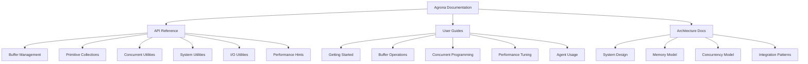
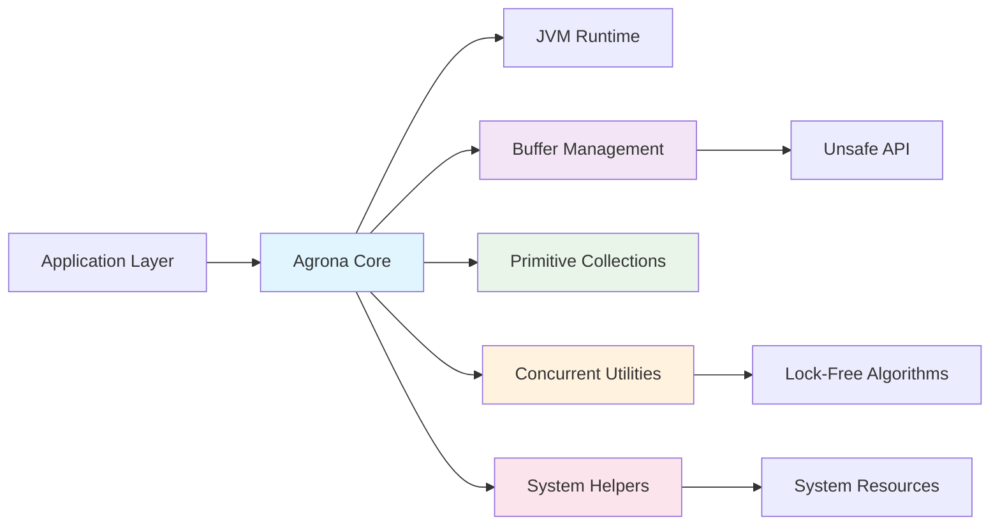

# Agrona Documentation

Welcome to the comprehensive documentation for Agrona, a high-performance, zero-dependency Java library providing essential data structures and utility methods for building low-latency applications.

## 📚 Table of Contents

1. [Quick Start](#-quick-start)
2. [Documentation Structure](#-documentation-structure)
3. [API Reference](#-api-reference)
4. [User Guides](#-user-guides)
5. [Architecture Documentation](#-architecture-documentation)
6. [Feature Overview](#-feature-overview)
7. [Installation & Setup](#-installation--setup)
8. [Performance Characteristics](#-performance-characteristics)
9. [Community Resources](#-community-resources)

---

## 🚀 Quick Start

### Essential Links
- **[Getting Started Guide](guides/getting-started.md)** - Your first steps with Agrona
- **[Buffer Operations Guide](guides/buffer-operations.md)** - Zero-copy memory management
- **[System Design Overview](architecture/system-design.md)** - High-level architecture
- **[Main Project Repository](../README.md)** - Root project documentation

### 5-Minute Example

```java
import org.agrona.concurrent.UnsafeBuffer;
import org.agrona.MutableDirectBuffer;

// Create a high-performance buffer
byte[] backingArray = new byte[1024];
MutableDirectBuffer buffer = new UnsafeBuffer(backingArray);

// Zero-copy operations
buffer.putInt(0, 42);
buffer.putLong(4, System.nanoTime());
String message = "High-performance messaging";
int bytesWritten = buffer.putStringAscii(12, message);

// Read back with microsecond latency
int value = buffer.getInt(0);
long timestamp = buffer.getLong(4);
String retrieved = buffer.getStringAscii(12);
```

### Installation

**Maven:**
```xml
<dependency>
    <groupId>org.agrona</groupId>
    <artifactId>agrona</artifactId>
    <version>1.25.0</version>
</dependency>
```

**Gradle:**
```groovy
implementation 'org.agrona:agrona:1.25.0'
```

---

## 📖 Documentation Structure

Our documentation is organized into three main categories to serve different user needs:



### Navigation by Experience Level

| Experience Level | Recommended Starting Point | Next Steps |
|-----------------|---------------------------|------------|
| **New to Agrona** | [Getting Started](guides/getting-started.md) | [Buffer Operations](guides/buffer-operations.md) → [System Design](architecture/system-design.md) |
| **Java Performance Engineer** | [Performance Tuning](guides/performance-tuning.md) | [Memory Model](architecture/memory-model.md) → [Concurrent Utilities API](api/concurrent-utilities.md) |
| **Systems Architect** | [System Design](architecture/system-design.md) | [Integration Patterns](architecture/integration-patterns.md) → [Concurrency Model](architecture/concurrency-model.md) |
| **API Integration** | [Buffer Management API](api/buffer-management.md) | [Primitive Collections API](api/primitive-collections.md) → [System Utilities API](api/system-utilities.md) |

---

## 📋 API Reference

Complete reference documentation for all public APIs, interfaces, and implementations.

### Core APIs

| Module | Description | Key Features |
|--------|-------------|--------------|
| **[Buffer Management](api/buffer-management.md)** | Zero-copy buffer operations with atomic access | DirectBuffer, MutableDirectBuffer, AtomicBuffer interfaces |
| **[Primitive Collections](api/primitive-collections.md)** | Boxing-free collections for int/long primitives | Hash maps, sets, lists with specialized implementations |
| **[Concurrent Utilities](api/concurrent-utilities.md)** | Lock-free data structures and agent framework | SPSC/MPSC queues, ring buffers, agent scheduling |

### Utility APIs

| Module | Description | Use Cases |
|--------|-------------|-----------|
| **[System Utilities](api/system-utilities.md)** | System introspection and resource management | SystemUtil, IoUtil, CloseHelper, timer wheels |
| **[I/O Utilities](api/io-utilities.md)** | Direct buffer stream implementations | InputStream/OutputStream wrappers, file operations |
| **[Performance Hints](api/hints-api.md)** | JVM optimization hints and thread control | ThreadHints, performance tuning utilities |

### Quick API Lookup

**Buffer Operations:**
- [`DirectBuffer`](api/buffer-management.md#directbuffer-interface) - Read-only buffer access
- [`MutableDirectBuffer`](api/buffer-management.md#mutabledirectbuffer-interface) - Read-write buffer operations  
- [`AtomicBuffer`](api/buffer-management.md#atomicbuffer-interface) - Thread-safe atomic operations
- [`UnsafeBuffer`](api/buffer-management.md#unsafebuffer) - High-performance implementation

**Collections:**
- [`Int2IntHashMap`](api/primitive-collections.md#int2inthashmap) - Integer key-value mapping
- [`IntHashSet`](api/primitive-collections.md#inthashset) - Integer set operations
- [`IntArrayList`](api/primitive-collections.md#intarraylist) - Growable integer arrays

**Concurrency:**
- [`MpscArrayQueue`](api/concurrent-utilities.md#mpscarrayqueue) - Multi-producer single-consumer queue
- [`ManyToOneRingBuffer`](api/concurrent-utilities.md#manytooneringbuffer) - IPC ring buffer
- [`Agent`](api/concurrent-utilities.md#agent-framework) - Scheduled task framework

---

## 📖 User Guides

Step-by-step guides for common usage patterns and advanced techniques.

### Essential Guides

| Guide | Target Audience | Prerequisites |
|-------|----------------|---------------|
| **[Getting Started](guides/getting-started.md)** | All developers new to Agrona | Java 17+ knowledge |
| **[Buffer Operations](guides/buffer-operations.md)** | Performance-focused developers | Understanding of memory management |
| **[Concurrent Programming](guides/concurrent-programming.md)** | Multi-threaded application developers | Java concurrency fundamentals |

### Specialized Guides

| Guide | Focus Area | When to Use |
|-------|------------|-------------|
| **[Performance Tuning](guides/performance-tuning.md)** | Optimization strategies | Building latency-sensitive applications |
| **[Agent Usage](guides/agent-usage.md)** | ByteBuddy instrumentation | Development and debugging workflows |

### Usage Patterns by Domain

**Financial Trading Systems:**
```
Getting Started → Buffer Operations → Concurrent Programming → Performance Tuning
```

**Real-Time Analytics:**
```
Getting Started → Buffer Operations → System Design → Performance Tuning
```

**Message Processing:**
```
Getting Started → Concurrent Programming → Integration Patterns → Agent Usage
```

**Game Engines:**
```
Getting Started → Buffer Operations → Memory Model → Performance Tuning
```

---

## 🏗️ Architecture Documentation

Deep technical documentation covering system design, implementation details, and integration patterns.

### System Architecture

| Document | Content Focus | Technical Depth |
|----------|---------------|----------------|
| **[System Design](architecture/system-design.md)** | Overall architecture and component relationships | High-level overview |
| **[Memory Model](architecture/memory-model.md)** | Memory layout, Unsafe API usage, alignment | Low-level implementation |
| **[Concurrency Model](architecture/concurrency-model.md)** | Lock-free algorithms, memory ordering | Algorithm analysis |
| **[Integration Patterns](architecture/integration-patterns.md)** | External system integration, Aeron/SBE | Integration strategies |

### Architecture by Component



### Design Principles

1. **Zero Dependencies** - Pure JDK implementation for maximum compatibility
2. **Zero Copy** - Direct memory access without intermediate allocations
3. **Zero Garbage** - Steady-state operation without GC pressure
4. **Zero Blocking** - Lock-free algorithms for predictable latency

---

## ⚡ Feature Overview

Agrona provides four major categories of high-performance utilities:

### 🗃️ Memory Management
- **Zero-Copy Buffers**: Direct memory access without copying overhead
- **Atomic Operations**: Thread-safe memory access with configurable ordering
- **Memory-Mapped Files**: Efficient file I/O through memory mapping
- **Alignment Control**: Platform-optimized memory layout

**Key Benefits:**
- Sub-microsecond buffer operations
- Zero garbage generation
- Platform-independent memory access
- Cache-friendly data structures

### 📊 Primitive Collections
- **Hash Maps**: `Int2IntHashMap`, `Long2LongHashMap` without boxing
- **Hash Sets**: `IntHashSet`, `LongHashSet` for primitive deduplication  
- **Array Lists**: `IntArrayList`, `LongArrayList` with dynamic growth
- **Counter Maps**: Specialized collections for metrics and telemetry

**Performance Characteristics:**
- 75% memory reduction vs. standard collections
- No boxing/unboxing CPU overhead
- Cache-optimized memory layouts
- Linear probe sequences for predictable access

### 🔄 Concurrent Utilities
- **Lock-Free Queues**: SPSC, MPSC, MPMC implementations
- **Ring Buffers**: Zero-copy IPC with broadcast capabilities
- **Agent Framework**: Scheduled concurrent services
- **Atomic Counters**: Shared memory telemetry

**Concurrency Features:**
- Wait-free progress guarantees
- Linear scalability with CPU cores
- Backpressure handling
- Memory ordering control

### 🛠️ System Utilities
- **High-Resolution Clocks**: Nanosecond precision timing
- **ID Generation**: Distributed Snowflake algorithm
- **Signal Handling**: Graceful shutdown coordination
- **Timer Wheels**: O(1) deadline scheduling

### Module Overview

| Module | Purpose | Dependencies | Usage Context |
|--------|---------|--------------|---------------|
| **agrona** | Core library with all primitives | None | Production applications |
| **agrona-agent** | ByteBuddy alignment enforcement | ByteBuddy | Development and debugging |
| **agrona-benchmarks** | JMH performance validation | JMH | Performance testing |
| **agrona-concurrency-tests** | JCStress correctness tests | JCStress | Concurrency validation |

---

## 🔧 Installation & Setup

### System Requirements

| Requirement | Minimum | Recommended | Notes |
|-------------|---------|-------------|-------|
| **Java Version** | Java 17 | Java 21+ | Tested through Java 25-ea |
| **Memory** | 512MB heap | 1GB+ heap | For benchmark and test suites |
| **CPU Architecture** | x86_64 | x86_64 with AVX2 | ARM64 supported |

### JVM Configuration

**Essential JVM Flags:**
```bash
# Required for Unsafe API access
--add-opens java.base/jdk.internal.misc=ALL-UNNAMED

# Performance optimization
-Dagrona.disable.bounds.checks=true
-Dagrona.strict.alignment.checks=true

# GC tuning for low-latency
-XX:+UseG1GC
-XX:MaxGCPauseMillis=1
```

**Development Configuration:**
```bash
# Enable all safety checks during development
-Dagrona.disable.bounds.checks=false
-Dagrona.strict.alignment.checks=true
-ea  # Enable assertions
```

**Production Configuration:**
```bash
# Maximum performance settings
-Dagrona.disable.bounds.checks=true
-Dagrona.strict.alignment.checks=false
-server -XX:+TieredCompilation
```

### Maven Integration

**Complete POM Configuration:**
```xml
<properties>
    <agrona.version>1.25.0</agrona.version>
    <maven.compiler.source>17</maven.compiler.source>
    <maven.compiler.target>17</maven.compiler.target>
</properties>

<dependencies>
    <dependency>
        <groupId>org.agrona</groupId>
        <artifactId>agrona</artifactId>
        <version>${agrona.version}</version>
    </dependency>
</dependencies>

<build>
    <plugins>
        <plugin>
            <groupId>org.apache.maven.plugins</groupId>
            <artifactId>maven-surefire-plugin</artifactId>
            <configuration>
                <argLine>--add-opens java.base/jdk.internal.misc=ALL-UNNAMED</argLine>
            </configuration>
        </plugin>
    </plugins>
</build>
```

### Gradle Integration

**Complete Build Script:**
```groovy
plugins {
    id 'java-library'
}

java {
    toolchain {
        languageVersion = JavaLanguageVersion.of(17)
    }
}

dependencies {
    implementation 'org.agrona:agrona:1.25.0'
    
    // Optional modules
    runtimeOnly 'org.agrona:agrona-agent:1.25.0'
    testImplementation 'org.agrona:agrona-benchmarks:1.25.0'
}

test {
    jvmArgs = ['--add-opens', 'java.base/jdk.internal.misc=ALL-UNNAMED']
    systemProperty 'agrona.disable.bounds.checks', 'false'
}
```

---

## 📈 Performance Characteristics

### Benchmark Results

**Buffer Operations (per operation):**
| Operation | Latency | Throughput |
|-----------|---------|------------|
| `putInt()` | ~1 ns | 1B ops/sec |
| `putLong()` | ~1 ns | 1B ops/sec |
| `putStringAscii()` | ~5 ns | 200M ops/sec |
| `compareAndSetInt()` | ~2 ns | 500M ops/sec |

**Collection Operations:**
| Collection | Operation | Latency | Memory Overhead |
|------------|-----------|---------|----------------|
| `Int2IntHashMap` | `put()` | ~8 ns | 75% reduction |
| `IntHashSet` | `add()` | ~6 ns | 80% reduction |
| `IntArrayList` | `add()` | ~2 ns | 70% reduction |

**Concurrent Structures:**
| Structure | Throughput | Latency P99 | Scalability |
|-----------|------------|-------------|-------------|
| `MpscArrayQueue` | 100M msg/sec | <100 ns | Linear to 16 cores |
| `ManyToOneRingBuffer` | 80M msg/sec | <50 ns | Constant |

### Performance Tuning

**Quick Wins:**
1. **Disable Bounds Checking**: `-Dagrona.disable.bounds.checks=true`
2. **Use Native Byte Order**: Avoid ByteOrder parameters
3. **Preallocate Buffers**: Reuse buffer instances
4. **Align Memory Access**: Use 8-byte aligned offsets
5. **Choose Optimal Collection Size**: Power-of-2 initial capacities

**Advanced Optimizations:**
- [Performance Tuning Guide](guides/performance-tuning.md)
- [Memory Model Documentation](architecture/memory-model.md)
- [JVM Configuration Examples](guides/getting-started.md#jvm-configuration)

---

## 🌐 Community Resources

### Official Resources

| Resource | Description | Link |
|----------|-------------|------|
| **Main Repository** | Source code and releases | [aeron-io/agrona](https://github.com/aeron-io/agrona) |
| **Javadoc API** | Complete API documentation | [javadoc.io/doc/org.agrona](https://javadoc.io/doc/org.agrona/agrona) |
| **Maven Central** | Artifact downloads | [search.maven.org](http://search.maven.org/#search%7Cga%7C1%7Cagrona) |
| **CI/CD Status** | Build and test status | [GitHub Actions](https://github.com/aeron-io/agrona/actions) |

### Related Projects

| Project | Relationship | Use Case |
|---------|-------------|----------|
| **[Aeron](https://github.com/aeron-io/aeron)** | Primary consumer | High-performance messaging transport |
| **[Simple Binary Encoding](https://github.com/aeron-io/simple-binary-encoding)** | Integration | Message serialization codec |
| **[Chronicle Queue](https://github.com/OpenHFT/Chronicle-Queue)** | Consumer | Persistent messaging |

### Learning Path

**Beginner (Week 1-2):**
1. Read [Getting Started](guides/getting-started.md)
2. Complete buffer operation examples
3. Understand primitive collections
4. Review [System Design](architecture/system-design.md)

**Intermediate (Week 3-4):**
1. Study [Concurrent Programming](guides/concurrent-programming.md)
2. Implement ring buffer messaging
3. Explore agent framework patterns
4. Read [Memory Model](architecture/memory-model.md)

**Advanced (Week 5+):**
1. Master [Performance Tuning](guides/performance-tuning.md)
2. Study [Concurrency Model](architecture/concurrency-model.md)
3. Implement custom integrations
4. Contribute to the project

### Support Channels

- **Issues**: [GitHub Issues](https://github.com/aeron-io/agrona/issues) for bugs and feature requests
- **Discussions**: [GitHub Discussions](https://github.com/aeron-io/agrona/discussions) for questions
- **Documentation**: This comprehensive documentation set
- **Source Code**: Browse annotated source with examples

---

## 📝 Documentation Maintenance

**Last Updated**: January 2025  
**Agrona Version**: 1.25.0  
**Documentation Version**: 2.0.0

### Contributing to Documentation

We welcome improvements to this documentation! Please see:
- [Contributing Guidelines](../CONTRIBUTING.md)
- [Documentation Standards](architecture/integration-patterns.md#documentation-patterns)
- [API Reference Guidelines](api/buffer-management.md#documentation-format)

### Documentation Roadmap

**Planned Additions:**
- [ ] Interactive code examples with RunKit
- [ ] Video tutorials for complex topics
- [ ] Migration guides from standard Java collections
- [ ] Platform-specific optimization guides
- [ ] Docker container examples

---

*📖 This documentation provides comprehensive coverage of the Agrona library ecosystem. For the most current information, always refer to the main repository and release notes.*