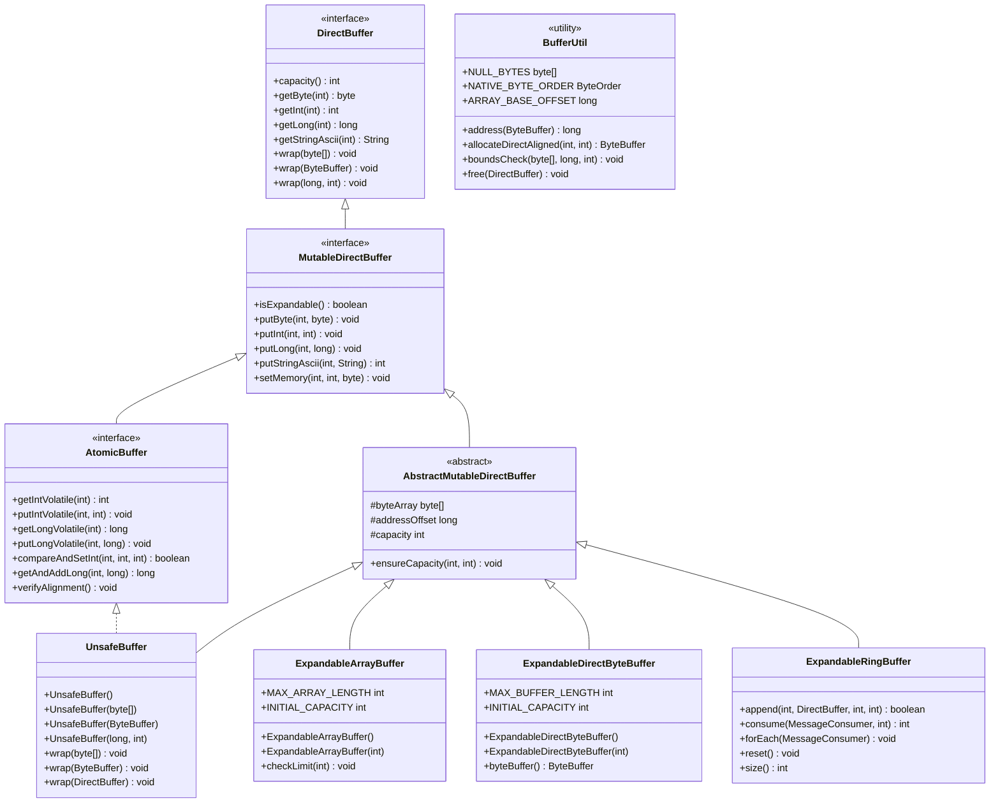

# Buffer Management API Reference

## Table of Contents

1. [Overview](#overview)
2. [Core Interfaces](#core-interfaces)
   - [DirectBuffer Interface](#directbuffer-interface)
   - [MutableDirectBuffer Interface](#mutabledirectbuffer-interface)
   - [AtomicBuffer Interface](#atomicbuffer-interface)
3. [Buffer Implementations](#buffer-implementations)
   - [UnsafeBuffer](#unsafebuffer)
   - [ExpandableArrayBuffer](#expandablearraybuffer)
   - [ExpandableDirectByteBuffer](#expandabledirectbytebuffer)
   - [ExpandableRingBuffer](#expandableringbuffer)
4. [Buffer Utilities](#buffer-utilities)
   - [BufferUtil Class](#bufferutil-class)
5. [Memory Management](#memory-management)
6. [Class Hierarchy](#class-hierarchy)
7. [Code Examples](#code-examples)

---

## Overview

Agrona's buffer management system provides a unified abstraction over diverse memory sources including heap-based byte arrays, NIO ByteBuffers, memory-mapped files, and off-heap memory regions. The system enables zero-copy operations essential for achieving microsecond-latency performance characteristics in high-frequency trading and messaging applications.

> Source: `/agrona/src/main/java/org/agrona/DirectBuffer.java:24-28`

### Key Features

- **Zero-Copy Operations**: Direct memory access without intermediate copying
- **Type-Safe Access**: Unified interface for all primitive types
- **Memory Ordering Control**: Atomic operations with configurable semantics
- **Expandable Storage**: Automatic capacity growth for dynamic requirements
- **Platform Independence**: Abstraction over different memory sources

### System Properties

| Property | Type | Purpose | Default |
|----------|------|---------|---------|
| `agrona.disable.bounds.checks` | boolean | Disable bounds checking for performance | false |
| `agrona.strict.alignment.checks` | boolean | Enable strict alignment verification | platform-dependent |

> Source: `/agrona/src/main/java/org/agrona/DirectBuffer.java:43-55`

---

## Core Interfaces

### DirectBuffer Interface

The `DirectBuffer` interface provides read-only access to underlying memory with typed access methods for all primitive types, string operations, and comparison capabilities.

> Source: `/agrona/src/main/java/org/agrona/DirectBuffer.java:29`

#### Key Constants

```java
/**
 * Length of the header on strings to denote the length of the string in bytes.
 */
int STR_HEADER_LEN = SIZE_OF_INT;

/**
 * Name of the system property that specify if the bounds checks should be disabled.
 */
String DISABLE_BOUNDS_CHECKS_PROP_NAME = "agrona.disable.bounds.checks";
```

> Source: `/agrona/src/main/java/org/agrona/DirectBuffer.java:32-46`

#### Core Methods

##### Buffer Wrapping

| Method | Description | Parameters |
|--------|-------------|------------|
| `void wrap(byte[] buffer)` | Attach view to byte array | `buffer` - array to wrap |
| `void wrap(byte[] buffer, int offset, int length)` | Attach view to byte array slice | `buffer`, `offset`, `length` |
| `void wrap(ByteBuffer buffer)` | Attach view to ByteBuffer | `buffer` - ByteBuffer to wrap |
| `void wrap(DirectBuffer buffer)` | Attach view to another DirectBuffer | `buffer` - DirectBuffer to wrap |
| `void wrap(long address, int length)` | Attach view to off-heap memory | `address` - memory address, `length` - size |

> Source: `/agrona/src/main/java/org/agrona/DirectBuffer.java:58-122`

##### Primitive Access Methods

| Method | Return Type | Description |
|--------|-------------|-------------|
| `byte getByte(int index)` | byte | Get byte value at index |
| `short getShort(int index)` | short | Get short value at index |
| `int getInt(int index)` | int | Get int value at index |
| `long getLong(int index)` | long | Get long value at index |
| `float getFloat(int index)` | float | Get float value at index |
| `double getDouble(int index)` | double | Get double value at index |

> Source: `/agrona/src/main/java/org/agrona/DirectBuffer.java:173-257`

All primitive access methods include overloads with `ByteOrder` parameters for endianness control:

```java
int getInt(int index, ByteOrder byteOrder);
long getLong(int index, ByteOrder byteOrder);
```

> Source: `/agrona/src/main/java/org/agrona/DirectBuffer.java:175-196`

##### String Operations

| Method | Return Type | Description |
|--------|-------------|-------------|
| `String getStringAscii(int index)` | String | Get length-prefixed ASCII string |
| `String getStringUtf8(int index)` | String | Get length-prefixed UTF-8 string |
| `String getStringWithoutLengthAscii(int index, int length)` | String | Get ASCII string without prefix |
| `String getStringWithoutLengthUtf8(int index, int length)` | String | Get UTF-8 string without prefix |

> Source: `/agrona/src/main/java/org/agrona/DirectBuffer.java:370-479`

##### Bulk Operations

```java
void getBytes(int index, byte[] dst);
void getBytes(int index, byte[] dst, int offset, int length);
void getBytes(int index, MutableDirectBuffer dstBuffer, int dstIndex, int length);
void getBytes(int index, ByteBuffer dstBuffer, int length);
```

> Source: `/agrona/src/main/java/org/agrona/DirectBuffer.java:318-368`

### MutableDirectBuffer Interface

The `MutableDirectBuffer` interface extends `DirectBuffer` with write capabilities, providing put operations for all primitive types and buffer manipulation methods.

> Source: `/agrona/src/main/java/org/agrona/MutableDirectBuffer.java:27`

#### Expandability

```java
/**
 * Is this buffer expandable to accommodate putting data into it beyond the current capacity?
 * @return true if the underlying storage can expand otherwise false.
 */
boolean isExpandable();
```

> Source: `/agrona/src/main/java/org/agrona/MutableDirectBuffer.java:30-34`

#### Memory Operations

```java
/**
 * Set a region of memory to a given byte value.
 * @param index  at which to start.
 * @param length of the run of bytes to set.
 * @param value  the memory will be set to.
 */
void setMemory(int index, int length, byte value);
```

> Source: `/agrona/src/main/java/org/agrona/MutableDirectBuffer.java:37-43`

#### Primitive Put Operations

| Method | Parameters | Description |
|--------|------------|-------------|
| `void putByte(int index, byte value)` | index, value | Put byte at index |
| `void putShort(int index, short value)` | index, value | Put short at index |
| `void putInt(int index, int value)` | index, value | Put int at index |
| `void putLong(int index, long value)` | index, value | Put long at index |
| `void putFloat(int index, float value)` | index, value | Put float at index |
| `void putDouble(int index, double value)` | index, value | Put double at index |

> Source: `/agrona/src/main/java/org/agrona/MutableDirectBuffer.java:46-153`

#### ASCII Encoding Operations

```java
/**
 * Puts an ASCII encoded int into the buffer.
 * @param index the offset at which to put the int.
 * @param value the int to write.
 * @return the number of bytes that the int took up encoded.
 */
int putIntAscii(int index, int value);

/**
 * Puts an ASCII encoded int sized natural number into the buffer.
 * @param index the offset at which to put the int.
 * @param value the int to write.
 * @return the number of bytes that the int took up encoded.
 */
int putNaturalIntAscii(int index, int value);
```

> Source: `/agrona/src/main/java/org/agrona/MutableDirectBuffer.java:80-95`

#### String Put Operations

| Method | Return Type | Description |
|--------|-------------|-------------|
| `int putStringAscii(int index, String value)` | int | Put ASCII string with length prefix |
| `int putStringUtf8(int index, String value)` | int | Put UTF-8 string with length prefix |
| `int putStringWithoutLengthAscii(int index, String value)` | int | Put ASCII string without prefix |
| `int putStringWithoutLengthUtf8(int index, String value)` | int | Put UTF-8 string without prefix |

> Source: `/agrona/src/main/java/org/agrona/MutableDirectBuffer.java:268-396`

### AtomicBuffer Interface

The `AtomicBuffer` interface extends `MutableDirectBuffer` with atomic operations providing various memory ordering semantics for thread-safe access.

> Source: `/agrona/src/main/java/org/agrona/concurrent/AtomicBuffer.java:48`

#### Alignment Requirements

```java
/**
 * Buffer alignment in bytes to ensure atomic word accesses.
 */
int ALIGNMENT = SIZE_OF_LONG;

/**
 * Name of the system property that specify if the alignment checks for atomic operations are strict.
 */
String STRICT_ALIGNMENT_CHECKS_PROP_NAME = "agrona.strict.alignment.checks";
```

> Source: `/agrona/src/main/java/org/agrona/concurrent/AtomicBuffer.java:50-60`

#### Memory Ordering Semantics

The `AtomicBuffer` provides four types of memory ordering:

1. **Volatile (Sequential Consistency)**: Strongest ordering guarantees
2. **Release/Acquire**: Unidirectional synchronisation 
3. **Opaque**: Atomic without ordering constraints
4. **Ordered (deprecated)**: Use Release semantics instead

> Source: `/agrona/src/main/java/org/agrona/concurrent/AtomicBuffer.java:33-42`

#### Volatile Operations

```java
int getIntVolatile(int index);
void putIntVolatile(int index, int value);
long getLongVolatile(int index);
void putLongVolatile(int index, long value);
```

> Source: `/agrona/src/main/java/org/agrona/concurrent/AtomicBuffer.java:104-130`

#### Acquire/Release Operations

```java
int getIntAcquire(int index);
void putIntRelease(int index, int value);
long getLongAcquire(int index);
void putLongRelease(int index, long value);
```

> Source: `/agrona/src/main/java/org/agrona/concurrent/AtomicBuffer.java:114-150`

#### Compare-and-Swap Operations

```java
boolean compareAndSetInt(int index, int expectedValue, int updateValue);
boolean compareAndSetLong(int index, long expectedValue, long updateValue);
int compareAndExchangeInt(int index, int expectedValue, int updateValue);
long compareAndExchangeLong(int index, long expectedValue, long updateValue);
```

> Source: `/agrona/src/main/java/org/agrona/concurrent/AtomicBuffer.java:210-232`

#### Atomic Arithmetic Operations

```java
int getAndSetInt(int index, int value);
int getAndAddInt(int index, int delta);
long getAndSetLong(int index, long value);
long getAndAddLong(int index, long delta);
```

> Source: `/agrona/src/main/java/org/agrona/concurrent/AtomicBuffer.java:235-255`

---

## Buffer Implementations

### UnsafeBuffer

`UnsafeBuffer` is a high-performance buffer implementation providing direct memory access with support for atomic operations and thread-safe buffer manipulation for both heap and off-heap memory.

> Source: `/agrona/src/main/java/org/agrona/concurrent/UnsafeBuffer.java:30-43`

#### Constructors

```java
// Empty constructor for reusable wrapper
UnsafeBuffer()

// Wrap byte array
UnsafeBuffer(byte[] buffer)
UnsafeBuffer(byte[] buffer, int offset, int length)

// Wrap ByteBuffer
UnsafeBuffer(ByteBuffer buffer)
UnsafeBuffer(ByteBuffer buffer, int offset, int length)

// Wrap DirectBuffer
UnsafeBuffer(DirectBuffer buffer)
UnsafeBuffer(DirectBuffer buffer, int offset, int length)

// Wrap off-heap memory
UnsafeBuffer(long address, int length)
```

> Source: `/agrona/src/main/java/org/agrona/concurrent/UnsafeBuffer.java:73-122`

#### Key Features

- Supports all memory sources (heap arrays, ByteBuffers, off-heap memory)
- Implements full `AtomicBuffer` interface with atomic operations
- Zero-copy wrapping of existing memory regions
- Thread-safe for concurrent read/write operations
- Configurable bounds checking for development vs production

### ExpandableArrayBuffer

`ExpandableArrayBuffer` is a heap-based mutable buffer that automatically grows by 50% when writes exceed current capacity.

> Source: `/agrona/src/main/java/org/agrona/ExpandableArrayBuffer.java:24-32`

#### Constants

```java
/**
 * Maximum length to which the underlying buffer can grow.
 */
public static final int MAX_ARRAY_LENGTH = Integer.MAX_VALUE - 8;

/**
 * Initial capacity of the buffer from which it will expand as necessary.
 */
public static final int INITIAL_CAPACITY = 128;
```

> Source: `/agrona/src/main/java/org/agrona/ExpandableArrayBuffer.java:35-43`

#### Constructors

```java
// Default constructor with INITIAL_CAPACITY
ExpandableArrayBuffer()

// Constructor with specified initial capacity  
ExpandableArrayBuffer(int initialCapacity)
```

> Source: `/agrona/src/main/java/org/agrona/ExpandableArrayBuffer.java:46-63`

#### Expansion Behavior

The buffer automatically expands when put operations exceed current capacity:

```java
public void checkLimit(final int limit)
{
    ensureCapacity(limit + 1, capacity);
}

private void ensureCapacity(final int requiredCapacity, final int currentCapacity)
{
    if (requiredCapacity > currentCapacity)
    {
        // Grow by 50%
        int newCapacity = Math.max(requiredCapacity, currentCapacity + (currentCapacity >>> 1));
        // Resize array
        byteArray = Arrays.copyOf(byteArray, newCapacity);
        capacity = newCapacity;
    }
}
```

### ExpandableDirectByteBuffer

`ExpandableDirectByteBuffer` provides off-heap expandable storage backed by direct ByteBuffers that automatically grows capacity when writes exceed current limits.

> Source: `/agrona/src/main/java/org/agrona/ExpandableDirectByteBuffer.java:24-30`

#### Constants

```java
/**
 * Maximum length to which the underlying buffer can grow.
 */
public static final int MAX_BUFFER_LENGTH = Integer.MAX_VALUE - 8;

/**
 * Initial capacity of the buffer from which it will expand as necessary.
 */
public static final int INITIAL_CAPACITY = 128;
```

#### Key Differences from ExpandableArrayBuffer

- Uses direct ByteBuffers for off-heap storage
- Suitable for memory-mapped file backing
- May have different allocation/deallocation characteristics
- Potentially better for large buffers due to reduced GC pressure

### ExpandableRingBuffer

`ExpandableRingBuffer` provides variable-length message storage with automatic capacity growth, message framing, and FIFO consumption patterns.

> Source: `/agrona/src/main/java/org/agrona/ExpandableRingBuffer.java:24-30`

#### Message Operations

```java
/**
 * Append a message to the ring buffer.
 * @param msgTypeId type identifier for the message
 * @param srcBuffer source buffer containing message data
 * @param srcIndex starting index in source buffer
 * @param length number of bytes to append
 * @return true if successful, false if insufficient capacity
 */
boolean append(int msgTypeId, DirectBuffer srcBuffer, int srcIndex, int length);

/**
 * Consume messages from the buffer.
 * @param handler message consumer function
 * @param messageCountLimit maximum messages to process
 * @return number of messages consumed
 */
int consume(MessageConsumer handler, int messageCountLimit);
```

#### Message Format

Each message in the ring buffer follows this structure:

```
[Header: 8 bytes]
  - Message Type (4 bytes)
  - Message Length (4 bytes)
[Payload: Variable length]
[Padding: Align to 8-byte boundary]
```

---

## Buffer Utilities

### BufferUtil Class

The `BufferUtil` class provides static utility methods for buffer operations including bounds checking, memory address calculations, and direct buffer allocation with alignment.

> Source: `/agrona/src/main/java/org/agrona/BufferUtil.java:25-28`

#### Constants

```java
/**
 * UTF-8-encoded byte representation of the "null" string.
 */
public static final byte[] NULL_BYTES = "null".getBytes(StandardCharsets.UTF_8);

/**
 * Native byte order.
 */
public static final ByteOrder NATIVE_BYTE_ORDER = ByteOrder.nativeOrder();

/**
 * Byte array base offset.
 */
public static final long ARRAY_BASE_OFFSET = UnsafeApi.arrayBaseOffset(byte[].class);
```

> Source: `/agrona/src/main/java/org/agrona/BufferUtil.java:31-43`

#### Bounds Checking

```java
/**
 * Bounds check the access range and throw IndexOutOfBoundsException if exceeded.
 */
public static void boundsCheck(byte[] buffer, long index, int length);
public static void boundsCheck(ByteBuffer buffer, long index, int length);
```

> Source: `/agrona/src/main/java/org/agrona/BufferUtil.java:83-114`

#### Memory Address Operations

```java
/**
 * Get the address at which the underlying buffer storage begins.
 * @param buffer direct ByteBuffer
 * @return memory address
 */
public static long address(ByteBuffer buffer);

/**
 * Get the array from a read-only ByteBuffer.
 * @param buffer heap-based ByteBuffer
 * @return underlying byte array
 */
public static byte[] array(ByteBuffer buffer);

/**
 * Get the array offset from a read-only ByteBuffer.
 * @param buffer heap-based ByteBuffer  
 * @return array offset
 */
public static int arrayOffset(ByteBuffer buffer);
```

> Source: `/agrona/src/main/java/org/agrona/BufferUtil.java:117-150`

#### Aligned Buffer Allocation

```java
/**
 * Allocate a direct ByteBuffer with specified alignment.
 * @param capacity size in bytes
 * @param alignment required alignment in bytes (must be power of 2)
 * @return aligned direct ByteBuffer
 */
public static ByteBuffer allocateDirectAligned(int capacity, int alignment);

/**
 * Free a direct buffer allocated by allocateDirectAligned.
 * @param buffer buffer to free
 */
public static void free(DirectBuffer buffer);
public static void free(ByteBuffer buffer);
```

---

## Memory Management

### Alignment Requirements

For atomic operations to be safe across all platforms, data must be properly aligned:

- **int operations**: 4-byte alignment 
- **long operations**: 8-byte alignment
- **AtomicBuffer**: 8-byte alignment required

> Source: `/agrona/src/main/java/org/agrona/concurrent/AtomicBuffer.java:44-47`

### Alignment Verification

```java
/**
 * Verify that the underlying buffer is correctly aligned.
 * @throws IllegalStateException if not properly aligned
 */
void verifyAlignment();
```

> Source: `/agrona/src/main/java/org/agrona/concurrent/AtomicBuffer.java:74-101`

### Platform Considerations

| Platform | Alignment Checks | Unaligned Access |
|----------|------------------|------------------|
| x86/x64 | Optional (controlled by system property) | Supported with performance penalty |
| ARM/AArch64 | Always enforced | May cause JVM crash |
| Other | Always enforced | Platform dependent |

---

## Class Hierarchy



---

## Code Examples

### Basic Buffer Operations

```java
import org.agrona.concurrent.UnsafeBuffer;
import org.agrona.MutableDirectBuffer;

// Create buffer from byte array
byte[] backingArray = new byte[1024];
MutableDirectBuffer buffer = new UnsafeBuffer(backingArray);

// Write primitive values
buffer.putInt(0, 42);
buffer.putLong(4, 123456789L);
buffer.putDouble(12, 3.14159);

// Read primitive values
int intValue = buffer.getInt(0);          // Returns 42
long longValue = buffer.getLong(4);       // Returns 123456789L
double doubleValue = buffer.getDouble(12); // Returns 3.14159

// String operations with length prefix
String message = "Hello World";
int bytesWritten = buffer.putStringAscii(20, message);
String retrieved = buffer.getStringAscii(20);
```

> Source: Test examples from `/agrona/src/test/java/org/agrona/MutableDirectBufferTests.java:61-88`

### Expandable Buffer Usage

```java
import org.agrona.ExpandableArrayBuffer;

// Create expandable buffer with default initial capacity
ExpandableArrayBuffer buffer = new ExpandableArrayBuffer();

// Buffer automatically expands as needed
for (int i = 0; i < 1000; i++) {
    buffer.putInt(i * 4, i);  // Will expand beyond initial 128 bytes
}

// Check final capacity
System.out.println("Final capacity: " + buffer.capacity());
```

### Atomic Operations

```java
import org.agrona.concurrent.AtomicBuffer;
import org.agrona.concurrent.UnsafeBuffer;

AtomicBuffer atomicBuffer = new UnsafeBuffer(new byte[1024]);

// Verify alignment for atomic operations
atomicBuffer.verifyAlignment();

// Volatile operations (strongest ordering)
atomicBuffer.putIntVolatile(0, 100);
int value = atomicBuffer.getIntVolatile(0);

// Compare-and-swap operations
boolean successful = atomicBuffer.compareAndSetInt(0, 100, 200);

// Atomic arithmetic
int previousValue = atomicBuffer.getAndAddInt(4, 50);
```

### Memory-Mapped Buffer

```java
import java.nio.channels.FileChannel;
import java.nio.file.Paths;
import java.nio.file.StandardOpenOption;

// Create memory-mapped buffer
try (FileChannel channel = FileChannel.open(
    Paths.get("data.bin"), 
    StandardOpenOption.CREATE, 
    StandardOpenOption.READ, 
    StandardOpenOption.WRITE)) {
    
    long fileSize = 1024 * 1024; // 1MB
    MappedByteBuffer mappedBuffer = channel.map(
        FileChannel.MapMode.READ_WRITE, 0, fileSize);
    
    UnsafeBuffer buffer = new UnsafeBuffer(mappedBuffer);
    
    // Use buffer for zero-copy operations
    buffer.putLong(0, System.currentTimeMillis());
}
```

### Ring Buffer Message Processing

```java
import org.agrona.ExpandableRingBuffer;
import org.agrona.concurrent.MessageHandler;

ExpandableRingBuffer ringBuffer = new ExpandableRingBuffer();

// Producer: Append messages
UnsafeBuffer messageBuffer = new UnsafeBuffer("Hello".getBytes());
boolean success = ringBuffer.append(1, messageBuffer, 0, messageBuffer.capacity());

// Consumer: Process messages
MessageHandler handler = (msgTypeId, buffer, index, length) -> {
    String message = buffer.getStringWithoutLengthAscii(index, length);
    System.out.println("Received: " + message);
};

int messagesProcessed = ringBuffer.consume(handler, 10);
```

### Alignment and Performance

```java
import org.agrona.BufferUtil;
import java.nio.ByteBuffer;

// Allocate aligned direct buffer for optimal performance
ByteBuffer alignedBuffer = BufferUtil.allocateDirectAligned(1024, 64); // 64-byte aligned
UnsafeBuffer buffer = new UnsafeBuffer(alignedBuffer);

// Verify alignment is correct
buffer.verifyAlignment();

// Use for high-performance operations
buffer.putLongVolatile(0, System.nanoTime());

// Clean up when done
BufferUtil.free(alignedBuffer);
```

### Error Handling and Bounds Checking

```java
// Enable bounds checking during development
System.setProperty("agrona.disable.bounds.checks", "false");

UnsafeBuffer buffer = new UnsafeBuffer(new byte[100]);

try {
    buffer.putInt(98, 42); // This will throw IndexOutOfBoundsException
} catch (IndexOutOfBoundsException e) {
    System.err.println("Buffer overflow detected: " + e.getMessage());
}

// Disable bounds checking in production for maximum performance
System.setProperty("agrona.disable.bounds.checks", "true");
```

### ByteOrder Control

```java
import java.nio.ByteOrder;

UnsafeBuffer buffer = new UnsafeBuffer(new byte[100]);

// Write with specific byte order
buffer.putInt(0, 0x12345678, ByteOrder.BIG_ENDIAN);
buffer.putInt(4, 0x12345678, ByteOrder.LITTLE_ENDIAN);

// Read with matching byte order
int bigEndianValue = buffer.getInt(0, ByteOrder.BIG_ENDIAN);
int littleEndianValue = buffer.getInt(4, ByteOrder.LITTLE_ENDIAN);

// Use native byte order for best performance
int nativeValue = buffer.getInt(8); // Uses native byte order
```

---

*This documentation covers the complete Agrona buffer management API as of version 1.22.0. For the latest updates and additional examples, refer to the official Agrona repository and test suites.*