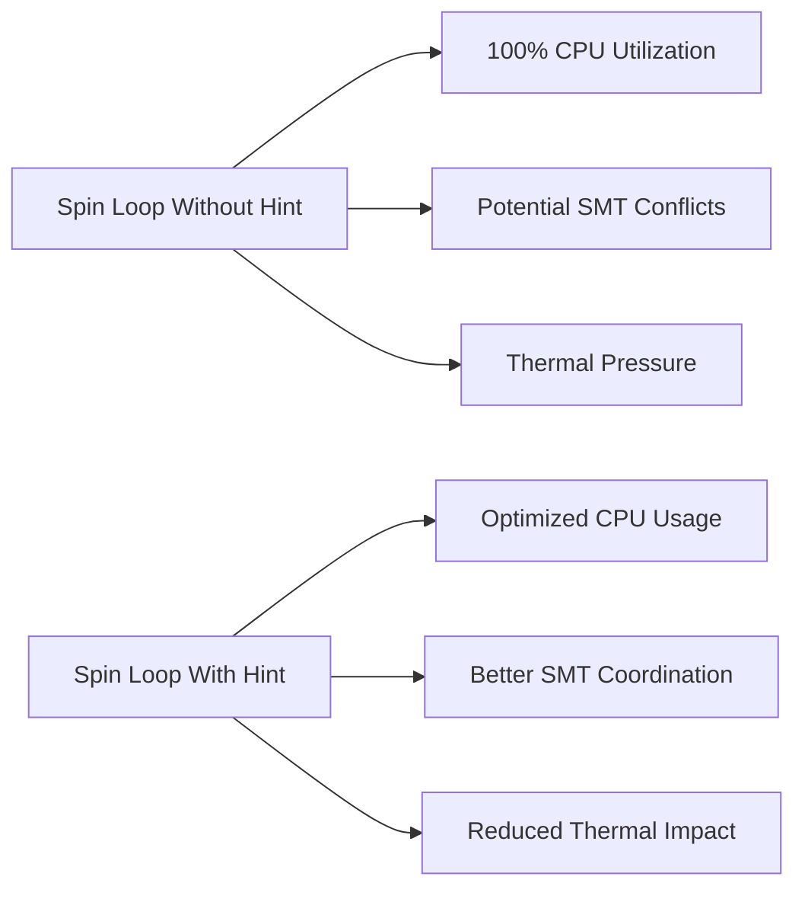

# Hints API Reference

Complete API reference documentation for Agrona's performance hints API, focusing on CPU spin-wait optimization and backward compatibility across Java versions.

## Table of Contents

- [Overview](#overview)
- [ThreadHints API](#threadhints-api)
- [Configuration Mechanisms](#configuration-mechanisms)
- [Version Compatibility](#version-compatibility)
- [Performance Implications](#performance-implications)
- [Integration Examples](#integration-examples)
- [Migration Guide](#migration-guide)

## Overview

The `org.agrona.hints` package provides portable performance hinting APIs across Java and JDK versions, enabling calling code to avoid maintaining version-specific sources for various JDK capabilities. The package is designed to capture hinting behaviors that are implemented in or anticipated to be specified under the `java.lang.Thread` class in some Java SE versions, but missing in prior versions.

> Source: `/agrona/src/main/java/org/agrona/hints/package-info.java:18-24`

### Design Philosophy

All features supported by this package are hints by definition, meaning a no-op implementation is always considered valid. When executing on Java versions for which corresponding capabilities exist and are specified in the Java version spec, the hint implementations attempt to use the appropriate JDK calls.

> Source: `/agrona/src/main/java/org/agrona/hints/package-info.java:27-34`

### Key Benefits

- **Portability**: Remain portable across Java versions without needing separate implementations
- **Performance**: Zero overhead in JIT'ted code - becomes either a no-op or an efficient inlined intrinsic
- **Flexibility**: Runtime configuration through system properties
- **Future-Proof**: JDKs can "intrinsify" APIs for enhanced performance on older Java versions

## ThreadHints API

**⚠️ DEPRECATION NOTICE**: The ThreadHints class is deprecated as of the current version. Use `Thread.onSpinWait()` directly instead.

> Source: `/agrona/src/main/java/org/agrona/hints/ThreadHints.java:22`

### Class Declaration

```java
@Deprecated
public final class ThreadHints
```

> Source: `/agrona/src/main/java/org/agrona/hints/ThreadHints.java:30-31`

### Methods

#### onSpinWait()

Indicates that the caller is momentarily unable to progress, until the occurrence of one or more actions on the part of other activities.

```java
public static void onSpinWait()
```

**Description**: By invoking this method within each iteration of a spin-wait loop construct, the calling thread indicates to the runtime that it is busy-waiting. The runtime may take action to improve the performance of invoking spin-wait loop constructions.

> Source: `/agrona/src/main/java/org/agrona/hints/ThreadHints.java:45-52`

**Implementation**:
```java
public static void onSpinWait()
{
    if (ON_SPIN_WAIT_ENABLED)
    {
        Thread.onSpinWait();
    }
}
```

> Source: `/agrona/src/main/java/org/agrona/hints/ThreadHints.java:52-58`

**Usage Pattern**:
```java
// Typical busy-spin loop with hint
while (!condition) {
    ThreadHints.onSpinWait(); // Deprecated - use Thread.onSpinWait() directly
}
```

**Modern Alternative**:
```java
// Recommended approach for Java 9+
while (!condition) {
    Thread.onSpinWait();
}
```

## Configuration Mechanisms

### System Property Control

The hints API provides runtime configuration through system properties to disable performance hints when needed.

#### DISABLE_ON_SPIN_WAIT_PROP_NAME

```java
public static final String DISABLE_ON_SPIN_WAIT_PROP_NAME = "org.agrona.hints.disable.onSpinWait";
```

> Source: `/agrona/src/main/java/org/agrona/hints/ThreadHints.java:36`

**Purpose**: Set this system property to "true" to disable `onSpinWait()` calls at runtime.

**Configuration Example**:
```bash
# Disable spin-wait hints
java -Dorg.agrona.hints.disable.onSpinWait=true MyApplication
```

### Runtime Behavior

The system property is evaluated during class initialization and cached for optimal performance:

```java
private static final boolean ON_SPIN_WAIT_ENABLED =
    !"true".equals(SystemUtil.getProperty(DISABLE_ON_SPIN_WAIT_PROP_NAME));
```

> Source: `/agrona/src/main/java/org/agrona/hints/ThreadHints.java:38-39`

The implementation uses `SystemUtil.getProperty()` which provides enhanced property handling compared to standard `System.getProperty()`, including support for special null values.

> Source: `/agrona/src/main/java/org/agrona/SystemUtil.java:311-316`

## Version Compatibility

### Java Version Support

The hints API was designed to bridge the gap between Java versions before and after the introduction of `Thread.onSpinWait()` in Java 9 (JEP 285).

#### Historical Context

Per JEP 285, Java SE 9 introduced `Thread.onSpinWait()` with behavior identical to `ThreadHints.onSpinWait()`. However, earlier Java SE versions did not include this behavior, forcing code that wanted to make use of this hinting capability to be written and maintained separately.

> Source: `/agrona/src/main/java/org/agrona/hints/package-info.java:43-49`

#### Backward Compatibility Strategy

The ThreadHints implementation resolves version compatibility by:

1. **Conditional Execution**: Calling `Thread.onSpinWait()` if it exists
2. **Graceful Degradation**: Doing nothing if the method does not exist
3. **Efficient Implementation**: Specifically designed for efficient inlining by common JVMs

> Source: `/agrona/src/main/java/org/agrona/hints/package-info.java:52-60`

### JVM Intrinsification Support

JDKs can introduce support for newer hinting capabilities in their implementations of older Java SE versions by "intrinsifying" associated `org.agrona.hints` classes and methods. This enables performance improvements even on prior Java SE versions.

> Source: `/agrona/src/main/java/org/agrona/hints/package-info.java:66-73`

## Performance Implications

### CPU Spin-Wait Optimization

The `onSpinWait()` hint provides the JVM with information about busy-waiting scenarios, enabling several optimizations:

#### Hardware-Level Optimizations

- **SMT Optimization**: On simultaneous multithreading processors, hints can improve resource sharing between logical cores
- **Power Management**: Allows processors to reduce power consumption during spin waits
- **Pipeline Optimization**: Enables better instruction scheduling in busy-spin loops

#### Runtime Optimizations

- **Thread Scheduling**: JVM can make better scheduling decisions when threads are busy-waiting
- **Memory Ordering**: Provides opportunities for relaxed memory ordering in spin loops
- **Thermal Management**: Helps prevent thermal throttling in high-frequency spin scenarios

### Performance Characteristics



### Zero-Overhead Design

The implementation is specifically designed for zero overhead in JIT'ted code:

- **Inlined Execution**: Common JVMs inline the hint call efficiently
- **No Allocation**: No object allocation or memory pressure
- **Branch Prediction**: Single conditional check optimized by branch prediction

> Source: `/agrona/src/main/java/org/agrona/hints/package-info.java:58-61`

## Integration Examples

### Direct Integration with Concurrent Utilities

#### BusySpinIdleStrategy

Agrona's `BusySpinIdleStrategy` demonstrates direct integration with spin-wait hints:

```java
public final class BusySpinIdleStrategy implements IdleStrategy
{
    public void idle(final int workCount)
    {
        if (workCount > 0)
        {
            return;
        }

        Thread.onSpinWait(); // Direct usage of Java 9+ API
    }

    public void idle()
    {
        Thread.onSpinWait();
    }
}
```

> Source: `/agrona/src/main/java/org/agrona/concurrent/BusySpinIdleStrategy.java:47-63`

**Key Features**:
- **Lowest Latency**: Targeted at achieving the lowest possible latency
- **Thread Monopolization**: Monopolizes a thread for maximum performance
- **Bubble Creation**: Creates execution pipeline bubbles in tight busy-spin loops
- **Zero State**: No instance state allows singleton usage for allocation efficiency

> Source: `/agrona/src/main/java/org/agrona/concurrent/BusySpinIdleStrategy.java:18-33`

### Custom Spin-Wait Implementations

#### High-Frequency Trading Pattern

```java
public class HFTProcessor {
    private volatile boolean dataReady = false;
    private volatile MarketData latestData;
    
    public MarketData waitForData() {
        while (!dataReady) {
            Thread.onSpinWait(); // Optimize for minimal latency
        }
        dataReady = false;
        return latestData;
    }
}
```

#### Lock-Free Queue Integration

```java
public class OptimizedSPSCQueue<T> {
    private volatile long head;
    private volatile long tail;
    private final T[] buffer;
    
    public T poll() {
        long currentHead = head;
        long currentTail = tail;
        
        while (currentHead == currentTail) {
            Thread.onSpinWait(); // Hint during busy wait
            currentTail = tail; // Re-read after hint
        }
        
        // Process queue item...
        return buffer[(int)(currentHead & mask)];
    }
}
```

#### Agent Framework Integration

```java
public class CustomAgent implements Agent {
    private volatile boolean running = true;
    
    @Override
    public int doWork() throws Exception {
        int workCount = 0;
        
        // Perform actual work
        workCount += processMessages();
        workCount += handleRequests();
        
        if (workCount == 0) {
            Thread.onSpinWait(); // No work available
        }
        
        return workCount;
    }
}
```

### Performance Monitoring Integration

```java
public class SpinWaitMonitor {
    private final AtomicLong spinCycles = new AtomicLong();
    private final AtomicLong productiveCycles = new AtomicLong();
    
    public void monitoredSpinWait() {
        long startTime = System.nanoTime();
        Thread.onSpinWait();
        long duration = System.nanoTime() - startTime;
        
        spinCycles.incrementAndGet();
        // Track spin-wait effectiveness
    }
}
```

## Migration Guide

### From ThreadHints to Thread.onSpinWait()

#### Step 1: Identify Usage

Search for all occurrences of `ThreadHints.onSpinWait()`:

```bash
grep -r "ThreadHints.onSpinWait" src/
```

#### Step 2: Replace Calls

**Before (Deprecated)**:
```java
import org.agrona.hints.ThreadHints;

public void busyWait() {
    while (!condition) {
        ThreadHints.onSpinWait();
    }
}
```

**After (Recommended)**:
```java
public void busyWait() {
    while (!condition) {
        Thread.onSpinWait();
    }
}
```

#### Step 3: Remove Dependencies

Remove any explicit imports of the hints package:

```java
// Remove this import
import org.agrona.hints.ThreadHints;
```

#### Step 4: Update Build Configuration

If your application explicitly depends on the hints API, update your build configuration to reflect the deprecation.

### Handling Java Version Compatibility

For applications that must support Java versions before Java 9:

#### Option 1: Version-Specific Code

```java
public static void portableSpinWait() {
    try {
        // Use reflection for Java < 9 compatibility
        Method onSpinWait = Thread.class.getMethod("onSpinWait");
        onSpinWait.invoke(null);
    } catch (Exception e) {
        // No-op for Java < 9
    }
}
```

#### Option 2: Conditional Compilation

```java
public static void conditionalSpinWait() {
    if (Runtime.version().feature() >= 9) {
        Thread.onSpinWait();
    }
    // No-op for earlier versions
}
```

#### Option 3: Continue Using ThreadHints (Deprecated)

For legacy applications that cannot be immediately updated:

```java
// Temporary approach - plan migration
@SuppressWarnings("deprecation")
public void legacySpinWait() {
    org.agrona.hints.ThreadHints.onSpinWait();
}
```

### Configuration Migration

The system property for disabling hints remains relevant for performance tuning:

```bash
# Continue using for Thread.onSpinWait() if needed
java -Dorg.agrona.hints.disable.onSpinWait=true MyApplication
```

Note: This property only affects the deprecated `ThreadHints` implementation. Direct `Thread.onSpinWait()` calls are not affected by this property.

---

## References

**Source Files Analyzed:**
- `/agrona/src/main/java/org/agrona/hints/ThreadHints.java` - Main hints implementation
- `/agrona/src/main/java/org/agrona/hints/package-info.java` - Package documentation and design philosophy  
- `/agrona/src/main/java/org/agrona/SystemUtil.java` - System property utilities
- `/agrona/src/main/java/org/agrona/concurrent/BusySpinIdleStrategy.java` - Integration example

**Related Documentation:**
- [JEP 285: Spin-Wait Hints](https://openjdk.java.net/jeps/285) - Java Enhancement Proposal introducing Thread.onSpinWait()
- [Thread.onSpinWait() Javadoc](https://docs.oracle.com/en/java/javase/17/docs/api/java.base/java/lang/Thread.html#onSpinWait()) - Official API documentation