# Integration Patterns Architecture

## Table of Contents

1. [System Integration Overview](#1-system-integration-overview)
2. [External System Integration Points](#2-external-system-integration-points)
3. [Zero-Copy Message Framing Patterns](#3-zero-copy-message-framing-patterns)
4. [Binary Protocol Patterns](#4-binary-protocol-patterns)
5. [Memory-Mapped Inter-Process Communication](#5-memory-mapped-inter-process-communication)
6. [Cross-Process Communication Patterns](#6-cross-process-communication-patterns)
7. [JVM Monitoring Integration Patterns](#7-jvm-monitoring-integration-patterns)
8. [Distribution and Dependency Management](#8-distribution-and-dependency-management)
9. [Performance Integration Patterns](#9-performance-integration-patterns)
10. [References](#10-references)

---

## 1. System Integration Overview

### 1.1 Integration Philosophy

Agrona's integration architecture is built on the principle of providing **minimal-overhead, zero-copy integration patterns** that enable external systems to achieve microsecond-latency performance characteristics. The library serves as a foundational layer for high-performance messaging systems, binary encoding frameworks, and inter-process communication mechanisms.

> Source: Technical Specification Section 5.1.4 External Integration Points

### 1.2 Core Integration Patterns

The system implements several critical integration patterns optimized for minimal latency and maximum throughput:

- **Buffer-Based Integration**: Unified memory abstractions enabling zero-copy operations across system boundaries
- **Lock-Free Coordination**: Wait-free algorithms for concurrent access without blocking semantics
- **Memory-Mapped IPC**: Shared memory regions for cross-process communication with minimal kernel overhead
- **Binary Protocol Support**: Direct buffer serialization for efficient wire protocols
- **Monitoring Infrastructure**: Off-heap counters and metrics for live system inspection

### 1.3 Integration Architecture Diagram

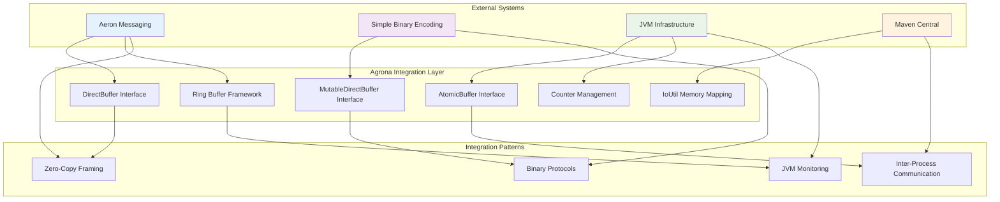

---

## 2. External System Integration Points

### 2.1 Aeron Messaging System Integration

#### 2.1.1 Integration Architecture

Agrona provides the foundational primitives for Aeron's ultra-low latency messaging transport layer. The integration enables zero-copy message passing with predictable sub-microsecond latency characteristics.

> Source: Technical Specification Section 6.3.3.1 Aeron Messaging Integration

**Key Integration Components:**

| Component | Purpose | Agrona Interface | Aeron Usage |
|-----------|---------|------------------|-------------|
| Ring Buffer Commands | Driver command queuing | `OneToOneRingBuffer` | Command processing pipeline |
| Broadcast Buffer Status | Status distribution | `BroadcastTransmitter/Receiver` | Multi-client status updates |
| Publication Data | Message payload transport | `AtomicBuffer` | Zero-copy message writing |
| Subscription Data | Message payload consumption | `DirectBuffer` | Zero-copy message reading |
| Error Reporting | Transport error capture | `DistinctErrorLog` | Error deduplication and logging |
| Heartbeat Monitoring | Liveness tracking | `CountersManager` | Driver and client health |

#### 2.1.2 Aeron Media Driver Integration Pattern

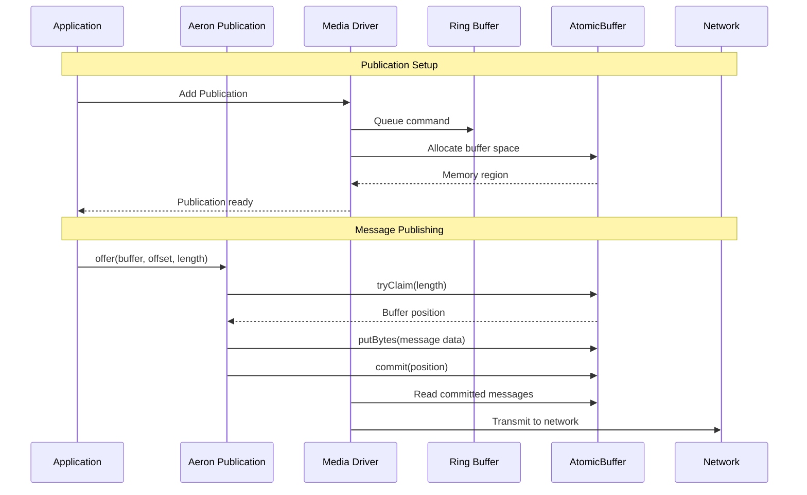

#### 2.1.3 Buffer Integration Examples

**Aeron Publication with DirectBuffer:**

```java
// Zero-copy message publishing using Agrona DirectBuffer
public class AeronPublisherExample {
    private final Publication publication;
    private final UnsafeBuffer messageBuffer;
    
    public void publishMessage(DirectBuffer sourceBuffer, int offset, int length) {
        // Direct buffer offer - zero-copy operation
        long result = publication.offer(sourceBuffer, offset, length);
        
        if (result > 0) {
            // Message published successfully
            logger.info("Published message, position: {}", result);
        } else if (result == Publication.BACK_PRESSURED) {
            // Apply back-pressure handling
            applyBackPressure();
        }
    }
    
    private void applyBackPressure() {
        // Use Agrona idle strategy for efficient waiting
        idleStrategy.idle(0);
    }
}
```

> Source: `agrona/src/main/java/org/agrona/DirectBuffer.java:345`

### 2.2 Simple Binary Encoding (SBE) Integration

#### 2.2.1 Direct Buffer Codec Integration

SBE leverages Agrona's buffer abstractions for efficient binary serialization without intermediate copying or object allocation:

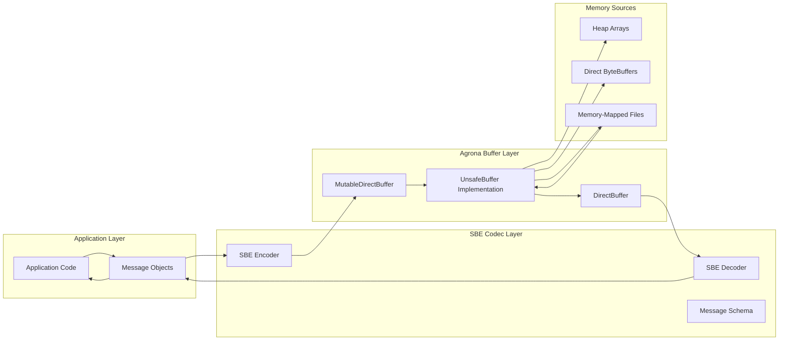

#### 2.2.2 SBE Encoding Integration Pattern

```java
// Example: SBE message encoding with zero-copy operations
public class SBEIntegrationExample {
    private final MessageHeaderEncoder headerEncoder = new MessageHeaderEncoder();
    private final TradeEncoder tradeEncoder = new TradeEncoder();
    private final UnsafeBuffer encodeBuffer = new UnsafeBuffer(new byte[1024]);
    
    public int encodeTradeMessage(long orderId, double price, long quantity) {
        // Wrap buffer for encoding - zero-copy operation
        tradeEncoder.wrapForEncode(encodeBuffer, MessageHeaderEncoder.ENCODED_LENGTH);
        
        // Direct memory writes through MutableDirectBuffer interface
        tradeEncoder.orderId(orderId)
                   .price(price)
                   .quantity(quantity);
        
        // Header encoding with length calculation
        headerEncoder.wrap(encodeBuffer, 0)
                    .blockLength(tradeEncoder.sbeBlockLength())
                    .templateId(TradeEncoder.TEMPLATE_ID)
                    .schemaId(TradeEncoder.SCHEMA_ID)
                    .version(TradeEncoder.SCHEMA_VERSION);
        
        return MessageHeaderEncoder.ENCODED_LENGTH + tradeEncoder.encodedLength();
    }
}
```

> Source: `agrona/src/main/java/org/agrona/MutableDirectBuffer.java:265`

#### 2.2.3 Binary Serialization Patterns

**Length-Prefixed Message Pattern:**

```mermaid
graph LR
    subgraph "Message Structure"
        LEN[Length Field<br/>4 bytes]
        TYPE[Type Field<br/>4 bytes]
        PAYLOAD[Message Payload<br/>Variable length]
    end
    
    subgraph "Buffer Operations"
        PUT_LEN[putInt(0, length)]
        PUT_TYPE[putInt(4, typeId)]
        PUT_DATA[putBytes(8, data)]
    end
    
    LEN --> PUT_LEN
    TYPE --> PUT_TYPE
    PAYLOAD --> PUT_DATA
```

### 2.3 JVM Infrastructure Integration

#### 2.3.1 Unsafe API Integration

Agrona integrates deeply with the JVM's internal Unsafe API to achieve zero-copy performance characteristics:

```java
// Example: Unsafe API integration for direct memory access
public class UnsafeIntegration {
    private static final Unsafe UNSAFE = UnsafeAccess.UNSAFE;
    private static final long ARRAY_BASE_OFFSET = UNSAFE.arrayBaseOffset(byte[].class);
    
    public void directMemoryAccess(byte[] array, int index, int value) {
        // Direct memory write bypassing JVM bounds checks
        UNSAFE.putInt(array, ARRAY_BASE_OFFSET + index, value);
    }
    
    public int directMemoryRead(byte[] array, int index) {
        // Direct memory read with explicit memory ordering
        return UNSAFE.getIntVolatile(array, ARRAY_BASE_OFFSET + index);
    }
}
```

> Source: `agrona/src/main/java/org/agrona/concurrent/AtomicBuffer.java:71`

#### 2.3.2 VarHandle Fallback Integration

For restricted environments where Unsafe access is limited:

```java
// VarHandle-based implementation for modern JVM compatibility
public class VarHandleIntegration {
    private static final VarHandle INT_HANDLE = 
        MethodHandles.byteArrayViewVarHandle(int[].class, ByteOrder.nativeOrder());
    
    public void safeAtomicWrite(byte[] array, int index, int value) {
        // VarHandle atomic write with release semantics
        INT_HANDLE.setRelease(array, index, value);
    }
    
    public int safeAtomicRead(byte[] array, int index) {
        // VarHandle atomic read with acquire semantics
        return (int) INT_HANDLE.getAcquire(array, index);
    }
}
```

---

## 3. Zero-Copy Message Framing Patterns

### 3.1 Ring Buffer Message Framing

#### 3.1.1 Message Header Protocol

All messages in Agrona ring buffers follow a consistent framing protocol that enables atomic publication and efficient parsing:

| Field | Offset | Size | Purpose | Encoding |
|-------|--------|------|---------|----------|
| Length | 0 | 4 bytes | Message length (negative = reserved) | Little-endian int |
| Type | 4 | 4 bytes | Message type identifier | Little-endian int |
| Payload | 8 | Variable | Message data content | Raw bytes |

> Source: Technical Specification Section 6.3.2.4 Message Framing Standard

#### 3.1.2 Atomic Publication Pattern

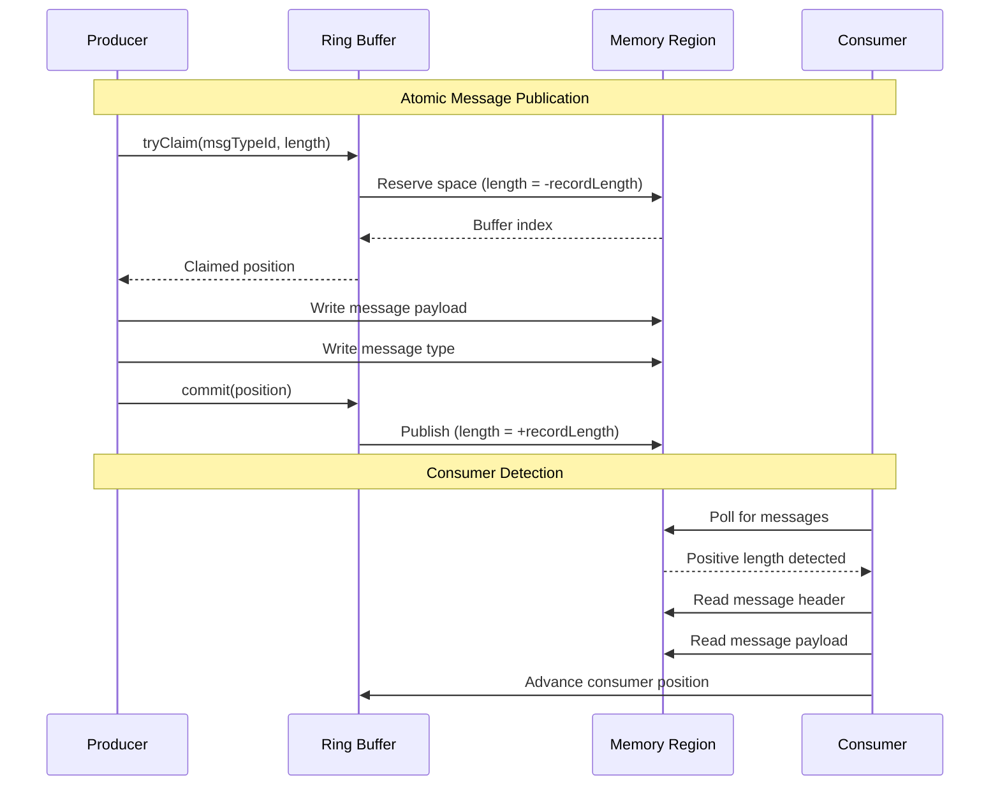

#### 3.1.3 Zero-Copy Implementation Example

```java
// Zero-copy message framing implementation
public class ZeroCopyFraming {
    private final OneToOneRingBuffer ringBuffer;
    private final UnsafeBuffer messageBuffer = new UnsafeBuffer(new byte[1024]);
    
    public boolean publishMessage(int messageType, DirectBuffer sourceBuffer, 
                                 int offset, int length) {
        // Zero-copy write operation - no intermediate copying
        return ringBuffer.write(messageType, sourceBuffer, offset, length);
    }
    
    public int consumeMessages(MessageHandler handler, int messageLimit) {
        // Zero-copy read operation - direct buffer access
        return ringBuffer.read(handler, messageLimit);
    }
    
    // Message handler receives direct buffer reference
    private final MessageHandler messageHandler = 
        (msgTypeId, buffer, index, length) -> {
            // Process message without copying - direct buffer access
            processMessage(msgTypeId, buffer, index, length);
        };
}
```

> Source: `agrona/src/main/java/org/agrona/concurrent/ringbuffer/OneToOneRingBuffer.java:89`

### 3.2 Broadcast Buffer Framing

#### 3.2.1 One-to-Many Message Distribution

Broadcast buffers enable efficient one-to-many message distribution with strict ordering guarantees:

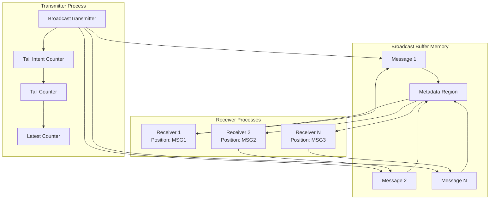

#### 3.2.2 Broadcast Message Protocol

```java
// Broadcast buffer zero-copy transmission
public class BroadcastFraming {
    private final BroadcastTransmitter transmitter;
    private final AtomicBuffer broadcastBuffer;
    
    public void transmitMessage(int msgTypeId, DirectBuffer srcBuffer, 
                               int srcIndex, int length) {
        // Zero-copy broadcast to multiple receivers
        transmitter.transmit(msgTypeId, srcBuffer, srcIndex, length);
    }
    
    // Multiple receivers can consume the same messages
    private final BroadcastReceiver receiver = new BroadcastReceiver(broadcastBuffer);
    
    public int receiveMessages(MessageHandler handler) {
        // Each receiver maintains independent position tracking
        return receiver.receive(handler);
    }
}
```

---

## 4. Binary Protocol Patterns

### 4.1 Message Framing Standards

#### 4.1.1 Length-Prefixed Message Protocol

Agrona implements a robust length-prefixed message protocol that ensures message boundary detection and atomic visibility:

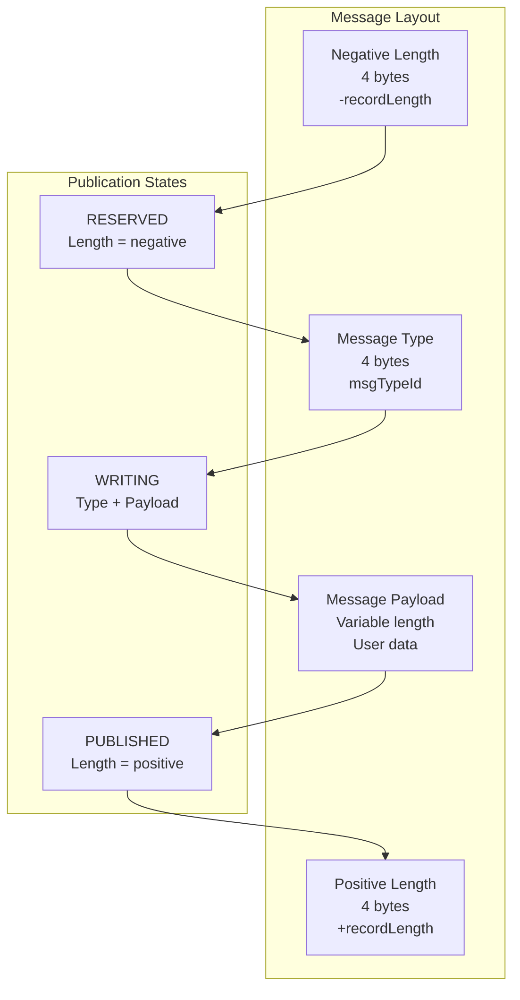

#### 4.1.2 Endianness Handling Patterns

All binary protocols support configurable byte ordering for cross-platform compatibility:

```java
// Endianness-aware binary protocol implementation
public class EndiannessBinaryProtocol {
    private final MutableDirectBuffer buffer;
    private final ByteOrder byteOrder;
    
    public void writeHeader(int messageType, int messageLength, ByteOrder order) {
        // Configurable byte order for cross-platform compatibility
        buffer.putInt(0, messageLength, order);
        buffer.putInt(4, messageType, order);
    }
    
    public MessageHeader readHeader(int offset, ByteOrder order) {
        // Platform-independent message parsing
        int length = buffer.getInt(offset, order);
        int type = buffer.getInt(offset + 4, order);
        return new MessageHeader(length, type);
    }
}
```

> Source: `agrona/src/main/java/org/agrona/DirectBuffer.java:179`

### 4.2 Binary Serialization Patterns

#### 4.2.1 Direct Buffer Serialization

```java
// High-performance binary serialization without intermediate objects
public class BinarySerializationPattern {
    private final MutableDirectBuffer writeBuffer;
    private final DirectBuffer readBuffer;
    
    public int serializeTradeData(long orderId, double price, long quantity, 
                                 String symbol, int offset) {
        int position = offset;
        
        // Direct primitive writes - no boxing overhead
        writeBuffer.putLong(position, orderId);
        position += Long.BYTES;
        
        writeBuffer.putDouble(position, price);
        position += Double.BYTES;
        
        writeBuffer.putLong(position, quantity);
        position += Long.BYTES;
        
        // Length-prefixed string encoding
        int symbolLength = writeBuffer.putStringUtf8(position, symbol);
        position += symbolLength;
        
        return position - offset; // Total bytes written
    }
    
    public TradeData deserializeTradeData(int offset) {
        int position = offset;
        
        // Direct primitive reads - zero allocation
        long orderId = readBuffer.getLong(position);
        position += Long.BYTES;
        
        double price = readBuffer.getDouble(position);
        position += Double.BYTES;
        
        long quantity = readBuffer.getLong(position);
        position += Long.BYTES;
        
        // Length-prefixed string decoding
        String symbol = readBuffer.getStringUtf8(position);
        
        return new TradeData(orderId, price, quantity, symbol);
    }
}
```

> Source: `agrona/src/main/java/org/agrona/MutableDirectBuffer.java:354`

### 4.3 Message Type Dispatch Patterns

#### 4.3.1 Type-Safe Message Dispatch

```java
// Efficient message type dispatch pattern
public class MessageDispatcher {
    private final Int2ObjectHashMap<MessageHandler> handlerMap;
    
    public MessageDispatcher() {
        handlerMap = new Int2ObjectHashMap<>();
        registerHandlers();
    }
    
    private void registerHandlers() {
        handlerMap.put(TradeMessage.TYPE_ID, this::handleTrade);
        handlerMap.put(QuoteMessage.TYPE_ID, this::handleQuote);
        handlerMap.put(OrderMessage.TYPE_ID, this::handleOrder);
    }
    
    public void dispatchMessage(int msgTypeId, DirectBuffer buffer, 
                               int index, int length) {
        MessageHandler handler = handlerMap.get(msgTypeId);
        if (handler != null) {
            handler.onMessage(msgTypeId, buffer, index, length);
        } else {
            handleUnknownMessage(msgTypeId, buffer, index, length);
        }
    }
}
```

---

## 5. Memory-Mapped Inter-Process Communication

### 5.1 Memory-Mapped File Integration

#### 5.1.1 Cross-Process Buffer Sharing

Agrona provides comprehensive memory-mapping utilities through the `IoUtil` class, enabling efficient inter-process communication:

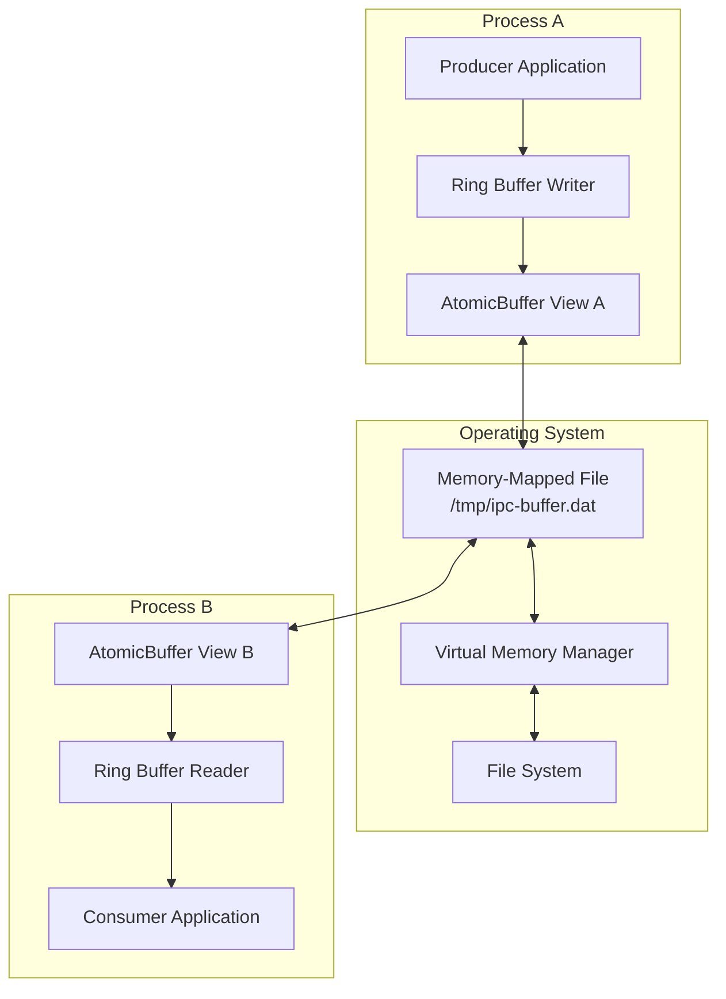

#### 5.1.2 Memory-Mapped File Creation Pattern

```java
// Cross-process memory-mapped buffer creation
public class MemoryMappedIPC {
    private static final String IPC_FILE_PATH = "/tmp/agrona-ipc.dat";
    private static final long BUFFER_SIZE = 64 * 1024 * 1024; // 64MB
    
    public static AtomicBuffer createSharedBuffer(boolean isProducer) {
        File ipcFile = new File(IPC_FILE_PATH);
        MappedByteBuffer mappedBuffer;
        
        if (isProducer) {
            // Producer creates and initializes the memory-mapped file
            mappedBuffer = IoUtil.mapNewFile(ipcFile, BUFFER_SIZE);
        } else {
            // Consumer maps existing file
            mappedBuffer = IoUtil.mapExistingFile(ipcFile, "IPC Buffer");
        }
        
        // Wrap in AtomicBuffer for thread-safe operations
        AtomicBuffer atomicBuffer = new UnsafeBuffer(mappedBuffer);
        atomicBuffer.verifyAlignment();
        
        return atomicBuffer;
    }
    
    public static void cleanupSharedBuffer(AtomicBuffer buffer) {
        // Proper cleanup to release memory mapping
        MappedByteBuffer mappedBuffer = buffer.byteBuffer();
        if (mappedBuffer != null) {
            IoUtil.unmap(mappedBuffer);
        }
    }
}
```

> Source: `agrona/src/main/java/org/agrona/IoUtil.java:400`

### 5.2 Cross-Process Ring Buffer Communication

#### 5.2.1 Producer-Consumer IPC Pattern

```java
// Producer process implementation
public class IPCProducer {
    private final AtomicBuffer ipcBuffer;
    private final OneToOneRingBuffer ringBuffer;
    
    public IPCProducer() {
        this.ipcBuffer = MemoryMappedIPC.createSharedBuffer(true);
        this.ringBuffer = new OneToOneRingBuffer(ipcBuffer);
    }
    
    public boolean sendMessage(int messageType, byte[] messageData) {
        // Zero-copy write to shared memory
        UnsafeBuffer srcBuffer = new UnsafeBuffer(messageData);
        return ringBuffer.write(messageType, srcBuffer, 0, messageData.length);
    }
}

// Consumer process implementation
public class IPCConsumer {
    private final AtomicBuffer ipcBuffer;
    private final OneToOneRingBuffer ringBuffer;
    private final MessageHandler messageHandler;
    
    public IPCConsumer() {
        this.ipcBuffer = MemoryMappedIPC.createSharedBuffer(false);
        this.ringBuffer = new OneToOneRingBuffer(ipcBuffer);
        this.messageHandler = this::processMessage;
    }
    
    public int pollMessages() {
        // Zero-copy read from shared memory
        return ringBuffer.read(messageHandler);
    }
    
    private void processMessage(int msgTypeId, DirectBuffer buffer, 
                              int index, int length) {
        // Direct processing without copying
        byte[] messageData = new byte[length];
        buffer.getBytes(index, messageData);
        handleMessage(msgTypeId, messageData);
    }
}
```

#### 5.2.2 IPC Synchronization Patterns

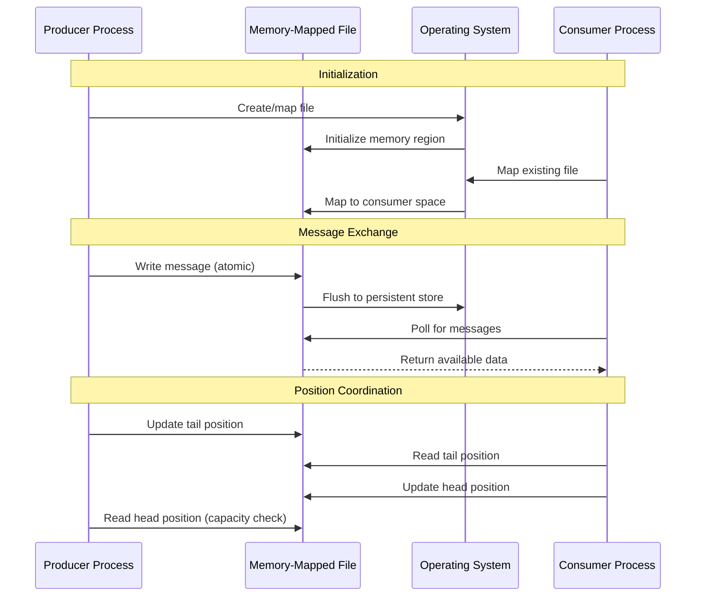

### 5.3 Persistent IPC Patterns

#### 5.3.1 Crash-Resilient Communication

```java
// Crash-resilient IPC implementation
public class PersistentIPC {
    private final File ipcFile;
    private final AtomicBuffer persistentBuffer;
    private final CountersManager countersManager;
    
    public PersistentIPC(String filePath) {
        this.ipcFile = new File(filePath);
        this.persistentBuffer = createOrRecoverBuffer();
        this.countersManager = new CountersManager(
            persistentBuffer, persistentBuffer.capacity() - 4096);
    }
    
    private AtomicBuffer createOrRecoverBuffer() {
        MappedByteBuffer mapped;
        
        if (ipcFile.exists()) {
            // Recover from existing persistent state
            mapped = IoUtil.mapExistingFile(ipcFile, "Persistent IPC");
            System.out.println("Recovered IPC buffer from: " + ipcFile);
        } else {
            // Create new persistent buffer
            mapped = IoUtil.mapNewFile(ipcFile, BUFFER_SIZE);
            System.out.println("Created new IPC buffer: " + ipcFile);
        }
        
        return new UnsafeBuffer(mapped);
    }
    
    public void registerCounter(int counterId, String label) {
        // Persistent counter registration survives process restart
        countersManager.newCounter(label, counterId);
    }
    
    public void incrementCounter(int counterId) {
        // Atomic increment visible across processes
        countersManager.getCounterValue(counterId);
    }
}
```

---

## 6. Cross-Process Communication Patterns

### 6.1 Multi-Process Coordination

#### 6.1.1 Process Lifecycle Management

```java
// Multi-process coordination pattern
public class ProcessCoordination {
    private final CountersManager countersManager;
    private final int processIdCounter;
    private final int heartbeatCounter;
    private final ScheduledExecutorService scheduler;
    
    public ProcessCoordination(AtomicBuffer sharedBuffer) {
        this.countersManager = new CountersManager(sharedBuffer, 1024);
        this.processIdCounter = countersManager.newCounter("Process ID");
        this.heartbeatCounter = countersManager.newCounter("Heartbeat");
        this.scheduler = Executors.newSingleThreadScheduledExecutor();
        
        startHeartbeat();
    }
    
    private void startHeartbeat() {
        // Periodic heartbeat for liveness detection
        scheduler.scheduleAtFixedRate(() -> {
            long currentTime = System.currentTimeMillis();
            countersManager.setCounterValue(heartbeatCounter, currentTime);
        }, 0, 1000, TimeUnit.MILLISECONDS);
    }
    
    public boolean isProcessAlive(int processId, long timeoutMs) {
        long lastHeartbeat = countersManager.getCounterValue(heartbeatCounter);
        long currentTime = System.currentTimeMillis();
        return (currentTime - lastHeartbeat) < timeoutMs;
    }
}
```

### 6.2 Shared Memory Data Structures

#### 6.2.1 Cross-Process Hash Map

```java
// Lock-free cross-process hash map implementation
public class SharedHashMap {
    private final AtomicBuffer sharedBuffer;
    private final int capacity;
    private final int mask;
    
    private static final int KEY_OFFSET = 0;
    private static final int VALUE_OFFSET = 8;
    private static final int ENTRY_SIZE = 16; // 8 bytes key + 8 bytes value
    
    public SharedHashMap(AtomicBuffer buffer, int capacity) {
        this.sharedBuffer = buffer;
        this.capacity = Integer.highestOneBit(capacity); // Ensure power of 2
        this.mask = this.capacity - 1;
    }
    
    public boolean put(long key, long value) {
        int index = hash(key) & mask;
        int attempts = 0;
        
        while (attempts < capacity) {
            int entryOffset = index * ENTRY_SIZE;
            
            // Atomic compare-and-swap for lock-free insertion
            if (sharedBuffer.compareAndSetLong(entryOffset + KEY_OFFSET, 0, key)) {
                sharedBuffer.putLongVolatile(entryOffset + VALUE_OFFSET, value);
                return true;
            }
            
            // Linear probing for collision resolution
            index = (index + 1) & mask;
            attempts++;
        }
        
        return false; // Hash map full
    }
    
    public long get(long key) {
        int index = hash(key) & mask;
        int attempts = 0;
        
        while (attempts < capacity) {
            int entryOffset = index * ENTRY_SIZE;
            long storedKey = sharedBuffer.getLongVolatile(entryOffset + KEY_OFFSET);
            
            if (storedKey == key) {
                return sharedBuffer.getLongVolatile(entryOffset + VALUE_OFFSET);
            } else if (storedKey == 0) {
                return -1; // Key not found
            }
            
            index = (index + 1) & mask;
            attempts++;
        }
        
        return -1; // Key not found after full scan
    }
    
    private int hash(long key) {
        // Simple hash function for demonstration
        return (int) (key ^ (key >>> 32));
    }
}
```

### 6.3 Process State Synchronization

#### 6.3.1 Distributed State Machine

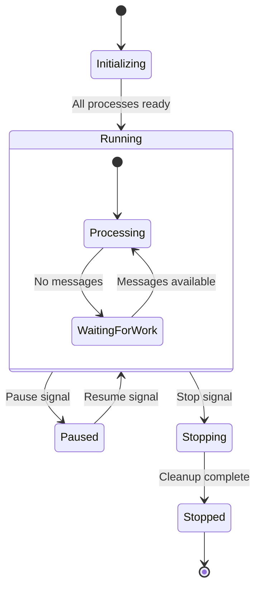

```java
// Distributed state machine coordination
public class DistributedStateMachine {
    private final AtomicBuffer stateBuffer;
    private final int stateCounterId;
    private final CountersManager countersManager;
    
    public enum ProcessState {
        INITIALIZING(0),
        RUNNING(1),
        PAUSED(2),
        STOPPING(3),
        STOPPED(4);
        
        private final int value;
        ProcessState(int value) { this.value = value; }
        public int getValue() { return value; }
    }
    
    public DistributedStateMachine(AtomicBuffer buffer) {
        this.stateBuffer = buffer;
        this.countersManager = new CountersManager(buffer, 1024);
        this.stateCounterId = countersManager.newCounter("Process State");
    }
    
    public void transitionTo(ProcessState newState) {
        ProcessState currentState = getCurrentState();
        
        if (isValidTransition(currentState, newState)) {
            // Atomic state transition visible to all processes
            countersManager.setCounterValue(stateCounterId, newState.getValue());
            System.out.println("State transition: " + currentState + " -> " + newState);
        } else {
            throw new IllegalStateException(
                "Invalid transition: " + currentState + " -> " + newState);
        }
    }
    
    public ProcessState getCurrentState() {
        long stateValue = countersManager.getCounterValue(stateCounterId);
        return ProcessState.values()[(int) stateValue];
    }
    
    private boolean isValidTransition(ProcessState from, ProcessState to) {
        // Define valid state transitions
        switch (from) {
            case INITIALIZING:
                return to == ProcessState.RUNNING;
            case RUNNING:
                return to == ProcessState.PAUSED || to == ProcessState.STOPPING;
            case PAUSED:
                return to == ProcessState.RUNNING || to == ProcessState.STOPPING;
            case STOPPING:
                return to == ProcessState.STOPPED;
            case STOPPED:
                return false; // Terminal state
            default:
                return false;
        }
    }
}
```

---

## 7. JVM Monitoring Integration Patterns

### 7.1 Off-Heap Metrics Collection

#### 7.1.1 Counter Management Integration

Agrona provides sophisticated counter management for JVM monitoring infrastructure, enabling live system inspection without performance impact:

```java
// JVM monitoring integration through off-heap counters
public class JVMMonitoringIntegration {
    private final CountersManager countersManager;
    private final StatusIndicator systemHealthIndicator;
    
    // Standard JVM metrics counters
    private final int gcCollectionCounter;
    private final int memoryUsageCounter;
    private final int threadCountCounter;
    private final int cpuUsageCounter;
    
    public JVMMonitoringIntegration(AtomicBuffer metricsBuffer) {
        this.countersManager = new CountersManager(metricsBuffer, 4096);
        
        // Register standard JVM metrics
        this.gcCollectionCounter = countersManager.newCounter("GC Collections");
        this.memoryUsageCounter = countersManager.newCounter("Memory Usage MB");
        this.threadCountCounter = countersManager.newCounter("Thread Count");
        this.cpuUsageCounter = countersManager.newCounter("CPU Usage %");
        
        // System health indicator
        this.systemHealthIndicator = new StatusIndicator(
            countersManager.valuesBuffer(), 
            countersManager.newCounter("System Health")
        );
        
        startMetricsCollection();
    }
    
    private void startMetricsCollection() {
        ScheduledExecutorService scheduler = Executors.newSingleThreadScheduledExecutor();
        
        scheduler.scheduleAtFixedRate(() -> {
            updateJVMMetrics();
        }, 0, 5, TimeUnit.SECONDS);
    }
    
    private void updateJVMMetrics() {
        MemoryMXBean memoryBean = ManagementFactory.getMemoryMXBean();
        ThreadMXBean threadBean = ManagementFactory.getThreadMXBean();
        
        // Update memory usage (atomic operation)
        long memoryUsed = memoryBean.getHeapMemoryUsage().getUsed() / (1024 * 1024);
        countersManager.setCounterValue(memoryUsageCounter, memoryUsed);
        
        // Update thread count
        long threadCount = threadBean.getThreadCount();
        countersManager.setCounterValue(threadCountCounter, threadCount);
        
        // Update system health based on thresholds
        boolean isHealthy = memoryUsed < 1024 && threadCount < 100;
        systemHealthIndicator.setOrdered(isHealthy ? 1 : 0);
    }
}
```

> Source: `agrona/src/main/java/org/agrona/concurrent/CountersManager.java:314`

### 7.2 External Monitoring Integration

#### 7.2.1 Prometheus Metrics Export Pattern

```java
// Prometheus metrics integration using Agrona counters
public class PrometheusIntegration {
    private final CountersReader countersReader;
    private final Map<String, Counter> prometheusCounters;
    
    public PrometheusIntegration(AtomicBuffer metricsBuffer) {
        this.countersReader = new CountersReader(metricsBuffer, 4096);
        this.prometheusCounters = new HashMap<>();
        
        // Register Prometheus collectors
        CollectorRegistry.defaultRegistry.register(new CountersCollector());
    }
    
    private class CountersCollector extends Collector {
        @Override
        public List<MetricFamilySamples> collect() {
            List<MetricFamilySamples> samples = new ArrayList<>();
            
            // Iterate through all Agrona counters
            countersReader.forEach((counterId, typeId, keyBuffer, label) -> {
                long value = countersReader.getCounterValue(counterId);
                String metricName = sanitizeMetricName(label);
                
                MetricFamilySamples.Sample sample = 
                    new MetricFamilySamples.Sample(metricName, 
                                                  Collections.emptyList(),
                                                  Collections.emptyList(), 
                                                  value);
                
                samples.add(new MetricFamilySamples(metricName, 
                                                   Type.COUNTER, 
                                                   "Agrona counter: " + label,
                                                   Collections.singletonList(sample)));
            });
            
            return samples;
        }
        
        private String sanitizeMetricName(String label) {
            return label.toLowerCase()
                       .replaceAll("[^a-z0-9_]", "_")
                       .replaceAll("_+", "_");
        }
    }
}
```

### 7.3 Health Monitoring Patterns

#### 7.3.1 System Health Dashboard

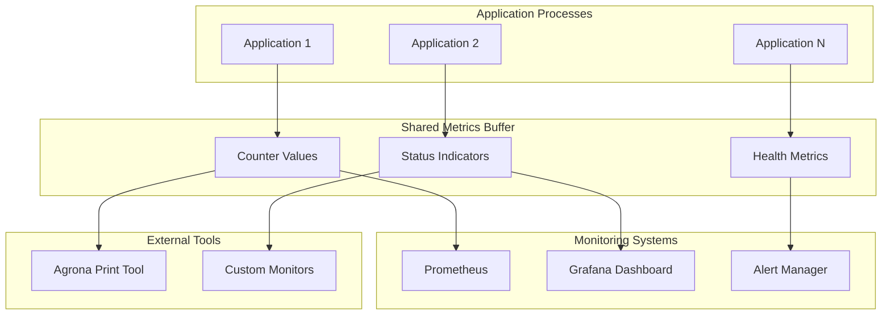

#### 7.3.2 Health Check Integration

```java
// Comprehensive health monitoring integration
public class HealthMonitoringSystem {
    private final CountersManager countersManager;
    private final Map<String, HealthCheck> healthChecks;
    private final int overallHealthCounter;
    
    public HealthMonitoringSystem(AtomicBuffer buffer) {
        this.countersManager = new CountersManager(buffer, 2048);
        this.healthChecks = new HashMap<>();
        this.overallHealthCounter = countersManager.newCounter("Overall Health");
        
        registerStandardHealthChecks();
        startHealthMonitoring();
    }
    
    private void registerStandardHealthChecks() {
        registerHealthCheck("memory", this::checkMemoryHealth);
        registerHealthCheck("disk_space", this::checkDiskSpaceHealth);
        registerHealthCheck("thread_count", this::checkThreadCountHealth);
        registerHealthCheck("gc_frequency", this::checkGCFrequencyHealth);
    }
    
    public void registerHealthCheck(String name, HealthCheck check) {
        healthChecks.put(name, check);
        countersManager.newCounter("Health: " + name);
    }
    
    private void startHealthMonitoring() {
        ScheduledExecutorService scheduler = Executors.newSingleThreadScheduledExecutor();
        
        scheduler.scheduleAtFixedRate(() -> {
            int healthyChecks = 0;
            int totalChecks = healthChecks.size();
            
            for (Map.Entry<String, HealthCheck> entry : healthChecks.entrySet()) {
                String name = entry.getKey();
                HealthCheck check = entry.getValue();
                
                try {
                    boolean isHealthy = check.isHealthy();
                    updateHealthMetric(name, isHealthy ? 1 : 0);
                    
                    if (isHealthy) {
                        healthyChecks++;
                    }
                } catch (Exception e) {
                    updateHealthMetric(name, -1); // Error state
                    logHealthCheckError(name, e);
                }
            }
            
            // Update overall health percentage
            int healthPercentage = (healthyChecks * 100) / totalChecks;
            countersManager.setCounterValue(overallHealthCounter, healthPercentage);
            
        }, 0, 10, TimeUnit.SECONDS);
    }
    
    private boolean checkMemoryHealth() {
        MemoryMXBean memoryBean = ManagementFactory.getMemoryMXBean();
        MemoryUsage heapUsage = memoryBean.getHeapMemoryUsage();
        
        double usagePercentage = (double) heapUsage.getUsed() / heapUsage.getMax();
        return usagePercentage < 0.8; // Healthy if < 80% memory usage
    }
    
    private boolean checkDiskSpaceHealth() {
        File tmpDir = new File(System.getProperty("java.io.tmpdir"));
        long freeSpace = tmpDir.getFreeSpace();
        long totalSpace = tmpDir.getTotalSpace();
        
        double freePercentage = (double) freeSpace / totalSpace;
        return freePercentage > 0.1; // Healthy if > 10% free space
    }
    
    private boolean checkThreadCountHealth() {
        ThreadMXBean threadBean = ManagementFactory.getThreadMXBean();
        int threadCount = threadBean.getThreadCount();
        return threadCount < 500; // Healthy if < 500 threads
    }
    
    private boolean checkGCFrequencyHealth() {
        // Check if GC is happening too frequently
        List<GarbageCollectorMXBean> gcBeans = ManagementFactory.getGarbageCollectorMXBeans();
        
        for (GarbageCollectorMXBean gcBean : gcBeans) {
            long collectionCount = gcBean.getCollectionCount();
            long collectionTime = gcBean.getCollectionTime();
            
            if (collectionCount > 0) {
                double avgCollectionTime = (double) collectionTime / collectionCount;
                if (avgCollectionTime > 100) { // > 100ms average GC time
                    return false;
                }
            }
        }
        
        return true;
    }
    
    private void updateHealthMetric(String name, long value) {
        String counterName = "Health: " + name;
        int counterId = findCounterIdByLabel(counterName);
        if (counterId >= 0) {
            countersManager.setCounterValue(counterId, value);
        }
    }
    
    private int findCounterIdByLabel(String label) {
        // Implementation to find counter ID by label
        // This would require iterating through counters or maintaining a lookup map
        return -1; // Placeholder
    }
    
    private void logHealthCheckError(String name, Exception e) {
        System.err.println("Health check failed for " + name + ": " + e.getMessage());
    }
    
    @FunctionalInterface
    private interface HealthCheck {
        boolean isHealthy() throws Exception;
    }
}
```

---

## 8. Distribution and Dependency Management

### 8.1 Maven Central Integration Patterns

#### 8.1.1 Artifact Publishing Configuration

Agrona implements comprehensive Maven Central distribution patterns for enterprise dependency management:

```groovy
// build.gradle - Maven Central publishing configuration
publishing {
    publications {
        maven(MavenPublication) {
            from components.java
            
            artifact sourceJar
            artifact javadocJar
            
            pom {
                name = 'Agrona'
                description = 'High Performance Data Structures and Utility Methods for Java'
                url = 'https://github.com/real-logic/agrona'
                
                licenses {
                    license {
                        name = 'The Apache License, Version 2.0'
                        url = 'http://www.apache.org/licenses/LICENSE-2.0.txt'
                    }
                }
                
                developers {
                    developer {
                        id = 'tmontgomery'
                        name = 'Todd L. Montgomery'
                        email = 'tmont@nard.net'
                    }
                    developer {
                        id = 'mjpt777'
                        name = 'Martin Thompson'
                        email = 'mjpt777@gmail.com'
                    }
                }
                
                scm {
                    connection = 'scm:git:https://github.com/real-logic/agrona.git'
                    developerConnection = 'scm:git:https://github.com/real-logic/agrona.git'
                    url = 'https://github.com/real-logic/agrona'
                }
            }
        }
    }
    
    repositories {
        maven {
            name = "sonatype"
            url = uri("https://s01.oss.sonatype.org/service/local/staging/deploy/maven2/")
            credentials {
                username = project.hasProperty('ossrhUsername') ? project.ossrhUsername : ''
                password = project.hasProperty('ossrhPassword') ? project.ossrhPassword : ''
            }
        }
    }
}

signing {
    sign publishing.publications.maven
}
```

#### 8.1.2 Dependency Integration Patterns

```xml
<!-- Maven dependency integration pattern -->
<dependency>
    <groupId>org.agrona</groupId>
    <artifactId>agrona</artifactId>
    <version>1.21.2</version>
</dependency>

<!-- Gradle dependency integration pattern -->
dependencies {
    implementation 'org.agrona:agrona:1.21.2'
    
    // Optional: Agent for runtime alignment checks
    testImplementation 'org.agrona:agrona-agent:1.21.2'
}
```

### 8.2 Version Management Patterns

#### 8.2.1 Semantic Versioning Strategy

```java
// Version management integration
public class VersionManagement {
    private static final String VERSION_FILE = "version.txt";
    private static final Pattern VERSION_PATTERN = 
        Pattern.compile("(\\d+)\\.(\\d+)\\.(\\d+)(?:-(.+))?");
    
    public static class Version {
        public final int major;
        public final int minor;
        public final int patch;
        public final String qualifier;
        
        public Version(int major, int minor, int patch, String qualifier) {
            this.major = major;
            this.minor = minor;
            this.patch = patch;
            this.qualifier = qualifier;
        }
        
        public boolean isCompatibleWith(Version other) {
            // Semantic versioning compatibility rules
            return this.major == other.major && this.minor >= other.minor;
        }
        
        @Override
        public String toString() {
            StringBuilder sb = new StringBuilder();
            sb.append(major).append('.').append(minor).append('.').append(patch);
            if (qualifier != null) {
                sb.append('-').append(qualifier);
            }
            return sb.toString();
        }
    }
    
    public static Version getCurrentVersion() {
        try (InputStream is = VersionManagement.class.getClassLoader()
                .getResourceAsStream(VERSION_FILE)) {
            if (is == null) {
                throw new IllegalStateException("Version file not found: " + VERSION_FILE);
            }
            
            String versionString = new String(is.readAllBytes(), StandardCharsets.UTF_8).trim();
            return parseVersion(versionString);
        } catch (IOException e) {
            throw new RuntimeException("Failed to read version", e);
        }
    }
    
    private static Version parseVersion(String versionString) {
        Matcher matcher = VERSION_PATTERN.matcher(versionString);
        if (!matcher.matches()) {
            throw new IllegalArgumentException("Invalid version format: " + versionString);
        }
        
        int major = Integer.parseInt(matcher.group(1));
        int minor = Integer.parseInt(matcher.group(2));
        int patch = Integer.parseInt(matcher.group(3));
        String qualifier = matcher.group(4);
        
        return new Version(major, minor, patch, qualifier);
    }
}
```

### 8.3 Multi-Module Distribution Patterns

#### 8.3.1 Module Organization

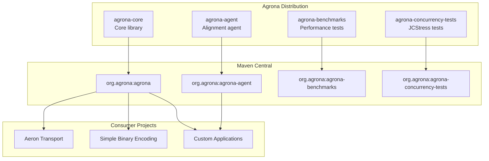

#### 8.3.2 Build Integration Patterns

```yaml
# GitHub Actions CI/CD integration
name: Continuous Integration

on: [push, pull_request]

jobs:
  build:
    strategy:
      matrix:
        java: [17, 21]
        os: [ubuntu-latest, windows-latest, macos-latest]
    
    runs-on: ${{ matrix.os }}
    
    steps:
    - uses: actions/checkout@v3
    
    - name: Setup JDK ${{ matrix.java }}
      uses: actions/setup-java@v3
      with:
        java-version: ${{ matrix.java }}
        distribution: 'zulu'
    
    - name: Cache Gradle dependencies
      uses: actions/cache@v3
      with:
        path: |
          ~/.gradle/caches
          ~/.gradle/wrapper
        key: ${{ runner.os }}-gradle-${{ hashFiles('**/*.gradle*', '**/gradle-wrapper.properties') }}
    
    - name: Build with Gradle
      run: ./gradlew build --stacktrace
    
    - name: Run benchmarks
      run: ./gradlew :agrona-benchmarks:jmh
    
    - name: Run concurrency tests
      run: ./gradlew :agrona-concurrency-tests:jcstress
    
    - name: Publish Test Results
      uses: dorny/test-reporter@v1
      if: success() || failure()
      with:
        name: Test Results (${{ matrix.os }} JDK ${{ matrix.java }})
        path: '**/build/test-results/test/TEST-*.xml'
        reporter: java-junit

  release:
    needs: build
    if: startsWith(github.ref, 'refs/tags/')
    runs-on: ubuntu-latest
    
    steps:
    - uses: actions/checkout@v3
    
    - name: Setup JDK 17
      uses: actions/setup-java@v3
      with:
        java-version: 17
        distribution: 'zulu'
    
    - name: Publish to Maven Central
      run: ./gradlew publishToSonatype closeAndReleaseSonatypeStagingRepository
      env:
        OSSRH_USERNAME: ${{ secrets.OSSRH_USERNAME }}
        OSSRH_PASSWORD: ${{ secrets.OSSRH_PASSWORD }}
        SIGNING_KEY_ID: ${{ secrets.SIGNING_KEY_ID }}
        SIGNING_PASSWORD: ${{ secrets.SIGNING_PASSWORD }}
        SIGNING_SECRET_KEY: ${{ secrets.SIGNING_SECRET_KEY }}
```

---

## 9. Performance Integration Patterns

### 9.1 Zero-Allocation Integration

#### 9.1.1 Steady-State Performance Pattern

```java
// Zero-allocation steady-state integration pattern
public class ZeroAllocationIntegration {
    private final UnsafeBuffer messageBuffer;
    private final OneToOneRingBuffer ringBuffer;
    private final MessageHandler messageHandler;
    private final IdleStrategy idleStrategy;
    
    // Pre-allocated objects to avoid GC pressure
    private final StringBuilder stringBuilder;
    private final ByteArrayOutputStream byteStream;
    private final long[] reusableArray;
    
    public ZeroAllocationIntegration(AtomicBuffer buffer) {
        this.messageBuffer = new UnsafeBuffer(new byte[1024]);
        this.ringBuffer = new OneToOneRingBuffer(buffer);
        this.messageHandler = this::handleMessage;
        this.idleStrategy = new BackoffIdleStrategy(100, 1000, 1, 1000);
        
        // Pre-allocate reusable objects
        this.stringBuilder = new StringBuilder(256);
        this.byteStream = new ByteArrayOutputStream(512);
        this.reusableArray = new long[64];
    }
    
    public void runSteadyStateLoop() {
        while (!Thread.currentThread().isInterrupted()) {
            int workCount = ringBuffer.read(messageHandler, 10);
            
            if (workCount > 0) {
                idleStrategy.reset();
            } else {
                idleStrategy.idle(workCount);
            }
        }
    }
    
    private void handleMessage(int msgTypeId, DirectBuffer buffer, int index, int length) {
        // Zero-allocation message processing
        switch (msgTypeId) {
            case 1:
                processTradeMessage(buffer, index, length);
                break;
            case 2:
                processQuoteMessage(buffer, index, length);
                break;
            default:
                // Reuse string builder - no allocation
                stringBuilder.setLength(0);
                stringBuilder.append("Unknown message type: ").append(msgTypeId);
                System.out.println(stringBuilder.toString());
        }
    }
    
    private void processTradeMessage(DirectBuffer buffer, int index, int length) {
        // Direct field access without object creation
        long orderId = buffer.getLong(index);
        double price = buffer.getDouble(index + 8);
        long quantity = buffer.getLong(index + 16);
        
        // Process without creating intermediate objects
        updateOrderBook(orderId, price, quantity);
    }
    
    private void updateOrderBook(long orderId, double price, long quantity) {
        // Implementation uses reusable arrays and primitive operations
        // No object allocation in steady state
    }
}
```

### 9.2 Cache-Conscious Integration Patterns

#### 9.2.1 Memory Layout Optimization

```java
// Cache-conscious data structure integration
public class CacheOptimizedIntegration {
    // Cache line size (64 bytes on most modern processors)
    private static final int CACHE_LINE_SIZE = 64;
    
    // Pad to prevent false sharing between producer and consumer
    @SuppressWarnings("unused")
    private long p1, p2, p3, p4, p5, p6, p7;
    private volatile long producerSequence;
    @SuppressWarnings("unused")
    private long p8, p9, p10, p11, p12, p13, p14, p15;
    
    private volatile long consumerSequence;
    @SuppressWarnings("unused")
    private long p16, p17, p18, p19, p20, p21, p22;
    
    private final AtomicBuffer buffer;
    private final int capacity;
    private final int mask;
    
    public CacheOptimizedIntegration(int capacity) {
        this.capacity = Integer.highestOneBit(capacity);
        this.mask = this.capacity - 1;
        
        // Allocate buffer aligned to cache line boundaries
        this.buffer = allocateAlignedBuffer(this.capacity * 64); // 64 bytes per slot
    }
    
    private AtomicBuffer allocateAlignedBuffer(int size) {
        // Allocate extra space for alignment
        byte[] array = new byte[size + CACHE_LINE_SIZE];
        UnsafeBuffer buffer = new UnsafeBuffer(array);
        
        // Calculate aligned offset
        long address = buffer.addressOffset();
        int alignmentOffset = (int) (CACHE_LINE_SIZE - (address % CACHE_LINE_SIZE));
        
        // Return aligned view
        UnsafeBuffer aligned = new UnsafeBuffer(array, alignmentOffset, size);
        aligned.verifyAlignment();
        return aligned;
    }
    
    public boolean offer(long value) {
        long currentProducerSequence = producerSequence;
        long nextSequence = currentProducerSequence + 1;
        
        // Check if buffer is full (cache-friendly access pattern)
        if (nextSequence - consumerSequence > capacity) {
            return false; // Buffer full
        }
        
        // Calculate slot index with cache-line alignment
        int slotIndex = (int) (currentProducerSequence & mask);
        int bufferOffset = slotIndex * CACHE_LINE_SIZE;
        
        // Write value to aligned slot
        buffer.putLongOrdered(bufferOffset, value);
        
        // Update producer sequence (release semantics)
        producerSequence = nextSequence;
        
        return true;
    }
    
    public long poll() {
        long currentConsumerSequence = consumerSequence;
        
        // Check if data is available
        if (currentConsumerSequence >= producerSequence) {
            return -1; // No data available
        }
        
        // Calculate slot index
        int slotIndex = (int) (currentConsumerSequence & mask);
        int bufferOffset = slotIndex * CACHE_LINE_SIZE;
        
        // Read value from aligned slot
        long value = buffer.getLongVolatile(bufferOffset);
        
        // Update consumer sequence
        consumerSequence = currentConsumerSequence + 1;
        
        return value;
    }
}
```

### 9.3 Latency Optimization Patterns

#### 9.3.1 CPU Affinity Integration

```java
// CPU affinity and performance optimization integration
public class LatencyOptimizedIntegration {
    private final Thread.UncaughtExceptionHandler errorHandler;
    private final AtomicBuffer sharedBuffer;
    private final OneToOneRingBuffer commandBuffer;
    private final BusySpinIdleStrategy idleStrategy;
    
    public LatencyOptimizedIntegration(AtomicBuffer buffer) {
        this.sharedBuffer = buffer;
        this.commandBuffer = new OneToOneRingBuffer(buffer);
        this.idleStrategy = new BusySpinIdleStrategy();
        this.errorHandler = (thread, exception) -> {
            System.err.println("Critical error in " + thread.getName() + ": " + 
                             exception.getMessage());
            System.exit(1);
        };
    }
    
    public void startOptimizedProcessing() {
        // Create dedicated thread with specific properties
        Thread processingThread = new Thread(this::processingLoop, "LatencyOptimized");
        processingThread.setDaemon(false);
        processingThread.setUncaughtExceptionHandler(errorHandler);
        
        // Set maximum priority for latency-critical thread
        processingThread.setPriority(Thread.MAX_PRIORITY);
        
        // Start processing
        processingThread.start();
        
        // Recommend CPU affinity (platform-specific)
        recommendCPUAffinity(processingThread);
    }
    
    private void processingLoop() {
        // JIT warm-up phase
        performWarmUp();
        
        // Disable GC during critical processing (requires -XX:+UnlockExperimentalVMOptions -XX:+UseEpsilonGC)
        System.gc(); // Final GC before critical processing
        
        while (!Thread.currentThread().isInterrupted()) {
            int workCount = commandBuffer.read(this::processCommand, 1);
            
            if (workCount == 0) {
                // Busy spin for minimal latency
                idleStrategy.idle(0);
            } else {
                idleStrategy.reset();
            }
        }
    }
    
    private void performWarmUp() {
        // Warm up JIT compiler with typical workload
        UnsafeBuffer warmupBuffer = new UnsafeBuffer(new byte[1024]);
        
        for (int i = 0; i < 100_000; i++) {
            warmupBuffer.putLong(0, System.nanoTime());
            warmupBuffer.putInt(8, i);
            warmupBuffer.putDouble(12, Math.random());
            
            long value = warmupBuffer.getLong(0);
            int count = warmupBuffer.getInt(8);
            double random = warmupBuffer.getDouble(12);
            
            // Prevent dead code elimination
            if (value < 0 || count < 0 || random < 0) {
                throw new RuntimeException("Impossible condition");
            }
        }
        
        System.out.println("JIT warm-up complete");
    }
    
    private void processCommand(int msgTypeId, DirectBuffer buffer, int index, int length) {
        // Ultra-low latency message processing
        long startTime = System.nanoTime();
        
        // Process message without allocation
        switch (msgTypeId) {
            case 1:
                processMarketData(buffer, index, length);
                break;
            case 2:
                processOrderCommand(buffer, index, length);
                break;
            default:
                // Minimal error handling for latency
                return;
        }
        
        long processingTime = System.nanoTime() - startTime;
        
        // Log only if processing time exceeds threshold (e.g., 1 microsecond)
        if (processingTime > 1000) {
            System.out.println("Slow processing: " + processingTime + " ns");
        }
    }
    
    private void processMarketData(DirectBuffer buffer, int index, int length) {
        // Direct field access without object creation
        long timestamp = buffer.getLong(index);
        int symbol = buffer.getInt(index + 8);
        double price = buffer.getDouble(index + 12);
        long volume = buffer.getLong(index + 20);
        
        // Update order book directly in memory
        updateOrderBookDirect(symbol, price, volume, timestamp);
    }
    
    private void processOrderCommand(DirectBuffer buffer, int index, int length) {
        // Fast order processing without allocation
        long orderId = buffer.getLong(index);
        int side = buffer.getInt(index + 8);
        double price = buffer.getDouble(index + 12);
        long quantity = buffer.getLong(index + 20);
        
        // Execute order with minimal latency
        executeOrderDirect(orderId, side, price, quantity);
    }
    
    private void updateOrderBookDirect(int symbol, double price, long volume, long timestamp) {
        // Implementation updates order book structures directly
        // Uses primitive operations and pre-allocated arrays
    }
    
    private void executeOrderDirect(long orderId, int side, double price, long quantity) {
        // Implementation executes orders with direct memory operations
        // Avoids object allocation and unnecessary method calls
    }
    
    private void recommendCPUAffinity(Thread thread) {
        // Platform-specific CPU affinity recommendations
        System.out.println("Recommend setting CPU affinity for thread: " + thread.getName());
        System.out.println("Linux: taskset -c 0 java ...");
        System.out.println("Windows: start /affinity 1 java ...");
        
        // Note: Actual CPU affinity setting requires JNI or external tools
        // This is just guidance for deployment
    }
    
    // Idle strategy for minimal latency
    private static class BusySpinIdleStrategy implements IdleStrategy {
        @Override
        public void idle(int workCount) {
            // Busy spin - consumes CPU but provides minimal latency
            Thread.onSpinWait();
        }
        
        @Override
        public void reset() {
            // No state to reset for busy spin
        }
    }
}
```

---

## 10. References

### 10.1 Source Code References

**Core Integration Components:**
- `/agrona/src/main/java/org/agrona/DirectBuffer.java:29` - Core buffer abstraction interface
- `/agrona/src/main/java/org/agrona/MutableDirectBuffer.java:27` - Write-capable buffer interface  
- `/agrona/src/main/java/org/agrona/concurrent/AtomicBuffer.java:48` - Thread-safe atomic operations
- `/agrona/src/main/java/org/agrona/concurrent/ringbuffer/OneToOneRingBuffer.java:37` - Single producer/consumer ring buffer
- `/agrona/src/main/java/org/agrona/concurrent/ringbuffer/ManyToOneRingBuffer.java` - Multi-producer ring buffer
- `/agrona/src/main/java/org/agrona/IoUtil.java:36` - Memory-mapped file utilities
- `/agrona/src/main/java/org/agrona/SystemUtil.java` - System introspection utilities
- `/agrona/src/main/java/org/agrona/concurrent/CountersManager.java` - Off-heap counter management
- `/agrona/src/main/java/org/agrona/concurrent/StatusIndicator.java` - Status indication interface

### 10.2 Technical Specification Cross-References

- **Section 5.1.4 External Integration Points** - Aeron messaging, SBE encoding, JVM monitoring infrastructure
- **Section 6.3 INTEGRATION ARCHITECTURE** - API design, message processing, external systems
- **Section 6.3.3.1 Aeron Messaging Integration** - Ring buffer commands, broadcast status, data transport
- **Section 6.3.2.4 Message Framing Standard** - Length-prefixed message protocol, atomic visibility
- **Section 2.1 FEATURE CATALOG** - Buffer management, primitive collections, lock-free queues

### 10.3 Architecture Documentation References

- **[System Design Architecture](system-design.md)** - Overall system architecture and component relationships
- **[Memory Model Architecture](memory-model.md)** - Memory layout, Unsafe API usage, platform considerations  
- **[Concurrency Model Architecture](concurrency-model.md)** - Lock-free algorithms, atomic operations, producer-consumer coordination

### 10.4 API Documentation References

- **[Buffer Management API](../api/buffer-management.md)** - DirectBuffer, MutableDirectBuffer, AtomicBuffer interfaces
- **[Concurrent Utilities API](../api/concurrent-utilities.md)** - Ring buffers, queues, agent framework
- **[System Utilities API](../api/system-utilities.md)** - IoUtil, SystemUtil, inter-process communication
- **[I/O Utilities API](../api/io-utilities.md)** - DirectBuffer streams, zero-copy I/O operations

### 10.5 External System Documentation

- **Aeron Transport Documentation** - High-performance messaging system built on Agrona primitives
- **Simple Binary Encoding (SBE)** - Schema-driven binary encoding using DirectBuffer abstractions
- **Java Memory Model Specification** - Memory ordering semantics and atomic operation guarantees
- **Maven Central Repository** - Artifact publishing and dependency resolution standards

---

*This document provides comprehensive coverage of Agrona's integration patterns with external systems, enabling developers to understand and implement high-performance integrations using zero-copy message framing, memory-mapped inter-process communication, and lock-free concurrent coordination patterns.*