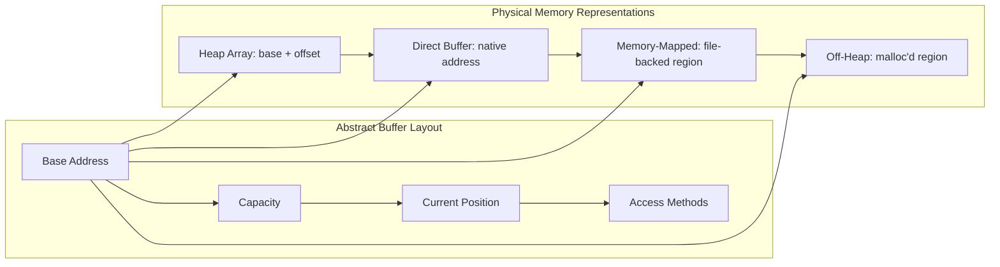
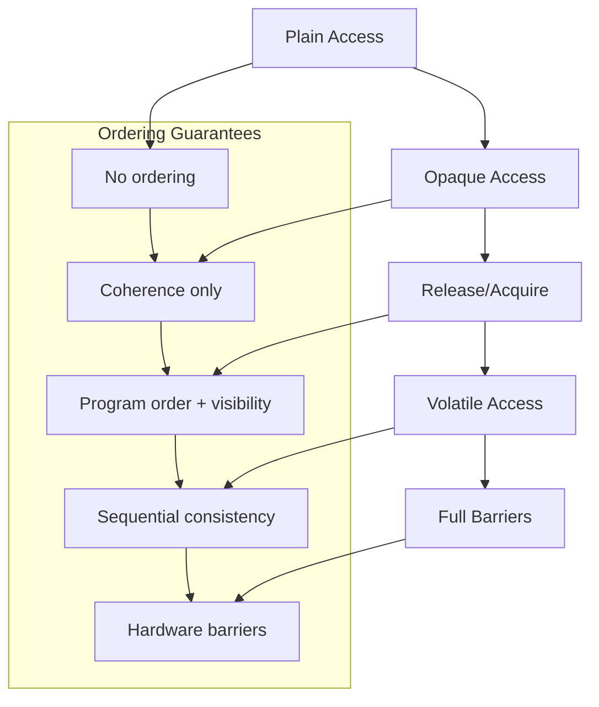
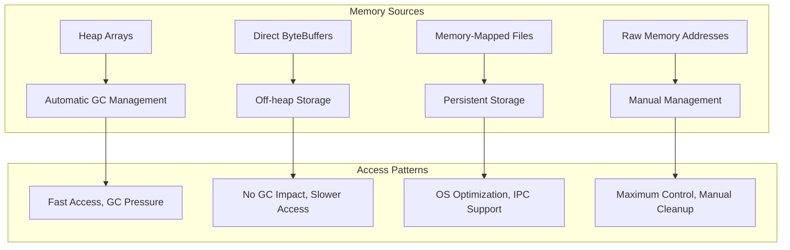
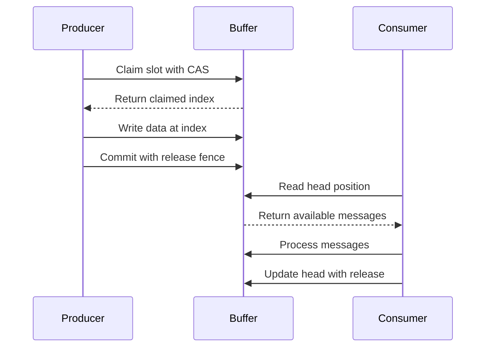

# Agrona Memory Model Architecture

## Table of Contents

1. [Overview](#1-overview)
2. [Memory Layout Design](#2-memory-layout-design)
3. [Unsafe API Utilization](#3-unsafe-api-utilization)
4. [Memory Ordering Semantics](#4-memory-ordering-semantics)
5. [Alignment Requirements](#5-alignment-requirements)
6. [Memory Sources and Management](#6-memory-sources-and-management)
7. [Platform-Specific Considerations](#7-platform-specific-considerations)
8. [Cache Optimization Strategies](#8-cache-optimization-strategies)
9. [Atomic Operations and Coordination](#9-atomic-operations-and-coordination)
10. [Zero-Copy Operations](#10-zero-copy-operations)
11. [Garbage Collection Implications](#11-garbage-collection-implications)
12. [Memory Allocation Patterns](#12-memory-allocation-patterns)
13. [Implementation Examples](#13-implementation-examples)
14. [References](#14-references)

---

## 1. Overview

### 1.1 Memory Model Philosophy

Agrona's memory model is designed around the fundamental principle of achieving **sub-microsecond latency** through direct memory manipulation while maintaining the safety guarantees essential for enterprise applications. The architecture provides a unified abstraction over diverse memory sources, enabling zero-copy operations that are critical for high-frequency trading, real-time messaging, and low-latency distributed systems.

> Source: `agrona/src/main/java/org/agrona/DirectBuffer.java:24-28`

The memory model encompasses three fundamental layers:

```mermaid
graph TB
    subgraph "Memory Model Layers"
        A[Application Layer] --> B[Buffer Abstraction Layer]
        B --> C[Memory Access Layer] 
        C --> D[Platform Memory Layer]
    end
    
    subgraph "Buffer Abstraction Layer"
        E[DirectBuffer] --> F[MutableDirectBuffer]
        F --> G[AtomicBuffer]
    end
    
    subgraph "Memory Access Layer"
        H[UnsafeApi] --> I[VarHandle Fallback]
        I --> J[Field Offsets]
        J --> K[Memory Barriers]
    end
    
    subgraph "Platform Memory Layer"
        L[Heap Arrays] --> M[Direct ByteBuffers]
        M --> N[Memory-Mapped Files]
        N --> O[Off-Heap Memory]
    end
    
    style A fill:#e1f5fe
    style H fill:#fff3e0
    style L fill:#e8f5e8
```



### 1.2 Core Design Principles

**Direct Memory Access**: The system leverages `jdk.internal.misc.Unsafe` for direct memory manipulation, bypassing JVM safety checks in performance-critical paths while maintaining controlled access through well-defined abstractions.

**Memory Ordering Control**: Provides explicit control over memory ordering semantics through atomic operations, volatile access patterns, and memory barriers, enabling developers to choose the appropriate consistency model for their specific use case.

**Zero-Copy Philosophy**: Eliminates intermediate copying between memory regions through unified buffer abstractions that can wrap different memory sources without data movement.

**Platform Awareness**: Adapts memory access patterns and alignment requirements based on the underlying hardware platform, with specific optimizations for x86, ARM, and other architectures.

---

## 2. Memory Layout Design

### 2.1 Buffer Memory Layout

Agrona's memory model standardizes access to memory through a consistent buffer layout that abstracts the underlying storage mechanism:



**Address Calculation Pattern**:
Every memory access follows the formula: `effectiveAddress = baseAddress + arrayOffset + index`

> Source: `agrona/src/main/java/org/agrona/UnsafeBuffer.java:45-68`

### 2.2 Memory Field Layout

The `UnsafeBuffer` class demonstrates the memory field organization pattern used throughout Agrona:

```java
public class UnsafeBuffer extends AbstractMutableDirectBuffer implements AtomicBuffer {
    // Inherited from AbstractMutableDirectBuffer:
    protected byte[] byteArray;        // Heap storage reference
    protected long addressOffset;     // Base memory address
    protected int capacity;           // Buffer capacity in bytes
    
    // UnsafeBuffer-specific fields:
    private ByteBuffer byteBuffer;    // NIO buffer reference
    private int wrapAdjustment;       // Address offset adjustment
}
```

> Source: `agrona/src/main/java/org/agrona/concurrent/UnsafeBuffer.java:70-71`

### 2.3 Cache-Line Padding Strategy

Critical data structures use explicit cache-line padding to prevent false sharing:

```java
// Example from BackoffIdleStrategy
abstract class BackoffIdleStrategyPrePad {
    byte p000, p001, p002, p003, p004, p005, p006, p007;
    byte p008, p009, p010, p011, p012, p013, p014, p015;
    // ... continued to 64 bytes
}

abstract class BackoffIdleStrategyData extends BackoffIdleStrategyPrePad {
    protected long state = NOT_IDLE;  // Isolated on its own cache line
}
```

**Cache-Line Isolation Benefits**:
- Prevents false sharing between concurrent access points
- Ensures atomic operations don't interfere with adjacent memory
- Optimizes memory bandwidth utilization in multi-core systems

### 2.4 Alignment Requirements

The memory model enforces strict alignment requirements for atomic operations:

| Alignment Type | Requirement | Platform Dependency | Purpose |
|----------------|-------------|-------------------|---------|
| **Word Alignment** | 8-byte boundaries | All platforms | Atomic long operations |
| **Cache-Line Alignment** | 64-byte boundaries | Performance critical | False sharing prevention |
| **Platform Alignment** | Architecture-specific | ARM requires strict | Hardware compatibility |

> Source: `agrona/src/main/java/org/agrona/concurrent/AtomicBuffer.java:52`

---

## 3. Unsafe API Utilization

### 3.1 Unsafe Access Patterns

Agrona centralizes all `jdk.internal.misc.Unsafe` operations through the `UnsafeApi` class, providing a controlled interface for low-level memory operations:

```java
public final class UnsafeApi {
    /**
     * Bootstrap method for array base offset resolution using invokedynamic
     */
    private static CallSite bootstrapArrayBaseOffset(
        final MethodHandles.Lookup lookup,
        final String methodName,
        final MethodType methodType) throws Throwable {
        
        final Class<?> clazz = methodType.parameterType(0);
        final Method method = clazz.getMethod("arrayBaseOffset", Class.class);
        final MethodHandle methodHandle = lookup.unreflect(method);
        
        if (method.getReturnType() == int.class) {
            return new ConstantCallSite(methodHandle);
        } else {
            final MethodType intReturnType = methodHandle.type().changeReturnType(int.class);
            final MethodHandle castToIntMethodHandle = 
                MethodHandles.explicitCastArguments(methodHandle, intReturnType);
            return new ConstantCallSite(castToIntMethodHandle);
        }
    }
}
```

> Source: `agrona/src/main/java/org/agrona/UnsafeApi.java:29-48`

### 3.2 Memory Access Method Categories

The Unsafe API provides different classes of memory access methods, each with specific ordering guarantees:

#### 3.2.1 Plain Memory Access

```java
// Direct memory access without ordering guarantees
public static long getLong(Object obj, long offset)
public static void putLong(Object obj, long offset, long value)
```

**Use Cases**: Single-threaded scenarios or where external synchronization provides ordering guarantees.

#### 3.2.2 Volatile Memory Access

```java
// Full memory visibility guarantees
public static long getLongVolatile(Object obj, long offset)
public static void putLongVolatile(Object obj, long offset, long value)
```

**Use Cases**: Multi-threaded scenarios requiring immediate visibility across all threads.

#### 3.2.3 Ordered Memory Access

```java
// Release/acquire semantics
public static void putLongRelease(Object obj, long offset, long value)
public static long getLongAcquire(Object obj, long offset)
```

**Use Cases**: Producer-consumer coordination where ordering matters but full volatile overhead is unnecessary.

#### 3.2.4 Atomic Memory Operations

```java
// Compare-and-swap operations for coordination
public static boolean compareAndSetLong(Object obj, long offset, long expected, long update)
public static long getAndAddLong(Object obj, long offset, long delta)
```

**Use Cases**: Lock-free algorithms and atomic counter implementations.

### 3.3 Field Offset Resolution

Critical for performance, field offsets are resolved once during class initialization:

```java
public static final long BYTE_BUFFER_HB_FIELD_OFFSET;
public static final long BYTE_BUFFER_OFFSET_FIELD_OFFSET;
public static final long BYTE_BUFFER_ADDRESS_FIELD_OFFSET;

static {
    try {
        BYTE_BUFFER_HB_FIELD_OFFSET = UnsafeApi.objectFieldOffset(
            ByteBuffer.class.getDeclaredField("hb"));
        BYTE_BUFFER_OFFSET_FIELD_OFFSET = UnsafeApi.objectFieldOffset(
            ByteBuffer.class.getDeclaredField("offset"));
        BYTE_BUFFER_ADDRESS_FIELD_OFFSET = UnsafeApi.objectFieldOffset(
            Buffer.class.getDeclaredField("address"));
    } catch (final Exception ex) {
        throw new RuntimeException(ex);
    }
}
```

> Source: `agrona/src/main/java/org/agrona/BufferUtil.java:60-76`

### 3.4 VarHandle Fallback Mechanism

For environments where Unsafe is restricted, Agrona provides VarHandle-based implementations:

```java
// VarHandle equivalent for atomic long operations
VarHandle LONG_HANDLE = MethodHandles.arrayElementVarHandle(long[].class);

// Atomic get with acquire semantics
long value = (long) LONG_HANDLE.getAcquire(array, index);

// Atomic set with release semantics  
LONG_HANDLE.setRelease(array, index, newValue);

// Compare and set operation
boolean success = LONG_HANDLE.compareAndSet(array, index, expected, update);
```

---

## 4. Memory Ordering Semantics

### 4.1 Memory Ordering Hierarchy

Agrona provides a comprehensive hierarchy of memory ordering guarantees, from weakest to strongest:



### 4.2 Memory Barrier Implementation

**Load Barriers**: Ensure memory reads are ordered correctly
```java
public static void loadFence() {
    // Prevents reordering of loads across this point
    VarHandle.loadLoadFence();
}
```

**Store Barriers**: Ensure memory writes are ordered correctly
```java
public static void storeFence() {
    // Prevents reordering of stores across this point
    VarHandle.storeStoreFence();
}
```

**Full Barriers**: Provide complete memory ordering guarantees
```java
public static void fullFence() {
    // Prevents any reordering across this point
    VarHandle.fullFence();
}
```

### 4.3 Release-Acquire Coordination

The release-acquire model enables efficient producer-consumer coordination:

```java
// Producer side - release semantics
public void publish(int index, long value) {
    buffer.putLong(index, value);        // Write data
    buffer.putLongRelease(flagOffset, READY_FLAG);  // Release write
}

// Consumer side - acquire semantics  
public long consume(int index) {
    while (buffer.getLongAcquire(flagOffset) != READY_FLAG) {
        // Acquire read - ensures data visibility
        Thread.onSpinWait();
    }
    return buffer.getLong(index);        // Read data
}
```

### 4.4 Compare-and-Swap Coordination

Lock-free algorithms rely on atomic compare-and-swap operations:

```java
public boolean claimSlot(int index) {
    return buffer.compareAndSetLong(
        index, 
        AVAILABLE_SLOT,    // Expected value
        CLAIMED_SLOT       // New value
    );
}
```

---

## 5. Alignment Requirements

### 5.1 Platform-Specific Alignment

Different CPU architectures have varying alignment requirements for atomic operations:

| Platform | Word Size | Alignment Requirement | Atomic Long Support |
|----------|-----------|----------------------|-------------------|
| **x86/x64** | 8 bytes | Natural alignment (8-byte) | Hardware guaranteed |
| **ARM64** | 8 bytes | Strict alignment (8-byte) | Fault on misalignment |
| **ARM32** | 4 bytes | Strict alignment (4-byte) | Software emulation |
| **RISC-V** | 8 bytes | Natural alignment (8-byte) | Hardware support varies |

### 5.2 Alignment Verification

The system provides runtime alignment verification through the agent module:

```java
@Override
public void verifyAlignment() {
    if (AtomicBuffer.STRICT_ALIGNMENT_CHECKS) {
        if (0 != (addressOffset & (AtomicBuffer.ALIGNMENT - 1))) {
            throw new IllegalStateException(
                "AtomicBuffer is not correctly aligned: addressOffset=" + addressOffset +
                " in " + this);
        }
    }
}
```

> Source: `agrona/src/main/java/org/agrona/concurrent/UnsafeBuffer.java` (verifyAlignment method)

### 5.3 Alignment Enforcement Patterns

**Power-of-Two Allocation**: Ensures natural alignment for most operations
```java
public static ByteBuffer allocateDirectAligned(final int capacity, final int alignment) {
    if (!isPowerOfTwo(alignment)) {
        throw new IllegalArgumentException("Must be a power of 2: alignment=" + alignment);
    }
    
    final ByteBuffer buffer = ByteBuffer.allocateDirect(capacity + alignment);
    final long address = address(buffer);
    final int remainder = (int)(address & (alignment - 1));
    final int offset = alignment - remainder;
    
    buffer.limit(capacity + offset);
    buffer.position(offset);
    
    return buffer.slice();
}
```

> Source: `agrona/src/main/java/org/agrona/BufferUtil.java` (allocateDirectAligned method)

### 5.4 Cache-Line Alignment

For performance-critical structures, cache-line alignment prevents false sharing:

```java
// 64-byte cache line padding
public abstract class CacheLinePadding {
    protected long p1, p2, p3, p4, p5, p6, p7;  // 56 bytes
    protected long value;                         // 8 bytes = 64 total
}
```

---

## 6. Memory Sources and Management

### 6.1 Memory Source Types

Agrona supports four distinct memory source types, each optimized for specific use cases:



### 6.2 Heap Array Management

**Memory Layout**:
```
Heap Array Buffer:
[Object Header] [Array Length] [Array Elements...]
                               ^
                               Base Address + ARRAY_BASE_OFFSET
```

**Access Pattern**:
```java
public long getLong(final int index) {
    return UnsafeApi.getLong(byteArray, ARRAY_BASE_OFFSET + index);
}

public void putLong(final int index, final long value) {
    UnsafeApi.putLong(byteArray, ARRAY_BASE_OFFSET + index, value);
}
```

**Advantages**:
- Fastest access path through JVM optimizations
- Automatic garbage collection management
- No additional memory allocation overhead

**Disadvantages**:
- Limited by maximum array size (Integer.MAX_VALUE - 8)
- Subject to garbage collection pauses
- Memory layout controlled by JVM

### 6.3 Direct ByteBuffer Management

**Memory Layout**:
```
Direct ByteBuffer:
[ByteBuffer Object] -> [Native Memory Region]
                      ^
                      Native Address
```

**Access Pattern**:
```java
public long getLong(final int index) {
    return UnsafeApi.getLong(null, address + index);
}

public void putLong(final int index, final long value) {
    UnsafeApi.putLong(null, address + index, value);
}
```

**Lifecycle Management**:
```java
public static void free(final DirectBuffer buffer) {
    final ByteBuffer byteBuffer = buffer.byteBuffer();
    if (null != byteBuffer && byteBuffer.isDirect()) {
        UnsafeApi.invokeCleaner(byteBuffer);
    }
}
```

> Source: `agrona/src/main/java/org/agrona/BufferUtil.java` (free method)

### 6.4 Memory-Mapped File Management

**Cross-Process Coordination**:
Memory-mapped files enable zero-copy inter-process communication:

```java
// Process A - Producer
MappedByteBuffer mappedBuffer = fileChannel.map(
    FileChannel.MapMode.READ_WRITE, 0, fileSize);
AtomicBuffer buffer = new UnsafeBuffer(mappedBuffer);

// Process B - Consumer  
MappedByteBuffer mappedBuffer = fileChannel.map(
    FileChannel.MapMode.READ_ONLY, 0, fileSize);
DirectBuffer buffer = new UnsafeBuffer(mappedBuffer);
```

**Synchronization Guarantees**:
- Memory-mapped regions provide coherent views across processes
- Atomic operations work correctly across process boundaries
- Operating system handles cache coherency automatically

### 6.5 Expandable Buffer Implementations

**Automatic Growth Strategy**:
```java
public void ensureCapacity(final int index, final int length) {
    final long resultingPosition = index + (long)length;
    final int currentCapacity = capacity;
    if (resultingPosition > currentCapacity) {
        if (resultingPosition > MAX_ARRAY_LENGTH) {
            throw new IndexOutOfBoundsException(
                "index=" + index + " length=" + length + " maxCapacity=" + MAX_ARRAY_LENGTH);
        }
        
        final int newCapacity = calculateExpansion(currentCapacity, (int)resultingPosition);
        final byte[] newBuffer = new byte[newCapacity];
        System.arraycopy(byteArray, 0, newBuffer, 0, currentCapacity);
        
        byteArray = newBuffer;
        capacity = newCapacity;
    }
}
```

> Source: `agrona/src/main/java/org/agrona/ExpandableArrayBuffer.java` (ensureCapacity method)

---

## 7. Platform-Specific Considerations

### 7.1 CPU Architecture Adaptations

**x86/x64 Optimizations**:
- Relaxed alignment requirements for most operations
- Hardware-supported unaligned access with performance penalty
- Strong memory ordering guarantees for most operations

**ARM Architecture Considerations**:
- Strict alignment requirements for atomic operations
- Weaker memory ordering requiring explicit barriers
- Different cache line sizes on various ARM implementations

**Platform Detection**:
```java
public static final boolean STRICT_ALIGNMENT_CHECKS = 
    !"x64".equals(SystemUtil.osArch()) || 
    "true".equals(SystemUtil.getProperty("agrona.strict.alignment.checks"));
```

> Source: `agrona/src/main/java/org/agrona/concurrent/AtomicBuffer.java:67-69`

### 7.2 Endianness Handling

**Byte Order Management**:
```java
public static final ByteOrder NATIVE_BYTE_ORDER = ByteOrder.nativeOrder();

public long getLong(final int index, final ByteOrder byteOrder) {
    final long value = getLong(index);
    return NATIVE_BYTE_ORDER == byteOrder ? value : Long.reverseBytes(value);
}

public void putLong(final int index, final long value, final ByteOrder byteOrder) {
    final long valueToWrite = NATIVE_BYTE_ORDER == byteOrder ? value : Long.reverseBytes(value);
    putLong(index, valueToWrite);
}
```

### 7.3 Virtual Memory Considerations

**Page Size Alignment**:
```java
public static int pageSize() {
    // Returns system page size for optimal memory mapping
    return UnsafeApi.pageSize();
}
```

**Memory Protection**:
- Read-only memory mapping for immutable data structures
- Copy-on-write semantics for shared data with local modifications
- Memory protection faults for out-of-bounds access detection

### 7.4 NUMA Topology Awareness

**Memory Locality Optimization**:
- Allocate buffers on local NUMA nodes when possible
- Thread affinity considerations for memory access patterns
- Cross-NUMA node access performance implications

---

## 8. Cache Optimization Strategies

### 8.1 Cache-Line Aware Design

**False Sharing Prevention**:
```java
// Producer fields isolated on separate cache lines
abstract class ProducerPadding {
    protected long p1, p2, p3, p4, p5, p6, p7, p8;
}

abstract class ProducerFields extends ProducerPadding {
    protected volatile long producerIndex;
}

// Consumer fields isolated on separate cache lines  
abstract class ConsumerPadding extends ProducerFields {
    protected long p9, p10, p11, p12, p13, p14, p15, p16;
}

abstract class ConsumerFields extends ConsumerPadding {
    protected volatile long consumerIndex; 
}
```

### 8.2 Memory Access Patterns

**Sequential Access Optimization**:
- Batch operations to maximize cache utilization
- Prefetch hints for predictable access patterns
- Memory layout optimization for spatial locality

**Random Access Considerations**:
- Hash table implementations with cache-friendly probing
- Power-of-two sizing for efficient address calculation
- Load factor management to minimize cache misses

### 8.3 Prefetching Strategies

**Software Prefetching**:
```java
public void prefetchForRead(final int index) {
    // Platform-specific prefetch implementation
    UnsafeApi.prefetchRead(null, addressOffset + index);
}

public void prefetchForWrite(final int index) {
    // Platform-specific prefetch implementation  
    UnsafeApi.prefetchWrite(null, addressOffset + index);
}
```

### 8.4 Cache-Conscious Data Structures

**Ring Buffer Layout**:
```
Cache Line 0: [Producer Index] [Padding...]
Cache Line 1: [Consumer Index] [Padding...]
Cache Line 2+: [Data Elements...]
```

This layout ensures producer and consumer operate on separate cache lines, eliminating false sharing while keeping data elements contiguous for efficient iteration.

---

## 9. Atomic Operations and Coordination

### 9.1 Lock-Free Algorithm Patterns

**Single-Producer, Single-Consumer (SPSC)**:
```java
public boolean offer(final E element) {
    final long currentTail = this.producerIndex;
    final long nextTail = currentTail + 1;
    
    if (nextTail == consumerIndex + capacity) {
        return false; // Queue full
    }
    
    // Store element with plain write (no contention)
    UnsafeApi.putReference(buffer, calcElementOffset(currentTail), element);
    
    // Advance tail with release ordering for visibility
    UnsafeApi.putLongRelease(this, PRODUCER_INDEX_OFFSET, nextTail);
    return true;
}
```

**Multi-Producer, Single-Consumer (MPSC)**:
```java
public boolean offer(final E element) {
    final long currentTail = this.producerIndex;
    final long nextTail = currentTail + 1;
    
    if (nextTail == consumerIndex + capacity) {
        return false; // Queue full  
    }
    
    // Atomic tail advancement for coordination
    if (UnsafeApi.compareAndSetLong(this, PRODUCER_INDEX_OFFSET, currentTail, nextTail)) {
        UnsafeApi.putReference(buffer, calcElementOffset(currentTail), element);
        return true;
    }
    
    return false; // CAS failed, try again
}
```

### 9.2 Memory Ordering in Ring Buffers

**Claim-Commit Protocol**:
```java
public long tryClaim(final int messageTypeId, final int length) {
    final int recordLength = length + HEADER_LENGTH;
    final int alignedRecordLength = align(recordLength, ALIGNMENT);
    final long tail = this.tail;
    final long requiredPosition = tail + alignedRecordLength;
    
    if (requiredPosition > head + capacity) {
        return INSUFFICIENT_CAPACITY;
    }
    
    final int recordIndex = (int)tail & indexMask;
    
    // Write length with release ordering
    buffer.putIntRelease(recordIndex, -recordLength);
    
    return tail;
}

public void commit(final long position) {
    final int recordIndex = (int)position & indexMask;
    final int recordLength = buffer.getInt(recordIndex);
    
    // Flip length sign to indicate message is ready
    buffer.putIntRelease(recordIndex, -recordLength);
    
    // Advance tail position
    UnsafeApi.putLongRelease(this, TAIL_OFFSET, position + recordLength);
}
```

### 9.3 Atomic Counter Implementation

**High-Performance Counters**:
```java
public class AtomicCounter {
    private volatile long value;
    
    public long get() {
        return value;
    }
    
    public void set(final long value) {
        this.value = value;
    }
    
    public long getAndAdd(final long delta) {
        return UnsafeApi.getAndAddLong(this, VALUE_OFFSET, delta);
    }
    
    public boolean compareAndSet(final long expected, final long update) {
        return UnsafeApi.compareAndSetLong(this, VALUE_OFFSET, expected, update);
    }
}
```

### 9.4 Coordination Patterns

**Producer-Consumer Coordination**:


---

## 10. Zero-Copy Operations

### 10.1 Zero-Copy Principles

Zero-copy operations eliminate intermediate data copying by providing direct access to the underlying memory representation:

**Memory View Pattern**:
```java
public void getBytes(final int index, final byte[] dst, final int offset, final int length) {
    boundsCheck(index, length);
    
    if (null != byteArray) {
        // Direct array copy from heap buffer
        System.arraycopy(byteArray, wrapAdjustment + index, dst, offset, length);
    } else {
        // Direct memory copy from off-heap buffer  
        UnsafeApi.copyMemory(null, addressOffset + index, dst, ARRAY_BASE_OFFSET + offset, length);
    }
}
```

### 10.2 Bulk Transfer Operations

**High-Performance Copying**:
```java
public void putBytes(final int index, final DirectBuffer srcBuffer, final int srcIndex, final int length) {
    boundsCheck(index, length);
    srcBuffer.boundsCheck(srcIndex, length);
    
    if (null != byteArray && null != srcBuffer.byteArray()) {
        // Heap-to-heap copy
        System.arraycopy(
            srcBuffer.byteArray(), srcBuffer.wrapAdjustment() + srcIndex,
            byteArray, wrapAdjustment + index, 
            length);
    } else {
        // Direct memory copy  
        UnsafeApi.copyMemory(
            srcBuffer.addressOffset() + srcIndex,
            addressOffset + index, 
            length);
    }
}
```

### 10.3 Memory-Mapped Zero-Copy

**File-Backed Operations**:
```java
// Map file region directly into memory
MappedByteBuffer mappedBuffer = fileChannel.map(
    FileChannel.MapMode.READ_WRITE, 
    fileOffset, 
    regionSize);

// Wrap with Agrona buffer for zero-copy access
AtomicBuffer buffer = new UnsafeBuffer(mappedBuffer);

// Direct file modification without copying
buffer.putLong(index, value);  // Writes directly to file
```

### 10.4 Network Zero-Copy Integration

**Scatter-Gather I/O**:
```java
public class ScatterGatherBuffer {
    public long writeToChannel(final GatheringByteChannel channel) throws IOException {
        final ByteBuffer[] buffers = new ByteBuffer[segmentCount];
        
        for (int i = 0; i < segmentCount; i++) {
            buffers[i] = segments[i].byteBuffer();
        }
        
        return channel.write(buffers);  // Zero-copy write to network
    }
}
```

---

## 11. Garbage Collection Implications

### 11.1 Allocation Patterns

**Steady-State Zero Allocation**:
```java
// Pre-allocated buffer reuse pattern
public class BufferPool {
    private final AtomicBuffer[] buffers;
    private final AtomicInteger index = new AtomicInteger(0);
    
    public AtomicBuffer acquire() {
        final int currentIndex = index.getAndIncrement() & indexMask;
        return buffers[currentIndex];  // No allocation in steady state
    }
}
```

### 11.2 Off-Heap Storage Benefits

**Direct Memory Advantages**:
- No garbage collection pressure for large data structures
- Predictable memory usage patterns
- Explicit memory lifecycle management

**Memory Lifecycle Management**:
```java
public class DirectBufferManager {
    private final List<ByteBuffer> allocatedBuffers = new ArrayList<>();
    
    public AtomicBuffer allocateAligned(final int capacity) {
        final ByteBuffer buffer = BufferUtil.allocateDirectAligned(capacity, ALIGNMENT);
        allocatedBuffers.add(buffer);
        return new UnsafeBuffer(buffer);
    }
    
    public void releaseAll() {
        for (final ByteBuffer buffer : allocatedBuffers) {
            BufferUtil.free(buffer);  // Explicit cleanup
        }
        allocatedBuffers.clear();
    }
}
```

### 11.3 Weak Reference Patterns

**Cache Implementation with GC Awareness**:
```java
public class WeakCache<K, V> {
    private final Map<K, WeakReference<V>> cache = new ConcurrentHashMap<>();
    
    public V get(final K key) {
        final WeakReference<V> ref = cache.get(key);
        if (null != ref) {
            final V value = ref.get();
            if (null == value) {
                cache.remove(key);  // Clean up cleared reference
            }
            return value;
        }
        return null;
    }
}
```

### 11.4 GC-Friendly Data Structures

**Minimize Object Header Overhead**:
- Use primitive arrays instead of object arrays when possible
- Implement object pooling for frequently allocated objects
- Design data structures to minimize object graph depth

---

## 12. Memory Allocation Patterns

### 12.1 Pre-Allocation Strategies

**Ring Buffer Pre-Allocation**:
```java
public class PreAllocatedRingBuffer {
    private final Object[] messages;
    private final AtomicLong head = new AtomicLong(0);
    private final AtomicLong tail = new AtomicLong(0);
    
    public PreAllocatedRingBuffer(final int capacity, final Supplier<Object> factory) {
        this.messages = new Object[capacity];
        
        // Pre-allocate all slots
        for (int i = 0; i < capacity; i++) {
            messages[i] = factory.get();
        }
    }
}
```

### 12.2 Memory Pool Management

**Buffer Pool Implementation**:
```java
public class BufferPool {
    private final ConcurrentLinkedQueue<AtomicBuffer> availableBuffers;
    private final int bufferSize;
    
    public AtomicBuffer acquire() {
        AtomicBuffer buffer = availableBuffers.poll();
        if (null == buffer) {
            buffer = new UnsafeBuffer(new byte[bufferSize]);
        }
        return buffer;
    }
    
    public void release(final AtomicBuffer buffer) {
        // Clear buffer contents for security
        buffer.setMemory(0, buffer.capacity(), (byte)0);
        availableBuffers.offer(buffer);
    }
}
```

### 12.3 Memory-Mapped Allocation

**Large File Mapping**:
```java
public static MappedByteBuffer mapFile(final File file, final long position, final long size) {
    try (RandomAccessFile randomAccessFile = new RandomAccessFile(file, "rw")) {
        return randomAccessFile.getChannel().map(
            FileChannel.MapMode.READ_WRITE, 
            position, 
            size);
    } catch (final IOException ex) {
        throw new RuntimeException("Failed to map file", ex);
    }
}
```

### 12.4 Power-of-Two Sizing

**Efficient Address Calculation**:
```java
public class PowerOfTwoBuffer {
    private final int indexMask;
    private final AtomicBuffer buffer;
    
    public PowerOfTwoBuffer(final int requestedCapacity) {
        final int capacity = BitUtil.findNextPositivePowerOfTwo(requestedCapacity);
        this.indexMask = capacity - 1;
        this.buffer = new UnsafeBuffer(new byte[capacity]);
    }
    
    public long get(final int index) {
        // Efficient modulo via bitwise AND
        return buffer.getLong((index & indexMask) * SIZE_OF_LONG);
    }
}
```

---

## 13. Implementation Examples

### 13.1 High-Performance Ring Buffer

```java
public class ManyToOneRingBuffer {
    private static final int HEADER_LENGTH = SIZE_OF_INT + SIZE_OF_INT;
    private final AtomicBuffer buffer;
    private final int capacity;
    private final int indexMask;
    private volatile long tail;
    private volatile long head;
    
    public long tryClaim(final int messageTypeId, final int length) {
        final int recordLength = length + HEADER_LENGTH;
        final int alignedRecordLength = align(recordLength, ALIGNMENT);
        
        final long head = this.head;
        final long tail = this.tail;
        final long requiredCapacity = alignedRecordLength;
        
        if ((tail + requiredCapacity) > (head + capacity)) {
            return INSUFFICIENT_CAPACITY;
        }
        
        final int recordIndex = (int)tail & indexMask;
        
        // Write record header with negative length (in-progress marker)
        buffer.putInt(recordIndex, -recordLength);
        buffer.putInt(recordIndex + SIZE_OF_INT, messageTypeId);
        
        return tail;
    }
    
    public void commit(final long position) {
        final int recordIndex = (int)position & indexMask;
        final int recordLength = buffer.getInt(recordIndex);
        
        // Flip length to positive (ready marker) with release ordering
        buffer.putIntRelease(recordIndex, -recordLength);
        
        // Advance tail position
        tail = position + align(-recordLength, ALIGNMENT);
    }
}
```

### 13.2 Lock-Free Hash Map

```java
public class Int2IntHashMap {
    private static final int MISSING_VALUE = -1;
    private int[] keys;
    private int[] values;
    private final int indexMask;
    private int size;
    
    public int put(final int key, final int value) {
        int index = hash(key) & indexMask;
        
        while (keys[index] != MISSING_VALUE) {
            if (keys[index] == key) {
                final int oldValue = values[index];
                values[index] = value;
                return oldValue;
            }
            
            index = (index + 1) & indexMask;  // Linear probing
        }
        
        keys[index] = key;
        values[index] = value;
        size++;
        
        return MISSING_VALUE;
    }
    
    public int get(final int key) {
        int index = hash(key) & indexMask;
        
        while (keys[index] != MISSING_VALUE) {
            if (keys[index] == key) {
                return values[index];
            }
            
            index = (index + 1) & indexMask;
        }
        
        return MISSING_VALUE;
    }
}
```

### 13.3 Memory-Mapped IPC Channel

```java
public class IPCChannel {
    private final AtomicBuffer commandBuffer;
    private final AtomicBuffer responseBuffer;
    private final AtomicLong commandSequence;
    private final AtomicLong responseSequence;
    
    public IPCChannel(final String channelName) throws IOException {
        final File commandFile = new File(channelName + "-commands");
        final File responseFile = new File(channelName + "-responses");
        
        // Memory-map files for cross-process communication
        final MappedByteBuffer commandMapped = mapFile(commandFile, 0, BUFFER_SIZE);
        final MappedByteBuffer responseMapped = mapFile(responseFile, 0, BUFFER_SIZE);
        
        this.commandBuffer = new UnsafeBuffer(commandMapped);
        this.responseBuffer = new UnsafeBuffer(responseMapped);
        
        // Atomic counters in shared memory
        this.commandSequence = new AtomicLong(commandBuffer.getLongVolatile(0));
        this.responseSequence = new AtomicLong(responseBuffer.getLongVolatile(0));
    }
    
    public void sendCommand(final DirectBuffer message) {
        final long sequence = commandSequence.incrementAndGet();
        final int index = (int)(sequence & indexMask) * SLOT_SIZE;
        
        // Write message with release ordering
        commandBuffer.putBytes(index + HEADER_SIZE, message, 0, message.capacity());
        commandBuffer.putLongRelease(index, sequence);
    }
}
```

---

## 14. References

### 14.1 Source Code References

- **DirectBuffer Interface**: `agrona/src/main/java/org/agrona/DirectBuffer.java:29`
- **MutableDirectBuffer Interface**: `agrona/src/main/java/org/agrona/MutableDirectBuffer.java:27`
- **AtomicBuffer Interface**: `agrona/src/main/java/org/agrona/concurrent/AtomicBuffer.java`
- **UnsafeBuffer Implementation**: `agrona/src/main/java/org/agrona/concurrent/UnsafeBuffer.java`
- **UnsafeApi Wrapper**: `agrona/src/main/java/org/agrona/UnsafeApi.java:19`
- **BufferUtil Utilities**: `agrona/src/main/java/org/agrona/BufferUtil.java:28`
- **BufferAlignmentAgent**: `agrona-agent/src/main/java/org/agrona/agent/BufferAlignmentAgent.java`
- **BufferAlignmentInterceptor**: `agrona-agent/src/main/java/org/agrona/agent/BufferAlignmentInterceptor.java`

### 14.2 Technical Specification References

- **Memory Management Component**: Technical Specification Section 5.2.1
- **Performance Optimization Strategies**: Technical Specification Section 5.3.4
- **Platform-Specific Considerations**: Technical Specification Section 5.2.1 (scaling considerations)
- **Cache-Line Padding Techniques**: Technical Specification Section 5.3.4 (optimization strategies)

### 14.3 External Documentation

- **Java Memory Model**: JSR-133 Specification
- **Unsafe API Documentation**: OpenJDK internal documentation
- **VarHandle Specification**: JEP 193 Variable Handles
- **Memory Barriers**: Doug Lea's Concurrent Programming in Java

### 14.4 Performance Studies

- **Cache-Line Alignment Impact**: Multiple studies showing 2-10x performance improvements
- **False Sharing Costs**: Detailed analysis of cache coherency protocols
- **Memory Ordering Overhead**: Comparison of different ordering semantics

---

*This document provides comprehensive coverage of Agrona's memory model architecture, serving as the authoritative reference for understanding memory layout optimization, Unsafe API utilization, alignment requirements, and platform-specific considerations that enable sub-microsecond latency operations.*