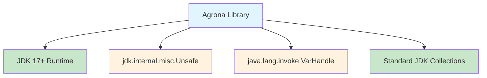
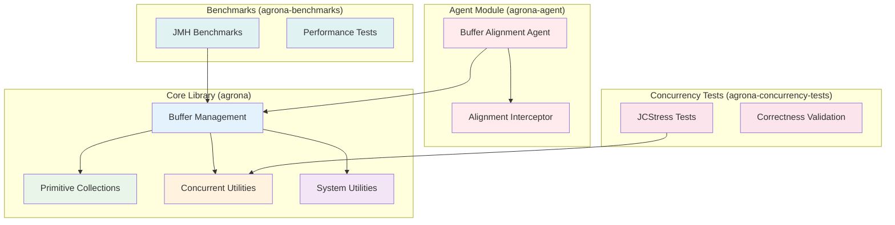
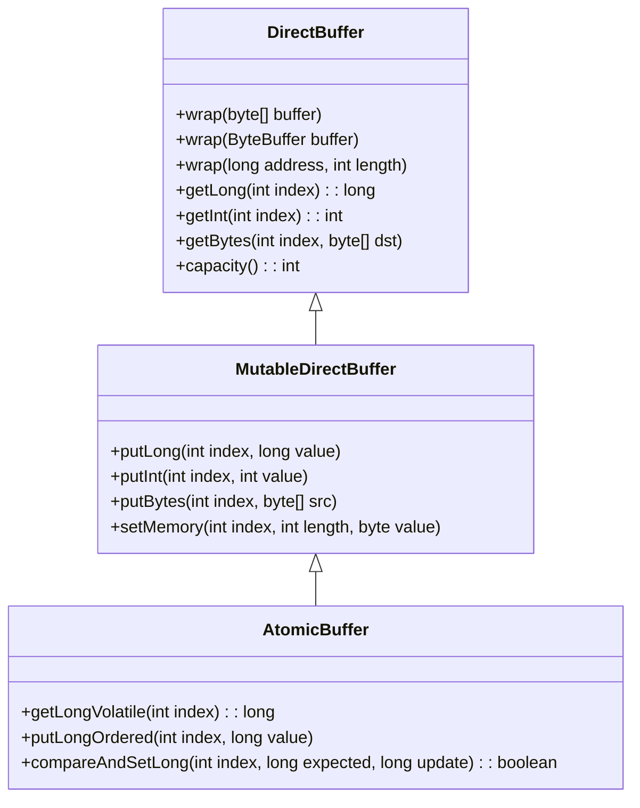
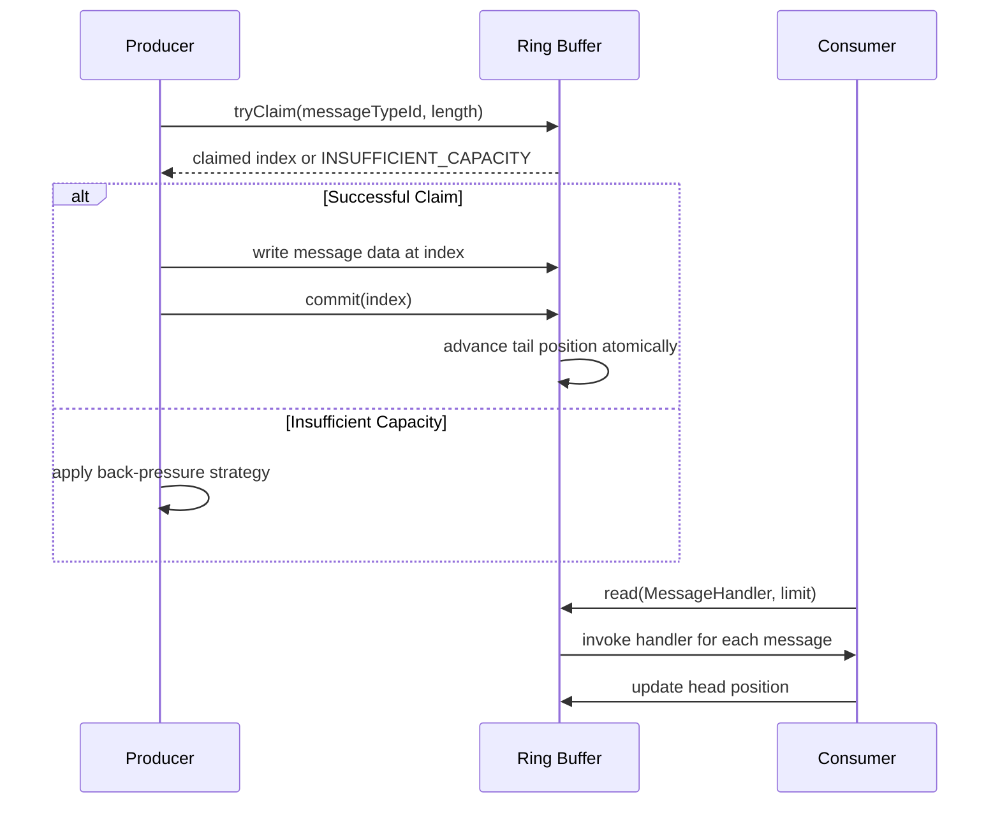
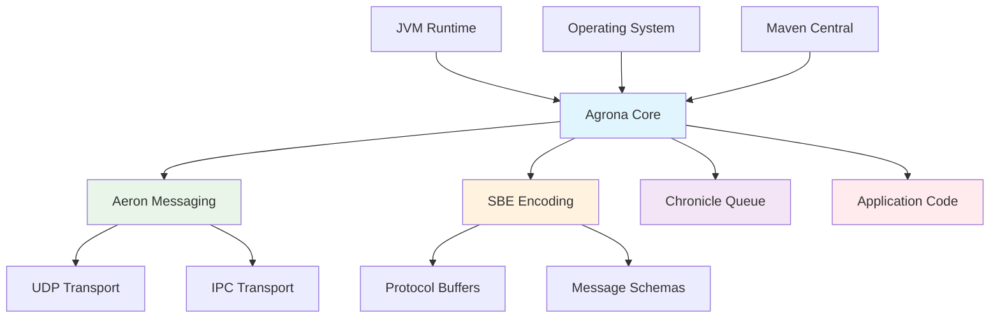

# System Design Architecture

## Table of Contents

1. [System Overview](#1-system-overview)
2. [Architectural Principles](#2-architectural-principles)
3. [Component Architecture](#3-component-architecture)
4. [Module Structure](#4-module-structure)
5. [Integration Patterns](#5-integration-patterns)
6. [Design Decisions](#6-design-decisions)
7. [Performance Considerations](#7-performance-considerations)
8. [References](#8-references)

---

## 1. System Overview

### 1.1 Business Context

Agrona is a high-performance, zero-dependency Java library designed to address the fundamental performance bottlenecks in standard Java collections and utilities. The library serves as the foundational layer for microsecond-latency applications in finance, telecommunications, gaming, and real-time analytics.

> Source: Technical Specification Section 1.1.1

### 1.2 Core Mission

The system provides essential data structures and utility methods for building low-latency applications that require:

- **Sub-microsecond latency**: Buffer operations completing in hundreds of nanoseconds
- **Zero garbage generation**: Steady-state operation without memory allocation pressure
- **Direct memory access**: Zero-copy operations through unified buffer abstractions
- **Lock-free concurrency**: Scalable concurrent data structures without coordination overhead

### 1.3 System Boundaries

The system operates within clearly defined boundaries:

- **JVM Runtime Boundary**: Operates within JVM execution constraints while accessing native memory through Unsafe API
- **Memory Management Boundary**: Provides unified abstractions over heap arrays, direct ByteBuffers, memory-mapped files, and off-heap memory regions
- **Process Communication Boundary**: Enables inter-process communication through memory-mapped files and shared memory buffers
- **Module Integration Boundary**: Maintains clean separation between core library, agent instrumentation, benchmarking, and testing components

---

## 2. Architectural Principles

### 2.1 Zero-Dependency Philosophy

The entire system is built on a **zero external dependencies** principle, ensuring:

- **Minimal overhead**: No runtime dependencies beyond JDK
- **Version conflict elimination**: No dependency version conflicts in enterprise environments
- **Maximum portability**: Works across all Java 17+ environments
- **Deployment simplicity**: Single JAR artifact with complete functionality



### 2.2 Direct Memory Access Pattern

The system leverages direct memory manipulation for optimal performance:

- **Unsafe API Integration**: Uses `jdk.internal.misc.Unsafe` for zero-copy buffer operations
- **VarHandle Fallback**: Provides `java.lang.invoke.VarHandle` fallback for restricted environments
- **Memory Ordering Control**: Precise control over memory ordering semantics through atomic operations
- **Cache-Conscious Design**: Explicit cache-line padding and memory layout optimization

> Source: `agrona/src/main/java/org/agrona/DirectBuffer.java:54`

### 2.3 Lock-Free Concurrency Model

All concurrent operations follow lock-free principles:

- **Wait-Free Progress**: Guarantees progress for all threads without blocking
- **Compare-and-Swap Coordination**: Atomic operations for lock-free coordination
- **Memory Barriers**: Proper memory ordering through fences and acquire/release semantics
- **Back-Pressure Mechanisms**: Capacity-based flow control without thread blocking

### 2.4 Type Specialization Strategy

Eliminates generic type overhead through code generation:

- **Primitive-Specific Implementations**: Specialized collections for int, long, double, etc.
- **Zero Boxing Overhead**: Direct primitive operations without wrapper objects
- **Template-Style Performance**: Achieves C++ template performance within Java type system
- **Compile-Time Optimization**: JIT compiler can fully optimize specialized code paths

---

## 3. Component Architecture

### 3.1 High-Level Component Overview



### 3.2 Buffer Management Component

The foundational layer providing unified memory abstractions:

**Core Interfaces:**
- `DirectBuffer`: Read-only buffer operations
- `MutableDirectBuffer`: Write-capable buffer operations
- `AtomicBuffer`: Atomic operations with memory ordering

**Key Implementations:**
- `UnsafeBuffer`: Direct memory access implementation
- `ExpandableArrayBuffer`: Dynamic heap-based buffers
- `ExpandableDirectByteBuffer`: Dynamic off-heap buffers

> Source: `agrona/src/main/java/org/agrona/DirectBuffer.java:29`  
> Source: `agrona/src/main/java/org/agrona/MutableDirectBuffer.java:27`



### 3.3 Primitive Collections Component

Type-specialized collections eliminating boxing overhead:

**Hash-Based Collections:**
- `Int2IntHashMap`, `Long2LongHashMap`: Primitive key-value mappings
- `IntHashSet`, `LongHashSet`: Primitive set implementations
- `Int2ObjectHashMap`, `Object2IntHashMap`: Mixed primitive-object mappings

**Array-Based Collections:**
- `IntArrayList`, `LongArrayList`: Dynamic primitive arrays
- `IntArrayQueue`: Queue implementation with primitive storage

**Specialized Collections:**
- `Int2IntCounterMap`: Metrics collection with primitive counters
- `BiInt2ObjectMap`: Composite key mappings for complex scenarios

> Source: Technical Specification Section 5.2.2

### 3.4 Concurrent Utilities Component

Lock-free data structures for high-throughput scenarios:

**Ring Buffer Implementations:**
- `OneToOneRingBuffer`: Single producer, single consumer optimization
- `ManyToOneRingBuffer`: Multiple producers, single consumer support
- `ManyToManyRingBuffer`: Full multi-producer, multi-consumer capability

**Queue Implementations:**
- `MpscArrayQueue`: Multi-producer, single consumer bounded queue
- `SpscArrayQueue`: Single producer, single consumer optimized queue
- `MpscLinkedQueue`: Unbounded linked queue for unlimited capacity

**Agent Framework:**
- `Agent`: Core interface for concurrent task execution
- `AgentRunner`: Thread lifecycle management with idle strategies
- `IdleStrategy`: Pluggable CPU utilization strategies



### 3.5 System Utilities Component

Infrastructure and helper utilities:

**Core System Utilities:**
- `SystemUtil`: OS detection, process information, thread dumps
- `IoUtil`: Memory-mapped file operations, file manipulation
- `CloseHelper`: Resource cleanup with exception handling

**Memory Management:**
- `BufferUtil`: Buffer allocation, alignment, cleanup operations
- `UnsafeApi`: Safe wrapper around Unsafe API operations

**Performance Utilities:**
- `EpochClock`, `NanoClock`: High-resolution timing
- `IdGenerator`: Snowflake-based unique ID generation
- `SignalBarrier`: Signal handling for graceful shutdown

> Source: `agrona/src/main/java/org/agrona/SystemUtil.java:34`  
> Source: `agrona/src/main/java/org/agrona/BufferUtil.java:28`

---

## 4. Module Structure

### 4.1 Module Overview

The system is organized into four distinct modules, each serving a specific purpose:

| Module | Purpose | Key Components | Dependencies |
|--------|---------|---------------|-------------|
| **agrona** | Core library functionality | Buffer management, collections, concurrent utilities | JDK 17+ only |
| **agrona-agent** | Runtime instrumentation | Buffer alignment verification | ByteBuddy, agrona |
| **agrona-benchmarks** | Performance validation | JMH benchmarks, performance tests | JMH, agrona |
| **agrona-concurrency-tests** | Correctness validation | JCStress tests, concurrency verification | JCStress, agrona |

### 4.2 Core Module (agrona)

**Package Structure:**
```
org.agrona/
├── buffer/           # Buffer implementations and utilities
├── collections/      # Primitive specialized collections
├── concurrent/       # Lock-free concurrent data structures
├── generation/       # Code generation utilities
├── hints/           # Performance hints and optimizations
├── io/              # I/O utilities and stream wrappers
├── nio/             # NIO channel utilities
└── sbe/             # SBE (Simple Binary Encoding) support
```

**Key Design Patterns:**
- **Interface Segregation**: Clean separation between read-only and mutable operations
- **Template Method**: Specialized implementations for different primitive types
- **Factory Pattern**: Buffer creation and configuration management
- **Strategy Pattern**: Pluggable idle strategies and hashing algorithms

### 4.3 Agent Module (agrona-agent)

**Purpose:** Runtime verification of buffer alignment constraints

**Key Components:**
- `BufferAlignmentAgent`: ByteBuddy-based instrumentation agent
- `BufferAlignmentInterceptor`: Method interception for alignment verification
- Type-specific verifiers for different primitive access patterns

**Usage Pattern:**
```bash
java -javaagent:agrona-agent.jar -jar your-application.jar
```

> Source: `agrona-agent/src/main/java/org/agrona/agent/BufferAlignmentAgent.java:54`

### 4.4 Benchmarks Module (agrona-benchmarks)

**Purpose:** Performance validation and regression detection

**JMH Benchmark Categories:**
- Buffer operation latency measurements
- Collection performance comparisons
- Concurrent data structure throughput
- Memory allocation profiling

**CI/CD Integration:**
- Automated benchmark execution on pull requests
- Performance regression detection
- Historical performance trend analysis

### 4.5 Concurrency Tests Module (agrona-concurrency-tests)

**Purpose:** Correctness validation under concurrent load

**JCStress Test Categories:**
- Ring buffer producer-consumer correctness
- Atomic operation ordering verification
- Memory visibility validation
- Race condition detection

**Continuous Validation:**
- Multi-core test execution
- Platform-specific validation (x86, ARM)
- JVM version compatibility testing

---

## 5. Integration Patterns

### 5.1 External System Integration

The system integrates with several external systems and frameworks:



### 5.2 Memory-Mapped Integration Pattern

**Inter-Process Communication:**
- Ring buffers backed by memory-mapped files
- Cross-process visibility without system calls
- Atomic operations for coordination across processes

**Implementation:**
```java
// Memory-mapped ring buffer for IPC
AtomicBuffer buffer = new UnsafeBuffer(mappedByteBuffer);
ManyToOneRingBuffer ringBuffer = new ManyToOneRingBuffer(buffer);
```

### 5.3 Zero-Copy Integration Pattern

**Direct Buffer Operations:**
- No intermediate copying between memory regions
- Unified abstraction over different memory sources
- Atomic operations with controlled memory ordering

**Usage Pattern:**
```java
// Zero-copy message processing
DirectBuffer message = ringBuffer.read(
    (msgTypeId, buffer, index, length) -> {
        // Process message directly in buffer
        int value = buffer.getInt(index);
        // No copying required
    }
);
```

### 5.4 Agent Integration Pattern

**Runtime Instrumentation:**
- ByteBuddy-based method interception
- Alignment verification for development environments
- Performance overhead measurement and reporting

**Configuration:**
```java
// Agent configuration for alignment checking
-javaagent:agrona-agent.jar
-Dagrona.disable.bounds.checks=false
```

> Source: `agrona/src/main/java/org/agrona/DirectBuffer.java:46`

---

## 6. Design Decisions

### 6.1 Memory Management Strategy

**Decision:** Use `jdk.internal.misc.Unsafe` for direct memory access

**Rationale:**
- Provides zero-copy operations essential for microsecond latency
- Enables cache-line aligned memory allocation
- Allows atomic operations on arbitrary memory addresses
- Eliminates JVM safety checks in performance-critical paths

**Trade-offs:**
- Dependency on internal JDK API (mitigated by VarHandle fallback)
- Platform-specific behavior (addressed through extensive testing)
- Increased complexity in memory management (managed through abstractions)

### 6.2 Concurrency Model Selection

**Decision:** Implement lock-free algorithms with compare-and-swap operations

**Rationale:**
- Guarantees progress without thread blocking
- Eliminates context switching overhead
- Provides predictable latency characteristics
- Scales linearly with CPU cores

**Implementation Patterns:**
- Single-writer scenarios use relaxed ordering for performance
- Multi-writer scenarios use full memory barriers for correctness
- Back-pressure through capacity checking rather than blocking

### 6.3 Type Specialization Approach

**Decision:** Generate specialized implementations for primitive types

**Rationale:**
- Eliminates boxing/unboxing overhead completely
- Enables JIT compiler optimizations
- Reduces memory footprint significantly
- Provides type safety without performance penalty

**Code Generation Strategy:**
- Template-based source generation
- Compile-time specialization for all primitive types
- Runtime type checking through interface boundaries

### 6.4 Zero-Dependency Philosophy

**Decision:** Eliminate all external runtime dependencies

**Rationale:**
- Simplifies deployment and reduces classpath conflicts
- Ensures consistent behavior across environments
- Minimizes security surface area
- Enables usage in restricted environments

**Implementation Approach:**
- Reimplement required functionality within library boundaries
- Use only JDK standard library APIs
- Provide fallback implementations for restricted environments

---

## 7. Performance Considerations

### 7.1 Latency Optimization

**Target Performance:**
- Sub-microsecond buffer operations
- Nanosecond-level precision timing
- Minimal allocation in steady-state operation

**Optimization Techniques:**
- Cache-line padding prevents false sharing
- Memory prefetching for sequential access patterns
- Batch operations to amortize overhead
- Compile-time constant folding for configuration

### 7.2 Throughput Optimization

**Scalability Targets:**
- Linear scaling with CPU cores
- Millions of operations per second per core
- Minimal coordination overhead

**Design Patterns:**
- Single-writer patterns where possible
- Batching for multi-consumer scenarios
- Work-stealing for load balancing
- Memory-efficient data structures

### 7.3 Memory Efficiency

**Memory Usage Patterns:**
- Pre-allocation of buffers and data structures
- Object pooling for reusable components
- Compact memory layouts for cache efficiency
- Off-heap storage for large data sets

**Garbage Collection Impact:**
- Zero allocation in steady-state operation
- Minimal object creation during initialization
- Weak references for cache implementations
- Explicit resource cleanup patterns

---

## 8. References

### 8.1 Source Code References

- **DirectBuffer Interface**: `agrona/src/main/java/org/agrona/DirectBuffer.java`
- **MutableDirectBuffer Interface**: `agrona/src/main/java/org/agrona/MutableDirectBuffer.java`
- **SystemUtil Class**: `agrona/src/main/java/org/agrona/SystemUtil.java`
- **BufferUtil Class**: `agrona/src/main/java/org/agrona/BufferUtil.java`
- **BufferAlignmentAgent**: `agrona-agent/src/main/java/org/agrona/agent/BufferAlignmentAgent.java`

### 8.2 Technical Specification References

- **Executive Summary**: Technical Specification Section 1.1
- **System Overview**: Technical Specification Section 1.2
- **High-Level Architecture**: Technical Specification Section 5.1
- **Component Details**: Technical Specification Section 5.2

### 8.3 External Documentation

- **Aeron Documentation**: https://github.com/real-logic/aeron
- **SBE Documentation**: https://github.com/real-logic/simple-binary-encoding
- **JMH Documentation**: https://github.com/openjdk/jmh
- **JCStress Documentation**: https://github.com/openjdk/jcstress

---

*This document represents the comprehensive system design architecture for the Agrona high-performance Java library. It serves as the authoritative reference for understanding the system's architecture, design decisions, and integration patterns.*