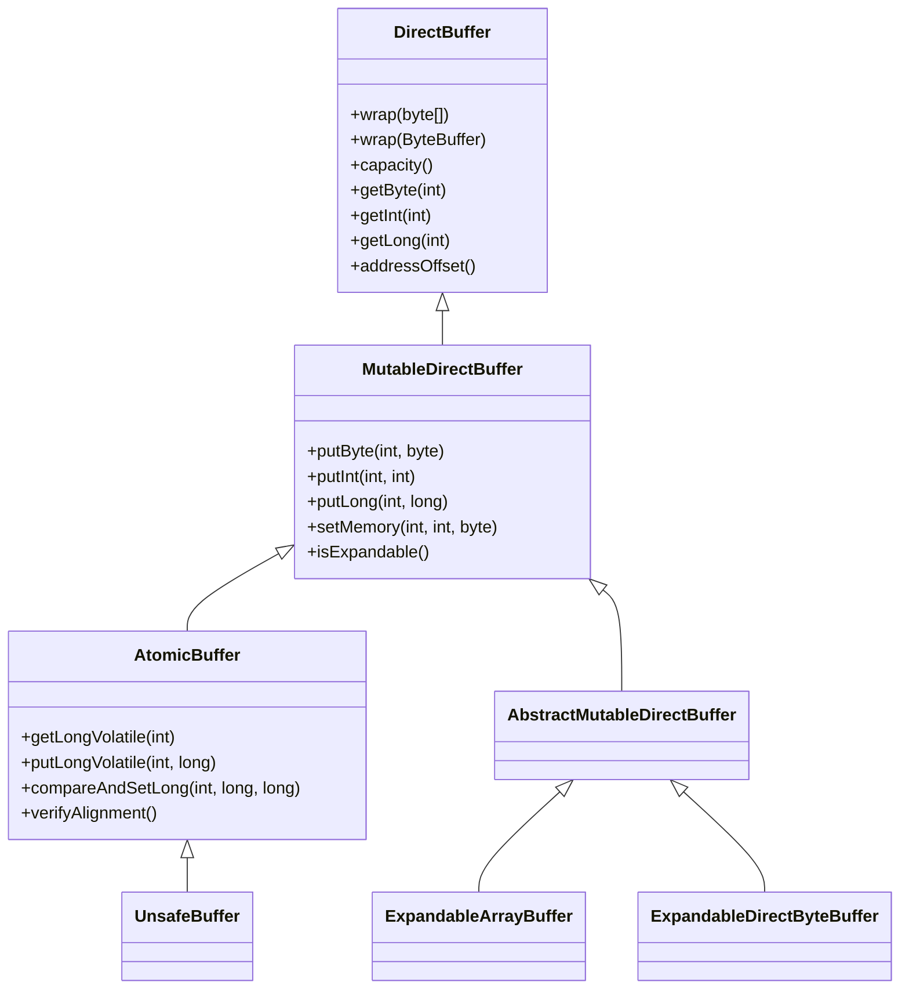

# Buffer Operations Guide

> **Comprehensive guide to buffer operations in Agrona for high-performance, zero-copy memory management**

## Table of Contents

1. [Introduction](#1-introduction)
2. [Zero-Copy Techniques](#2-zero-copy-techniques)
3. [Memory-Mapped File Operations](#3-memory-mapped-file-operations)
4. [Buffer Expansion Strategies](#4-buffer-expansion-strategies)
5. [Alignment Requirements and Enforcement](#5-alignment-requirements-and-enforcement)
6. [Atomic Buffer Operations](#6-atomic-buffer-operations)
7. [Buffer Lifecycle Management](#7-buffer-lifecycle-management)
8. [Heap vs Off-Heap Performance Comparison](#8-heap-vs-off-heap-performance-comparison)
9. [Best Practices](#9-best-practices)
10. [Common Patterns and Examples](#10-common-patterns-and-examples)

---

## 1. Introduction

Agrona's buffer system provides the foundation for high-performance, zero-copy operations essential for low-latency applications. This guide covers the comprehensive buffer operations available in Agrona, from basic read/write operations to advanced atomic memory semantics.

### 1.1 Buffer Hierarchy Overview

The Agrona buffer system is built around a clear hierarchy of interfaces and implementations:



> **Source**: `/agrona/src/main/java/org/agrona/DirectBuffer.java:29`

---

## 2. Zero-Copy Techniques

Zero-copy operations eliminate unnecessary data copying by providing direct access to underlying memory, whether on-heap or off-heap.

### 2.1 Understanding Zero-Copy Philosophy

Zero-copy in Agrona means:
- **Direct Memory Access**: No intermediate copying between user space and buffer space
- **View-Based Operations**: Buffers provide views over existing memory regions
- **Minimal Object Allocation**: Operations avoid creating temporary objects

### 2.2 Buffer Wrapping Techniques

#### 2.2.1 Wrapping Byte Arrays

```java
import org.agrona.concurrent.UnsafeBuffer;

// Create a zero-copy view over a byte array
byte[] data = new byte[1024];
UnsafeBuffer buffer = new UnsafeBuffer();
buffer.wrap(data);

// Direct access without copying
int value = buffer.getInt(0);
buffer.putInt(4, 42);
```

> **Source**: `/agrona/src/main/java/org/agrona/DirectBuffer.java:58-72`

#### 2.2.2 Wrapping ByteBuffers

```java
import java.nio.ByteBuffer;
import org.agrona.concurrent.UnsafeBuffer;

// Zero-copy wrapping of direct ByteBuffer
ByteBuffer directBuffer = ByteBuffer.allocateDirect(1024);
UnsafeBuffer buffer = new UnsafeBuffer();
buffer.wrap(directBuffer);

// Access the underlying memory directly
long address = buffer.addressOffset();
int capacity = buffer.capacity();
```

> **Source**: `/agrona/src/main/java/org/agrona/DirectBuffer.java:74-98`

#### 2.2.3 Address-Based Wrapping

```java
import org.agrona.concurrent.UnsafeBuffer;

// Direct memory address wrapping (advanced usage)
long memoryAddress = // ... obtained from unsafe allocation
int length = 4096;

UnsafeBuffer buffer = new UnsafeBuffer();
buffer.wrap(memoryAddress, length);

// Direct memory manipulation
buffer.putLong(0, System.nanoTime());
```

> **Source**: `/agrona/src/main/java/org/agrona/DirectBuffer.java:117-122`

### 2.3 Bounds Checking Control

Agrona provides configurable bounds checking for optimal performance:

```java
// Disable bounds checks for maximum performance (production)
System.setProperty("agrona.disable.bounds.checks", "true");

// Enable bounds checks for development and debugging
System.setProperty("agrona.disable.bounds.checks", "false");
```

> **Source**: `/agrona/src/main/java/org/agrona/DirectBuffer.java:42-55`

### 2.4 Zero-Copy String Operations

```java
import org.agrona.concurrent.UnsafeBuffer;

UnsafeBuffer buffer = new UnsafeBuffer(new byte[256]);

// Zero-copy ASCII string encoding with length prefix
int bytesWritten = buffer.putStringAscii(0, "Hello, Agrona!");

// Zero-copy ASCII string decoding
String decoded = buffer.getStringAscii(0);

// Without length prefix for fixed-format protocols
int length = buffer.putStringWithoutLengthAscii(16, "Fixed");
String fixed = buffer.getStringWithoutLengthAscii(16, length);
```

> **Source**: `/agrona/src/main/java/org/agrona/MutableDirectBuffer.java:268-396`

---

## 3. Memory-Mapped File Operations

Memory-mapped files provide zero-copy access to file-backed storage, essential for persistent buffers and IPC.

### 3.1 Creating Memory-Mapped Files

#### 3.1.1 Mapping New Files

```java
import java.io.File;
import java.nio.MappedByteBuffer;
import org.agrona.IoUtil;
import org.agrona.concurrent.UnsafeBuffer;

// Create a new memory-mapped file
File dataFile = new File("/tmp/agrona-buffer.dat");
long fileSize = 1024 * 1024; // 1MB

MappedByteBuffer mappedBuffer = IoUtil.mapNewFile(dataFile, fileSize);
UnsafeBuffer buffer = new UnsafeBuffer();
buffer.wrap(mappedBuffer);

// Zero-copy operations on file-backed memory
buffer.putLong(0, System.currentTimeMillis());
buffer.putInt(8, 42);
```

> **Source**: `/agrona/src/main/java/org/agrona/IoUtil.java:400-438`

#### 3.1.2 Mapping Existing Files

```java
import java.nio.channels.FileChannel;
import org.agrona.IoUtil;

// Map existing file for read-write access
File existingFile = new File("/path/to/existing/file.dat");
MappedByteBuffer mapped = IoUtil.mapExistingFile(
    existingFile, 
    FileChannel.MapMode.READ_WRITE,
    "data-file"
);

UnsafeBuffer buffer = new UnsafeBuffer();
buffer.wrap(mapped);
```

> **Source**: `/agrona/src/main/java/org/agrona/IoUtil.java:336-352`

#### 3.1.3 Partial File Mapping

```java
// Map only a portion of a large file
long offset = 4096;  // Start at 4KB
long length = 1024 * 1024;  // Map 1MB

MappedByteBuffer partialMap = IoUtil.mapExistingFile(
    largeFile,
    FileChannel.MapMode.READ_ONLY,
    "large-file-section",
    offset,
    length
);
```

> **Source**: `/agrona/src/main/java/org/agrona/IoUtil.java:368-388`

### 3.2 Memory-Mapped Buffer Operations

#### 3.2.1 Force and Load Operations

```java
import java.nio.MappedByteBuffer;

// Ensure data is written to storage
MappedByteBuffer mapped = // ... obtained from mapping
mapped.force();  // Synchronous write to storage

// Hint to load pages into memory
mapped.load();   // Asynchronous load into RAM

// Check if buffer is resident in memory
boolean isLoaded = mapped.isLoaded();
```

### 3.2.2 File-Backed Ring Buffers

```java
import org.agrona.concurrent.ringbuffer.OneToOneRingBuffer;
import org.agrona.concurrent.UnsafeBuffer;

// Create persistent ring buffer using memory-mapped file
File ringFile = new File("/tmp/ring-buffer.dat");
int ringSize = 1024 * 1024;

MappedByteBuffer mappedBuffer = IoUtil.mapNewFile(ringFile, ringSize);
UnsafeBuffer buffer = new UnsafeBuffer();
buffer.wrap(mappedBuffer);

OneToOneRingBuffer ringBuffer = new OneToOneRingBuffer(buffer);

// Ring buffer operations are now persistent
ringBuffer.write(1, buffer, 0, 64);  // Survives process restart
```

### 3.3 Cleanup and Resource Management

```java
// Proper cleanup of memory-mapped buffers
try {
    // Unmap the buffer to release resources
    IoUtil.unmap(mappedBuffer);
} finally {
    // Ensure file handles are released
    mappedBuffer = null;
}
```

> **Source**: `/agrona/src/main/java/org/agrona/IoUtil.java:457-477`

---

## 4. Buffer Expansion Strategies

Agrona provides expandable buffers that grow dynamically while maintaining performance characteristics.

### 4.1 Heap-Based Expandable Buffers

#### 4.1.1 ExpandableArrayBuffer Basics

```java
import org.agrona.ExpandableArrayBuffer;

// Create expandable heap buffer with default initial capacity
ExpandableArrayBuffer buffer = new ExpandableArrayBuffer();
// Default initial capacity: 128 bytes

// Create with custom initial capacity
ExpandableArrayBuffer customBuffer = new ExpandableArrayBuffer(4096);

// Automatic expansion on write beyond capacity
buffer.putLong(0, 1L);     // Within initial capacity
buffer.putLong(1000, 2L);  // Triggers expansion
int newCapacity = buffer.capacity();  // Now >= 1008 bytes
```

> **Source**: `/agrona/src/main/java/org/agrona/ExpandableArrayBuffer.java:46-63`

#### 4.1.2 Expansion Algorithm

```java
// Expansion follows a growth strategy:
// newCapacity = Math.max(currentCapacity, 2)
// while (newCapacity < requiredLength) {
//     newCapacity = newCapacity + (newCapacity >> 1);  // 1.5x growth
// }

// Maximum expansion limit
int maxCapacity = ExpandableArrayBuffer.MAX_ARRAY_LENGTH;  // Integer.MAX_VALUE - 8
```

> **Source**: `/agrona/src/main/java/org/agrona/ExpandableArrayBuffer.java:186-201`

### 4.2 Direct Memory Expandable Buffers

#### 4.2.1 ExpandableDirectByteBuffer Usage

```java
import org.agrona.ExpandableDirectByteBuffer;

// Off-heap expandable buffer
ExpandableDirectByteBuffer directBuffer = new ExpandableDirectByteBuffer();

// Automatic off-heap expansion
directBuffer.putInt(0, 42);
directBuffer.putLong(8192, System.nanoTime());  // Triggers expansion

// Check if buffer is expandable
boolean canExpand = directBuffer.isExpandable();  // true
```

> **Source**: `/agrona/src/main/java/org/agrona/ExpandableDirectByteBuffer.java`

### 4.3 Capacity Management

#### 4.3.1 Explicit Capacity Ensurance

```java
import org.agrona.ExpandableArrayBuffer;

ExpandableArrayBuffer buffer = new ExpandableArrayBuffer();

// Ensure minimum capacity before bulk operations
int requiredCapacity = 64 * 1024;  // 64KB
buffer.ensureCapacity(requiredCapacity);

// Now safe to write up to requiredCapacity without expansion
for (int i = 0; i < requiredCapacity / 8; i++) {
    buffer.putLong(i * 8, i);
}
```

#### 4.3.2 Monitoring Capacity Changes

```java
ExpandableArrayBuffer buffer = new ExpandableArrayBuffer(256);
int initialCapacity = buffer.capacity();

// Perform operations that might trigger expansion
buffer.putBytes(0, new byte[1024]);

int finalCapacity = buffer.capacity();
if (finalCapacity > initialCapacity) {
    System.out.printf("Buffer expanded from %d to %d bytes%n", 
                      initialCapacity, finalCapacity);
}
```

### 4.4 Performance Considerations

#### 4.4.1 Pre-sizing for Known Workloads

```java
// Best practice: pre-size if maximum size is known
int expectedMaxSize = calculateMaxMessageSize();
ExpandableArrayBuffer buffer = new ExpandableArrayBuffer(expectedMaxSize);

// Avoids expansion overhead during critical path
processMessages(buffer);
```

#### 4.4.2 Expansion Frequency Analysis

```java
// Monitor expansion events for performance tuning
class BufferMetrics {
    private int expansionCount = 0;
    private final ExpandableArrayBuffer buffer;
    
    public BufferMetrics(int initialCapacity) {
        this.buffer = new ExpandableArrayBuffer(initialCapacity) {
            @Override
            protected void ensureCapacity(int index, int length) {
                int oldCapacity = capacity();
                super.ensureCapacity(index, length);
                if (capacity() > oldCapacity) {
                    expansionCount++;
                }
            }
        };
    }
    
    public int getExpansionCount() { return expansionCount; }
}
```

---

## 5. Alignment Requirements and Enforcement

Memory alignment is critical for atomic operations and optimal performance across different CPU architectures.

### 5.1 Understanding Alignment Requirements

#### 5.1.1 Cache Line Alignment

```java
import org.agrona.BitUtil;

// Cache line length (typically 64 bytes)
int cacheLineLength = BitUtil.CACHE_LINE_LENGTH;

// Align value to cache line boundary
int unalignedSize = 100;
int alignedSize = BitUtil.align(unalignedSize, cacheLineLength);
// alignedSize = 128 (next multiple of 64)

// Check if address is aligned
long address = buffer.addressOffset();
boolean isAligned = BitUtil.isAligned(address, BitUtil.SIZE_OF_LONG);
```

> **Source**: `/agrona/src/main/java/org/agrona/BitUtil.java:69-71`, `/agrona/src/main/java/org/agrona/BitUtil.java:414-422`

#### 5.1.2 Atomic Operation Alignment

```java
import org.agrona.concurrent.AtomicBuffer;
import org.agrona.concurrent.UnsafeBuffer;

// Atomic buffers require proper alignment
UnsafeBuffer buffer = new UnsafeBuffer(new byte[1024]);

// Verify alignment for atomic operations
buffer.verifyAlignment();  // Throws if not properly aligned

// Alignment requirement for atomic operations
int requiredAlignment = AtomicBuffer.ALIGNMENT;  // 8 bytes
```

> **Source**: `/agrona/src/main/java/org/agrona/concurrent/AtomicBuffer.java:49-101`

### 5.2 Aligned Buffer Allocation

#### 5.2.1 Creating Aligned Direct Buffers

```java
import org.agrona.BufferUtil;
import java.nio.ByteBuffer;

// Allocate aligned direct buffer
int capacity = 4096;
int alignment = 64;  // Cache line alignment

ByteBuffer alignedBuffer = BufferUtil.allocateDirectAligned(capacity, alignment);

// Verify alignment
long address = BufferUtil.address(alignedBuffer);
boolean isAligned = (address % alignment) == 0;  // Should be true
```

> **Source**: `/agrona/src/main/java/org/agrona/BufferUtil.java:169-185`

### 5.3 Alignment Checking and Validation

#### 5.3.1 Runtime Alignment Verification

```java
import org.agrona.BitUtil;

// Check if value is power of two (valid alignment)
boolean validAlignment = BitUtil.isPowerOfTwo(64);  // true
boolean invalidAlignment = BitUtil.isPowerOfTwo(100);  // false

// Align to specific boundary
int value = 123;
int aligned4 = BitUtil.align(value, 4);    // 124
int aligned8 = BitUtil.align(value, 8);    // 128
long aligned64 = BitUtil.align(123L, 64L); // 128
```

> **Source**: `/agrona/src/main/java/org/agrona/BitUtil.java:325-338`, `/agrona/src/main/java/org/agrona/BitUtil.java:156-175`

#### 5.3.2 Buffer Alignment Agent

```java
// Enable runtime alignment checking with BufferAlignmentAgent
// JVM flag: -javaagent:agrona-agent.jar

// Agent automatically validates all buffer operations
UnsafeBuffer buffer = new UnsafeBuffer(new byte[1024]);

// These operations are checked for alignment:
buffer.putLongVolatile(0, 42L);    // OK - index 0 is 8-byte aligned
buffer.putLongVolatile(1, 42L);    // Throws - index 1 is not 8-byte aligned
buffer.putIntVolatile(4, 100);     // OK - index 4 is 4-byte aligned
buffer.putIntVolatile(6, 100);     // Throws - index 6 is not 4-byte aligned
```

### 5.4 Platform-Specific Alignment

#### 5.4.1 Architecture-Aware Alignment

```java
import org.agrona.concurrent.AtomicBuffer;

// Strict alignment checks are platform-dependent
boolean strictChecks = AtomicBuffer.STRICT_ALIGNMENT_CHECKS;

// On x64: controlled by system property (default: false)
// On other platforms: always true

// Control strict checking on x64
System.setProperty("agrona.strict.alignment.checks", "true");
```

> **Source**: `/agrona/src/main/java/org/agrona/concurrent/AtomicBuffer.java:60-72`

---

## 6. Atomic Buffer Operations

Atomic operations provide thread-safe memory access with explicit memory ordering semantics.

### 6.1 Memory Ordering Semantics

#### 6.1.1 Volatile Operations (Sequential Consistency)

```java
import org.agrona.concurrent.UnsafeBuffer;

UnsafeBuffer buffer = new UnsafeBuffer(new byte[1024]);

// Sequential consistency operations
long value = buffer.getLongVolatile(0);      // Full memory barrier
buffer.putLongVolatile(8, System.nanoTime()); // Full memory barrier

// All threads see consistent ordering of these operations
int intValue = buffer.getIntVolatile(16);
buffer.putIntVolatile(20, 42);
```

> **Source**: `/agrona/src/main/java/org/agrona/concurrent/AtomicBuffer.java:104-130`

#### 6.1.2 Acquire-Release Semantics

```java
// Acquire-release provides ordering without full barriers
// More efficient than volatile for producer-consumer patterns

// Producer thread
buffer.putLongRelease(0, dataReady);  // Release: all previous writes visible

// Consumer thread  
while (buffer.getLongAcquire(0) == 0) {
    // Acquire: all subsequent reads see published data
    Thread.onSpinWait();
}
long data = buffer.getLong(8);  // Guaranteed to see producer's writes
```

> **Source**: `/agrona/src/main/java/org/agrona/concurrent/AtomicBuffer.java:114-150`

#### 6.1.3 Opaque Operations (Coherence Without Ordering)

```java
// Opaque operations ensure visibility without ordering guarantees
// Useful for metrics and monotonic counters

buffer.putLongOpaque(0, counter++);     // Visible but no ordering
long current = buffer.getLongOpaque(0); // Latest value visible
```

> **Source**: `/agrona/src/main/java/org/agrona/concurrent/AtomicBuffer.java:167-195`

### 6.2 Compare-and-Swap Operations

#### 6.2.1 Basic CAS Operations

```java
// Atomic compare-and-set for lock-free algorithms
long expectedValue = 100L;
long newValue = 200L;
int index = 0;

boolean success = buffer.compareAndSetLong(index, expectedValue, newValue);
if (success) {
    // Value was 100 and is now 200
} else {
    // Value was not 100, operation failed
}
```

> **Source**: `/agrona/src/main/java/org/agrona/concurrent/AtomicBuffer.java:218-219`

#### 6.2.2 Compare-and-Exchange

```java
// Get the actual value regardless of CAS success
long expectedValue = 100L;
long newValue = 200L;

long actualValue = buffer.compareAndExchangeLong(0, expectedValue, newValue);
// actualValue is the value that was in the buffer
// If actualValue == expectedValue, the exchange succeeded
```

> **Source**: `/agrona/src/main/java/org/agrona/concurrent/AtomicBuffer.java:222-232`

### 6.3 Atomic Arithmetic Operations

#### 6.3.1 Get-and-Set Operations

```java
// Atomic exchange returning previous value
long previousValue = buffer.getAndSetLong(0, 42L);
int previousInt = buffer.getAndSetInt(8, 100);

// Atomic increment/decrement
long previousCount = buffer.getAndAddLong(16, 1L);    // Increment by 1
int decremented = buffer.getAndAddInt(20, -5);        // Decrement by 5
```

> **Source**: `/agrona/src/main/java/org/agrona/concurrent/AtomicBuffer.java:242-255`

#### 6.3.2 Add-with-Release Semantics

```java
// Add with release semantics (more efficient than volatile)
long previousValue = buffer.addLongRelease(0, 1L);

// Useful for counters where ordering matters
class AtomicCounter {
    private final AtomicBuffer buffer;
    private final int offset;
    
    public long increment() {
        return buffer.addLongRelease(offset, 1L) + 1L;
    }
    
    public long get() {
        return buffer.getLongAcquire(offset);
    }
}
```

> **Source**: `/agrona/src/main/java/org/agrona/concurrent/AtomicBuffer.java:198-207`

### 6.4 Lock-Free Data Structure Patterns

#### 6.4.1 Lock-Free Stack

```java
public class LockFreeStack {
    private final AtomicBuffer buffer;
    private static final int HEAD_OFFSET = 0;
    
    public void push(long value) {
        int nextIndex = allocateNode();
        buffer.putLong(nextIndex, value);
        
        long head;
        do {
            head = buffer.getLongVolatile(HEAD_OFFSET);
            buffer.putLong(nextIndex + 8, head);  // next pointer
        } while (!buffer.compareAndSetLong(HEAD_OFFSET, head, nextIndex));
    }
    
    public long pop() {
        long head;
        long next;
        do {
            head = buffer.getLongVolatile(HEAD_OFFSET);
            if (head == 0) return -1;  // Empty
            next = buffer.getLong(head + 8);
        } while (!buffer.compareAndSetLong(HEAD_OFFSET, head, next));
        
        return buffer.getLong(head);
    }
}
```

---

## 7. Buffer Lifecycle Management

Proper buffer lifecycle management is essential for resource cleanup and memory leak prevention.

### 7.1 Buffer Creation Patterns

#### 7.1.1 Stack-Based Buffer Management

```java
// Short-lived buffers for method-local operations
public void processMessage(byte[] data) {
    UnsafeBuffer buffer = new UnsafeBuffer();
    buffer.wrap(data);
    
    try {
        // Process using buffer
        int messageType = buffer.getInt(0);
        long timestamp = buffer.getLong(4);
        processMessageContent(buffer, 12);
    } finally {
        // No explicit cleanup needed for heap-backed buffers
        buffer = null;
    }
}
```

#### 7.1.2 Pooled Buffer Management

```java
public class BufferPool {
    private final Queue<UnsafeBuffer> pool = new ConcurrentLinkedQueue<>();
    private final int bufferSize;
    
    public BufferPool(int bufferSize, int initialSize) {
        this.bufferSize = bufferSize;
        for (int i = 0; i < initialSize; i++) {
            pool.offer(new UnsafeBuffer(new byte[bufferSize]));
        }
    }
    
    public UnsafeBuffer acquire() {
        UnsafeBuffer buffer = pool.poll();
        if (buffer == null) {
            buffer = new UnsafeBuffer(new byte[bufferSize]);
        }
        return buffer;
    }
    
    public void release(UnsafeBuffer buffer) {
        // Clear sensitive data if needed
        buffer.setMemory(0, buffer.capacity(), (byte) 0);
        pool.offer(buffer);
    }
}
```

### 7.2 Direct Memory Management

#### 7.2.1 Direct Buffer Cleanup

```java
import org.agrona.BufferUtil;
import java.nio.ByteBuffer;

// Explicit cleanup of direct buffers
ByteBuffer directBuffer = ByteBuffer.allocateDirect(1024);
UnsafeBuffer buffer = new UnsafeBuffer();
buffer.wrap(directBuffer);

try {
    // Use buffer for operations
    performOperations(buffer);
} finally {
    // Explicit cleanup to avoid memory leaks
    BufferUtil.free(directBuffer);
    directBuffer = null;
    buffer = null;
}
```

> **Source**: `/agrona/src/main/java/org/agrona/BufferUtil.java:195-216`

#### 7.2.2 Memory-Mapped File Cleanup

```java
import org.agrona.IoUtil;

// Proper cleanup sequence for memory-mapped files
MappedByteBuffer mappedBuffer = null;
try {
    mappedBuffer = IoUtil.mapNewFile(file, size);
    UnsafeBuffer buffer = new UnsafeBuffer();
    buffer.wrap(mappedBuffer);
    
    // Use buffer...
    
} finally {
    if (mappedBuffer != null) {
        IoUtil.unmap(mappedBuffer);
        mappedBuffer = null;
    }
}
```

> **Source**: `/agrona/src/main/java/org/agrona/IoUtil.java:462-477`

### 7.3 Resource Management Patterns

#### 7.3.1 Try-with-Resources Pattern

```java
// Custom resource wrapper for automatic cleanup
public class ManagedBuffer implements AutoCloseable {
    private final ByteBuffer directBuffer;
    private final UnsafeBuffer buffer;
    
    public ManagedBuffer(int capacity) {
        this.directBuffer = ByteBuffer.allocateDirect(capacity);
        this.buffer = new UnsafeBuffer();
        this.buffer.wrap(directBuffer);
    }
    
    public UnsafeBuffer getBuffer() { return buffer; }
    
    @Override
    public void close() {
        BufferUtil.free(directBuffer);
    }
}

// Usage with automatic cleanup
try (ManagedBuffer managed = new ManagedBuffer(4096)) {
    UnsafeBuffer buffer = managed.getBuffer();
    // Use buffer...
} // Automatically cleaned up
```

#### 7.3.2 Weak Reference Tracking

```java
import java.lang.ref.WeakReference;
import java.util.concurrent.ConcurrentHashMap;

// Track direct buffers for cleanup monitoring
public class BufferTracker {
    private static final Map<WeakReference<ByteBuffer>, String> trackedBuffers = 
        new ConcurrentHashMap<>();
    
    public static ByteBuffer allocateTracked(int capacity, String label) {
        ByteBuffer buffer = ByteBuffer.allocateDirect(capacity);
        trackedBuffers.put(new WeakReference<>(buffer), label);
        return buffer;
    }
    
    public static void cleanup() {
        trackedBuffers.entrySet().removeIf(entry -> {
            ByteBuffer buffer = entry.getKey().get();
            if (buffer == null) {
                return true; // Reference was garbage collected
            }
            // Optionally force cleanup of unreferenced buffers
            return false;
        });
    }
}
```

---

## 8. Heap vs Off-Heap Performance Comparison

Understanding the performance characteristics of heap vs off-heap buffers is crucial for optimal system design.

### 8.1 Performance Characteristics Overview

| Aspect | Heap Buffers | Off-Heap Buffers |
|--------|--------------|-------------------|
| **Allocation Speed** | Very Fast | Slower |
| **Access Speed** | Fast | Fast (may be faster for large data) |
| **GC Impact** | Subject to GC | No GC impact |
| **Memory Limit** | Heap size limit | System memory limit |
| **Persistence** | No | Possible (memory-mapped) |
| **Inter-Process** | No | Yes (shared memory) |

### 8.2 Allocation Performance

#### 8.2.1 Allocation Benchmark

```java
public class AllocationBenchmark {
    private static final int ITERATIONS = 1_000_000;
    private static final int BUFFER_SIZE = 4096;
    
    public void benchmarkHeapAllocation() {
        long start = System.nanoTime();
        
        for (int i = 0; i < ITERATIONS; i++) {
            UnsafeBuffer buffer = new UnsafeBuffer(new byte[BUFFER_SIZE]);
            // Simulate usage
            buffer.putLong(0, i);
        }
        
        long duration = System.nanoTime() - start;
        System.out.printf("Heap allocation: %.2f ns/op%n", 
                         (double) duration / ITERATIONS);
    }
    
    public void benchmarkDirectAllocation() {
        long start = System.nanoTime();
        
        for (int i = 0; i < ITERATIONS; i++) {
            ByteBuffer direct = ByteBuffer.allocateDirect(BUFFER_SIZE);
            UnsafeBuffer buffer = new UnsafeBuffer();
            buffer.wrap(direct);
            buffer.putLong(0, i);
            BufferUtil.free(direct);
        }
        
        long duration = System.nanoTime() - start;
        System.out.printf("Direct allocation: %.2f ns/op%n", 
                         (double) duration / ITERATIONS);
    }
}
```

### 8.3 Access Performance

#### 8.3.1 Read/Write Throughput

```java
public class AccessBenchmark {
    private static final int SIZE = 1024 * 1024; // 1MB
    private static final int ITERATIONS = 10_000;
    
    public void benchmarkHeapAccess() {
        UnsafeBuffer buffer = new UnsafeBuffer(new byte[SIZE]);
        
        long start = System.nanoTime();
        for (int iter = 0; iter < ITERATIONS; iter++) {
            for (int i = 0; i < SIZE / 8; i += 8) {
                long value = buffer.getLong(i);
                buffer.putLong(i, value + 1);
            }
        }
        long duration = System.nanoTime() - start;
        
        double throughput = (SIZE * ITERATIONS * 2.0) / duration; // Read + Write
        System.out.printf("Heap throughput: %.2f GB/s%n", throughput);
    }
    
    public void benchmarkDirectAccess() {
        ByteBuffer direct = ByteBuffer.allocateDirect(SIZE);
        UnsafeBuffer buffer = new UnsafeBuffer();
        buffer.wrap(direct);
        
        try {
            long start = System.nanoTime();
            for (int iter = 0; iter < ITERATIONS; iter++) {
                for (int i = 0; i < SIZE / 8; i += 8) {
                    long value = buffer.getLong(i);
                    buffer.putLong(i, value + 1);
                }
            }
            long duration = System.nanoTime() - start;
            
            double throughput = (SIZE * ITERATIONS * 2.0) / duration;
            System.out.printf("Direct throughput: %.2f GB/s%n", throughput);
        } finally {
            BufferUtil.free(direct);
        }
    }
}
```

### 8.4 GC Impact Analysis

#### 8.4.1 GC Pressure Measurement

```java
import java.lang.management.GarbageCollectorMXBean;
import java.lang.management.ManagementFactory;

public class GCImpactTest {
    
    public void testHeapBufferGCImpact() {
        long initialCollections = getTotalGCCollections();
        long initialGCTime = getTotalGCTime();
        
        // Create many short-lived heap buffers
        for (int i = 0; i < 100_000; i++) {
            UnsafeBuffer buffer = new UnsafeBuffer(new byte[4096]);
            buffer.putLong(0, System.nanoTime());
            // Buffer becomes eligible for GC
        }
        
        System.gc(); // Force GC to measure impact
        
        long finalCollections = getTotalGCCollections();
        long finalGCTime = getTotalGCTime();
        
        System.out.printf("Heap buffers - GC collections: %d, GC time: %d ms%n",
                         finalCollections - initialCollections,
                         finalGCTime - initialGCTime);
    }
    
    public void testDirectBufferGCImpact() {
        long initialCollections = getTotalGCCollections();
        long initialGCTime = getTotalGCTime();
        
        // Create many direct buffers (with proper cleanup)
        for (int i = 0; i < 100_000; i++) {
            ByteBuffer direct = ByteBuffer.allocateDirect(4096);
            UnsafeBuffer buffer = new UnsafeBuffer();
            buffer.wrap(direct);
            buffer.putLong(0, System.nanoTime());
            BufferUtil.free(direct);
        }
        
        System.gc();
        
        long finalCollections = getTotalGCCollections();
        long finalGCTime = getTotalGCTime();
        
        System.out.printf("Direct buffers - GC collections: %d, GC time: %d ms%n",
                         finalCollections - initialCollections,
                         finalGCTime - initialGCTime);
    }
    
    private long getTotalGCCollections() {
        return ManagementFactory.getGarbageCollectorMXBeans()
            .stream()
            .mapToLong(GarbageCollectorMXBean::getCollectionCount)
            .sum();
    }
    
    private long getTotalGCTime() {
        return ManagementFactory.getGarbageCollectorMXBeans()
            .stream()
            .mapToLong(GarbageCollectorMXBean::getCollectionTime)
            .sum();
    }
}
```

### 8.5 Memory Usage Patterns

#### 8.5.1 Memory Footprint Analysis

```java
import java.lang.management.ManagementFactory;
import java.lang.management.MemoryMXBean;
import java.lang.management.MemoryUsage;

public class MemoryFootprintTest {
    
    public void analyzeHeapUsage() {
        MemoryMXBean memoryBean = ManagementFactory.getMemoryMXBean();
        MemoryUsage beforeHeap = memoryBean.getHeapMemoryUsage();
        
        // Allocate heap buffers
        UnsafeBuffer[] buffers = new UnsafeBuffer[10_000];
        for (int i = 0; i < buffers.length; i++) {
            buffers[i] = new UnsafeBuffer(new byte[4096]);
        }
        
        MemoryUsage afterHeap = memoryBean.getHeapMemoryUsage();
        
        long heapIncrease = afterHeap.getUsed() - beforeHeap.getUsed();
        System.out.printf("Heap memory increase: %d MB%n", heapIncrease / 1024 / 1024);
        
        // Keep reference to prevent GC
        System.out.println("Buffers allocated: " + buffers.length);
    }
    
    public void analyzeDirectUsage() {
        MemoryMXBean memoryBean = ManagementFactory.getMemoryMXBean();
        MemoryUsage beforeNonHeap = memoryBean.getNonHeapMemoryUsage();
        
        // Allocate direct buffers
        ByteBuffer[] directBuffers = new ByteBuffer[10_000];
        for (int i = 0; i < directBuffers.length; i++) {
            directBuffers[i] = ByteBuffer.allocateDirect(4096);
        }
        
        MemoryUsage afterNonHeap = memoryBean.getNonHeapMemoryUsage();
        
        long nonHeapIncrease = afterNonHeap.getUsed() - beforeNonHeap.getUsed();
        System.out.printf("Non-heap memory increase: %d MB%n", nonHeapIncrease / 1024 / 1024);
        
        // Cleanup
        for (ByteBuffer buffer : directBuffers) {
            BufferUtil.free(buffer);
        }
    }
}
```

---

## 9. Best Practices

### 9.1 Buffer Selection Guidelines

#### 9.1.1 When to Use Heap Buffers

✅ **Use heap buffers when:**
- Buffer lifetime is short (method-local)
- Small buffer sizes (< 64KB)
- Simple read/write operations without atomic requirements
- Memory allocation is not in critical path
- GC pauses are acceptable

```java
// Good use case: temporary parsing buffer
public MessageType parseMessage(byte[] data) {
    UnsafeBuffer buffer = new UnsafeBuffer();
    buffer.wrap(data);
    return MessageType.fromId(buffer.getInt(0));
}
```

#### 9.1.2 When to Use Direct Buffers

✅ **Use direct buffers when:**
- Long-lived buffers (application lifetime)
- Large buffer sizes (> 1MB)
- Inter-process communication required
- Zero GC pressure critical
- Memory-mapped file backing needed

```java
// Good use case: persistent ring buffer
public class PersistentMessageQueue {
    private final MappedByteBuffer mappedFile;
    private final UnsafeBuffer buffer;
    
    public PersistentMessageQueue(File file, int size) {
        this.mappedFile = IoUtil.mapNewFile(file, size);
        this.buffer = new UnsafeBuffer();
        this.buffer.wrap(mappedFile);
    }
}
```

### 9.2 Performance Optimization

#### 9.2.1 Alignment Best Practices

```java
// Align data structures to cache lines for optimal performance
public class CacheLinePaddedCounter {
    // Ensure counter starts on cache line boundary
    private final AtomicBuffer buffer;
    private final int counterOffset;
    
    public CacheLinePaddedCounter() {
        // Allocate with cache line alignment
        ByteBuffer aligned = BufferUtil.allocateDirectAligned(
            BitUtil.CACHE_LINE_LENGTH * 2, 
            BitUtil.CACHE_LINE_LENGTH
        );
        
        this.buffer = new UnsafeBuffer();
        this.buffer.wrap(aligned);
        this.counterOffset = 0;
    }
    
    public long increment() {
        return buffer.addLongRelease(counterOffset, 1L) + 1L;
    }
}
```

#### 9.2.2 Bounds Checking Strategy

```java
// Development vs Production bounds checking
public class BufferConfiguration {
    
    static {
        // Enable bounds checking in development
        boolean isDevelopment = "development".equals(
            System.getProperty("environment", "production")
        );
        
        System.setProperty("agrona.disable.bounds.checks", 
                          String.valueOf(!isDevelopment));
    }
    
    public static UnsafeBuffer createBuffer(int size) {
        return new UnsafeBuffer(new byte[size]);
    }
}
```

### 9.3 Error Handling and Debugging

#### 9.3.1 Safe Buffer Operations

```java
public class SafeBufferOperations {
    
    public static boolean safeGetLong(DirectBuffer buffer, int index, 
                                     AtomicReference<Long> result) {
        try {
            if (index < 0 || index + BitUtil.SIZE_OF_LONG > buffer.capacity()) {
                return false;
            }
            result.set(buffer.getLong(index));
            return true;
        } catch (Exception e) {
            // Log error without throwing
            System.err.printf("Buffer access error at index %d: %s%n", 
                             index, e.getMessage());
            return false;
        }
    }
    
    public static boolean safePutLong(MutableDirectBuffer buffer, int index, 
                                     long value) {
        try {
            if (index < 0 || index + BitUtil.SIZE_OF_LONG > buffer.capacity()) {
                return false;
            }
            buffer.putLong(index, value);
            return true;
        } catch (Exception e) {
            System.err.printf("Buffer write error at index %d: %s%n", 
                             index, e.getMessage());
            return false;
        }
    }
}
```

#### 9.3.2 Buffer State Validation

```java
public class BufferValidator {
    
    public static void validateBuffer(DirectBuffer buffer, String context) {
        Objects.requireNonNull(buffer, "Buffer cannot be null");
        
        if (buffer.capacity() <= 0) {
            throw new IllegalArgumentException(
                context + ": Buffer capacity must be positive: " + buffer.capacity()
            );
        }
        
        // Validate alignment for atomic operations
        if (buffer instanceof AtomicBuffer) {
            try {
                ((AtomicBuffer) buffer).verifyAlignment();
            } catch (IllegalStateException e) {
                throw new IllegalArgumentException(
                    context + ": Buffer alignment validation failed", e
                );
            }
        }
    }
    
    public static void validateIndex(DirectBuffer buffer, int index, 
                                   int length, String operation) {
        if (index < 0) {
            throw new IndexOutOfBoundsException(
                operation + ": negative index: " + index
            );
        }
        
        if (length < 0) {
            throw new IndexOutOfBoundsException(
                operation + ": negative length: " + length
            );
        }
        
        if (index + length > buffer.capacity()) {
            throw new IndexOutOfBoundsException(String.format(
                "%s: index=%d length=%d capacity=%d",
                operation, index, length, buffer.capacity()
            ));
        }
    }
}
```

---

## 10. Common Patterns and Examples

### 10.1 Message Processing Patterns

#### 10.1.1 Zero-Copy Message Parser

```java
public class MessageParser {
    private static final int HEADER_LENGTH = 12;
    private static final int TYPE_OFFSET = 0;
    private static final int LENGTH_OFFSET = 4;
    private static final int TIMESTAMP_OFFSET = 8;
    
    public static class ParsedMessage {
        public final int type;
        public final int length;
        public final long timestamp;
        public final DirectBuffer payload;
        
        ParsedMessage(int type, int length, long timestamp, DirectBuffer payload) {
            this.type = type;
            this.length = length;
            this.timestamp = timestamp;
            this.payload = payload;
        }
    }
    
    public static ParsedMessage parse(DirectBuffer buffer, int offset) {
        // Zero-copy header parsing
        int type = buffer.getInt(offset + TYPE_OFFSET);
        int length = buffer.getInt(offset + LENGTH_OFFSET);
        long timestamp = buffer.getLong(offset + TIMESTAMP_OFFSET);
        
        // Create zero-copy view of payload
        UnsafeBuffer payload = new UnsafeBuffer();
        payload.wrap(buffer, offset + HEADER_LENGTH, length);
        
        return new ParsedMessage(type, length, timestamp, payload);
    }
}
```

#### 10.1.2 Message Builder Pattern

```java
public class MessageBuilder {
    private final ExpandableArrayBuffer buffer;
    private int position = 0;
    
    public MessageBuilder() {
        this.buffer = new ExpandableArrayBuffer(256);
    }
    
    public MessageBuilder putHeader(int type, long timestamp) {
        buffer.putInt(position, type);
        position += BitUtil.SIZE_OF_INT;
        
        buffer.putLong(position, timestamp);
        position += BitUtil.SIZE_OF_LONG;
        
        return this;
    }
    
    public MessageBuilder putString(String value) {
        int lengthOffset = position;
        position += BitUtil.SIZE_OF_INT; // Reserve space for length
        
        int bytesWritten = buffer.putStringWithoutLengthAscii(position, value);
        buffer.putInt(lengthOffset, bytesWritten); // Write actual length
        position += bytesWritten;
        
        return this;
    }
    
    public MessageBuilder putBytes(byte[] data) {
        buffer.putInt(position, data.length);
        position += BitUtil.SIZE_OF_INT;
        
        buffer.putBytes(position, data);
        position += data.length;
        
        return this;
    }
    
    public DirectBuffer build() {
        UnsafeBuffer result = new UnsafeBuffer(new byte[position]);
        result.putBytes(0, buffer, 0, position);
        position = 0; // Reset for reuse
        return result;
    }
}
```

### 10.2 Ring Buffer Producer-Consumer

#### 10.2.1 High-Performance Producer

```java
import org.agrona.concurrent.ringbuffer.OneToOneRingBuffer;

public class MessageProducer {
    private final OneToOneRingBuffer ringBuffer;
    private final MessageBuilder builder = new MessageBuilder();
    
    public MessageProducer(OneToOneRingBuffer ringBuffer) {
        this.ringBuffer = ringBuffer;
    }
    
    public boolean publish(int messageType, String data) {
        // Build message in reusable buffer
        DirectBuffer message = builder
            .putHeader(messageType, System.nanoTime())
            .putString(data)
            .build();
        
        // Zero-copy publish to ring buffer
        return ringBuffer.write(messageType, message, 0, message.capacity());
    }
    
    public boolean publishBatch(List<String> messages) {
        for (String msg : messages) {
            if (!publish(1, msg)) {
                return false; // Ring buffer full
            }
        }
        return true;
    }
}
```

#### 10.2.2 Efficient Consumer

```java
import org.agrona.concurrent.ringbuffer.MessageHandler;

public class MessageConsumer implements MessageHandler {
    private long messagesProcessed = 0;
    private final MessageParser parser = new MessageParser();
    
    @Override
    public void onMessage(int msgTypeId, DirectBuffer buffer, 
                         int index, int length) {
        // Zero-copy message processing
        MessageParser.ParsedMessage message = parser.parse(buffer, index);
        
        switch (message.type) {
            case 1:
                processTextMessage(message);
                break;
            case 2:
                processBinaryMessage(message);
                break;
            default:
                handleUnknownMessage(message);
        }
        
        messagesProcessed++;
    }
    
    private void processTextMessage(MessageParser.ParsedMessage message) {
        // Direct access to payload without copying
        String text = message.payload.getStringAscii(0);
        // Process text...
    }
    
    private void processBinaryMessage(MessageParser.ParsedMessage message) {
        // Direct binary data access
        for (int i = 0; i < message.payload.capacity(); i += 8) {
            long value = message.payload.getLong(i);
            // Process long value...
        }
    }
    
    public long getProcessedCount() {
        return messagesProcessed;
    }
}
```

### 10.3 Memory-Mapped File Processing

#### 10.3.1 Large File Processing

```java
public class LargeFileProcessor {
    private static final int CHUNK_SIZE = 1024 * 1024; // 1MB chunks
    
    public void processLargeFile(File file) throws IOException {
        long fileSize = file.length();
        long processed = 0;
        
        while (processed < fileSize) {
            long chunkSize = Math.min(CHUNK_SIZE, fileSize - processed);
            
            MappedByteBuffer mapped = IoUtil.mapExistingFile(
                file, 
                FileChannel.MapMode.READ_ONLY,
                "large-file-chunk",
                processed,
                chunkSize
            );
            
            try {
                UnsafeBuffer buffer = new UnsafeBuffer();
                buffer.wrap(mapped);
                
                processChunk(buffer);
                
            } finally {
                IoUtil.unmap(mapped);
            }
            
            processed += chunkSize;
        }
    }
    
    private void processChunk(DirectBuffer chunk) {
        // Process chunk data without loading entire file into memory
        for (int i = 0; i < chunk.capacity(); i += 8) {
            long value = chunk.getLong(i);
            // Process value...
        }
    }
}
```

#### 10.3.2 Persistent Data Structure

```java
public class PersistentCounter {
    private final MappedByteBuffer mappedFile;
    private final AtomicBuffer buffer;
    private static final int COUNTER_OFFSET = 0;
    
    public PersistentCounter(File file) {
        this.mappedFile = IoUtil.mapNewFile(file, BitUtil.SIZE_OF_LONG);
        this.buffer = new UnsafeBuffer();
        this.buffer.wrap(mappedFile);
        this.buffer.verifyAlignment();
    }
    
    public long increment() {
        return buffer.addLongRelease(COUNTER_OFFSET, 1L) + 1L;
    }
    
    public long get() {
        return buffer.getLongAcquire(COUNTER_OFFSET);
    }
    
    public void reset() {
        buffer.putLongVolatile(COUNTER_OFFSET, 0L);
        mappedFile.force(); // Ensure persistence
    }
    
    public void close() {
        IoUtil.unmap(mappedFile);
    }
}
```

---

## Conclusion

This guide has covered the comprehensive buffer operations available in Agrona, from basic zero-copy techniques to advanced atomic memory semantics. Key takeaways include:

1. **Zero-Copy Operations**: Essential for high-performance applications, eliminating unnecessary data copying
2. **Memory Management**: Proper lifecycle management prevents memory leaks and ensures optimal performance
3. **Alignment Requirements**: Critical for atomic operations and cross-platform compatibility
4. **Buffer Selection**: Choose heap vs off-heap based on specific use case requirements
5. **Performance Optimization**: Understanding memory ordering semantics and alignment enables microsecond-latency operations

For additional information, refer to:
- [API Reference Documentation](../api/buffer-management.md)
- [System Architecture Overview](../architecture/memory-model.md)
- [Getting Started Guide](getting-started.md)

> **Related Documentation**:
> - [Concurrent Programming Guide](concurrent-programming.md)
> - [Performance Tuning Guide](performance-tuning.md)
> - [Architecture Overview](../architecture/system-design.md)