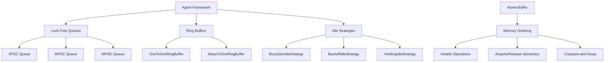
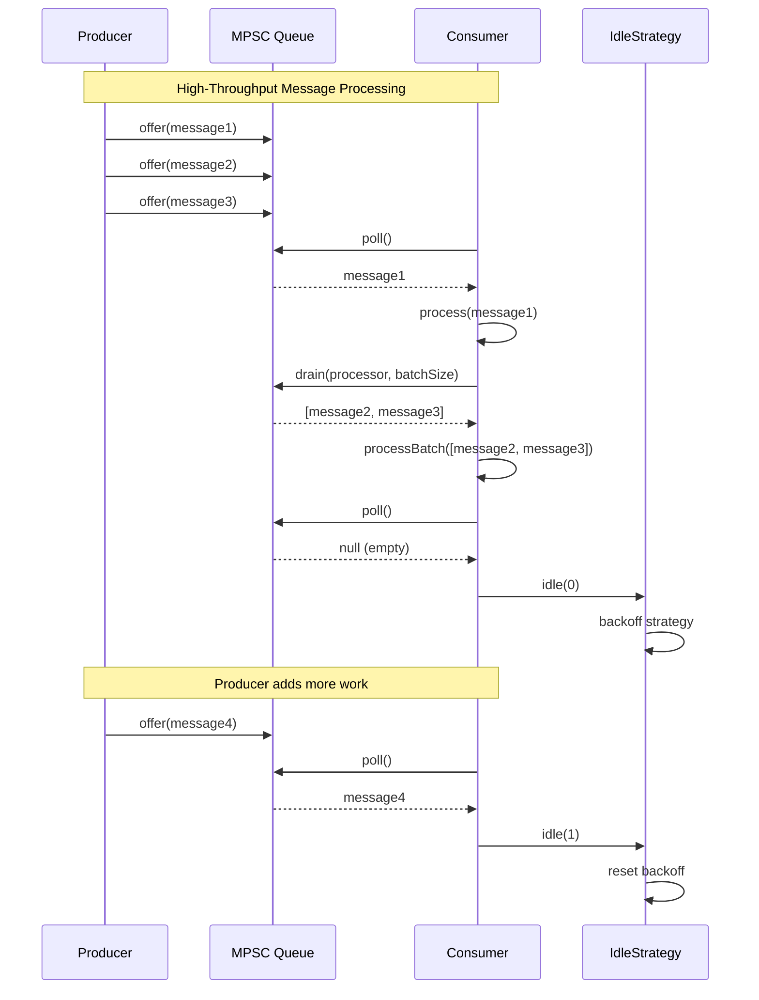
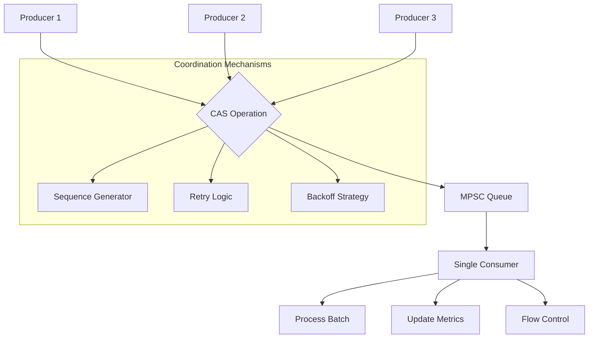

# Concurrent Programming with Agrona

A comprehensive guide to building high-performance concurrent systems using Agrona's lock-free primitives, agent framework, and advanced memory ordering techniques.

## Table of Contents

1. [Introduction to Concurrent Programming with Agrona](#1-introduction)
2. [Lock-Free Programming Principles](#2-lock-free-programming-principles)
3. [Agent Framework Development](#3-agent-framework-development)
4. [Producer-Consumer Patterns](#4-producer-consumer-patterns)
5. [Back-Pressure Handling](#5-back-pressure-handling)
6. [Multi-Producer Coordination](#6-multi-producer-coordination)
7. [Memory Ordering and Visibility](#7-memory-ordering-and-visibility)
8. [Error Handling in Concurrent Systems](#8-error-handling-in-concurrent-systems)
9. [Performance Optimization Guidelines](#9-performance-optimization-guidelines)
10. [Real-World Examples](#10-real-world-examples)

---

## 1. Introduction

Agrona provides a comprehensive suite of lock-free concurrent programming primitives designed for ultra-low latency applications. This guide covers the fundamental concepts, patterns, and best practices for building high-performance concurrent systems.

> **Performance Promise**: Agrona's concurrent utilities deliver sub-microsecond latency operations while maintaining zero garbage generation in steady-state operation.

### 1.1 Core Principles

Agrona's concurrent programming model is built on four fundamental principles:

1. **Lock-Free Algorithms**: Eliminate thread contention through atomic operations
2. **Memory Ordering Control**: Precise control over memory visibility and synchronization
3. **Zero-Copy Operations**: Minimize memory allocation and copying overhead
4. **Agent-Based Scheduling**: Structured approach to concurrent task execution

### 1.2 Key Components Overview



---

## 2. Lock-Free Programming Principles

Lock-free programming eliminates the use of blocking synchronization primitives like mutexes and semaphores, instead relying on atomic operations and careful memory ordering.

### 2.1 Fundamental Concepts

#### 2.1.1 Atomic Operations

Agrona's `AtomicBuffer` provides the foundation for lock-free programming with various memory ordering semantics:

```java
import org.agrona.concurrent.AtomicBuffer;
import org.agrona.concurrent.UnsafeBuffer;

// Example: Lock-free counter implementation
public class LockFreeCounter {
    private final AtomicBuffer buffer;
    private static final int COUNTER_OFFSET = 0;
    
    public LockFreeCounter() {
        this.buffer = new UnsafeBuffer(new byte[8]);
        buffer.verifyAlignment(); // Ensure proper alignment for atomic operations
    }
    
    public long increment() {
        long currentValue, newValue;
        do {
            currentValue = buffer.getLongVolatile(COUNTER_OFFSET);
            newValue = currentValue + 1;
        } while (!buffer.compareAndSetLong(COUNTER_OFFSET, currentValue, newValue));
        
        return newValue;
    }
    
    public long getValue() {
        return buffer.getLongVolatile(COUNTER_OFFSET);
    }
}
```

> **Source**: `/agrona/src/main/java/org/agrona/concurrent/AtomicBuffer.java:48-150`

#### 2.1.2 Memory Ordering Semantics

Agrona provides precise control over memory ordering through different operation types:

| Operation Type | Use Case | Performance | Ordering Guarantee |
|---------------|----------|-------------|-------------------|
| **Volatile** | Cross-thread visibility | Medium | Sequential consistency |
| **Acquire/Release** | Producer-consumer coordination | High | Acquire-release ordering |
| **Opaque** | Atomic without ordering | Highest | No ordering constraints |
| **Plain** | Single-threaded access | Highest | No atomicity guarantee |

```java
// Example: Producer-consumer with acquire-release semantics
public class ProducerConsumerExample {
    private final AtomicBuffer dataBuffer;
    private final AtomicBuffer flagBuffer;
    private static final int DATA_OFFSET = 0;
    private static final int FLAG_OFFSET = 0;
    
    public void produce(long value) {
        // Store data first
        dataBuffer.putLong(DATA_OFFSET, value);
        
        // Release store - ensures data store happens before flag store
        flagBuffer.putLongRelease(FLAG_OFFSET, 1L);
    }
    
    public long consume() {
        // Acquire load - ensures flag load happens before data load
        while (flagBuffer.getLongAcquire(FLAG_OFFSET) == 0) {
            Thread.onSpinWait(); // CPU hint for spin-wait loops
        }
        
        long value = dataBuffer.getLong(DATA_OFFSET);
        flagBuffer.putLongRelease(FLAG_OFFSET, 0L); // Reset flag
        return value;
    }
}
```

### 2.2 Lock-Free Algorithm Patterns

#### 2.2.1 Compare-and-Swap (CAS) Loops

The fundamental building block for lock-free algorithms:

```java
// Pattern: CAS-based atomic update
public boolean atomicUpdate(AtomicBuffer buffer, int offset, 
                           Function<Long, Long> updateFunction) {
    long currentValue, newValue;
    do {
        currentValue = buffer.getLongVolatile(offset);
        newValue = updateFunction.apply(currentValue);
        
        // Early exit if no change needed
        if (currentValue == newValue) {
            return false;
        }
    } while (!buffer.compareAndSetLong(offset, currentValue, newValue));
    
    return true;
}
```

#### 2.2.2 Load-Link/Store-Conditional Pattern

For complex atomic operations requiring multiple steps:

```java
// Example: Atomic increment with overflow protection
public class SafeAtomicIncrement {
    private final AtomicBuffer buffer;
    private static final int VALUE_OFFSET = 0;
    private static final long MAX_VALUE = Long.MAX_VALUE - 1000; // Safety margin
    
    public boolean safeIncrement() {
        long currentValue, newValue;
        do {
            currentValue = buffer.getLongVolatile(VALUE_OFFSET);
            
            // Check for overflow condition
            if (currentValue >= MAX_VALUE) {
                return false; // Cannot increment safely
            }
            
            newValue = currentValue + 1;
        } while (!buffer.compareAndSetLong(VALUE_OFFSET, currentValue, newValue));
        
        return true;
    }
}
```

---

## 3. Agent Framework Development

The Agent framework provides a structured approach to concurrent task execution with built-in lifecycle management and error handling.

### 3.1 Agent Interface and Lifecycle

The `Agent` interface defines a simple but powerful contract for scheduled work:

```java
import org.agrona.concurrent.Agent;
import org.agrona.concurrent.AgentRunner;
import org.agrona.concurrent.BusySpinIdleStrategy;
import org.agrona.ErrorHandler;

// Example: Data processing agent
public class DataProcessorAgent implements Agent {
    private final Queue<DataItem> workQueue;
    private final DataProcessor processor;
    private volatile boolean isStarted = false;
    
    public DataProcessorAgent(Queue<DataItem> workQueue, DataProcessor processor) {
        this.workQueue = workQueue;
        this.processor = processor;
    }
    
    @Override
    public void onStart() {
        // Initialize resources
        processor.initialize();
        isStarted = true;
        System.out.println("DataProcessorAgent started");
    }
    
    @Override
    public int doWork() throws Exception {
        if (!isStarted) {
            return 0; // No work available yet
        }
        
        int workCount = 0;
        DataItem item;
        
        // Process available items in batches
        while ((item = workQueue.poll()) != null && workCount < 10) {
            processor.process(item);
            workCount++;
        }
        
        return workCount; // Return number of items processed
    }
    
    @Override
    public void onClose() {
        // Cleanup resources
        processor.close();
        isStarted = false;
        System.out.println("DataProcessorAgent stopped");
    }
    
    @Override
    public String roleName() {
        return "DataProcessor";
    }
}
```

> **Source**: `/agrona/src/main/java/org/agrona/concurrent/Agent.java:18-65`

### 3.2 Agent Execution with AgentRunner

The `AgentRunner` manages agent execution with idle strategies and error handling:

```java
// Example: Setting up and running an agent
public class AgentSetupExample {
    
    public static void setupDataProcessorAgent() {
        // Create the agent
        Queue<DataItem> workQueue = new ConcurrentLinkedQueue<>();
        DataProcessor processor = new DefaultDataProcessor();
        Agent agent = new DataProcessorAgent(workQueue, processor);
        
        // Configure idle strategy for optimal performance
        IdleStrategy idleStrategy = new BusySpinIdleStrategy(); // Lowest latency
        
        // Error handler for robust operation
        ErrorHandler errorHandler = throwable -> {
            System.err.println("Agent error in " + agent.roleName() + ": " + 
                             throwable.getMessage());
            // Log to monitoring system
            // Decide whether to continue or shutdown
        };
        
        // Create and start agent runner
        AgentRunner agentRunner = new AgentRunner(
            idleStrategy,
            errorHandler,
            null, // No error counter
            agent
        );
        
        // Start on dedicated thread
        Thread agentThread = AgentRunner.startOnThread(agentRunner);
        agentThread.setName("DataProcessor-Thread");
        
        // Register shutdown hook for graceful cleanup
        Runtime.getRuntime().addShutdownHook(new Thread(() -> {
            agentRunner.close(); // Graceful shutdown
            try {
                agentThread.join(5000); // Wait up to 5 seconds
            } catch (InterruptedException e) {
                Thread.currentThread().interrupt();
            }
        }));
    }
}
```

> **Source**: `/agrona/src/main/java/org/agrona/concurrent/AgentRunner.java:27-350`

### 3.3 Idle Strategies for Performance Optimization

#### 3.3.1 BusySpinIdleStrategy - Ultra-Low Latency

```java
import org.agrona.concurrent.BusySpinIdleStrategy;

// Use for applications requiring absolute minimum latency
IdleStrategy ultraLowLatency = BusySpinIdleStrategy.INSTANCE;
// Characteristics:
// - Lowest possible latency (sub-microsecond)
// - 100% CPU utilization
// - Best for dedicated cores in low-latency systems
```

> **Source**: `/agrona/src/main/java/org/agrona/concurrent/BusySpinIdleStrategy.java:18-87`

#### 3.3.2 BackoffIdleStrategy - Balanced Performance

```java
import org.agrona.concurrent.BackoffIdleStrategy;
import java.util.concurrent.TimeUnit;

// Three-phase backoff: spin -> yield -> park
IdleStrategy balanced = new BackoffIdleStrategy(
    64,    // maxSpins - spin this many times
    64,    // maxYields - then yield this many times  
    TimeUnit.MICROSECONDS.toNanos(1),  // minParkPeriodNs
    TimeUnit.MICROSECONDS.toNanos(100) // maxParkPeriodNs
);

// Characteristics:
// - Balances latency and CPU usage
// - Exponential backoff reduces power consumption
// - Suitable for most high-performance applications
```

> **Source**: `/agrona/src/main/java/org/agrona/concurrent/BackoffIdleStrategy.java:101-261`

### 3.4 Agent Coordination Patterns

#### 3.4.1 Pipeline Pattern

```java
// Example: Multi-stage processing pipeline
public class ProcessingPipeline {
    private final AgentRunner stage1Runner;
    private final AgentRunner stage2Runner;
    private final AgentRunner stage3Runner;
    
    // Pipeline: Input -> Transform -> Output
    private final ManyToOneConcurrentArrayQueue<RawData> inputQueue;
    private final ManyToOneConcurrentArrayQueue<TransformedData> transformQueue;
    private final ManyToOneConcurrentArrayQueue<ProcessedData> outputQueue;
    
    public void start() {
        // Start stages in reverse order to avoid back-pressure
        AgentRunner.startOnThread(stage3Runner); // Output stage
        AgentRunner.startOnThread(stage2Runner); // Transform stage  
        AgentRunner.startOnThread(stage1Runner); // Input stage
    }
    
    public void stop() {
        // Stop in forward order
        stage1Runner.close();
        stage2Runner.close();
        stage3Runner.close();
    }
}
```

---

## 4. Producer-Consumer Patterns

Agrona provides multiple queue and ring buffer implementations optimized for different producer-consumer scenarios.

### 4.1 Single-Producer Single-Consumer (SPSC)

The `OneToOneConcurrentArrayQueue` provides optimal performance for single-threaded producer and consumer:

```java
import org.agrona.concurrent.OneToOneConcurrentArrayQueue;

// Example: High-throughput SPSC communication
public class SPSCExample {
    private final OneToOneConcurrentArrayQueue<MarketData> queue;
    
    public SPSCExample() {
        this.queue = new OneToOneConcurrentArrayQueue<>(1024); // Power of 2 capacity
    }
    
    // Producer thread
    public void producer() {
        MarketData data = new MarketData();
        
        while (isRunning) {
            // Generate market data
            data.update(getCurrentPrice(), getCurrentVolume());
            
            // Non-blocking offer
            while (!queue.offer(data)) {
                Thread.onSpinWait(); // CPU hint for spin-wait
            }
        }
    }
    
    // Consumer thread  
    public void consumer() {
        while (isRunning) {
            MarketData data = queue.poll();
            if (data != null) {
                processMarketData(data);
            } else {
                Thread.onSpinWait(); // No data available
            }
        }
    }
    
    // Batch processing for higher throughput
    public void batchConsumer() {
        final int maxBatch = 32;
        final Consumer<MarketData> processor = this::processMarketData;
        
        while (isRunning) {
            int processed = queue.drain(processor, maxBatch);
            if (processed == 0) {
                Thread.onSpinWait(); // No data available
            }
        }
    }
}
```

> **Source**: `/agrona/src/main/java/org/agrona/concurrent/OneToOneConcurrentArrayQueue.java`

### 4.2 Multi-Producer Single-Consumer (MPSC)

The `ManyToOneConcurrentArrayQueue` handles multiple producers with lock-free coordination:

```java
import org.agrona.concurrent.ManyToOneConcurrentArrayQueue;
import java.util.concurrent.atomic.AtomicLong;

// Example: Multi-threaded order processing system
public class MPSCOrderProcessor {
    private final ManyToOneConcurrentArrayQueue<Order> orderQueue;
    private final AtomicLong totalOrders = new AtomicLong();
    
    public MPSCOrderProcessor() {
        this.orderQueue = new ManyToOneConcurrentArrayQueue<>(4096);
    }
    
    // Multiple producer threads
    public void submitOrder(Order order) {
        // Non-blocking submission with retry
        while (!orderQueue.offer(order)) {
            // Queue full - handle back-pressure
            handleBackPressure();
        }
        totalOrders.incrementAndGet();
    }
    
    // Single consumer thread
    public void processOrders() {
        final Consumer<Order> processor = this::executeOrder;
        
        while (isRunning) {
            int processed = orderQueue.drain(processor);
            if (processed == 0) {
                // No orders available - use idle strategy
                idleStrategy.idle(0);
            } else {
                idleStrategy.idle(processed);
            }
        }
    }
    
    private void handleBackPressure() {
        // Implement back-pressure strategy
        // Option 1: Spin briefly
        Thread.onSpinWait();
        
        // Option 2: Exponential backoff  
        // LockSupport.parkNanos(backoffNanos);
        
        // Option 3: Drop oldest orders (if acceptable)
        // orderQueue.poll(); // Make space
    }
}
```

> **Source**: `/agrona/src/main/java/org/agrona/concurrent/ManyToOneConcurrentArrayQueue.java:23-145`

### 4.3 Ring Buffer Messaging

Ring buffers provide variable-length message support with zero-copy operations:

```java
import org.agrona.concurrent.ringbuffer.ManyToOneRingBuffer;
import org.agrona.concurrent.UnsafeBuffer;
import org.agrona.DirectBuffer;

// Example: Financial trading system with ring buffer
public class TradingRingBuffer {
    private final ManyToOneRingBuffer ringBuffer;
    private final UnsafeBuffer buffer;
    
    // Message types
    private static final int ORDER_MSG_TYPE = 1;
    private static final int TRADE_MSG_TYPE = 2;
    private static final int CANCEL_MSG_TYPE = 3;
    
    public TradingRingBuffer() {
        int bufferSize = 64 * 1024; // 64KB ring buffer
        this.buffer = new UnsafeBuffer(new byte[bufferSize + 
                                               RingBufferDescriptor.TRAILER_LENGTH]);
        this.ringBuffer = new ManyToOneRingBuffer(buffer);
    }
    
    // Producer: Submit order
    public boolean submitOrder(Order order) {
        int messageLength = order.getEncodedLength();
        UnsafeBuffer messageBuffer = new UnsafeBuffer(new byte[messageLength]);
        
        // Encode order into buffer
        order.encode(messageBuffer, 0);
        
        // Write to ring buffer (atomic operation)
        return ringBuffer.write(ORDER_MSG_TYPE, messageBuffer, 0, messageLength);
    }
    
    // Consumer: Process messages
    public void processMessages() {
        MessageHandler handler = (msgTypeId, buffer, index, length) -> {
            switch (msgTypeId) {
                case ORDER_MSG_TYPE:
                    processOrderMessage(buffer, index, length);
                    break;
                case TRADE_MSG_TYPE:
                    processTradeMessage(buffer, index, length);
                    break;
                case CANCEL_MSG_TYPE:
                    processCancelMessage(buffer, index, length);
                    break;
            }
        };
        
        // Read up to 100 messages per batch
        int messagesRead = ringBuffer.read(handler, 100);
        
        if (messagesRead == 0) {
            idleStrategy.idle(0);
        } else {
            idleStrategy.idle(messagesRead);
        }
    }
}
```

> **Source**: `/agrona/src/main/java/org/agrona/concurrent/ringbuffer/ManyToOneRingBuffer.java:31-200`

### 4.4 Sequence Diagrams for Producer-Consumer Flow



---

## 5. Back-Pressure Handling

Back-pressure handling prevents system overload by controlling the flow of data through producer-consumer chains.

### 5.1 Controlled Message Processing

The `ControlledMessageHandler` provides fine-grained flow control:

```java
import org.agrona.concurrent.ControlledMessageHandler;
import org.agrona.concurrent.ControlledMessageHandler.Action;

// Example: Rate-limited message processor with back-pressure
public class RateLimitedProcessor implements ControlledMessageHandler {
    private final RateLimiter rateLimiter;
    private final MetricsCollector metrics;
    private long lastProcessTime;
    
    public RateLimitedProcessor(int maxMessagesPerSecond) {
        this.rateLimiter = new RateLimiter(maxMessagesPerSecond);
        this.metrics = new MetricsCollector();
    }
    
    @Override
    public Action onMessage(int msgTypeId, MutableDirectBuffer buffer, 
                           int index, int length) {
        long currentTime = System.nanoTime();
        
        // Check rate limit
        if (!rateLimiter.tryAcquire()) {
            metrics.recordBackPressure();
            return Action.ABORT; // Back-pressure: don't advance position
        }
        
        // Check processing capacity  
        if (isSystemOverloaded()) {
            metrics.recordSystemOverload();
            return Action.BREAK; // Stop processing, commit current position
        }
        
        try {
            // Process the message
            processMessage(msgTypeId, buffer, index, length);
            
            // Update metrics
            long processingTime = System.nanoTime() - currentTime;
            metrics.recordProcessingTime(processingTime);
            
            // Flow control decision
            if (shouldCommitPosition()) {
                return Action.COMMIT; // Commit position for flow control
            } else {
                return Action.CONTINUE; // Continue processing
            }
            
        } catch (Exception e) {
            handleProcessingError(e);
            return Action.ABORT; // Don't advance on error
        }
    }
    
    private boolean shouldCommitPosition() {
        // Commit every 10 messages for flow control
        return (metrics.getProcessedCount() % 10) == 0;
    }
}
```

> **Source**: `/agrona/src/main/java/org/agrona/concurrent/ControlledMessageHandler.java:20-65`

### 5.2 Adaptive Back-Pressure Strategies

```java
// Example: Adaptive back-pressure system
public class AdaptiveBackPressureManager {
    private final AtomicLong successCount = new AtomicLong();
    private final AtomicLong failureCount = new AtomicLong(); 
    private final AtomicInteger currentBackoffNanos = new AtomicInteger(1000);
    
    // Minimum and maximum backoff periods
    private static final int MIN_BACKOFF_NS = 1000;
    private static final int MAX_BACKOFF_NS = 1_000_000; // 1ms
    
    public ControlledMessageHandler.Action handleBackPressure(
            boolean processingSuccessful) {
        
        if (processingSuccessful) {
            successCount.incrementAndGet();
            
            // Reduce backoff on success
            int currentBackoff = currentBackoffNanos.get();
            if (currentBackoff > MIN_BACKOFF_NS) {
                currentBackoffNanos.compareAndSet(currentBackoff, 
                                                Math.max(MIN_BACKOFF_NS, 
                                                        currentBackoff / 2));
            }
            
            return ControlledMessageHandler.Action.CONTINUE;
            
        } else {
            failureCount.incrementAndGet();
            
            // Increase backoff on failure
            int currentBackoff = currentBackoffNanos.get();
            if (currentBackoff < MAX_BACKOFF_NS) {
                currentBackoffNanos.compareAndSet(currentBackoff,
                                                Math.min(MAX_BACKOFF_NS,
                                                        currentBackoff * 2));
            }
            
            // Apply backoff
            LockSupport.parkNanos(currentBackoff);
            
            return ControlledMessageHandler.Action.ABORT;
        }
    }
    
    public double getSuccessRate() {
        long total = successCount.get() + failureCount.get();
        return total > 0 ? (double) successCount.get() / total : 0.0;
    }
}
```

### 5.3 Circuit Breaker Pattern

```java
// Example: Circuit breaker for system protection
public class CircuitBreakerMessageHandler implements ControlledMessageHandler {
    private final CircuitBreaker circuitBreaker;
    private final ControlledMessageHandler delegate;
    
    public CircuitBreakerMessageHandler(ControlledMessageHandler delegate,
                                      int failureThreshold, 
                                      long timeoutMs) {
        this.delegate = delegate;
        this.circuitBreaker = new CircuitBreaker(failureThreshold, timeoutMs);
    }
    
    @Override
    public Action onMessage(int msgTypeId, MutableDirectBuffer buffer,
                           int index, int length) {
        
        // Check circuit breaker state
        if (circuitBreaker.isOpen()) {
            // Circuit open - reject processing
            circuitBreaker.recordAttempt();
            return Action.ABORT;
        }
        
        try {
            // Delegate to actual processor
            Action result = delegate.onMessage(msgTypeId, buffer, index, length);
            
            // Record success
            circuitBreaker.recordSuccess();
            return result;
            
        } catch (Exception e) {
            // Record failure
            circuitBreaker.recordFailure();
            throw e; // Re-throw to maintain error handling
        }
    }
    
    // Circuit breaker implementation
    private static class CircuitBreaker {
        private final int failureThreshold;
        private final long timeoutMs;
        private final AtomicInteger failureCount = new AtomicInteger();
        private volatile long lastFailureTime;
        private volatile boolean isOpen = false;
        
        public CircuitBreaker(int failureThreshold, long timeoutMs) {
            this.failureThreshold = failureThreshold;
            this.timeoutMs = timeoutMs;
        }
        
        public boolean isOpen() {
            if (isOpen && (System.currentTimeMillis() - lastFailureTime) > timeoutMs) {
                // Try to close circuit after timeout
                isOpen = false;
                failureCount.set(0);
            }
            return isOpen;
        }
        
        public void recordSuccess() {
            failureCount.set(0);
            isOpen = false;
        }
        
        public void recordFailure() {
            lastFailureTime = System.currentTimeMillis();
            if (failureCount.incrementAndGet() >= failureThreshold) {
                isOpen = true;
            }
        }
        
        public void recordAttempt() {
            // Could add attempt logging here
        }
    }
}
```

---

## 6. Multi-Producer Coordination

Coordinating multiple producers requires careful consideration of memory ordering and contention management.

### 6.1 MPSC Queue Coordination

```java
// Example: Order book with multiple price feeds
public class MultiSourceOrderBook {
    private final ManyToOneConcurrentArrayQueue<PriceUpdate> priceQueue;
    private final AtomicLong sequenceGenerator = new AtomicLong();
    private final Map<String, AtomicLong> sourceCounters = new ConcurrentHashMap<>();
    
    public MultiSourceOrderBook() {
        this.priceQueue = new ManyToOneConcurrentArrayQueue<>(8192);
    }
    
    // Multiple producer threads calling this method
    public boolean submitPriceUpdate(String source, String symbol, 
                                   BigDecimal price, long volume) {
        
        // Generate globally unique sequence number
        long sequence = sequenceGenerator.incrementAndGet();
        
        // Track per-source statistics
        sourceCounters.computeIfAbsent(source, k -> new AtomicLong())
                     .incrementAndGet();
        
        PriceUpdate update = new PriceUpdate(
            sequence, source, symbol, price, volume, System.nanoTime()
        );
        
        // Submit to queue with back-pressure handling
        int retryCount = 0;
        while (!priceQueue.offer(update)) {
            if (++retryCount > 1000) {
                // Reject after too many retries
                return false;
            }
            
            // Exponential backoff
            LockSupport.parkNanos(1000L << Math.min(retryCount / 100, 10));
        }
        
        return true;
    }
    
    // Single consumer thread
    public void processPriceUpdates() {
        Consumer<PriceUpdate> processor = update -> {
            // Update order book
            updateOrderBook(update);
            
            // Update last sequence per source
            updateLastSequence(update.getSource(), update.getSequence());
        };
        
        while (isRunning) {
            int processed = priceQueue.drain(processor, 100);
            idleStrategy.idle(processed);
        }
    }
}
```

### 6.2 MPMC Queue for Fan-Out Processing

```java
import org.agrona.concurrent.ManyToManyConcurrentArrayQueue;

// Example: Multi-consumer trade processing
public class TradeProcessingSystem {
    private final ManyToManyConcurrentArrayQueue<Trade> tradeQueue;
    private final List<TradeProcessor> processors;
    private final AtomicInteger roundRobinCounter = new AtomicInteger();
    
    public TradeProcessingSystem(int numProcessors) {
        this.tradeQueue = new ManyToManyConcurrentArrayQueue<>(16384);
        this.processors = createProcessors(numProcessors);
    }
    
    // Multiple producers submit trades
    public void submitTrade(Trade trade) {
        // Add unique identifier for tracking
        trade.setSubmissionTime(System.nanoTime());
        trade.setSubmissionThread(Thread.currentThread().getId());
        
        while (!tradeQueue.offer(trade)) {
            // Handle back-pressure
            Thread.onSpinWait();
        }
    }
    
    // Multiple consumers process trades
    public void processTradesMultiConsumer(int consumerId) {
        TradeProcessor processor = processors.get(consumerId);
        
        while (isRunning) {
            Trade trade = tradeQueue.poll();
            if (trade != null) {
                // Add processing metadata
                trade.setProcessingStartTime(System.nanoTime());
                trade.setProcessorId(consumerId);
                
                processor.process(trade);
                
                // Track processing latency
                long latency = System.nanoTime() - trade.getSubmissionTime();
                processor.recordLatency(latency);
            } else {
                // No work available
                idleStrategy.idle(0);
            }
        }
    }
    
    // Work-stealing pattern for load balancing
    public void processTradesWorkStealing(int consumerId) {
        final int maxBatchSize = 32;
        final List<Trade> batch = new ArrayList<>(maxBatchSize);
        
        while (isRunning) {
            // Try to drain a batch
            int drained = tradeQueue.drainTo(batch, maxBatchSize);
            
            if (drained > 0) {
                // Process batch
                for (Trade trade : batch) {
                    processors.get(consumerId).process(trade);
                }
                batch.clear();
                idleStrategy.idle(drained);
            } else {
                idleStrategy.idle(0);
            }
        }
    }
}
```

### 6.3 Producer Coordination Patterns



### 6.4 Producer Batching for Throughput

```java
// Example: Batched producer for high throughput
public class BatchedProducer {
    private final ManyToOneConcurrentArrayQueue<Event> queue;
    private final ThreadLocal<List<Event>> batchBuffer;
    private final int batchSize;
    private final long batchTimeoutNs;
    
    public BatchedProducer(ManyToOneConcurrentArrayQueue<Event> queue) {
        this.queue = queue;
        this.batchSize = 64;
        this.batchTimeoutNs = TimeUnit.MICROSECONDS.toNanos(100);
        this.batchBuffer = ThreadLocal.withInitial(() -> new ArrayList<>(batchSize));
    }
    
    public void submitEvent(Event event) {
        List<Event> batch = batchBuffer.get();
        batch.add(event);
        
        // Flush when batch is full or timeout elapsed
        if (batch.size() >= batchSize || shouldFlushOnTimeout(batch)) {
            flushBatch(batch);
        }
    }
    
    private void flushBatch(List<Event> batch) {
        // Submit all events in batch
        for (Event event : batch) {
            while (!queue.offer(event)) {
                // Spin until space available
                Thread.onSpinWait();
            }
        }
        
        batch.clear();
        updateLastFlushTime();
    }
    
    private boolean shouldFlushOnTimeout(List<Event> batch) {
        if (batch.isEmpty()) return false;
        
        long elapsed = System.nanoTime() - getLastFlushTime();
        return elapsed > batchTimeoutNs;
    }
    
    // Periodic flush for remaining events
    public void periodicFlush() {
        List<Event> batch = batchBuffer.get();
        if (!batch.isEmpty()) {
            flushBatch(batch);
        }
    }
}
```

---

## 7. Memory Ordering and Visibility

Understanding memory ordering is crucial for correct lock-free programming in Java's memory model.

### 7.1 Memory Ordering Fundamentals

#### 7.1.1 Java Memory Model Basics

```java
// Example: Memory visibility patterns
public class MemoryOrderingExamples {
    private volatile boolean ready = false;
    private int data = 0;
    
    // Wrong: Data race - no synchronization
    public void unsafePattern() {
        // Thread 1
        data = 42;      // Plain store
        ready = true;   // Volatile store
        
        // Thread 2  
        while (!ready); // Volatile load
        assert data == 42; // May fail! No happens-before relationship
    }
    
    // Correct: Using acquire-release semantics
    private final AtomicBuffer buffer = new UnsafeBuffer(new byte[16]);
    private static final int DATA_OFFSET = 0;
    private static final int READY_OFFSET = 8;
    
    public void safePattern() {
        // Thread 1 (Producer)
        buffer.putInt(DATA_OFFSET, 42);           // Plain store
        buffer.putIntRelease(READY_OFFSET, 1);    // Release store
        
        // Thread 2 (Consumer)
        while (buffer.getIntAcquire(READY_OFFSET) == 0) {
            Thread.onSpinWait();
        }
        int value = buffer.getInt(DATA_OFFSET);   // Guaranteed to see 42
        assert value == 42; // Always passes
    }
}
```

#### 7.1.2 Memory Ordering Categories

| Ordering Type | Guarantees | Performance | Use Case |
|--------------|-------------|-------------|----------|
| **Sequential Consistency** | Total order across all threads | Slowest | Simple correctness |
| **Acquire-Release** | Synchronizes-with relationship | Fast | Producer-consumer |
| **Relaxed/Opaque** | Atomicity only | Fastest | Counters, flags |
| **Plain** | No guarantees | Fastest | Single-threaded |

### 7.2 Advanced Memory Ordering Patterns

#### 7.2.1 Publication Pattern

```java
// Example: Safe object publication
public class SafePublication {
    private final AtomicBuffer metadataBuffer;
    private final AtomicBuffer dataBuffer;
    
    // Offsets for metadata
    private static final int DATA_LENGTH_OFFSET = 0;
    private static final int DATA_READY_OFFSET = 4;
    private static final int CHECKSUM_OFFSET = 8;
    
    public void publishData(byte[] data) {
        // 1. Store data payload
        dataBuffer.putBytes(0, data);
        
        // 2. Compute and store checksum
        int checksum = computeChecksum(data);
        metadataBuffer.putInt(CHECKSUM_OFFSET, checksum);
        
        // 3. Store length
        metadataBuffer.putInt(DATA_LENGTH_OFFSET, data.length);
        
        // 4. Release store to make everything visible
        metadataBuffer.putIntRelease(DATA_READY_OFFSET, 1);
    }
    
    public byte[] consumeData() {
        // 1. Acquire load to see all previous stores
        while (metadataBuffer.getIntAcquire(DATA_READY_OFFSET) == 0) {
            Thread.onSpinWait();
        }
        
        // 2. Read metadata (guaranteed visible)
        int length = metadataBuffer.getInt(DATA_LENGTH_OFFSET);
        int expectedChecksum = metadataBuffer.getInt(CHECKSUM_OFFSET);
        
        // 3. Read data payload
        byte[] data = new byte[length];
        dataBuffer.getBytes(0, data);
        
        // 4. Verify integrity
        int actualChecksum = computeChecksum(data);
        if (actualChecksum != expectedChecksum) {
            throw new IllegalStateException("Data corruption detected");
        }
        
        // 5. Reset ready flag
        metadataBuffer.putIntRelease(DATA_READY_OFFSET, 0);
        
        return data;
    }
}
```

#### 7.2.2 Double-Checked Locking Pattern

```java
// Example: Lazy initialization with double-checked locking
public class LazyInitialization {
    private final AtomicBuffer controlBuffer;
    private static final int INITIALIZED_OFFSET = 0;
    private volatile ExpensiveObject instance;
    
    public ExpensiveObject getInstance() {
        ExpensiveObject result = instance;
        
        // First check (no synchronization)
        if (result == null) {
            synchronized (this) {
                result = instance;
                
                // Second check (with synchronization)
                if (result == null) {
                    result = new ExpensiveObject();
                    
                    // Ensure full construction before assignment
                    VarHandle.releaseFence();
                    instance = result;
                    
                    // Mark as initialized
                    controlBuffer.putIntRelease(INITIALIZED_OFFSET, 1);
                }
            }
        }
        
        return result;
    }
    
    public boolean isInitialized() {
        return controlBuffer.getIntAcquire(INITIALIZED_OFFSET) != 0;
    }
}
```

### 7.3 Memory Fences and Barriers

```java
// Example: Manual memory fence usage
public class ManualFenceExample {
    private final AtomicBuffer sharedBuffer;
    private volatile boolean dataReady = false;
    
    public void writeWithFences() {
        // Write data
        sharedBuffer.putLong(0, computeValue1());
        sharedBuffer.putLong(8, computeValue2());
        
        // Release fence ensures all prior stores complete
        VarHandle.releaseFence();
        
        // Make data visible to readers
        dataReady = true;
    }
    
    public void readWithFences() {
        // Wait for data availability
        while (!dataReady) {
            Thread.onSpinWait();
        }
        
        // Acquire fence ensures subsequent reads see all stores
        VarHandle.acquireFence();
        
        // Read data (guaranteed to see latest values)
        long value1 = sharedBuffer.getLong(0);
        long value2 = sharedBuffer.getLong(8);
        
        processValues(value1, value2);
    }
    
    // Full fence example for stronger ordering
    public void fullFenceExample() {
        sharedBuffer.putLong(0, 123);
        
        // Full fence - no reordering across this point
        VarHandle.fullFence();
        
        long result = sharedBuffer.getLong(8);
    }
}
```

---

## 8. Error Handling in Concurrent Systems

Robust error handling is essential for production concurrent systems.

### 8.1 ErrorHandler Interface

```java
import org.agrona.ErrorHandler;

// Example: Comprehensive error handling strategy
public class ProductionErrorHandler implements ErrorHandler {
    private final Logger logger;
    private final MetricsCollector metrics;
    private final AlertManager alertManager;
    private final AtomicLong errorCount = new AtomicLong();
    
    @Override
    public void onError(Throwable throwable) {
        long errorNumber = errorCount.incrementAndGet();
        
        // Log error with context
        logger.error("Concurrent system error #{}: {}", 
                    errorNumber, throwable.getMessage(), throwable);
        
        // Update metrics
        metrics.incrementErrorCounter(throwable.getClass().getSimpleName());
        
        // Classify error severity
        ErrorSeverity severity = classifyError(throwable);
        
        switch (severity) {
            case CRITICAL:
                handleCriticalError(throwable, errorNumber);
                break;
            case WARNING:
                handleWarningError(throwable, errorNumber);
                break;
            case INFO:
                handleInfoError(throwable, errorNumber);
                break;
        }
        
        // Circuit breaker logic
        if (errorCount.get() > 100 && getErrorRate() > 0.1) {
            alertManager.sendAlert("High error rate detected: " + getErrorRate());
        }
    }
    
    private ErrorSeverity classifyError(Throwable throwable) {
        if (throwable instanceof OutOfMemoryError ||
            throwable instanceof StackOverflowError) {
            return ErrorSeverity.CRITICAL;
        }
        
        if (throwable instanceof InterruptedException ||
            throwable instanceof TimeoutException) {
            return ErrorSeverity.WARNING;
        }
        
        return ErrorSeverity.INFO;
    }
    
    private void handleCriticalError(Throwable throwable, long errorNumber) {
        // Immediate alert
        alertManager.sendCriticalAlert(
            "Critical error #" + errorNumber + ": " + throwable.getMessage()
        );
        
        // Consider system shutdown
        if (throwable instanceof OutOfMemoryError) {
            logger.error("Out of memory - initiating graceful shutdown");
            initiateGracefulShutdown();
        }
    }
}
```

> **Source**: `/agrona/src/main/java/org/agrona/ErrorHandler.java:17-32`

### 8.2 Agent Error Recovery

```java
// Example: Self-healing agent with error recovery
public class ResilientAgent implements Agent {
    private final ErrorHandler errorHandler;
    private final AtomicInteger consecutiveErrors = new AtomicInteger();
    private final int maxConsecutiveErrors = 5;
    private volatile long lastErrorTime = 0;
    
    @Override
    public int doWork() throws Exception {
        try {
            int workCount = performActualWork();
            
            // Reset error counter on successful work
            if (workCount > 0) {
                consecutiveErrors.set(0);
            }
            
            return workCount;
            
        } catch (Exception e) {
            handleWorkError(e);
            throw e; // Re-throw to let AgentRunner handle it
        }
    }
    
    private void handleWorkError(Exception e) {
        int errorCount = consecutiveErrors.incrementAndGet();
        lastErrorTime = System.currentTimeMillis();
        
        if (errorCount >= maxConsecutiveErrors) {
            // Too many consecutive errors - attempt recovery
            attemptRecovery();
            consecutiveErrors.set(0);
        }
        
        // Apply exponential backoff
        long backoffMs = Math.min(1000, 10 * (1L << Math.min(errorCount, 6)));
        try {
            Thread.sleep(backoffMs);
        } catch (InterruptedException ie) {
            Thread.currentThread().interrupt();
            throw new AgentTerminationException("Interrupted during error backoff");
        }
    }
    
    private void attemptRecovery() {
        try {
            // Recovery actions
            reinitializeResources();
            clearCaches();
            resetCounters();
            
        } catch (Exception recoveryError) {
            errorHandler.onError(new RuntimeException(
                "Recovery failed after " + maxConsecutiveErrors + " errors", 
                recoveryError
            ));
        }
    }
    
    @Override
    public String roleName() {
        return "ResilientAgent";
    }
}
```

### 8.3 Counted Error Handler

```java
import org.agrona.concurrent.CountedErrorHandler;

// Example: Error tracking and monitoring
public class MonitoredSystem {
    private final CountedErrorHandler errorHandler;
    private final ScheduledExecutorService scheduler;
    
    public MonitoredSystem() {
        // Delegate to production error handler
        ErrorHandler delegate = new ProductionErrorHandler();
        this.errorHandler = new CountedErrorHandler(delegate);
        
        // Start error monitoring
        this.scheduler = Executors.newSingleThreadScheduledExecutor();
        startErrorMonitoring();
    }
    
    private void startErrorMonitoring() {
        scheduler.scheduleAtFixedRate(() -> {
            long currentErrors = errorHandler.errorCount();
            double errorRate = calculateErrorRate();
            
            // Log error statistics
            logger.info("Error statistics - Total: {}, Rate: {}/min", 
                       currentErrors, errorRate);
            
            // Health check based on error rate
            if (errorRate > 10.0) {
                logger.warn("High error rate detected: {}/min", errorRate);
                // Trigger corrective actions
            }
            
        }, 1, 1, TimeUnit.MINUTES);
    }
    
    public void shutdown() {
        scheduler.shutdown();
        try {
            if (!scheduler.awaitTermination(5, TimeUnit.SECONDS)) {
                scheduler.shutdownNow();
            }
        } catch (InterruptedException e) {
            scheduler.shutdownNow();
            Thread.currentThread().interrupt();
        }
        
        // Close error handler
        if (!errorHandler.isClosed()) {
            errorHandler.close();
        }
    }
}
```

> **Source**: `/agrona/src/main/java/org/agrona/concurrent/CountedErrorHandler.java`

---

## 9. Performance Optimization Guidelines

### 9.1 CPU Cache Optimization

```java
// Example: Cache-aware data structures
public class CacheOptimizedProcessor {
    // Pad to cache line boundaries (64 bytes on most systems)
    private static final int CACHE_LINE_SIZE = 64;
    
    // Hot data - frequently accessed together
    @SuppressWarnings("unused")
    private volatile long p0, p1, p2, p3, p4, p5, p6, p7;
    private volatile long processedCount;
    private volatile long lastProcessTime;
    @SuppressWarnings("unused")
    private volatile long p8, p9, p10, p11, p12, p13, p14, p15;
    
    // Cold data - separate cache line
    @SuppressWarnings("unused")
    private volatile long q0, q1, q2, q3, q4, q5, q6, q7;
    private volatile long startTime;
    private volatile String configValue;
    @SuppressWarnings("unused")
    private volatile long q8, q9, q10, q11, q12, q13, q14, q15;
    
    // Process data in cache-friendly patterns
    public void processDataBatch(ByteBuffer data) {
        int batchSize = 64; // Process in cache-line sized batches
        
        for (int offset = 0; offset < data.remaining(); offset += batchSize) {
            int chunkSize = Math.min(batchSize, data.remaining() - offset);
            processChunk(data, offset, chunkSize);
        }
        
        // Update hot counters
        processedCount++;
        lastProcessTime = System.nanoTime();
    }
}
```

### 9.2 Thread Affinity and CPU Pinning

```java
// Example: Thread affinity for consistent performance
public class AffinityOptimizedAgent implements Agent {
    private final int cpuId;
    private final ThreadLocal<Boolean> affinitySet = ThreadLocal.withInitial(() -> false);
    
    public AffinityOptimizedAgent(int cpuId) {
        this.cpuId = cpuId;
    }
    
    @Override
    public void onStart() {
        // Set thread affinity on start
        setThreadAffinity();
    }
    
    private void setThreadAffinity() {
        if (!affinitySet.get()) {
            try {
                // Platform-specific CPU affinity
                // This would use JNI or system-specific libraries
                setCpuAffinity(Thread.currentThread(), cpuId);
                affinitySet.set(true);
                
            } catch (Exception e) {
                logger.warn("Failed to set CPU affinity to {}: {}", cpuId, e.getMessage());
            }
        }
    }
    
    @Override
    public int doWork() throws Exception {
        // Ensure affinity is maintained
        if (!affinitySet.get()) {
            setThreadAffinity();
        }
        
        return performWork();
    }
    
    // JVM flags for better CPU utilization:
    // -XX:+UnlockExperimentalVMOptions
    // -XX:+UseZGC (for low-latency GC)
    // -XX:+DisableExplicitGC
    // -XX:+AlwaysPreTouch (pre-touch memory)
}
```

### 9.3 Memory Allocation Optimization

```java
// Example: Zero-allocation message processing
public class ZeroAllocationProcessor {
    // Pre-allocated buffers
    private final UnsafeBuffer messageBuffer;
    private final UnsafeBuffer workingBuffer;
    private final ThreadLocal<ByteArrayOutputStream> outputStream;
    
    // Object pools for reuse
    private final ObjectPool<Message> messagePool;
    private final ObjectPool<ProcessingContext> contextPool;
    
    public ZeroAllocationProcessor() {
        // Pre-allocate large buffers
        this.messageBuffer = new UnsafeBuffer(new byte[64 * 1024]);
        this.workingBuffer = new UnsafeBuffer(new byte[32 * 1024]);
        
        // Thread-local streams avoid allocation
        this.outputStream = ThreadLocal.withInitial(() -> 
            new ByteArrayOutputStream(1024));
        
        // Object pools for reuse
        this.messagePool = new ObjectPool<>(Message::new, 1000);
        this.contextPool = new ObjectPool<>(ProcessingContext::new, 100);
    }
    
    public void processMessage(DirectBuffer input, int offset, int length) {
        // Reuse pooled objects
        Message message = messagePool.acquire();
        ProcessingContext context = contextPool.acquire();
        
        try {
            // Zero-copy parsing
            message.parseFrom(input, offset, length);
            
            // Process using pre-allocated buffers
            context.initialize(workingBuffer);
            processWithContext(message, context);
            
            // Zero-copy output
            writeResult(context, messageBuffer);
            
        } finally {
            // Return to pools
            messagePool.release(message);
            contextPool.release(context);
        }
    }
    
    // Simple object pool implementation
    private static class ObjectPool<T> {
        private final ConcurrentLinkedQueue<T> pool = new ConcurrentLinkedQueue<>();
        private final Supplier<T> factory;
        private final int maxSize;
        private final AtomicInteger currentSize = new AtomicInteger();
        
        public ObjectPool(Supplier<T> factory, int maxSize) {
            this.factory = factory;
            this.maxSize = maxSize;
        }
        
        public T acquire() {
            T item = pool.poll();
            if (item == null) {
                item = factory.get();
            } else {
                currentSize.decrementAndGet();
            }
            return item;
        }
        
        public void release(T item) {
            if (item instanceof Resettable) {
                ((Resettable) item).reset();
            }
            
            if (currentSize.get() < maxSize) {
                pool.offer(item);
                currentSize.incrementAndGet();
            }
        }
    }
}
```

---

## 10. Real-World Examples

### 10.1 High-Frequency Trading System

```java
// Example: Complete HFT order processing system
public class HighFrequencyTradingSystem {
    
    // Market data processing pipeline
    private final ManyToOneRingBuffer marketDataRingBuffer;
    private final AgentRunner marketDataAgent;
    
    // Order processing
    private final ManyToOneConcurrentArrayQueue<Order> orderQueue;
    private final AgentRunner orderProcessingAgent;
    
    // Risk management
    private final OneToOneConcurrentArrayQueue<RiskCheck> riskQueue;
    private final AgentRunner riskAgent;
    
    public HighFrequencyTradingSystem() {
        // Initialize buffers with appropriate sizes
        setupMarketDataPipeline();
        setupOrderProcessing();
        setupRiskManagement();
    }
    
    private void setupMarketDataPipeline() {
        // Large ring buffer for market data
        UnsafeBuffer buffer = new UnsafeBuffer(new byte[16 * 1024 * 1024]);
        marketDataRingBuffer = new ManyToOneRingBuffer(buffer);
        
        Agent marketAgent = new MarketDataAgent();
        marketDataAgent = new AgentRunner(
            BusySpinIdleStrategy.INSTANCE, // Lowest latency
            new CriticalErrorHandler(),
            null,
            marketAgent
        );
    }
    
    private class MarketDataAgent implements Agent {
        private final MarketDataProcessor processor = new MarketDataProcessor();
        
        @Override
        public int doWork() throws Exception {
            ControlledMessageHandler handler = (msgTypeId, buffer, index, length) -> {
                try {
                    MarketData data = parseMarketData(msgTypeId, buffer, index, length);
                    
                    // Update pricing models
                    processor.updatePricing(data);
                    
                    // Generate trading signals if needed
                    if (processor.shouldGenerateSignal(data)) {
                        generateTradingSignal(data);
                    }
                    
                    return ControlledMessageHandler.Action.CONTINUE;
                    
                } catch (Exception e) {
                    // Log but continue processing
                    logger.error("Market data processing error", e);
                    return ControlledMessageHandler.Action.CONTINUE;
                }
            };
            
            return marketDataRingBuffer.controlledRead(handler, 1000);
        }
        
        @Override
        public String roleName() {
            return "MarketDataProcessor";
        }
    }
    
    // Order processing with latency tracking
    private class OrderProcessingAgent implements Agent {
        private final LatencyTracker latencyTracker = new LatencyTracker();
        
        @Override
        public int doWork() throws Exception {
            Consumer<Order> processor = order -> {
                long startTime = System.nanoTime();
                
                try {
                    // Validate order
                    if (!validateOrder(order)) {
                        rejectOrder(order, "Validation failed");
                        return;
                    }
                    
                    // Risk check
                    RiskResult risk = performRiskCheck(order);
                    if (!risk.isAccepted()) {
                        rejectOrder(order, risk.getReason());
                        return;
                    }
                    
                    // Submit to exchange
                    submitToExchange(order);
                    
                } finally {
                    long latency = System.nanoTime() - startTime;
                    latencyTracker.recordLatency(latency);
                }
            };
            
            return orderQueue.drain(processor, 100);
        }
        
        @Override
        public String roleName() {
            return "OrderProcessor";
        }
    }
    
    public void start() {
        // Start agents in dependency order
        AgentRunner.startOnThread(riskAgent);
        AgentRunner.startOnThread(orderProcessingAgent);
        AgentRunner.startOnThread(marketDataAgent);
        
        logger.info("HFT System started - targeting sub-microsecond latencies");
    }
    
    public void shutdown() {
        marketDataAgent.close();
        orderProcessingAgent.close();
        riskAgent.close();
        
        // Print final statistics
        printPerformanceStats();
    }
}
```

### 10.2 Real-Time Analytics Engine

```java
// Example: Stream processing for real-time analytics
public class RealTimeAnalyticsEngine {
    private final Map<String, ManyToOneRingBuffer> topicBuffers;
    private final Map<String, AgentRunner> processingAgents;
    private final ResultsAggregator aggregator;
    
    public RealTimeAnalyticsEngine() {
        this.topicBuffers = new ConcurrentHashMap<>();
        this.processingAgents = new ConcurrentHashMap<>();
        this.aggregator = new ResultsAggregator();
    }
    
    // Dynamic topic creation and processing
    public void createTopic(String topicName, AnalyticsFunction function) {
        // Create dedicated ring buffer for topic
        UnsafeBuffer buffer = new UnsafeBuffer(new byte[4 * 1024 * 1024]);
        ManyToOneRingBuffer ringBuffer = new ManyToOneRingBuffer(buffer);
        topicBuffers.put(topicName, ringBuffer);
        
        // Create processing agent
        Agent processingAgent = new AnalyticsAgent(topicName, function, aggregator);
        AgentRunner runner = new AgentRunner(
            new BackoffIdleStrategy(), // Balanced performance
            new AnalyticsErrorHandler(topicName),
            null,
            processingAgent
        );
        
        processingAgents.put(topicName, runner);
        AgentRunner.startOnThread(runner);
    }
    
    private class AnalyticsAgent implements Agent {
        private final String topicName;
        private final AnalyticsFunction function;
        private final ResultsAggregator aggregator;
        private final WindowBuffer windowBuffer;
        
        public AnalyticsAgent(String topicName, AnalyticsFunction function, 
                            ResultsAggregator aggregator) {
            this.topicName = topicName;
            this.function = function;
            this.aggregator = aggregator;
            this.windowBuffer = new WindowBuffer(10000); // 10K events
        }
        
        @Override
        public int doWork() throws Exception {
            ManyToOneRingBuffer buffer = topicBuffers.get(topicName);
            
            MessageHandler handler = (msgTypeId, msgBuffer, index, length) -> {
                // Parse event
                Event event = parseEvent(msgBuffer, index, length);
                
                // Add to sliding window
                windowBuffer.addEvent(event);
                
                // Check if window is full or time-based trigger
                if (windowBuffer.shouldProcess()) {
                    // Execute analytics function
                    AnalyticsResult result = function.process(windowBuffer.getEvents());
                    
                    // Aggregate results
                    aggregator.aggregate(topicName, result);
                    
                    // Clear processed events
                    windowBuffer.clear();
                }
            };
            
            return buffer.read(handler, 1000);
        }
        
        @Override
        public String roleName() {
            return "Analytics-" + topicName;
        }
    }
    
    // Results aggregation with controlled back-pressure
    private class ResultsAggregator {
        private final ManyToOneRingBuffer resultsBuffer;
        private final AgentRunner aggregatorAgent;
        
        public ResultsAggregator() {
            UnsafeBuffer buffer = new UnsafeBuffer(new byte[1024 * 1024]);
            this.resultsBuffer = new ManyToOneRingBuffer(buffer);
            
            Agent agent = new AggregatorAgent();
            this.aggregatorAgent = new AgentRunner(
                new YieldingIdleStrategy(), // CPU-friendly for aggregation
                new AggregationErrorHandler(),
                null,
                agent
            );
            
            AgentRunner.startOnThread(aggregatorAgent);
        }
        
        public void aggregate(String topic, AnalyticsResult result) {
            // Encode result for transmission
            UnsafeBuffer resultBuffer = encodeResult(topic, result);
            
            // Submit with back-pressure handling
            while (!resultsBuffer.write(1, resultBuffer, 0, resultBuffer.capacity())) {
                // Apply back-pressure
                Thread.onSpinWait();
            }
        }
        
        private class AggregatorAgent implements Agent {
            private final Map<String, AccumulatedStats> topicStats = new HashMap<>();
            
            @Override
            public int doWork() throws Exception {
                ControlledMessageHandler handler = (msgTypeId, buffer, index, length) -> {
                    AnalyticsResult result = decodeResult(buffer, index, length);
                    
                    // Update accumulated statistics
                    AccumulatedStats stats = topicStats.computeIfAbsent(
                        result.getTopic(), k -> new AccumulatedStats());
                    stats.update(result);
                    
                    // Publish to external systems every 100 results
                    if (stats.getUpdateCount() % 100 == 0) {
                        publishStats(result.getTopic(), stats);
                        return ControlledMessageHandler.Action.COMMIT;
                    }
                    
                    return ControlledMessageHandler.Action.CONTINUE;
                };
                
                return resultsBuffer.controlledRead(handler, 500);
            }
            
            @Override
            public String roleName() {
                return "ResultsAggregator";
            }
        }
    }
}
```

### 10.3 Performance Monitoring and Metrics

```java
// Example: Built-in performance monitoring
public class PerformanceMonitor {
    private final AtomicLong operationCount = new AtomicLong();
    private final AtomicLong totalLatency = new AtomicLong();
    private final LatencyHistogram histogram = new LatencyHistogram();
    
    // High-resolution latency tracking
    private static class LatencyHistogram {
        private final AtomicLong[] buckets = new AtomicLong[64];
        private static final long[] BOUNDARIES = {
            1_000L,      // 1 µs
            2_000L,      // 2 µs  
            5_000L,      // 5 µs
            10_000L,     // 10 µs
            25_000L,     // 25 µs
            50_000L,     // 50 µs
            100_000L,    // 100 µs
            250_000L,    // 250 µs
            500_000L,    // 500 µs
            1_000_000L,  // 1 ms
            Long.MAX_VALUE
        };
        
        public LatencyHistogram() {
            for (int i = 0; i < buckets.length; i++) {
                buckets[i] = new AtomicLong();
            }
        }
        
        public void recordLatency(long latencyNs) {
            for (int i = 0; i < BOUNDARIES.length; i++) {
                if (latencyNs <= BOUNDARIES[i]) {
                    buckets[i].incrementAndGet();
                    return;
                }
            }
        }
        
        public void printPercentiles() {
            long total = Arrays.stream(buckets).mapToLong(AtomicLong::get).sum();
            long cumulative = 0;
            
            for (int i = 0; i < BOUNDARIES.length; i++) {
                cumulative += buckets[i].get();
                double percentile = (double) cumulative / total * 100;
                
                System.out.printf("%.1f%% <= %d ns\n", percentile, BOUNDARIES[i]);
                
                if (percentile >= 99.9) break;
            }
        }
    }
    
    public void recordOperation(long startTime) {
        long latency = System.nanoTime() - startTime;
        operationCount.incrementAndGet();
        totalLatency.addAndGet(latency);
        histogram.recordLatency(latency);
    }
    
    public void printStats() {
        long ops = operationCount.get();
        long totalLat = totalLatency.get();
        
        System.out.println("=== Performance Statistics ===");
        System.out.printf("Total Operations: %,d\n", ops);
        System.out.printf("Average Latency: %,.1f ns\n", 
                         ops > 0 ? (double) totalLat / ops : 0);
        System.out.printf("Throughput: %,.0f ops/sec\n", 
                         ops > 0 ? ops / (totalLat / 1_000_000_000.0) : 0);
        
        System.out.println("\nLatency Distribution:");
        histogram.printPercentiles();
    }
}
```

---

## Conclusion

This guide has covered the essential patterns and practices for concurrent programming with Agrona. The key takeaways are:

1. **Lock-Free First**: Always prefer lock-free algorithms using atomic operations
2. **Memory Ordering Matters**: Understand and use appropriate memory ordering semantics
3. **Agent Framework**: Structure concurrent work using the Agent pattern for maintainability
4. **Back-Pressure Control**: Implement proper flow control to prevent system overload
5. **Error Resilience**: Build robust error handling into every concurrent component
6. **Performance Monitoring**: Continuously measure and optimize for your specific use case

### Next Steps

- Experiment with the provided examples in your development environment
- Profile your applications to identify bottlenecks
- Gradually migrate from traditional concurrent utilities to Agrona's lock-free alternatives
- Monitor performance metrics to validate improvements

### Additional Resources

- [Agrona API Documentation](../api/concurrent-utilities.md)
- [Buffer Management Guide](./buffer-operations.md)
- [Performance Tuning Guide](./performance-tuning.md)
- [System Architecture Overview](../architecture/system-design.md)

---

*This documentation is part of the comprehensive Agrona library guide. For the latest updates and examples, visit the [official repository](https://github.com/real-logic/agrona).*